# 一些 StackOverflow 无法取代的优秀程序员书籍

> 原文：<https://itnext.io/some-great-books-for-programmers-that-stackoverflow-cannot-replace-514773b273a3?source=collection_archive---------2----------------------->

这里有一个非常好的书籍列表，如果你是一名程序员，或者打算成为一名程序员，你可能会想要阅读。他们会教你许多关于一般推理、测试、命令行实用程序、管理等方面的东西。

我希望在这个列表的最后能清楚地表明，我不认为阅读一种编程语言只有在你用这种特定的语言编程时才有用。每一种编程语言都提供了不同的视角，可能会影响你的一般编程技能。

大多数意见还表明，我更喜欢引发灵感的书籍，而不是呈现一个公式或教条。

# 为什么《露比的辛酸指南》

由[为什么幸运僵硬](https://en.wikipedia.org/wiki/Why_the_lucky_stiff)。

让我们向后做事情。首先是荣誉奖。我本可以挑选很多书来学习 Ruby，但是我决定提到著名的[辛酸指南](https://poignant.guide/)。可能有些地方已经过时了，但该死的这本书太棒了！它会提醒你去享受乐趣，去尝试。它是完全免费和在线的。这是一封写给 Ruby 的情书，充满了动物和熏肉，最重要的是，这是一个将编程推出舒适区的灵感。更接近艺术的地方。

**每次我在 Stack Overflow 上闲逛时，都会有一些人天真地问我如何完成一项具有挑战性的任务，比如创建一门语言，甚至是一个操作系统，而他得到的都是来自“专业”开发人员的学究气十足的评论，其中最鼓舞人心的是“你为什么要这么做？”，然后我才真正全心全意地怀念** [**为什么幸运僵硬的**](https://www.youtube.com/watch?v=64anPPVUw5U) **。**

# HTML 和 CSS，设计和建立网站

作者乔恩·达克特。

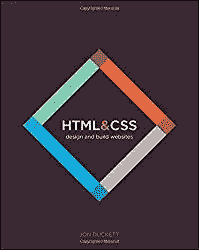

这本书非常适合想要开始学习 web 开发的初学者，因为 HTML 和 CSS 是基础。我把它推荐给所有和我一起工作的学生。我不能说它深入了主题，但它通过实际案例，有很好的例子和很好的插图。

老实说，这是我找到的开始建立网站的最好的书。这是进步的，很大程度上基于现实生活中的例子。这本书教授 HTML 版本 5 并鼓励语义标记。语义标记是尽可能使用有意义的标签的好习惯，而不是使用通用的`div`或`span`。其中一些是`header`、`footer`、`address`、`strong`。它可以帮助机器人/脚本通过阅读文本轻松理解你的内容。

我之所以提到这一点，是因为这本书不仅对初学者有用。这对获得正确的基础很重要，因为即使 Javascript 一直在发展，趋势是用 HTML 或 CSS 中的新功能取代常见的 Javascript 技巧。这些最终变得更快、更容易实现，并有望成为标准。这意味着前端 web 开发人员要花大量时间学习新的更简单或更强大的做事方法。然后他们在黑暗中等待一个功能足够容易使用。他们会定期检查。有时候他们会哭。有时时间太长，以至于他们实际上忘记或放弃了这个功能。

这就是奇迹发生的时候。你是一个有经验的开发人员。你出于好奇读了一本初学者的书，然后你意识到你多年前就想使用的功能现在已经成为一个广泛的标准。因此，定期回归基础非常重要。

# 七周内七种语言

布鲁斯·泰特著。

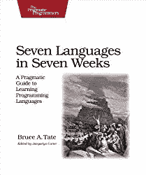

如果你像我一样是一个编程语言爱好者，喜欢学习新的编程语言，即使你很少使用它们，那么这本书就是为你准备的。标题很明显。您将学习一些 Clojure、Haskell、Io、Prolog、Scala、Erlang 和 Ruby。都是很神奇的语言。我可能会把 Ruby 换成一种不太为人所知的语言，但这可能是因为我已经非常熟悉 Ruby 了。

在这里所有的书中，这本书最好地说明了一个事实，即所有的语言都有东西可以教你。函数式编程，Io 漂亮的基于原型的对象模型，actor 模型，并发性，并行性。从零开始，试图解决一个特定的问题是令人耳目一新的。

# 如何创建你自己的超棒的编程语言

马克-安德烈·库尔诺耶。

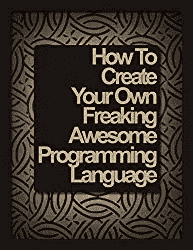

好笑的是，标题不是诱饵。你将真正能够[创造你自己的编程语言](http://createyourproglang.com/)。这将是令人敬畏的，因为你是从零开始做的，可以随时更改。Marc-André Cournoyer 是一位了不起的老师。一旦你理解了这本书，你会想看看他的[在线课程](https://www.macournoyer.com/products/)。你可以看出他非常热爱教学。这本书很有趣，容易理解，目标明确。

即使你不打算创造自己的语言，也没关系。你会学到很多东西。你将会理解使一门语言独一无二的小细节，而不仅仅是语法。内存管理、并发、解析、函数、类、虚拟机、字节码等。一章接一章，你会明白的。速度是舒适的，有插图帮助你理解结构和流程。这里有一个[示例章节](http://createyourproglang.com/sample.pdf)来了解一下。

第 101 个名字:这个家伙创造了 [Thin](https://rubygems.org/gems/thin) ，这本书激发了[杰瑞米·阿什肯纳斯](http://ashkenas.com/)创作 [CoffeeScript](http://coffeescript.org/) 。

# 计算机程序的结构和解释

哈罗德·艾贝尔森，杰拉德·让伊·萨斯曼和朱莉·苏斯曼。

说实话，我跳火购买这 657 页的学术知识，花了好几年。我在书店翻了很多遍。我总是被封面和主题所吸引。但我觉得这很吓人。然而，在听到吉姆·威里奇(Jim Weirich)对这本书的好评后，我决定试一试。

事实是，这是纯金的。即使你不想构建一个解释器或编译器，你也会学到很多关于程序的知识。阅读它而不找到有用的东西几乎是不可能的。你将沉浸在程序的奇妙世界中，理解其他程序。带大写“M”的 Meta。如果你还不相信，让我补充一下，这篇文章用数百行性感的 Lisp 语句来说明。

如果不想买硬拷贝，可以[免费下载成 PDF](https://web.mit.edu/alexmv/6.037/sicp.pdf) 。

# 学你一个哈斯克尔的伟大好处！

作者 Miran Lipovač。

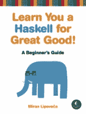

如果你想学习函数式编程，又不知道从何入手，这是一本非常好的书。它是彻底的，有趣的，丰富多彩的。如果主题对你来说是新的，这正是你需要的语气。即使挣扎，步伐也相当缓慢。在进行下一步之前，你会有足够的时间让想法沉淀下来。

你可以购买硬拷贝，或者在网上免费阅读全文。如果您认为 Haskell 不适合您，那么 Erlang 有一个等效的解决方案。

# 学点儿二郎神对你有好处！

弗雷德·赫伯特。

它不是完全相同的书，因为两种语言有不同的概念，但语气和目的是相似的。我两本书都读过，更喜欢这本书，因为我发现了 Erlang 更实际的用途。OTP 的并发模型令人惊叹。

# 99 瓶 OOP

桑迪·梅斯和卡特里娜·欧文。

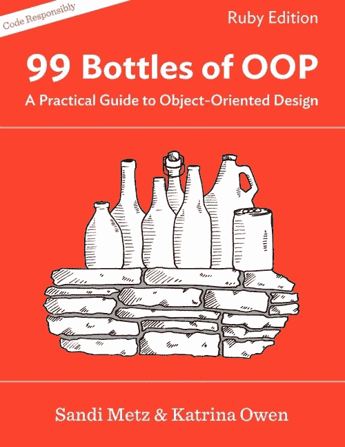

这本书是用 Ruby 的例子写的，但是是关于一般的面向对象编程。如果你不知道桑迪·梅斯和卡特里娜·欧文，你应该在 YouTube 上看看他们。它会定下基调，并确认这本书是否适合你。就重构而言，Sandi 绝对是一头野兽。你可以看到她从显而易见的有效代码开始，一路向上，直到所有代码都易于维护。这就是书中应用的方法。您将浏览示例，使其工作，并在每次迭代中用不同的概念清理它。

这是从罗伯特·c·马丁这样的伟人及其坚实的原则中汲取的知识。但是语气很谦卑。不要误会我的意思，鲍勃叔叔的教训是无价的，但对他来说，在所谓的“专业”方面有一种确定性，有时会令人不快。你应该看看他和詹姆斯·科普林之间的推特之战。当你想到他们是如此伟大的人，有如此多的东西要教时，你会感到尴尬。它只是一连串的“哦，我的方法对你不起作用。你可能做的方式不对。”而且听起来比什么都讽刺。如果你和我一样，只是想得到一些好的线索，让你的代码更有条理，而不带有宗教色彩，那么你最好用 99 瓶 OOP。

我应该提到这本书的方法是使用测试来构建你的功能。您将编写测试并使其通过。不，我不会提到任何缩写。一旦你开始用首字母缩写词和以“ism”结尾的词来定义你所做的事情，你将会花时间解释或争论定义，而不是做实际的代码。

# 神话中的人月

作者小佛瑞德·P·布鲁克斯

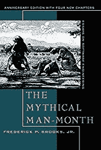

这本是经典之作，首次出版于 1975 年。可能是有史以来最好的书名之一。主题是开发项目的管理方面。虽然与编程无关，但肯定会引起业内人士的共鸣。

剧透警告，标题本身指的是一个管理者倾向于认为人力资源会加速结果。在精彩的例子中总结道:“如果一个女人生一个孩子需要 9 个月，那么让我们雇佣 9 个女人，我们将在一个月内得到它。”因此得名。我敢肯定，如果你作为一名开发人员工作了足够长的时间，你会经历类似的情况。

# 黑客，剥削的艺术

乔恩·埃里克森。

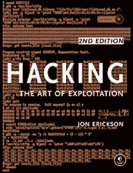

一开始可能看起来不明显，但即使你不打算渗透政府网站，关于剥削黑客的书籍也非常有用。人们忽视主要原因是大多数关于黑客的书籍解释了过时的技术。它们不再有效，除非一个系统非常脆弱，或者你可以用一个 [DeLorean](https://en.wikipedia.org/wiki/DMC_DeLorean) 回到过去。黑客书籍的事情是你学会如何跳出框框思考。这真的很有价值。

在本书中，您将首先学习 C 编程语言的基础知识，然后浏览所有与黑客相关的敏感主题。联网、嗅探、加密、破解、暴力破解等等。每一章都有一段代码可以玩。通常是同一个代码的多次迭代和改进。你将学会如何保护自己免受攻击。尤其是关于网络的部分是一个很好的信息来源，而不是专门针对剥削的。你将会学到什么是层、包、头以及使互联网成为现在这个样子的一切。

这本书还附带了一个包含 Linux 的可引导磁盘，以及在沙盒中尝试这些示例所需的一切，这样就不会损害您的系统。

# 向前思考

作者利奥·布罗迪。

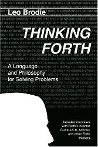

Forth 是我最喜欢的语言之一。它是 Lisp 的邪恶双胞胎。事实上，我很惊讶这种语言和它的创造者[查克·摩尔](https://en.wikipedia.org/wiki/Charles_H._Moore)被如此低估。它甚至与 Lisp 共享相同的诅咒。它很容易实现，每个人都有自己的版本，我们最终有了一个家庭，而不是一个标准语言。有人说 Lisp 的诅咒是宏，但这些人都是疯子。

总之，这本书更多的是关于你如何思考一个问题，并尽可能用最简单的方式把它翻译成代码。我喜欢它，因为第四社区的想法通常与当前的趋势相反，或者至少让你考虑相反的方向。这是它离开 Lisp 的地方。例如，解释语言的世界都是关于后期绑定的，而 Forth 致力于早期绑定。在方法论方面，趋势是使用所谓的[自上而下的方法](https://en.wikipedia.org/wiki/Top-down_and_bottom-up_design)，但是 Forth 鼓励你用[自下而上的方法](https://en.wikipedia.org/wiki/Top-down_and_bottom-up_design)来平衡它。这个主题太广泛了，以至于有一天我想写一篇关于它的文章。

主要思想是极简主义，因为这是 Forth 程序员的特点。就算不坚持这种极端，感觉也是那么清爽。你会意识到一个严酷的事实:大量的计算机问题实际上是人类的问题。我们给自己制造的问题。就解析器而言，中缀符号就是其中之一，这一点我不得不认同。

我将把它放在那里:[反向波兰符号](https://en.wikipedia.org/wiki/Reverse_Polish_notation)是括号杀手。[代码必须流动](https://dooleyblag.files.wordpress.com/2010/10/dune-book-cover.jpg)。

# 修订

杰森·弗里德和大卫·海涅迈尔·汉森。

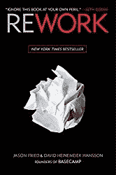

我是在工作中接触到这本书的。我们的老板买下了它，留给所有员工阅读。起初我非常怀疑，因为我真的不太喜欢关于企业家精神的书。但是当我在喝咖啡休息的时候，我开始在这里和那里随意阅读一章，它开始引起我的共鸣。主要是因为它突出了我正在努力解决的问题。尤其是关于会议、待办事项和计划的事情。

无论如何，这本书开始上升，直到我认为这是我最喜欢的关于这个主题的书。尽管你可以在许多博客文章和视频中找到杰森和大卫的想法，我还是购买了我自己版本的书，因为我非常喜欢它。写得很好。每章尽可能短。它讲述了一个主要的想法，包含了一个真实世界的例子来说明这个想法。仅此而已。

关于这本书有很多批评，而且它只对 Basecamp 这样的公司有效。主要是因为 Basecamp 是一个网站，因此它不需要一大笔启动资金。老实说，这些想法只适用于 Basecamp 是一件好事。这意味着书中的观点是基于经验而不是假设。另一件事是，许多人认为这是一个公式。但这不是真的。作者很清楚这些想法对他们有用，你可以自由选择那些对你有用的，忽略其他的。这实际上是本书的核心，没有放之四海而皆准的方法。书中的许多章节都警告说，不要试图经营一个小企业，就像经营一个大企业一样。规模小或与众不同都有机会。

为什么这本书是给开发者看的？一个原因是作者在创建网络业务时发现了这些想法。因此，很多想法都与这个行业相关。另一个原因是，即使你不打算使用你的开发技能来建立一个企业，一些想法仍然是相关的。就像神话中的人月一样，里面讲了很多关于管理，和管理者的关系等等。

我不知道是不是只有我，但我几乎把这本书当成了励志演讲。许多想法都围绕着一件事，那就是某种担忧，并意识到这只是一种担忧，因为你太努力了，而不是遵循一条自然的道路。

# 简单的法则

作者约翰·梅达。

我很久以前就买了这本书。我甚至不确定我已经是一个开发者了。如果你不知道约翰·梅达，他在计算世界因其在技术和艺术之间的桥梁上的工作而闻名。他通过书籍和演讲做到了这一点，但他也是有趣的艺术相关软件的背后，如启发了[处理](https://processing.org/)框架的[数字设计](https://dbn.media.mit.edu/)。

在这本简短的书中(大约 100 页)，约翰·梅达介绍了产品设计师为了让界面更简单，或者看起来更简单而使用的所有技术。当你在构建一个数字接口时，它的大部分显然是有价值的。这是我第一次听说“[格式塔](https://en.wikipedia.org/wiki/Gestalt_psychology)”，它给了我们很多关于我们如何理解我们所看到的以及我们如何连接这些点的见解。

你们中的一些人可能已经注意到，我跳过了关于这个主题的经典书籍，比如《不要让我思考》或者《人性化界面》。原因是因为我发现这些被高估了。在我看来，他们试图让自己听起来更真实。不要误会我的意思，他们很有趣，但对他们的发现有点过于自信，通常不值得写这么长。而“简单性法则”简短扼要，最重要的是留下了解释的空间，因为像“简单性”这样的主观话题没有绝对的答案。在所有编程语言社区中都有一个简单大师，你猜怎么着，他们并不总是彼此一致。

# UNIX 和 Linux 系统管理手册

作者:艾维·内梅特、加斯·斯奈德、特伦特·r·海因、本·威利和丹·麦金。

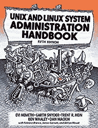

作为一名开发人员，如果你在 Linux 或 OSX 上工作，拥有一本关于 Unix 系统的书总是好的。说实话，这部不是我最喜欢的，但我最喜欢的是法语版。这是我的下一个选择，只是因为它更深入，可能更令人生畏。我更喜欢有两个不同层次的两本书。但我在这里很挑剔。

反正里面包含了你需要的一切。您将学习 Unix 命令以及如何手动设置您的系统(即不使用 CPanel 或 Plesk 之类的界面)。我不知道这是否是由于大量的作者，但说这本书是彻底的几乎是轻描淡写。您将会学到很多关于 Unix 的东西。甚至还有对 Ruby，Python，Git 的介绍。由此产生的唯一问题是，它是如此完整，以至于根据您的 Unix 版本的不同，它会出现在不同的区域。FreeBSD 包括在内，但是如果你在达尔文/OSX 之类的其他东西上，那么你可能想用一个特定于你的操作系统的来完成你的书架。

# Minix 图书，操作系统

安德鲁·S·塔南鲍姆和艾伯特·S·伍德赫尔。

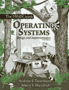

最后但同样重要的是，对于你们当中最有野心的人来说，这是一本教你如何构建操作系统的书。只是因为你需要在业余时间做点什么。

我有一个以前的版本，但我认为这个新版本有类似的内容。它基本上是操作系统构建的圣经。作者是一名计算机科学教师，为了教他的学生如何工作，他创建了一个名为 Minix 的操作系统。当时 Linux 还不存在，这是有充分理由的:正是 Minix 激发了 Linus Torvalds 创建 Linux。

为了解释 Minix 的工作原理，Tanenbaum 写了这本书。所有东西都在里面。系统调用、进程、IPC、调度、I/O、死锁、内存管理、线程、文件系统、安全性等等。都是用源码解释的。

1088 页，教你如何建立一个操作系统，不提示你安装诺顿防病毒每次开机。