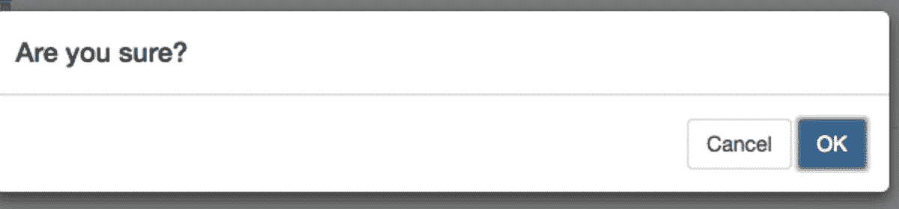

# 角度测量中的一些实用 rxjs 技术

> 原文：<https://itnext.io/some-practical-rxjs-techniques-in-angular-315d1bfa41c8?source=collection_archive---------1----------------------->

(免责声明:在 Angular 5 上使用 rxjs 第 5 版进行了演示，但我猜第 6 版的想法也是类似的，只是 api 发生了变化。)

我试图收集一些在 Angular 中被动开发时使用的实用技术。

1.  可观测量的“预期”选择:

```
updateSomething$(something: Something[]): Observable<Something[]{
**const** requests = something.map(thingy =>  **this**.http.put(**`/something/**${thingy.i**d**}**`**, thingy)
    .**catch**(err => Observable.*of*({**err**: err, **reason**:  thingy.**message**})));
**return** forkJoin(requests);
}
```

解释:

*   编写了一个 api 调用列表(observables ),用于根据 id 更新内容。
*   如果失败——捕获失败并返回一个带有原因的可观察值。
*   该函数返回传递请求列表的 forkJoin 运算符。(使用该函数的任何人都可以订阅它以获得 forkjoined 结果)
*   forkJoin 将一直等到最后一个观察完成，然后它将产生最新结果的单个值。
*   如果我不捕捉错误并通过返回一个可观察值来处理它以便继续，我将丢失先前的可观察值。

2.返回“thenable”函数(返回 promise 的函数)备选项:

```
SaveOrCancel$() {
  **return this**.service.someObsFn().map(result => result ? followingObsFn : Observable.*of*(result));
}
```

假设我有一个函数，它返回一个要订阅的可观察对象(例如，您从中解析的模态实例，单击“确定”将流为真，单击“取消”将流为假)，我想运行另一个从其订阅返回可观察对象的函数(例如，用户单击“确定”来解析操作)，然后我将使用映射运算符来流“下一个”值，并将返回我希望返回的下一个反应函数(表示一个可观察对象，它包含用户单击“确定”来解析时运行的函数的结果)。



这里的美妙之处(与处理承诺不同)在于，如果我保留对 returnObsFromSubscription$函数的订阅引用，我可以随时取消订阅！

4.*组合测试运算符—完全反应式—无承诺项选择*

```
**this**.**combinedSubscriptions$** = *combineLatest*(
  **this**.store.select(**'a'**),
  **this**.store.select(**'b'**).map(b => b.name),
  **this**.route.**params)
.**subscribe(retValues => {
console.log(`a: ${retValues[0].something} b: ${retValues[1]} routeParam: ${retValues}`);
```

说明

*   一旦每个可观察值产生一个值，combineLatest 将返回“聚合”结果，它不会等待诸如 forkJoin 之类的完成，这意味着如果“a”存储将被更新，打印的结果将包含“b”和 routeParam 的最后值:)

5.行为主体

使用 BehaviorSubject 允许您以快速的方式在应用程序的不同区域之间共享状态，但也很容易变得混乱(难以维护)，并且在使用 rxjs store 以 redux 模式管理应用程序的可共享状态时并不总是需要。

在下面的例子中，我使用它来设置应用程序中几个区域的纯 UI 状态，我选择使用它而不是使用存储，以避免从我不希望他们订阅的组件订阅存储，并避免将存储本身作为依赖项和操作类型导入，加上我的目标是最小的更改和易于测试的解决方案，所以它是一个很好的选择。

```
@Injectable()
**export class** ToggleSliderEditModeService {

  private **isSliderOnEdit** = **new** BehaviorSubject<**boolean**>(**false**);

  setIsEdit(isEdit: **boolean**) {
    **this**.**isSliderOnEdit**.next(isEdit);
  }
  isSliderOnEditMode() {
    **return this**.**isSliderOnEdit**.asObservable();
  }
}
```

目前就是这样，rxjs 真的很棒，管道流很有趣..别忘了退订:P