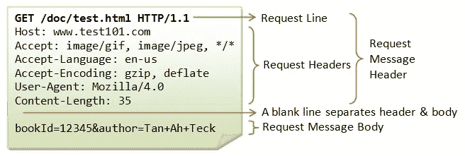
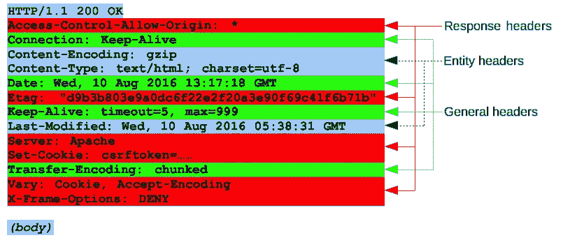
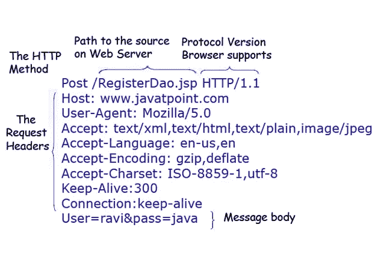

# 使用 API 的一些结构化数据

> 原文：<https://itnext.io/some-structure-data-for-work-with-api-8e9f2816cd84?source=collection_archive---------5----------------------->


克里斯多夫·高尔在[杂志](https://unsplash.com/photos/m_HRfLhgABo)上拍摄的照片

一个 RESTful API 是一个应用程序接口(API)，它使用 HTTP 请求来获取、上传、发布和删除数据。

RESTful API——也称为 RESTful web 服务或 REST API——基于表述性状态转移(REST)技术，这是一种架构风格，也是 web 服务开发中常用的通信方法。

TTP——最初是数据传输的应用层协议——以“HTML”格式的超文本文档的形式，目前用于任意数据的传输。HTTP 的基础是“客户机-服务器”技术，即存在:

*   发起连接并发送请求的消费者(客户端)；
*   等待连接的提供者(服务器)接收请求，执行必要的操作，并返回一条包含结果的消息。

**HTTP** 协议是为应用程序和 web 服务器相互“通信”而设计的。并在网页上传递了一些信息。
HTTP 协议最初是 Keep-Alive，是什么意思？当用户访问网站时，任何请求都不会被授权，后续的请求，如基于 cookies 或标题的用户授权和身份验证。该数据在 GET 或 POST 请求中发送。通常，授权是通过 cookies 进行的。

cookie 是由网络服务器发送并存储在用户电脑上的一小段数据。web 客户端(通常是 web 浏览器)在每次尝试打开站点上的页面时，都会将这段数据作为 HTTP 请求的一部分发送到 web 服务器。它用于在用户端存储数据，实际上它通常用于:

*   认证用户；
*   个人偏好和用户设置的存储；
*   监控用户访问会话状态；
*   维护关于用户的统计数据。

**cookie**在任何请求中传输，任何服务器都可以根据一些数据，即根据 cookie 和 GET 或 POST 请求中的一些参数，了解您是谁以及您拥有什么访问权限。HTTP 协议最常见的方法是 GET 和 POST。其余的存在，但真正的应用程序并不经常使用它们。
关于任何请求你需要知道的最基本的事情:
任何请求发送时，都会产生一个包，并且会在应用层发送。
每个包由一个请求行、请求头和请求体组成。



GET 请求只发送一些数据的报头。发送的数据位于请求消息头中，响应的数据位于响应头中。



POST 请求不仅发送请求头，还发送消息正文。在主体中，可以传递任何数据格式，JSON、XML、媒体文件、数据、认证等。



**GET 请求和 POST 有什么区别？**

GET 包含唯一的标题，POST 包含标题和正文。主体包含一个简单的数据结构。

如果你把头和体传递给 GET 会怎么样？什么都不会发生。GET 将正确无误地工作。

**这两个问题在面试应聘者时很常见。这就是为什么我将它们包含在本文中。**

**JSON 模式到 POJO。**

 [## jsonschema2pojo

### 从 JSON 或 JSON-Schema 生成普通的旧 Java 对象。对于“属性”定义中出现的每个属性，我们…

www.jsonschema2pojo.org](http://www.jsonschema2pojo.org/) 

这个资源允许您从 JSON 或 JSON-Schema 中生成普通的旧 Java 对象。

例如，从斯瓦格[http://petstore.swagger.io/](http://petstore.swagger.io/)的 JSON 到 POST 方法

```
{"id": **0**,"category":{"id": **0**,"name":"string"},"name":"doggie","photoUrls":["string"],"tags":[{"id": **0**,"name":"string"}],"status":"available"}
```

模型生成后，在生成文件的主体中包含注释[**@ jsonpropertyeorder**](http://twitter.com/JsonPropertyOrder)该注释检查响应中所有元素的顺序。
这种方法是合同测试的原型。对于每个属性，为每个 getter 和 setter 插入注释[**@ JsonPropertyOrder**](http://twitter.com/JsonPropertyOrder)。

```
**public class** Category { @JsonProperty(**"id"**)
    **private** Integer **id**;
    @JsonProperty(**"name"**)
    **private** String **name**;
    @JsonIgnore
    **private** Map<String, Object> **additionalProperties** = **new** HashMap<String, Object>(); @JsonProperty(**"id"**)
    **public** Integer getId() {
        **return id**;
    } @JsonProperty(**"id"**)
    **public void** setId(Integer id) {
        **this**.**id** = id;
    } @JsonProperty(**"name"**)
    **public** String getName() {
        **return name**;
    } @JsonProperty(**"name"**)
    **public void** setName(String name) {
        **this**.**name** = name;
    }
}
..................................................................
```

唯一的缺点是对 JSON 文件大小的限制。

**插件 RoboPOJOGenerator。**

Intellij Idea，用于 JSON 到 POJO 转换的 Android Studio 插件。

从 JSON: GSON，AutoValue，Logan Square，FastJSON，Jackson，Moshi，empty annotations 模板生成 Java 和 Kotlin POJO 文件。支持:基本类型，多个内部 JSONArrays。

**安装**

从插件库中获取并安装，或者在“首选项”->“插件”->“浏览库”->“RoboPOJOGenerator”中找到它。

**如何使用**

选择目标包->新建->从 JSON 生成 POJO。

注解[**@ JsonPropertyOrder**](http://twitter.com/JsonPropertyOrder)这个插件只添加字段，不添加 getters 和 setters。

唯一的缺点是对 JSON 文件大小的限制。

**数据结构不是 JSON 和 XML 怎么办？**

有时响应是 XML 而不是 JSON。

不幸的是，没有方便的 XML 生成器。基于 XML 生成 POJO 的唯一选择主要是生成 XSD (XML 模式定义)。

XML Schema 是一种描述 XML 文档结构的语言。XML 模式规范是 W3C 的推荐标准。

像大多数 XML 标记语言一样，XML Schema 被设计用来定义文档必须遵守的规则。但是与其他语言不同，XML Schema 被设计成可以在创建处理 XML 文档的软件时使用。

根据 XML 模式验证文档后，读者可以创建一个文档数据模型，其中包括:

*   字典(元素和属性的名称)；
*   内容模型(元素和属性之间的关系及其结构)；
*   数据类型。

类似于 JSON schema to POJO，首先我们需要从 XML 生成一个 schema，然后基于这个 XML 生成 XSD。

从斯瓦格[http://petstore.swagger.io/](http://petstore.swagger.io/)获取 XML 内容以选择帖子和应用程序/XML:

```
<?**xml version**="1.0" **encoding**="UTF-8"?><**Pet**><**id**>**0**</**id**><**Category**><**id**>**0**</**id**><**name**>string</**name**></**Category**><**name**>**doggie**</**name**><**photoUrl**><**photoUrl**>string</**photoUrl**></**photoUrl**><**tag**><**Tag**><**id**>**0**</**id**><**name**>string</**name**></**Tag**></**tag**><**status**>**available**</**status**></**Pet**>
```

**XML 到 XSD 在线生成。**

 [## XSD/XML 模式生成器

### 从 XML 文件生成 XSD (XML 架构)。只需复制粘贴或上传您的 XML 文档，让生成器…

www.freeformatter.com](https://www.freeformatter.com/xsd-generator.html) 

在 XML 的基础上，我们生成 XSD，从而创建模式文件。XSD

通过调用 Windows 上的 PowerShell 控制台或 Linux 上的常规终端，您可以使用 XJC 程序。

**XJC —** 将 XML 模式文件编译成完全带注释的 Java 类。

**使用 XJC。**

正如您在下面的代码片段中看到的，XJC 支持很多选项。最重要的是

**举例:**

**xjc**-d src-p io . swagger . pet store schema . xsd

-d 定义生成的类应该存储在文件系统中的什么位置，

-p 来定义要使用的包，当然

*   如果你还需要什么帮助。

**XJC 和 JAXB 的利弊。**

**优点**:

*   生成一个包含内部类的文件，该文件用于模型/第二个 ObjectFactory 文件仅在您拥有相同类型的模型时使用。
    但是它们有不同的字段，比使用 ObjectFactory 你可以分配一个新的不同的模型有不同的字段)。
    例如，PojoGenerator 创建几个与响应者数量相等的类。
*   使用了 [@XmlRootElement](http://twitter.com/XmlRootElement) 和 [@XmlElement](http://twitter.com/XmlElement) 注释。
*   足够灵活，可以工作。它是基于 XML 的。
*   JAXB 不仅适用于 REST，也适用于 SOAP。

**缺点**:

在生成过程中，大量的文档以注释的形式插入。

**放心**只支持 3 个日期构建库——JSON、Jackson 和 GSON。对于 XML — JAXB。

**JSON** (JavaScript 对象符号)是一种轻量级的数据交换格式。对人类来说，读和写很容易。机器很容易解析生成。JSON 是一种完全独立于语言的文本格式，但是它使用了 C 语言系列的程序员所熟悉的约定，包括 C、C++、C#、Java、JavaScript、Perl、Python 和许多其他语言。这些特性使 JSON 成为理想的数据交换语言。

**JSON** 建立在两个结构上:

*   名称/值对的集合。在各种语言中，这被实现为对象、记录、结构、字典、哈希表、键列表或关联数组。
*   值的有序列表。在大多数语言中，这被实现为数组、向量、列表或序列。

**Jackson** 是一款面向 Java 的高性能 JSON 处理器。它的开发者推崇该库的快速、正确、轻量级和人体工程学属性的结合。

**Jackson** —数据绑定 API 用于使用属性访问器或使用注释将 JSON 与 POJO(普通旧 Java 对象)相互转换。它有两种类型。

*   简单数据绑定——将 JSON 与 Java 映射、列表、字符串、数字、布尔值和空对象相互转换。
*   完全数据绑定—将 JSON 与任何 JAVA 类型相互转换。

GSON 是一个 Java 库，可以用来将 Java 对象转换成它们的 JSON 表示。它还可以用来将 JSON 字符串转换成等价的 Java 对象。Gson 可以处理任意 Java 对象，包括您没有源代码的预先存在的对象。

有几个开源项目可以将 Java 对象转换成 JSON。然而，大多数都要求在类中放置 Java 注释；如果你不能访问源代码，你就做不到。大多数也不完全支持 Java 泛型的使用。Gson 认为这两者都是非常重要的设计目标。

*   提供简单的 toJson()和 fromJson()方法，将 Java 对象转换成 Json，反之亦然。
*   允许预先存在的不可修改对象与 JSON 相互转换。
*   对 Java 泛型的广泛支持。
*   允许对象的自定义表达。
*   支持任意复杂的对象(具有深度继承层次和广泛使用泛型类型)。

Java Architecture for XML Binding(JAXB)提供了一种快速便捷的方式来绑定 XML 模式和 Java 表示，使得 Java 开发人员可以轻松地将 XML 数据和处理功能集成到 Java 应用程序中。作为这个过程的一部分，JAXB 提供了将 XML 实例文档解组(读取)到 Java 内容树中，然后将 Java 内容树封送(写入)回 XML 实例文档的方法。JAXB 还提供了一种从 Java 对象生成 XML 模式的方法。