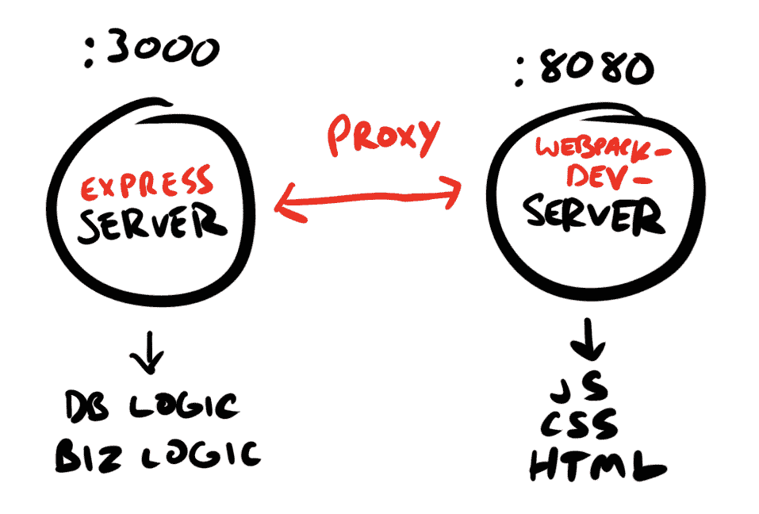
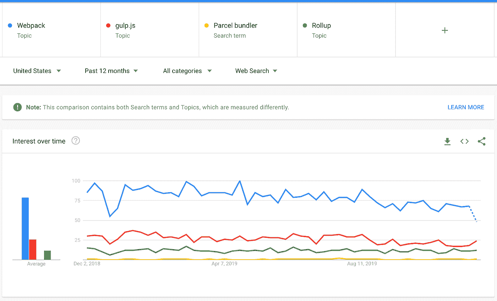

# webpack-dev-server 初学者指南

> 原文：<https://itnext.io/sort-of-beginners-guide-to-webpack-dev-server-98f8843b1bc1?source=collection_archive---------2----------------------->

想法由胡安·哈特提供

如果你正在运行一个节点后端，很有可能你已经使用了 Webpack 来捆绑你的模块(毕竟，它是行业标准)，如果你已经在开发中使用了 Webpack，但是还没有探索过 webpack-dev-server (WDS，从这里开始，因为我很懒)，那么你就有机会了。

简而言之，WDS 是 Webpack 的专用开发服务器，它预装了一整套选项，让你的开发过程如丝般顺畅。像热模块重载、gzip 压缩和代码分割/延迟加载这样的选项绝对是轻而易举的事情——只需要在选项标签下击几下键就可以开始了。

*web pack-dev-server 到底是怎么工作的*

基本上，我们的 Node/Express/What-have-you 服务器是我们的应用程序承担重任的地方。它处理我们的数据库逻辑、业务逻辑，并为我们驻留在硬盘上的缩小的、丑陋的包提供服务。相比之下，WDS 负责我们的前端逻辑(JS，CSS，HTML)。它有点像“门面”,充当我们的节点服务器的代理。WDS 提供了一个位于我们机器的 RAM 中的包，而不是硬盘，这就是为什么即使我们从/dist 文件夹(或者您决定放置包的任何地方)中删除了 bundle.js，我们仍然能够以开发模式提供我们的站点，因为即使包不再位于/dist 文件路径中，它仍然存在于 RAM 中。

*这样想；在一家餐馆里，可能会有一名厨师长和一名厨师长。可能餐厅的整个菜单已经由厨师长决定了；然而，生产线上的厨师仍然知道如何准备所有的饭菜。即使厨师长休息了一天，生产线上的厨师仍然知道如何准备所有的饭菜——但是食谱的想法最初来自厨师长，并且他们得到了创造的荣誉。*

*这是一个奇怪的类比，我很抱歉*

你感到困惑、非常困惑还是有些困惑？Youtube 搜索 webpack-dev-server 并自己安装一个，希望这一切开始变得更有意义。如果你和我到目前为止，让我们继续前进…

行业标准=更大的生态系统，更好的支持，更好的文档，更少的麻烦(也许)

*为什么 Webpack 生病了，而我却经常使用它*

依我拙见，webpack 使模块捆绑*变得非常简单*和*非常非常可定制*。我最喜欢的一些选项:

**HTMLwebpackPlugin:** 使用 HTMLwebpackPlugin 构建 index.html 文件，默认情况下使用默认属性，或者基于模板。

**监视模式:**在“监视”模式下运行 Webpack，持续监视更新，并在发生任何变化时重建我们的包

**Common chunks plugin:** 如果我们在多个包(在一个多页应用程序中)中使用任何特定的模块，通过在两个包中只渲染一个公共项目的实例来优化包的大小(默认情况下，每个包会渲染两次)

**热模块重装:**如此，如此，如此有助于开发。您不必重新加载服务器来观察 DOM 的变化；它们会在保存时自动填充。使前端开发速度更快。

**代码分割:**允许你使用 webpack 将你的代码分割成多个包，这些包可以立即加载，也可以在需要时延迟加载。

*web pack——您可能已经见过并且应该知道的属性*

**publicPath:** 指定 dev-server 在 RAM 中存储包并为其提供服务的基本路径，它优先于 content-base。

**contentBase:** 指定 dev-server 为应用程序提供服务的基本文件夹。只有当您希望提供静态文件时，才需要这样做。

**压缩**:对提供的所有内容启用 gzip 压缩

**devServer.after** :指定在所有其他中间件完成其进程后运行某些功能的能力

**devServer.before** :指定在所有其他中间件运行其进程之前为某些功能提供资金的能力

**devServer.lazy** :指定懒惰模式。该包只有在被请求时才会被编译。

这只是冰山一角，人们——如果你想知道更多，进入真正本质的东西，只是去建立一些东西。阅读文件。在推特上关注我。今天就到这里，干杯

-丙