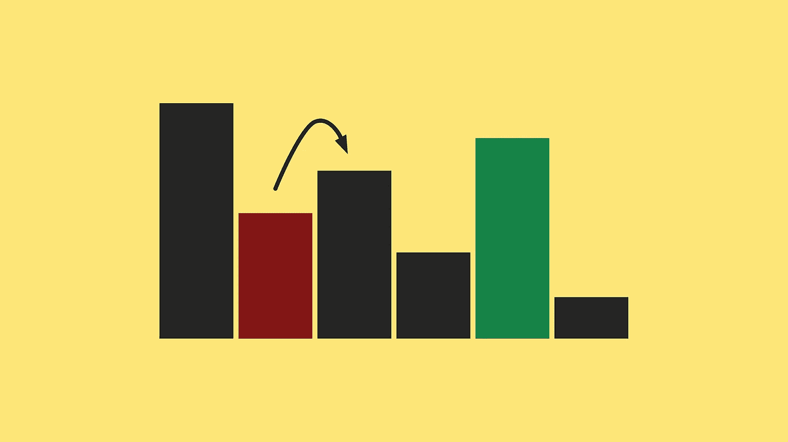
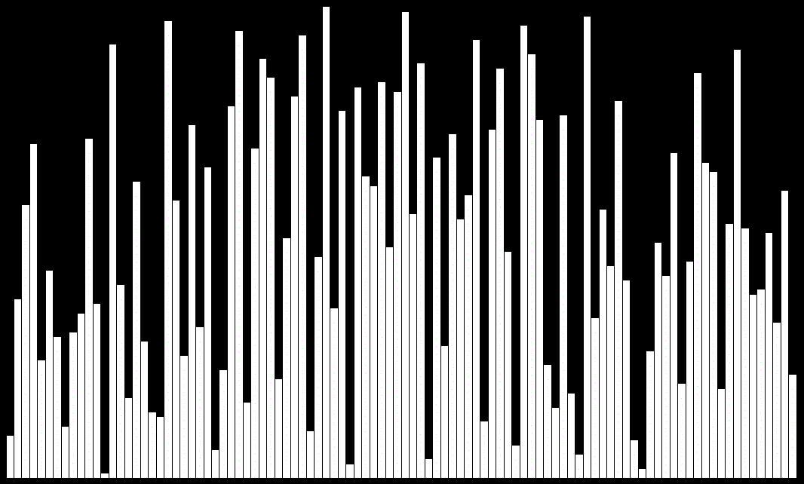
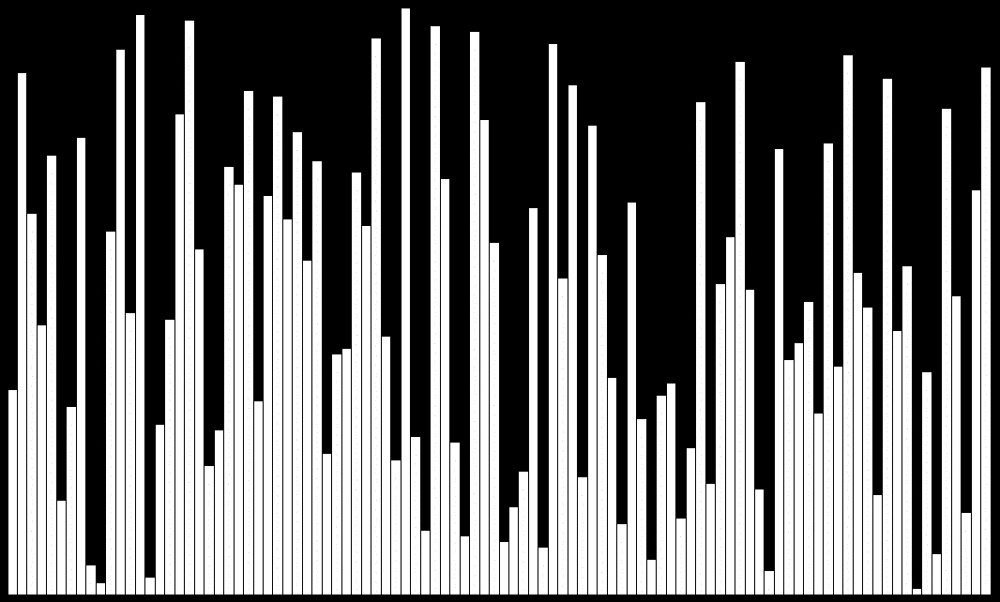
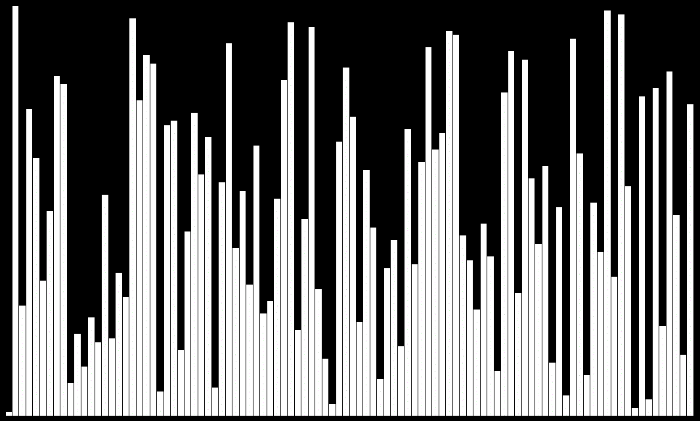
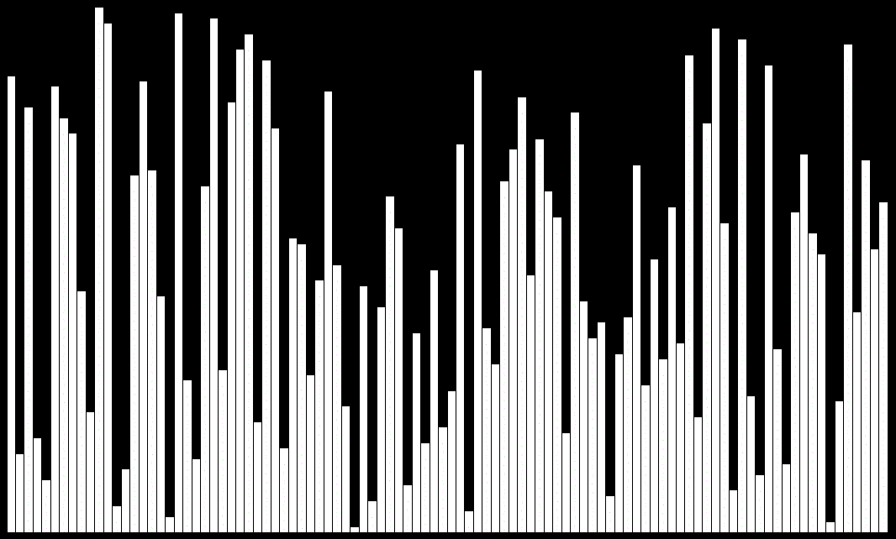
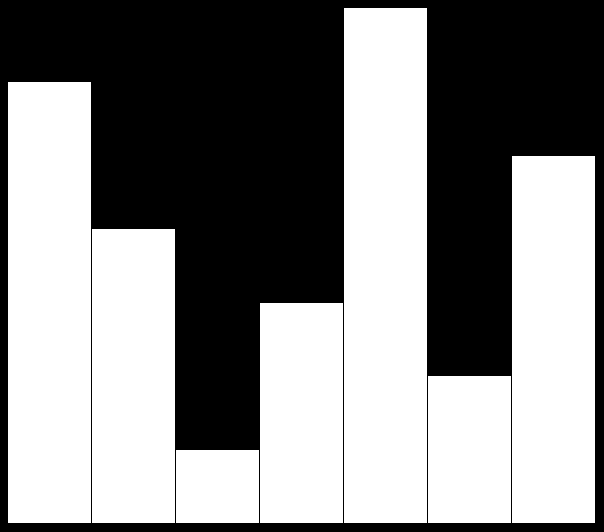

# JavaScript 中的排序算法

> 原文：<https://itnext.io/sorting-algorithms-in-javascript-4c3b7b80e88d?source=collection_archive---------2----------------------->

## 使用 JavaScript 实现一些排序算法

如果你从来没有解决过排序问题，你就不是程序员。对值列表进行排序是一个非常常见的问题，它是如此古老，以至于今天我们有很多方法来解决这个问题。现在，我将向您展示一些在我们喜爱的 JavaScript 中应用的排序算法。

# 冒泡排序

是我们在程序员生活中会遇到的第一批排序算法[之一，即使不是最有效的，也很容易理解并应用于我们的编码中。](https://en.wikipedia.org/wiki/Bubble_sort)

气泡分类

泡泡是一个**比较排序算法**，它非常简单:它只是比较成对的值，然后如果相邻的值不按顺序，就交换相邻的值，直到完成。这就是为什么这种方法效率很低的原因，它使用了太多必要的比较。

气泡函数

真正的执行

【https://codepen.io/adrian-legaspi/pen/QWwOeLm 

# 循环排序

这是一个就地和比较[排序算法](https://big-o.io/algorithms/comparison/cycle-sort/#javascript)。与他们的其他就地算法兄弟相比是如此高效，但不是最好的排序算法。

循环排序

该算法不知道正在处理的列表，使用该算法，元素不会在整个列表中跳跃，如果它们已经在正确的位置，它们将停留，直到对其他元素继续排序，如果不是，它将移动到该项应该属于的索引。

[https://codepen.io/adrian-legaspi/pen/YzPYKXe](https://codepen.io/adrian-legaspi/pen/YzPYKXe)

# 选择排序

[另一种原地比较算法](https://en.wikipedia.org/wiki/Selection_sort)为循环排序。在非常大的列表中效率很低，但是易于实现和理解。

选择排序

该算法将列表分为两部分。在每次迭代中，搜索符合比较语句的元素，并将该元素移动到排序部分的末尾。这样，我们跳过该部分，再次检查已排序的部分，但是在每次迭代中寻找所有未排序的部分，这使得该算法效率低下。

[https://codepen.io/adrian-legaspi/pen/LYEevZY](https://codepen.io/adrian-legaspi/pen/LYEevZY)

# 合并排序

这是这里展示的最[有效的算法之一](https://www.geeksforgeeks.org/merge-sort/)。它属于分治和比较算法的范畴。

合并排序

它将主列表分割成多个子列表/块，直到无法再进一步分割列表。然后，我们创建的所有这些部分应该按照排序顺序进行合并。

[https://codepen.io/adrian-legaspi/pen/dyPJjzL](https://codepen.io/adrian-legaspi/pen/dyPJjzL)

# Bogo 排序

也被称为 [*猴子排序*](https://en.wikipedia.org/wiki/Bogosort) ，它可能是最有趣的幸运类型算法之一，没错，如果你想用这种算法排序，你需要很多运气。

Bogo 分类

它重组列表并检查所有元素，看看是否神奇地排序了。用这个排序的概率是`1/(n!)`，这意味着用一个 10 个元素的列表，你将在 **1/3628800** 中排序它(这就是为什么图像的列表只有 7 个长度)。这个算法实际上不是用来排序的，而是用来测试计算速度的。

[https://codepen.io/adrian-legaspi/pen/JjoMzmx](https://codepen.io/adrian-legaspi/pen/JjoMzmx)

# 结论

我希望这篇文章能让你想起大学时光，或者如果你还是个学生，这篇小文章能对你有所帮助。如果你想在 javascript 中快速排序数组，只需使用 Array.prototype 的 [sort](https://developer.mozilla.org/en-US/docs/Web/JavaScript/Reference/Global_Objects/Array/sort) 方法，这是一个很好的实践。

> 参考资料:
> 
> 动画制作用:**排序的声音→**https://panthema.net/2013/sound-of-sorting/
> 
> 冒泡排序→【https://en.wikipedia.org/wiki/Bubble_sort 
> 
> 循环排序→[https://www.geeksforgeeks.org/cycle-sort/](https://www.geeksforgeeks.org/cycle-sort/)，[https://big-o . io/algorithms/comparison/cycle-sort/# JavaScript](https://big-o.io/algorithms/comparison/cycle-sort/#javascript)
> 
> 选择排序→[https://guide . freecodecamp . org/algorithms/sorting-algorithms/selection-sort/](https://guide.freecodecamp.org/algorithms/sorting-algorithms/selection-sort/)、[https://humanwhocodes . com/blog/2009/09/08/computer-science-in-JavaScript-selection-sort/](https://humanwhocodes.com/blog/2009/09/08/computer-science-in-javascript-selection-sort/)
> 
> 归并排序*→*[https://www . w3 resource . com/JavaScript-exercises/searching-and-sorting-algorithm/searching-and-sorting-algorithm-exercise-2 . PHP](https://www.w3resource.com/javascript-exercises/searching-and-sorting-algorithm/searching-and-sorting-algorithm-exercise-2.php)
> 
> 波哥大排序→[https://en.wikipedia.org/wiki/Bogosort](https://en.wikipedia.org/wiki/Bogosort)，[https://rosettacode.org/wiki/Sorting_algorithms/Bogosort](https://rosettacode.org/wiki/Sorting_algorithms/Bogosort)
> 
> *MDN 网络文档→*[*https://developer.mozilla.org/en-US/*](https://developer.mozilla.org/en-US/)
> 
> 我自己→[https://twitter.com/Imluyou](https://twitter.com/Imluyou)