# 排序和分区:114 C++算法系列

> 原文：<https://itnext.io/sorting-partitioning-the-114-c-algorithms-series-6503ad41cede?source=collection_archive---------2----------------------->

欢迎阅读本系列的第二篇文章。标准 C++库提供了一套高性能的排序、部分排序、分区和选择算法。

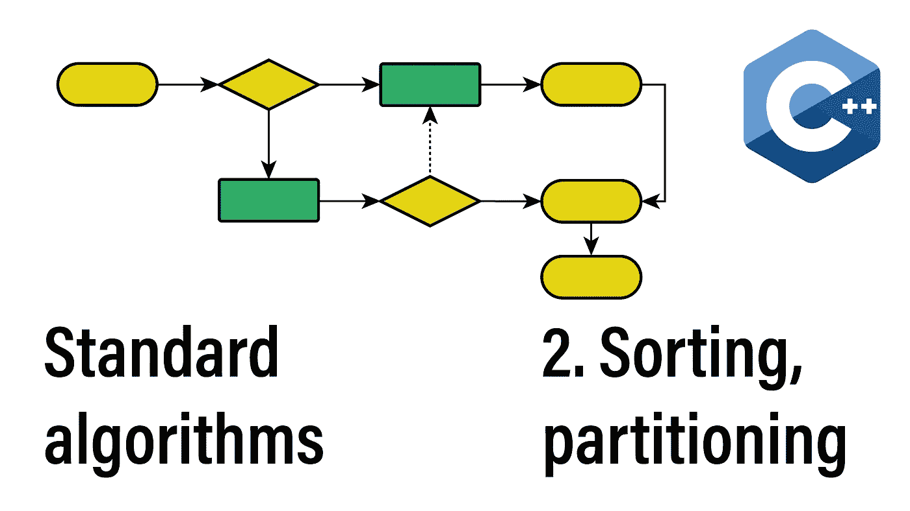

今天，我们将从 std::sort 开始讨论字典比较和 C++20 宇宙飞船操作符。然后我们将讨论标准库中提供的排序、部分排序和划分算法的所有变体。

## 该系列:

*   [简介](/the-114-standard-c-algorithms-introduction-2a75a2df4300)
*   排序和分区算法
*   [对排序或分区范围进行操作的算法](/divide-conquer-and-sets-the-114-c-algorithms-series-d0085a38046e)
*   [转换算法](/transformations-the-114-c-algorithms-series-deacdbd4c373)
*   [左侧折叠和其他缩减](/left-folds-and-other-reductions-the-114-c-algorithms-series-6195724d324)
*   [生成器、副本和移动](/generators-copies-and-moves-the-114-c-algorithms-series-1d0774472877)
*   [堆和堆](/heap-and-heap-the-114-c-algorithms-series-1d4215ae9f0d)
*   [搜索和最小值-最大值](https://medium.com/@simontoth/8a6ed951ad40)
*   结论(即将发布)

# 分类

不出所料，基本的排序算法是 std::sort。

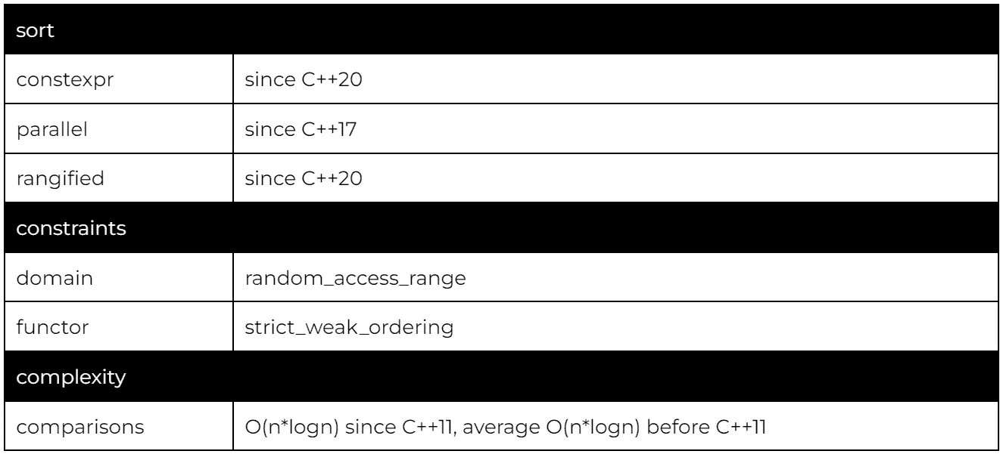

虽然 std::sort 的实际实现可能有所不同(通常是 intro-sort)，但它保证是 O(n*logn)比较(从 C++11 开始)。因此，它只能在随机访问范围内运行。这意味着我们不能将 std::sort 与 std::list 一起使用，STD::list 确实提供了 O(n*logn)排序作为方法。

有了 C++20，我们可以利用投影按方法或成员进行排序:

在这里，我们按照计算值以降序(技术上是非升序)对账户进行排序。`std::greater<>`是`std::greater`的 C++14 专门化，它依赖于类型演绎来确定参数类型。在 C++14 之前，你必须指定类型(在这里是`std::greater<double>()`)。

## 使您的类型具有可比性

在示例中，我们对基本语言中具有内在可比性的类型使用 std::sort，或者使用投影将自定义类型缩小到 double 类型。但是，有时您可能希望使您的自定义类型具有可比性。

首先，我们回到 std::sort 的要求。它期望一个严格 _ 弱 _ 排序，这意味着比较函子(或者小于运算符)需要是单向的: *f(a，a) = false* ，反对称: *f(a，b) = true = > f(b，a) = false* ，传递: *f(a，b) = true & & f(b，c) = true = > f(a，c) = true* 。

如果您的特定数据类型没有特定于域的排序方式，那么一个可靠的默认方式就是字典排序。字典顺序也是标准容器提供的顺序。

在 C++20 中，随着飞船操作符的引入，为你的类型实现比较变得简单多了:

默认的字典顺序(第 13 行)是递归的。它首先从对象的基开始，从左到右，深度优先，然后是声明顺序的非静态成员(从左到右，逐个元素地处理数组)。

为 spaceship 运算符返回的类型是基和成员的通用比较类别类型:strong_ordering、weak_ordering 或 partial_ordering。

# 字典式比较，字典式比较三种方式

当讨论字典式比较时，我们必须讨论为范围提供这种功能的两种算法。

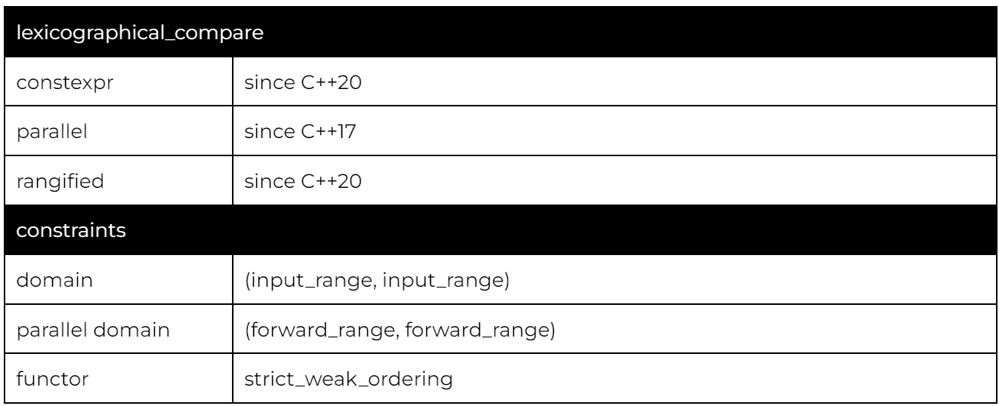

正如我已经提到的，所有标准容器都通过它们的比较操作符(在 C++20 之前)或宇宙飞船操作符(从 C++20 开始)提供字典式比较。手动调用 lexicographical _ compare 的主要用途是在使用 C 样式数组时，或者当您想要指定一个自定义元素比较器时:

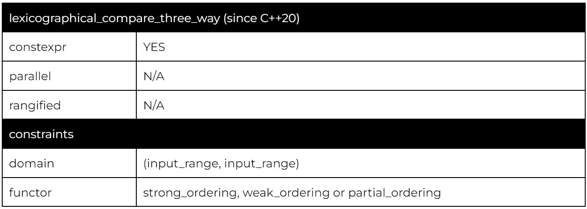

字典式比较三路是相当于字典式比较的太空船操作符。它返回 strong_ordering、weak_ordering 或 partial_ordering 类型之一(基于提供的函子)。

# 稳定排序

std::sort 可以自由地重新排列等价元素，这在对已经排序的范围重新排序时是不可取的。std::stable_sort 为保持相等元素的相对顺序提供了额外的保证。如果有额外的内存可用，stable_sort 保持为 O(n*logn)。但如果分配失败，就会退化为 O(n*logn*logn)算法。

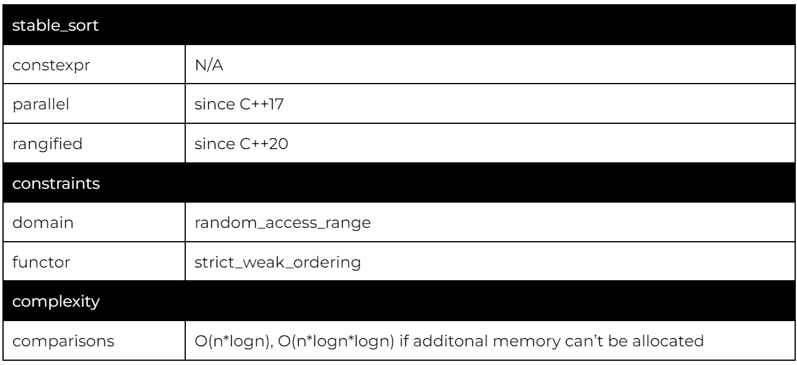

虽然 stable_sort 在我们已经按照类型的每个方面进行排序时(例如，通过依赖于字典式比较)并不特别有用，但是当排序基于用户输入时(例如，在 UI 中按照列进行重新排序)，它经常出现。

# is_sorted，is_sorted_until

为了验证一个范围是否按照提供的谓词排序，我们可以使用 is_sorted。默认谓词是 std::less。

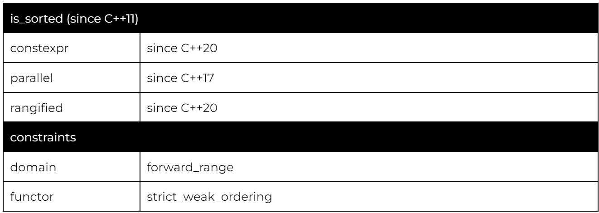

或者，我们可以使用 is_sorted_until，它将迭代器返回到第一个无序元素。

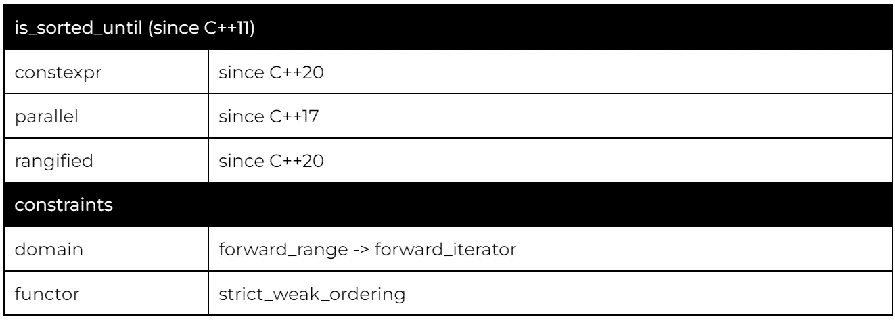

# 部分排序，部分排序复制

通常，我们只对排序顺序中最上面的两个元素感兴趣，这正是部分排序算法所提供的。使用部分排序的好处是运行时间更快——大约为 O(n*logk ),其中 k 是排序的元素数量。

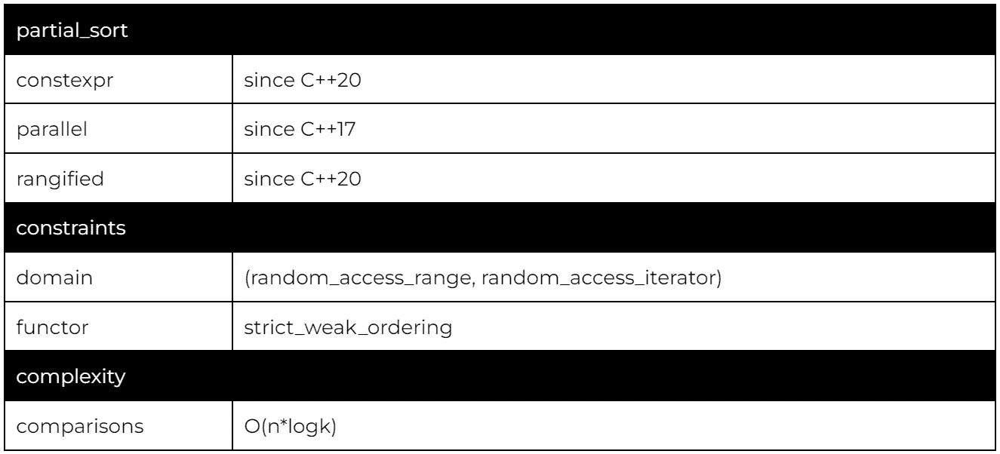

使用中间迭代器指定要排序的子范围，语义[begin，middle]表示范围的排序部分。

partial_sort 的一个变体是 partial_sort_copy，它在处理不可变的源数据时很有优势。

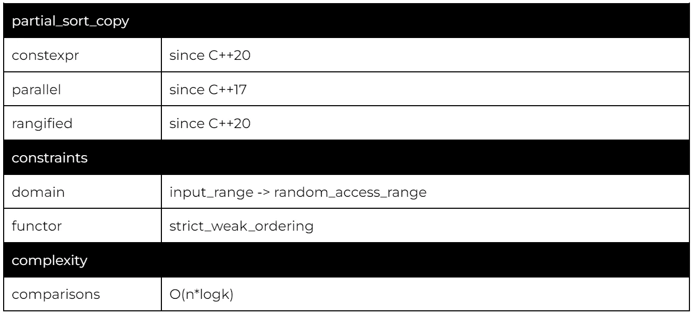

这个变体只要求目标范围是可变的和随机访问的。

# 分区，稳定分区，分区副本，已分区

分割算法将一个范围“分割”成两个子范围。首先是满足给定谓词的所有元素，其次是不满足谓词的所有元素。值得注意的是，3 路分区是 QuickSort 的核心构件。

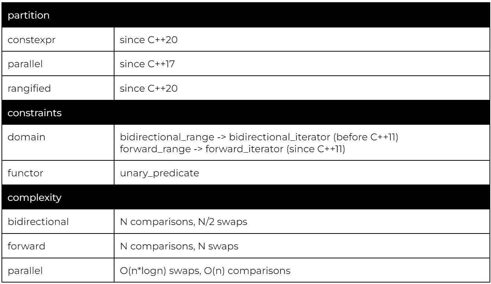

如果我们只是对按特定属性分组元素感兴趣，std::partition 是解决方案。

在这里，我们将考试结果分为及格和不及格的学生。分区算法返回分区点(第 11 行)。我们可以使用分割点来处理范围的两个部分(第 16 行和第 19 行)。

与 is_sorted 类似，我们可以使用 is_partitioned 检查一个范围是否被分区(根据给定的谓词)。

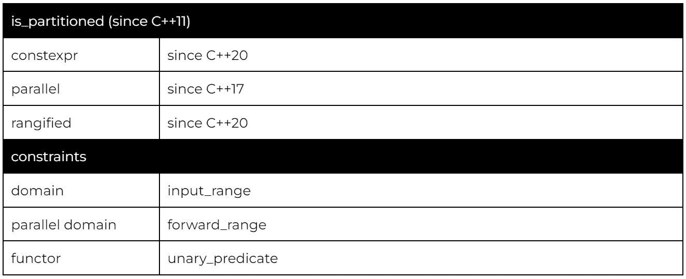

稳定分区保证它不会改变项目的相对顺序。

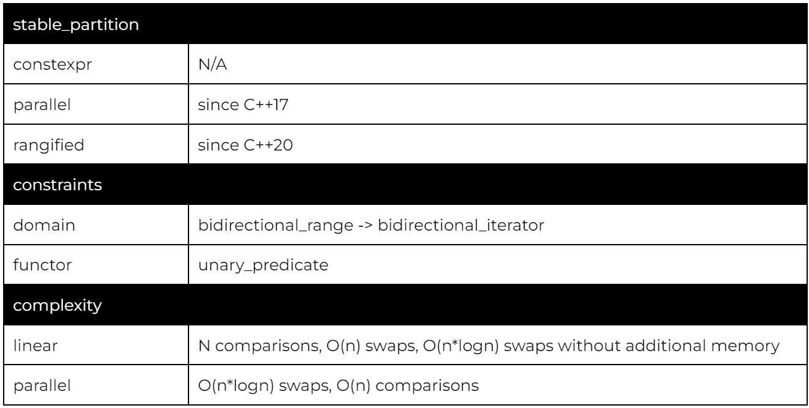

这段代码可能会令人困惑，因为我们用 std::identity 代替了谓词。但是，请注意，投影的结果是一个布尔值。因此，我们对谓词的所有要求就是转发这个值。

最后，partition_copy 不会对输入范围重新排序，而是将两个分区复制到提供的输出范围。

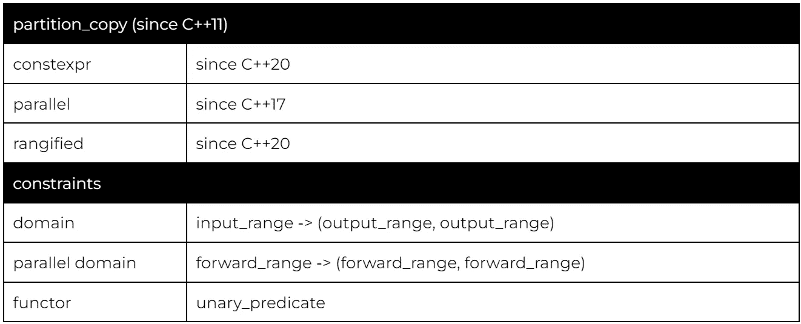

我们使用 back_inserter 适配器来填充这两个向量，而不需要预先分配足够的容量(适配器在内部调用 push_back)。

# 第 n 个元素

有时，我们只需要选择一个超出范围的特定元素(例如，选择中值时)。由于 O(n*logn)的复杂性，排序(即使是部分排序)可能是多余的。对于 O(n)复杂度，我们需要使用一个选择算法，第 n _ element 就是其中之一。

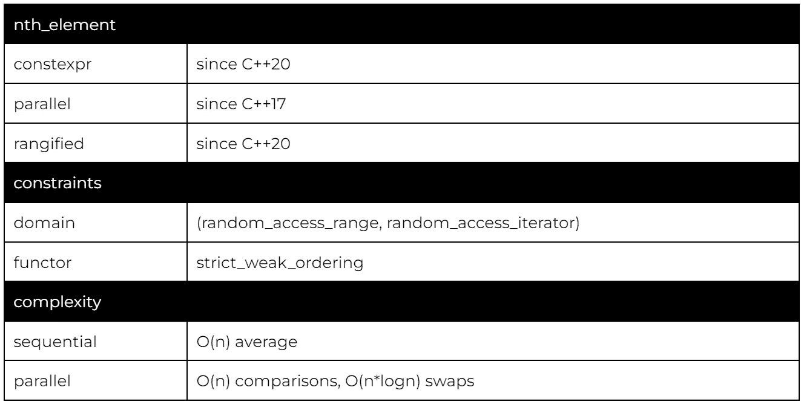

使用中间迭代器指定选取的元素。该算法将对范围进行重新排序，使该元素处于其排序后的位置。而且算法对范围进行了弱划分(中间之前的每个元素≤中间之后的每个元素)。

根据您的用例，partial_sort 有时会比 nth_element 更快，尽管理论上的复杂性更差。

# c 标准库:qsort

因为 C 标准库是 C++标准库的一部分，所以我们也可以访问 qsort。

我强烈建议避免使用 qsort，因为 std::sort 和 std::ranges::sort 在任何情况下都是更好的选择。此外，qsort 只对普通的可复制类型有效，即使使用 std::sort(如果需要的话)，也能正确地优化 memcpy 操作。

# 感谢您的阅读

不要忘记关注，这样你就不会错过本系列的其他文章。例如，下一篇文章将讨论对排序或分区范围进行操作的算法。

我也在 YouTube 上发布视频。你有问题吗？在[推特](https://twitter.com/SimonToth83)或 [LinkedIn](https://www.linkedin.com/in/simontoth) 上联系我。