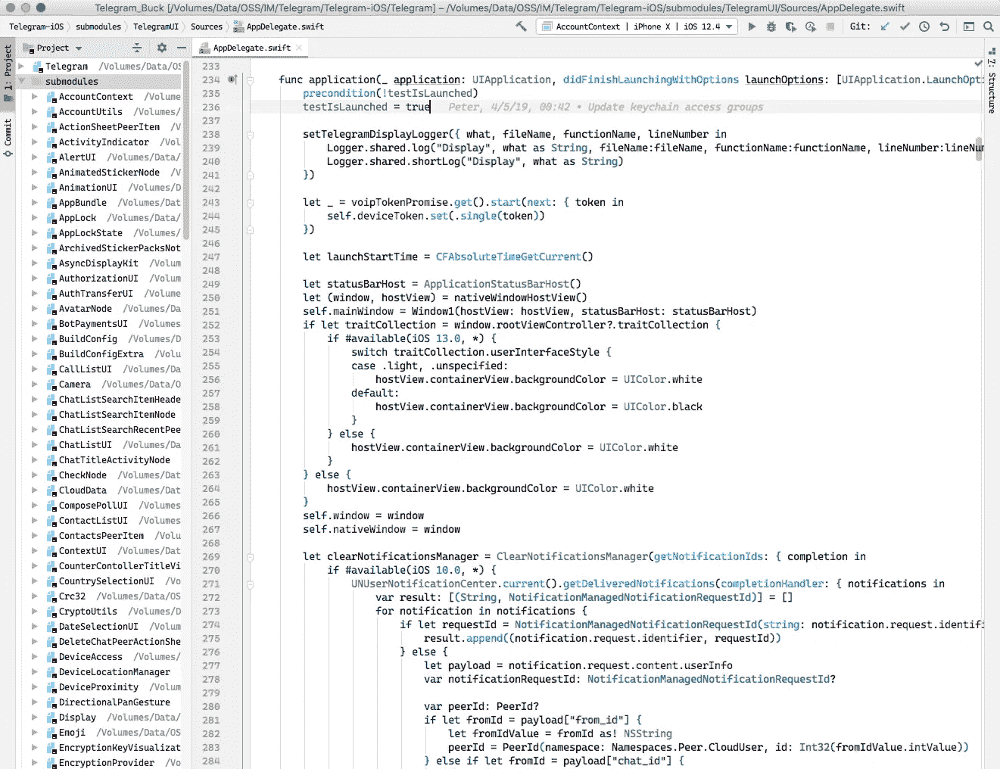

# Telegram-iOS 源代码演练:第 1 部分

> 原文：<https://itnext.io/source-code-walkthrough-of-telegram-ios-part-1-adee673e2202?source=collection_archive---------2----------------------->

## 代码库概述

> [hubo.dev](https://hubo.dev/2020-05-07-source-code-walkthrough-of-telegram-ios-part-1/) 的镜像

# 介绍

elegram 是市场上最受欢迎的即时通讯工具之一。截至今年 4 月，其 MAU 已过 [4 亿](https://telegram.org/blog/400-million)。考虑到它的服务在某些国家不可用，这是一个巨大的成就。

大多数 Telegram [客户端应用](https://telegram.org/apps)都是开源的，以证明其安全性基因。他们还启动了一个新的程序，允许其他人验证 iOS 和 Android 的源代码是否与应用商店和 Google Play 上使用的版本相同。这个过程是一个值得赞赏的举措，有助于缓解过去几年对其缓慢释放习惯的批评。

由于 iOS 是我最喜欢的平台，所以第一系列文章都是关于 [Telegram-iOS](https://github.com/TelegramMessenger/Telegram-iOS) 。代码库展示了其他 iOS 工程师会遇到的许多实际工程问题的解决方案，如可靠的网络、安全的存储、反应式事件、多媒体回放、交互式 UX、复杂的列表 UI、系统控制器的定制/破解等。

# 代码概述

Telegram-iOS 通过 200 多个[子模块](https://github.com/TelegramMessenger/Telegram-iOS/tree/master/submodules)组织源代码，代码超过 200 万行。我大致将这些模块分为五类:

*   `App`，支持主要应用功能的模块，如基础实用程序、UI、网络等。
*   `VoIP`，2017 年 3 月底发布的语音通话功能。
*   `Watch`，手表 app。
*   `TON`，与新区块链平台的实验性整合。
*   `3rd-party`，它所依赖的其他开源项目。

以下是每个类别的 LOC 统计数据:

Telegram-iOS 是一个混合语言项目。通过查看`App`类别，Swift 中有近 70%的代码，Objective-C/C++中有 24%的代码。[降压器](https://buck.build/)用作构建工具。看起来它也在向巴泽尔移动。对于不熟悉 iOS 构建工具的读者来说，普通的 Xcode 项目文件格式，比如`.xcodeproj`和`.xcworkspace`，对于较小的项目已经足够好了。从长远来看，维护起来会变得很困难，因为文件是用 XML 表示的，并且是通过 Xcode UI 指令编辑的。当 Xcode 文件中存在合并冲突时，这通常不是一种愉快的体验，而且在代码审查期间发现问题也很有挑战性。

Buck 是脸书开发的一个构建系统。它鼓励由代码和资源组成的小模块，这导致干净的构建配置文件和更快的并行构建。对于一个典型的模块，它只有一个用十几行描述构建规则的`BUCK`文件，一个用于代码文件的`Sources`文件夹，以及一个可选的用于图像的`Resouces`文件夹。命令`buck project`可以生成 Xcode 项目文件，供工程师在 Xcode 中开发，这些文件在 Git 中被显式忽略。您可以在`[Makefile](https://github.com/TelegramMessenger/Telegram-iOS/blob/master/Makefile#L382)`中找到更多详细信息。还有一个来自 Airbnb 的[模板项目](https://github.com/airbnb/BuckSample)使用 Buck 构建 iOS 应用。

# 子模块

这里是所有 229 个子模块的统计列表。136 模块由不超过两个几百行的源文件组成。一些小的不值得放在专用模块中，在 IMO 中可能会被合并，但这是设计品味的问题。

 [## 电报-iOS 统计

docs.google.com](https://docs.google.com/spreadsheets/d/1isAY-89ZvoXG3JpB4eytVmLYm21TITFkWb7WtR71sQ0/edit#gid=2029178277) 

# 结论

代码统计应该给 Telegram-iOS 项目一个简要的印象。我将在下一篇文章中讨论基础模块。