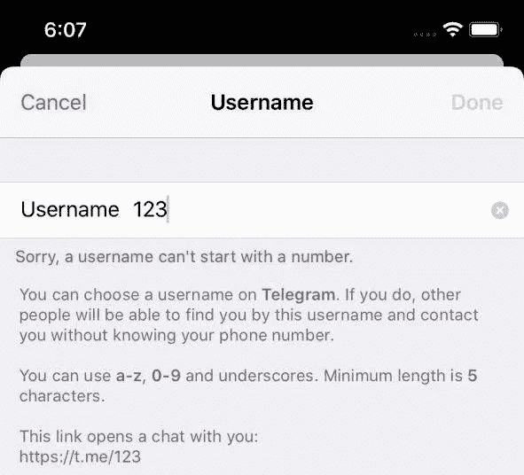
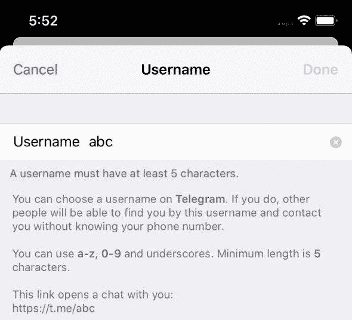
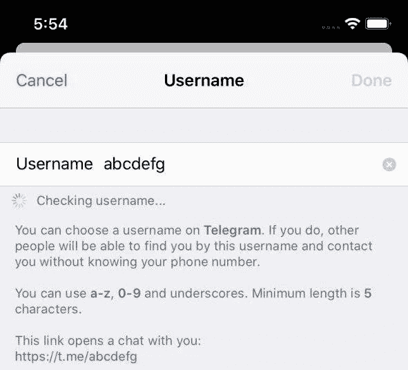
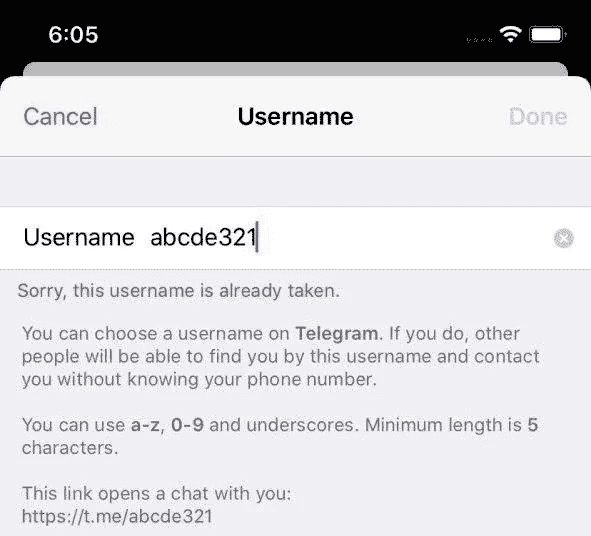
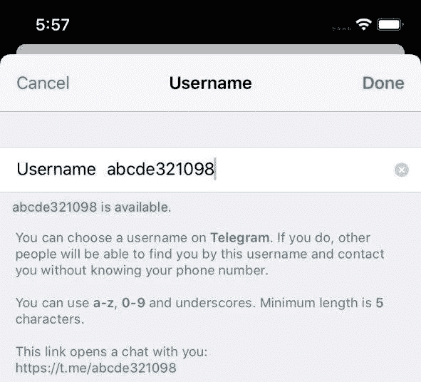
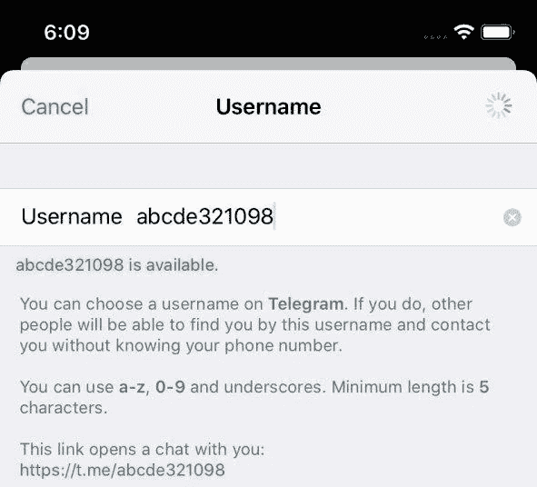

# Telegram-iOS 第 2 部分源代码演练:SSignalKit

> 原文：<https://itnext.io/source-code-walkthrough-of-telegram-ios-part-2-ssignalkit-afdf35ff60ba?source=collection_archive---------1----------------------->

> [hubo.dev](https://hubo.dev/2020-05-11-source-code-walkthrough-of-telegram-ios-part-2/) 的镜像

照片由 [JJ 英](https://unsplash.com/@jjying?utm_source=medium&utm_medium=referral)在 [Unsplash](https://unsplash.com?utm_source=medium&utm_medium=referral) 上拍摄

# 介绍

elegram-iOS 在大多数模块中使用反应式编程。有三个框架来实现项目内部的反应功能:

*   `[MTSignal](https://github.com/TelegramMessenger/Telegram-iOS/blob/master/submodules/MtProtoKit/Sources/MTSignal.m)`:这可能是他们在 Objective-C 中第一次尝试反应式范例。它主要用在模块 [MtProtoKit](https://github.com/TelegramMessenger/Telegram-iOS/tree/master/submodules/MtProtoKit) 中，该模块实现了 [MTProto](https://core.telegram.org/mtproto) ，Telegram 的移动协议。
*   `[SSignalKit](https://github.com/TelegramMessenger/Telegram-iOS/tree/master/submodules/SSignalKit/SSignalKit)`:它是 MTSignal 的后代，用于更一般的场景，原语和操作更丰富。
*   `[SwiftSignalKit](https://github.com/TelegramMessenger/Telegram-iOS/tree/master/submodules/SSignalKit/SwiftSignalKit)`:斯威夫特的一个对等港口。

这篇文章关注 SwiftSignalKit，用用例来解释它的设计。

# 设计

## 信号

`[Signal](https://github.com/TelegramMessenger/Telegram-iOS/blob/master/submodules/SSignalKit/SwiftSignalKit/Source/Signal.swift#L41)`是一个捕捉“随时间变化”概念的类。其签名如下所示:

为了建立一个信号，它接受一个生成器闭包，该闭包定义了生成数据(`<T>)`)、捕捉错误(`<E>`)和更新完成状态的方法。一旦设置好，函数`start`就可以注册观察器闭包。

## 订户

`[Subscriber](https://github.com/TelegramMessenger/Telegram-iOS/blob/master/submodules/SSignalKit/SwiftSignalKit/Source/Subscriber.swift)`具有将数据分发到每个观察者闭包的逻辑，并考虑到线程安全。

当错误发生或完成时，订户被终止。状态无法逆转。

*   只要订户没有被终止，`putNext`就向`next`闭包发送新数据
*   `putError`向`error`闭包发送错误，并标记订户终止
*   `putCompletion`调用`completed`关闭并标记用户终止。

## 经营者

定义了一组丰富的操作符来提供信号的功能原语。这些原语根据其功能分为几类:`[Catch](https://github.com/TelegramMessenger/Telegram-iOS/blob/master/submodules/SSignalKit/SwiftSignalKit/Source/Signal_Catch.swift)`、`[Combine](https://github.com/TelegramMessenger/Telegram-iOS/blob/master/submodules/SSignalKit/SwiftSignalKit/Source/Signal_Combine.swift)`、`[Dispatch](https://github.com/TelegramMessenger/Telegram-iOS/blob/master/submodules/SSignalKit/SwiftSignalKit/Source/Signal_Dispatch.swift)`、`[Loop](https://github.com/TelegramMessenger/Telegram-iOS/blob/master/submodules/SSignalKit/SwiftSignalKit/Source/Signal_Loop.swift)`、`[Mapping](https://github.com/TelegramMessenger/Telegram-iOS/blob/master/submodules/SSignalKit/SwiftSignalKit/Source/Signal_Mapping.swift)`、`[Meta](https://github.com/TelegramMessenger/Telegram-iOS/blob/master/submodules/SSignalKit/SwiftSignalKit/Source/Signal_Meta.swift)`、`[Reduce](https://github.com/TelegramMessenger/Telegram-iOS/blob/master/submodules/SSignalKit/SwiftSignalKit/Source/Signal_Reduce.swift)`、`[SideEffects](https://github.com/TelegramMessenger/Telegram-iOS/blob/master/submodules/SSignalKit/SwiftSignalKit/Source/Signal_SideEffects.swift)`、`[Single](https://github.com/TelegramMessenger/Telegram-iOS/blob/master/submodules/SSignalKit/SwiftSignalKit/Source/Signal_Single.swift)`、`[Take](https://github.com/TelegramMessenger/Telegram-iOS/blob/master/submodules/SSignalKit/SwiftSignalKit/Source/Signal_Take.swift)`和`[Timing](https://github.com/TelegramMessenger/Telegram-iOS/blob/master/submodules/SSignalKit/SwiftSignalKit/Source/Signal_Timing.swift)`。让我们以几个映射运算符为例:

像`map()`这样的操作符接受一个转换闭包并返回一个函数来改变信号的数据类型。有一个方便的`|>`操作符可以帮助将这些操作符链接成管道:

运算符`|>`可能会受到 JavaScript 世界中提议的[管道运算符](https://developer.mozilla.org/en-US/docs/Web/JavaScript/Reference/Operators/Pipeline_operator)的启发。通过 Swift 的尾随闭包支持，所有运算符都可以以直观的可读性进行流水线操作:

## 长队

类`[Queue](https://github.com/TelegramMessenger/Telegram-iOS/blob/master/submodules/SSignalKit/SwiftSignalKit/Source/Queue.swift)`是 GCD 上的一个包装器，用于管理在信号中调度数据的队列。一般用例有三个预置队列:`globalMainQueue,` `globalDefaultQueue,`和`globalBackgroundQueue`。没有机制可以避免[过度使用](https://forums.developer.apple.com/message/338719#338719)队列，我认为这是可以改进的。

## 可任意处理的

协议`[Disposable](https://github.com/TelegramMessenger/Telegram-iOS/blob/master/submodules/SSignalKit/SwiftSignalKit/Source/Disposable.swift)`定义了一些可以被处理的东西。它通常与释放资源或取消任务有关。四个类实现了这个协议，并且可以覆盖大多数用例:`ActionDisposable`、`MetaDisposable`、`DisposableSet`和`DisposableDict`。

## 承诺

类`[Promise](https://github.com/TelegramMessenger/Telegram-iOS/blob/master/submodules/SSignalKit/SwiftSignalKit/Source/Promise.swift)`和`[ValuePromise](https://github.com/TelegramMessenger/Telegram-iOS/blob/master/submodules/SSignalKit/SwiftSignalKit/Source/Promise.swift#L82)`是为多个观察者对一个数据源感兴趣的场景而构建的。`Promise`支持使用信号更新数据值，而`ValuePromise`被定义为直接接受值的变化。

# 用例

让我们来看看项目中的一些真实用例，它们展示了 SwiftSignalKit 的使用模式。

## #1 请求授权

iOS 强制应用程序在访问设备上的敏感信息之前请求用户授权，如[联系人](https://developer.apple.com/documentation/contacts/requesting_authorization_to_access_contacts)、[摄像头](https://developer.apple.com/documentation/avfoundation/cameras_and_media_capture/requesting_authorization_for_media_capture_on_ios)、[位置](https://developer.apple.com/documentation/corelocation/requesting_authorization_for_location_services)等。在与朋友聊天时，Telegram-iOS 有一个功能，可以将您的位置作为消息发送。让我们看看它是如何用信号获得位置授权的。

该工作流是一个标准的异步任务，可以通过 SwiftSignalKit 进行建模。`[DeviceAccess.swift](https://github.com/TelegramMessenger/Telegram-iOS/blob/master/submodules/DeviceAccess/Sources/DeviceAccess.swift)`中的函数`[authorizationStatus](https://github.com/TelegramMessenger/Telegram-iOS/blob/master/submodules/DeviceAccess/Sources/DeviceAccess.swift#L84)`返回一个信号来检查当前的授权状态:

> 当前的实现通过管道传输了另一个`[then](https://github.com/TelegramMessenger/Telegram-iOS/blob/master/submodules/DeviceAccess/Sources/DeviceAccess.swift#L233)`操作，我认为这是一段复制粘贴代码，应该删除。

当`[LocationPickerController](https://github.com/TelegramMessenger/Telegram-iOS/blob/master/submodules/LocationUI/Sources/LocationPickerController.swift#L295)`出现时，它观察来自`authorizationStatus`的信号，如果未确定许可，则调用`DeviceAccess.authrizeAccess`。

`Signal.start`返回`Disposable`的一个实例。最佳实践是将它保存在一个字段变量中，并在`deinit`中处理它。

## #2 更改用户名

让我们看一个更复杂的例子。电报允许每个用户在`[UsernameSetupController](https://github.com/TelegramMessenger/Telegram-iOS/blob/master/submodules/SettingsUI/Sources/UsernameSetupController.swift)`中更改唯一的用户名。用户名用于生成一个公共链接，供其他人联系您。

`[UsernameSetupController](https://github.com/TelegramMessenger/Telegram-iOS/blob/master/submodules/SettingsUI/Sources/UsernameSetupController.swift)`的状态

实施应满足以下要求:

*   控制器从当前用户名和当前主题开始。Telegram 有一个强大的[主题系统](https://telegram.org/blog/android-themes)，所有的控制器都应该是主题化的。
*   应该首先在本地验证输入字符串，以检查其长度和字符。
*   应该向后端发送一个有效的字符串以进行可用性检查。在快速打字的情况下，应该限制请求的数量。
*   UI 反馈应该跟随用户的输入。屏幕上的消息应该告诉新用户名的状态:正在检查、无效、不可用或可用。当输入字符串有效且可用时，应该启用右侧导航按钮。
*   一旦用户想要更新用户名，右边的导航按钮应该在更新过程中显示一个活动指示器。

有三个数据源可能会随着时间的推移而改变:主题、当前帐户和编辑状态。主题和账户是项目中的基础数据组件，因此有专用的信号:`[SharedAccountContext.presentationData](https://github.com/TelegramMessenger/Telegram-iOS/blob/master/submodules/AccountContext/Sources/AccountContext.swift#L428)`和`[Account.viewTracker.peerView](https://github.com/TelegramMessenger/Telegram-iOS/blob/master/submodules/TelegramCore/Sources/AccountViewTracker.swift#L1153)`。我会试着在其他帖子中介绍它们。让我们一步一步来关注如何用 Signal 对编辑状态进行建模。

1.  结构`[UsernameSetupControllerState](https://github.com/TelegramMessenger/Telegram-iOS/blob/master/submodules/SettingsUI/Sources/UsernameSetupController.swift#L130)`用三个元素定义数据:编辑输入文本、验证状态和更新标志。提供了几个助手函数来更新它并获得一个新的实例。

2.状态变化由`ValuePromise`中的`[statePromise](https://github.com/TelegramMessenger/Telegram-iOS/blob/master/submodules/SettingsUI/Sources/UsernameSetupController.swift#L228)`传播，这也提供了一个简洁的特性来省略重复的数据更新。还有一个`[stateValue](https://github.com/TelegramMessenger/Telegram-iOS/blob/master/submodules/SettingsUI/Sources/UsernameSetupController.swift#L229)`来保存最新状态，因为在外面`ValuePromise`中的数据[不可见](https://github.com/TelegramMessenger/Telegram-iOS/blob/master/submodules/SSignalKit/SwiftSignalKit/Source/Promise.swift#L83)。在项目中，价值承诺伴随着状态价值是一种常见的模式。对内部值公开读访问可能是对`ValuePromise` IMO 的一个适当的改进。

3.验证过程可以在管道信号中实现。操作员`delay`将请求延迟 0.3 秒。为了快速输入，步骤 4 中的设置会取消之前未发送的请求。

4.A `[MetaDisposable](https://github.com/TelegramMessenger/Telegram-iOS/blob/master/submodules/SettingsUI/Sources/UsernameSetupController.swift#L239)`保持信号，当`text`在`TextFieldNode`中改变时，更新`statePromise`和`stateValue`中的数据。调用`checkAddressNameDisposable.set()`时，前一个被处理，触发第三步操作符`delay`内的取消任务。

> `[TextFieldNode](https://github.com/TelegramMessenger/Telegram-iOS/blob/master/submodules/Display/Source/EditableTextNode.swift)`是`ASDisplayNode`的子类，包装了一个用于文本输入的 UITextField。Telegram-iOS 利用来自 [AsyncDisplayKit](https://github.com/TelegramMessenger/Telegram-iOS/tree/master/submodules/AsyncDisplayKit) 的异步渲染机制，使其复杂的消息 UI 流畅且响应迅速。

5.操作符`[combineLatest](https://github.com/TelegramMessenger/Telegram-iOS/blob/master/submodules/SettingsUI/Sources/UsernameSetupController.swift#L288)`组合这三个信号，如果其中任何一个发生变化，就更新控制器 UI。

# 结论

`SSignalKit`是 Telegram-iOS 对反应式编程的解决方案。核心组件，如`Signal`和`Promise`，以与其他反应式框架略有不同的方式实现。它在模块中广泛使用，将 UI 与数据更改联系起来。

这种设计鼓励大量使用闭包。有很多闭包相互嵌套，[缩进一些行](https://github.com/TelegramMessenger/Telegram-iOS/blob/master/submodules/TelegramUI/Sources/ChatMediaInputNode.swift#L1125)远。该项目还喜欢[将许多动作公开为闭包](https://github.com/TelegramMessenger/Telegram-iOS/blob/master/submodules/TelegramUI/Sources/ChatControllerInteraction.swift#L52)以获得灵活性。电报工程师如何保持代码质量并轻松调试信号对我来说仍然是一个神话。