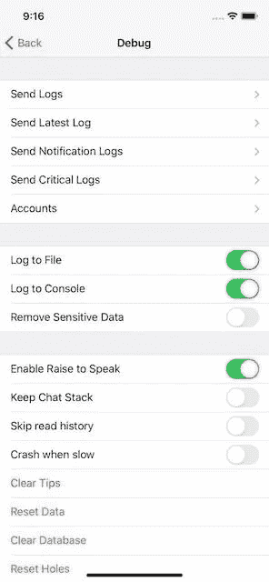

# Telegram-iOS 源代码演练第 3 部分:其他基础

> 原文：<https://itnext.io/source-code-walkthrough-of-telegram-ios-part-3-other-foundations-66ace05954a4?source=collection_archive---------2----------------------->

> [hubo.dev](https://hubo.dev/2020-05-15-source-code-walkthrough-of-telegram-ios-part-3/) 的镜像

照片由 [Mirko Blicke](https://unsplash.com/@mirkoblicke?utm_source=medium&utm_medium=referral) 在 [Unsplash](https://unsplash.com?utm_source=medium&utm_medium=referral) 上拍摄

让我再用一个帖子来完成这个项目的基础模块的介绍。

# 记录

模块`TelegramCore`提供了一个简单的[日志](https://github.com/TelegramMessenger/Telegram-iOS/blob/master/submodules/TelegramCore/Sources/Log.swift)实现。

如果标志打开，它支持登录到控制台和文件系统。`queue`用于在非主线程中运行文件写入。`redactSensitiveData`由其他代码决定是否在日志消息中包含敏感数据。

在公共版本中，仍然可以通过上一节介绍的应用内调试控制器来更改设置。

对于不依赖于 TelegramCore 的模块，项目设置通过`[Network.swift](https://github.com/TelegramMessenger/Telegram-iOS/blob/master/submodules/TelegramCore/Sources/Network.swift)`中的`[registeredLoggingFunctions](https://github.com/TelegramMessenger/Telegram-iOS/blob/master/submodules/TelegramCore/Sources/Network.swift#L156)`桥接功能。它将日志调用从 [MtProtoKit](https://github.com/TelegramMessenger/Telegram-iOS/blob/master/submodules/MtProtoKit/Sources/MTLogging.m) 、[邮箱](https://github.com/TelegramMessenger/Telegram-iOS/blob/master/submodules/Postbox/Sources/PostboxLogging.swift)和 [TelegramApi](https://github.com/TelegramMessenger/Telegram-iOS/blob/master/submodules/TelegramApi/Sources/TelegramApiLogger.swift) 等模块重定向到共享日志记录器。

它不是一个甚至不支持日志记录级别的花哨框架。还有很多模块根本不做日志记录或者只是通过`[print](https://github.com/TelegramMessenger/Telegram-iOS/search?l=Swift&q=print&type=Code)` / `[NSLog](https://github.com/TelegramMessenger/Telegram-iOS/search?q=NSLog&type=Code)`进行日志记录。它可能需要进一步清理海事组织。例如，聊天中打开的 URL 通过打印记录到系统输出中的[最近提交](https://github.com/TelegramMessenger/Telegram-iOS/commit/d5142c876e084bb2df39f0d56a8c2e12d961f91b#diff-7cef1a32e852176c8b9240cd5e3d5e40R8001)，这听起来不是一个好主意。

# 崩溃报告

Telegram 不使用第三方 SDK 来防止[用户数据](https://blog.zoom.us/wordpress/2020/03/27/zoom-use-of-facebook-sdk-in-ios-client/)泄露是合理的。让我感到惊讶的是，这个项目没有任何内置的崩溃报告模块，甚至没有一个自己开发的模块。在查看提交历史后，它确实整合了 Hockey SDK，然后在今年 1 月通过 commit `bdc0bb2`移除了它。工程师可能会依靠 AppStore 的崩溃报告来检查稳定性问题。

Hockey SDK 已经被微软淘汰，转而支持[应用中心](https://docs.microsoft.com/en-us/appcenter/transition/)。Telegram-iOS 使用一个[应用中心 API](https://github.com/TelegramMessenger/Telegram-iOS/blob/b3ab501a75cd12ff079f32c299dea4a38ac61bba/submodules/TelegramUI/Sources/AppDelegate.swift#L2198) 来检查更新。没有与 SDK 集成。

# 磁盘存储器

为了支持主应用程序、观察应用程序、意图应用程序扩展之间的数据共享，该项目将大多数数据存储在名为`telegram-data`的[组容器文件夹](https://github.com/TelegramMessenger/Telegram-iOS/blob/b3ab501a75cd12ff079f32c299dea4a38ac61bba/submodules/TelegramUI/Sources/AppDelegate.swift#L373)中。一些[遗留组件](https://github.com/TelegramMessenger/Telegram-iOS/blob/master/submodules/LegacyComponents/PublicHeaders/LegacyComponents/LegacyComponentsGlobals.h#L56)仍然使用`[Documents](https://github.com/TelegramMessenger/Telegram-iOS/blob/master/submodules/LegacyUI/Sources/TelegramInitializeLegacyComponents.swift#L374)`文件夹。下面是`telegram-data`的典型布局:

除了直接读写文件之外，项目对结构化数据大多使用`SQLite`。启用了两个 SQLite 扩展:`[SQLCipher](https://github.com/TelegramMessenger/Telegram-iOS/tree/b3ab501a75cd12ff079f32c299dea4a38ac61bba/submodules/sqlcipher)`用于完全数据库加密，而`[FTS5](https://github.com/TelegramMessenger/Telegram-iOS/blob/master/submodules/Database/ValueBox/Sources/SqliteValueBox.swift#L617)`用于全文搜索。这种方式在其他流行的信使中也很流行，比如[微信](https://github.com/Tencent/wcdb)和 [SignalApp](https://github.com/signalapp/Signal-iOS/tree/master/SignalServiceKit/src/Storage) 。

[LMDB](http://www.lmdb.tech/doc/) ，一个基于 BTree 的事务键值存储，为一些 Objective-C 组件提供:比如`[TGEmbedCoubPlayerView](https://github.com/TelegramMessenger/Telegram-iOS/blob/master/submodules/LegacyComponents/Sources/TGEmbedCoubPlayerView.m)`([coub.com](http://coub.com)的嵌入式播放器)，以及负责在发送媒体消息时编辑照片和视频的`[TGMediaEditingContext](https://github.com/TelegramMessenger/Telegram-iOS/blob/master/submodules/LegacyComponents/Sources/TGMediaEditingContext.m)`。

# 网络传输

消息传递和 VoIP 呼叫是需要网络传输的两个主要场景。可靠的连接和实时更新是 messenger 应用程序的重要特征，这是一个迷人的挑战，因为全球网络环境相当复杂。一些工程技巧被发明出来，并在 messenger 应用程序中广泛应用，如流量混淆、混合端点发现、域名转发等。我会试着在其他文章中写更多关于这个主题的内容。

电报的核心协议 [MTProto](https://core.telegram.org/mtproto) ，被设计成支持[多种传输协议](https://core.telegram.org/mtproto/transports)。目前版本的 Telegram-iOS 只支持 [TCP 传输](https://github.com/TelegramMessenger/Telegram-iOS/blob/master/submodules/MtProtoKit/Sources/MTTcpTransport.m)。HTTP 传输在 2018 年被[移除](https://github.com/TelegramMessenger/Telegram-iOS/commit/80c64348dcebe2c972ddfef1e2f78bf3c6109391)。VoIP 模块`[libtgvoip](https://github.com/telegramdesktop/libtgvoip/tree/522550a1e975b17e9048d7a2ab2d5b97cfc2f5d4)`支持 UDP 和 TCP 传输。

Telegram-iOS 还利用来自 PushKit 的 [VoIP 通知，通过苹果的网络接收数据。这是另一个广泛使用的技巧，使应用程序能够将数据封装在通知负载中，并在后台处理它，而无需用户交互。正常的 APNS 无法复制同样的行为。这对于一些核心功能是必不可少的，如更新未读计数，如果应用程序无法连接到后端，检索新的端点，更新实时位置等。](https://developer.apple.com/documentation/pushkit/responding_to_voip_notifications_from_pushkit)

由于任何滥用都可能导致严重的电池消耗问题，自 iOS SDK 13 以来，苹果开始要求应用程序在收到 VoIP 通知后[调用 CallKit](https://developer.apple.com/videos/play/wwdc2019/707?time=624) 。但是 Telegram-iOS 似乎从新规则中幸存了下来，因为它从苹果那里获得了一项特殊权利。在 [SignalApp](https://github.com/signalapp/Signal-iOS/blob/master/Signal/Signal-AppStore.entitlements#L22) 中也可以找到相同的未记录权利。

# UI 框架

除了使用 [AsyncDisplayKit](https://github.com/TelegramMessenger/Telegram-iOS/tree/master/submodules/AsyncDisplayKit) 作为其核心 UI 渲染框架，Telegram-iOS 更进一步，用它重新实现了常见的 UIKit 控制器和视图。大部分 UIKit 组件都可以在项目内部找到对应的组件:`NavigationController`、`TabBarController`、`AlertController`、`ActionSheetController`、`NavigationBar`、`ItemListController`(替换 UITableViewController)等。这种方法相当合理，一旦你被主要 iOS 版本中系统控制器的不一致行为所困扰。

> 跑题了。有趣的是，大多数 iOS 工程师最终会在 UIKit 上学习一些 swizzing 技巧。不知何故，重新实现像 UINavigationController 这样的组件并不像破解原始组件那样简单。我最喜欢的一个细节是 UINavigationController 如何设法推动和弹出一个只支持风景的控制器。

关于 UI 属性动画，`[POP](https://github.com/TelegramMessenger/Telegram-iOS/blob/master/submodules/LegacyComponents/Sources/POPAnimation.mm)`是 Objective-C 中[遗留 UI 组件](https://github.com/TelegramMessenger/Telegram-iOS/tree/master/submodules/LegacyComponents)的动画，而 swift 模块大多在 [CADisplayLink](https://github.com/TelegramMessenger/Telegram-iOS/blob/master/submodules/Display/Source/DisplayLinkAnimator.swift) 或 [CoreAnimation](https://github.com/TelegramMessenger/Telegram-iOS/blob/master/submodules/Display/Source/CAAnimationUtils.swift) 上使用自己的 animator 实现。

这款应用内置了两个洛蒂库`[rlottie](https://github.com/TelegramMessenger/Telegram-iOS/tree/master/submodules/rlottie)`和`[lottie-ios](https://github.com/TelegramMessenger/Telegram-iOS/tree/master/submodules/lottie-ios)`，以支持后期效果动画。`rlottie`主要用于`tgs`格式的[动画贴纸](https://telegram.org/blog/animated-stickers)。`Lottie-ios`用于从[捆绑资源](https://github.com/TelegramMessenger/Telegram-iOS/tree/master/submodules/TelegramUI/Resources/Animations)中加载动画文件。看起来实际上没有必要为同一件事创建两个库，`lottie-ios`可以被`rlottie`代替。

# 单元测试

项目中基本没有单元测试。

# 应用内调试

点击设置 10 次会出现[调试控制器](https://github.com/TelegramMessenger/Telegram-iOS/blob/master/submodules/SettingsUI/Sources/DebugController.swift)，在这里可以调整[日志设置](https://github.com/TelegramMessenger/Telegram-iOS/blob/master/submodules/TelegramCore/Sources/LoggingSettings.swift)，收集日志，尝试[实验 UI 设置](https://github.com/TelegramMessenger/Telegram-iOS/blob/master/submodules/TelegramUIPreferences/Sources/ExperimentalUISettings.swift)等。

