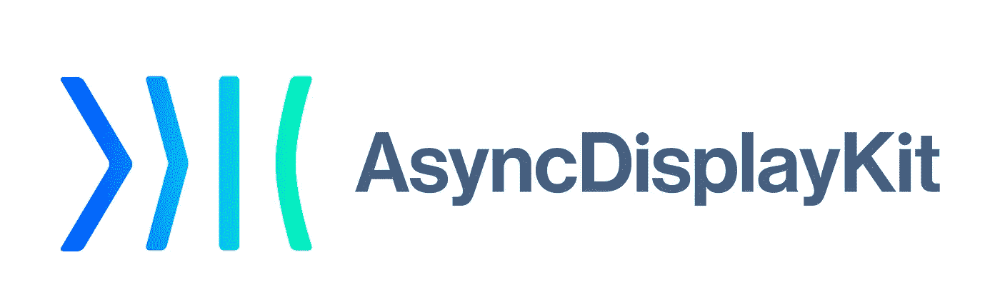
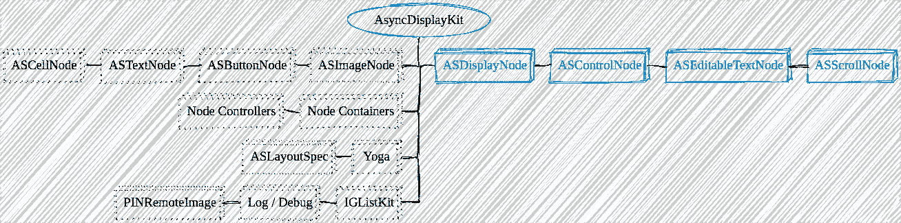
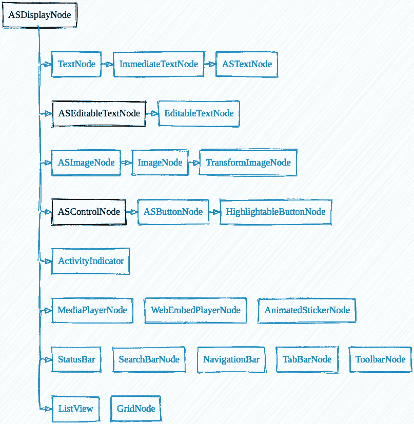
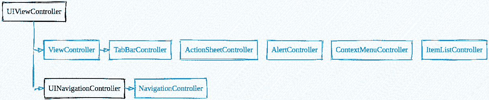

# 电报源代码演练-iOS 第 5 部分:AsyncDisplayKit

> 原文：<https://itnext.io/source-code-walkthrough-of-telegram-ios-part-5-asyncdisplaykit-8c6a209da681?source=collection_archive---------1----------------------->

> [hubo.dev](https://hubo.dev/2020-06-14-source-code-walkthrough-of-telegram-ios-part-5/) 之镜

elegram-iOS 基于 AsyncDisplayKit 构建了大部分 ui。它被称为该项目的[子模块](https://github.com/TelegramMessenger/Telegram-iOS/tree/release-6.1.2/submodules/AsyncDisplayKit)，其中许多功能已被移除，其中一些功能在 Swift 中重新实现。这篇文章讨论了项目中的组件结构和 UI 编程模式。

# 1.概观

AsyncDisplayKit 是一个异步 UI 框架，最初[诞生于脸书](https://engineering.fb.com/ios/introducing-asyncdisplaykit-for-smooth-and-responsive-apps-on-ios/)。是 Pinterest 采用的[，2017 年更名为](https://medium.com/pinterest-engineering/introducing-texture-a-new-home-for-asyncdisplaykit-e7c003308f50)[纹理](https://texturegroup.org/)。它的核心概念是使用`[node](https://texturegroup.org/docs/getting-started.html)`作为`UIView`的抽象，这有点类似于 React Virtual DOM 的想法。节点是线程安全的，这有助于将昂贵的 UI 操作移出主线程，如图像解码、文本大小调整等。节点也是轻量级的，这允许您在表和集合中不重用单元格。

民间 AsyncDisplayKit 的结构

如图所示，Telegram-iOS 保留了大约 35%的代码，用蓝框表示，并从正式版本中删除了其他代码。

*   从上游合并的最新提交是`[ae2b3af9](https://github.com/TextureGroup/Texture/commit/ae2b3af9)`
*   像`[ASDisplayNode](https://github.com/TelegramMessenger/Telegram-iOS/blob/release-6.1.2/submodules/AsyncDisplayKit/Source/ASDisplayNode.mm)`、`[ASControlNode](https://github.com/TelegramMessenger/Telegram-iOS/blob/release-6.1.2/submodules/AsyncDisplayKit/Source/ASControlNode.mm)`、`[ASEditableTextNode](https://github.com/TelegramMessenger/Telegram-iOS/blob/release-6.1.2/submodules/AsyncDisplayKit/Source/ASEditableTextNode.mm)`和`[ASScrollNode](https://github.com/TelegramMessenger/Telegram-iOS/blob/release-6.1.2/submodules/AsyncDisplayKit/Source/ASScrollNode.mm)`这样的基本节点大部分是完整的。
*   `[ASImageNode](https://texturegroup.org/docs/image-node.html)`及其子类被删除。Telegram 使用 MTProto 而不是 HTTPS 从数据中心下载文件。正式版的[网络镜像支持](https://texturegroup.org/docs/network-image-node.html)没有用，所以对`[PINRemoteImage](https://github.com/pinterest/PINRemoteImage)`的依赖也被删除了。
*   移除所有正式的[节点容器](https://texturegroup.org/docs/containers-overview.html)，如`[ASCollectionNode](https://texturegroup.org/docs/containers-ascollectionnode.html)`、`[ASTableNode](https://texturegroup.org/docs/containers-astablenode.html)`、`[ASViewController](https://texturegroup.org/docs/containers-asviewcontroller.html)`等。节点上的表和视图控制器在 Swift 中重新实现，不依赖`[IGListKit](https://github.com/TextureGroup/Texture/blob/master/Source/Layout/ASLayout%2BIGListDiffKit.h)`。
*   该项目更喜欢手动布局。受 CSS Flexbox 启发的[官方布局 API 去掉了，](https://texturegroup.org/docs/layout2-quickstart.html) [yoga 引擎](https://texturegroup.org/development/layout-specs.html)也去掉了。
*   移除内部[测井和调试](https://texturegroup.org/development/how-to-debug.html)支架。

基本上来说，Telegram-iOS 保留了核心节点系统的最小集合，然后用数百个节点子类对其进行扩展。代码分布在子模块中，如`[Display](https://github.com/TelegramMessenger/Telegram-iOS/tree/release-6.1.2/submodules/Display)`、`[TelegramUI](https://github.com/TelegramMessenger/Telegram-iOS/tree/release-6.1.2/submodules/TelegramUI)`、`[ItemListUI](https://github.com/TelegramMessenger/Telegram-iOS/tree/release-6.1.2/submodules/ItemListUI)`和其他支持主电报 UI 特性的子模块。

# 2.核心节点

核心节点类

有几个节点类作为构建应用程序用户界面的基本块。让我们按照图表中所列来检查它们。

> 带箭头的边表示右边的节点是左边节点的子类。没有边的同一级别的节点意味着它们与最左边的节点共享同一个父类。

## 文本

`[TextNode](https://github.com/TelegramMessenger/Telegram-iOS/blob/release-6.1.2/submodules/Display/Source/TextNode.swift#L775)`、`[ImmediateTextNode](https://github.com/TelegramMessenger/Telegram-iOS/blob/release-6.1.2/submodules/Display/Source/ImmediateTextNode.swift#L9)`、`[ASTextNode](https://github.com/TelegramMessenger/Telegram-iOS/blob/release-6.1.2/submodules/Display/Source/ImmediateTextNode.swift#L199)`负责文本渲染。

文本节点

`TextNode`利用`CoreText`渲染一个`NSAttributedString`。它有一个方法`[calculateLayout](https://github.com/TelegramMessenger/Telegram-iOS/blob/release-6.1.2/submodules/Display/Source/TextNode.swift#L826)`来计算基于行的文本布局，并覆盖类方法`[draw](https://github.com/TelegramMessenger/Telegram-iOS/blob/release-6.1.2/submodules/Display/Source/TextNode.swift#L1084)`来呈现文本。公共类方法`[asyncLayout](https://github.com/TelegramMessenger/Telegram-iOS/blob/release-6.1.2/submodules/Display/Source/TextNode.swift#L1198)`用于异步调用布局计算并缓存结果。通过设计调用`asyncLayout`是被调用者的责任。否则，它不会呈现任何内容，因为缓存的布局为零。实现支持 [RTL](https://github.com/TelegramMessenger/Telegram-iOS/blob/release-6.1.2/submodules/Display/Source/TextNode.swift#L32) 和[可访问性](https://github.com/TelegramMessenger/Telegram-iOS/blob/release-6.1.2/submodules/Display/Source/TextNode.swift#L668)也很棒。

`ImmediateTextNode`通过添加更多属性来控制文本布局样式，丰富了`TextNode`。它还支持链接高亮显示和点击操作。

`ASTextNode`在设置属性`attributedText`时简单更新布局。它不是 AsyncDisplayKit 项目中的[同一个](https://texturegroup.org/docs/text-node.html),尽管它共享相同的类名。

`[EditableTextNode](https://github.com/TelegramMessenger/Telegram-iOS/blob/release-6.1.2/submodules/Display/Source/EditableTextNode.swift#L5)`扩展`ASEditableTextNode`以支持 RTL 输入检测。

## 图像

图像节点

`[ASImageNode](https://github.com/TelegramMessenger/Telegram-iOS/blob/release-6.1.2/submodules/Display/Source/Nodes/ASImageNode.swift#L5)`渲染一个`UIImage`并使用图像大小作为其节点大小。同样不是官方项目中的[同级](https://texturegroup.org/docs/image-node.html)。

`[ImageNode](https://github.com/TelegramMessenger/Telegram-iOS/blob/release-6.1.2/submodules/Display/Source/ImageNode.swift#L124)`接受信号异步设置图像内容。虽然名字看起来很普通，但却是`[AvatarNode](https://github.com/TelegramMessenger/Telegram-iOS/blob/release-6.1.2/submodules/AvatarNode/Sources/AvatarNode.swift#L216)`专用的。

`[TransformImageNode](https://github.com/TelegramMessenger/Telegram-iOS/blob/176e4eaad7505b12c86a400b9da6903695b3bc35/submodules/Display/Source/TransformImageNode.swift#L17)`是异步图像最广泛使用的类。它支持改变图像的阿尔法动画，并支持颜色覆盖。

## 纽扣

按钮节点

`[ASButtonNode](https://github.com/TelegramMessenger/Telegram-iOS/blob/release-6.1.2/submodules/Display/Source/Nodes/ButtonNode.swift#L5)`模拟一个带有图像和标题的按钮，有三种状态:正常、高亮和禁用。

`[HighlightableButtonNode](https://github.com/TelegramMessenger/Telegram-iOS/blob/release-6.1.2/submodules/Display/Source/HighlightableButton.swift#L87)`在跟踪按钮时添加高亮动画。

## 状态

`[ActivityIndicator](https://github.com/TelegramMessenger/Telegram-iOS/blob/release-6.1.2/submodules/ActivityIndicator/Sources/ActivityIndicator.swift#L57)`复制了`UIActivityIndicatorView`的风格，并提供灵活的选项来定制细节，如[颜色、直径和线宽](https://github.com/TelegramMessenger/Telegram-iOS/blob/release-6.1.2/submodules/ActivityIndicator/Sources/ActivityIndicator.swift#L64)。

## 媒体

Telegram-iOS 实现了一组丰富的组件来支持不同的媒体类型。这篇文章只是一瞥。这个系列值得专门写一篇，包括 FFMpeg 集成，第三方视频网站的应用内视频播放，贴纸动画等。

`[MediaPlayNode](https://github.com/TelegramMessenger/Telegram-iOS/blob/release-6.1.2/submodules/MediaPlayer/Sources/MediaPlayerNode.swift#L54)`是子模块`[MediaPlayer](https://github.com/TelegramMessenger/Telegram-iOS/tree/release-6.1.2/submodules/MediaPlayer)`中的一个节点类，用于在`AVSampleBufferDisplayLayer`上渲染视频帧。

`[WebEmbedPlayerNode](https://github.com/TelegramMessenger/Telegram-iOS/blob/release-6.1.2/submodules/TelegramUniversalVideoContent/Sources/WebEmbedPlayerNode.swift#L63)`通过嵌入`WKWebView`播放网页中的视频。它支持来自 Youtube、Vimeo、Twitch 等的视频。

`[AnimatedStickerNode](https://github.com/TelegramMessenger/Telegram-iOS/blob/release-6.1.2/submodules/AnimatedStickerNode/Sources/AnimatedStickerNode.swift#L385)`播放来自`AnimatedStickerNodeSource`的华丽动画。

## 酒吧

`[SearchBarNode](https://github.com/TelegramMessenger/Telegram-iOS/blob/release-6.1.2/submodules/SearchBarNode/Sources/SearchBarNode.swift#L253)`、`[NavigationBar](https://github.com/TelegramMessenger/Telegram-iOS/blob/release-6.1.2/submodules/Display/Source/NavigationBar.swift#L105)`、`[TabBarNode](https://github.com/TelegramMessenger/Telegram-iOS/blob/release-6.1.2/submodules/Display/Source/TabBarNode.swift#L303)`和`[ToolbarNode](https://github.com/TelegramMessenger/Telegram-iOS/blob/release-6.1.2/submodules/Display/Source/ToolbarNode.swift#L5)`模仿 UIKit 对应物的特征。它还消除了操作系统版本之间不一致行为的影响，这是一个令人不快的问题，因为 UIKit 内部对开发人员来说是不可见的。

`[StatusBar](https://github.com/TelegramMessenger/Telegram-iOS/blob/release-6.1.2/submodules/Display/Source/StatusBar.swift#L66)`在系统状态栏区域显示通话中文本通知。

## 目录

是为滚动列表设计的最复杂的节点类之一。它利用一个隐藏的`UIScrollView`，并借用它的平移手势来获得滚动行为，就像我们从 [WWDC 2014](https://asciiwwdc.com/2014/sessions/235) 中学到的一样。除了管理列表中项目的可见性，无论项目是小还是大，它还提供了额外的简洁功能，如方便的项目标题、可定制的滚动指示器、记录项目、滚动节点、捕捉边界等。

`[GridNode](https://github.com/TelegramMessenger/Telegram-iOS/blob/release-6.1.2/submodules/Display/Source/GridNode.swift#L208)`是另一个用于网格布局的滚动 UI 组件。它支持贴纸选择屏幕、壁纸设置等功能。

# 3.控制器

通用控制器

`[ViewController](https://github.com/TelegramMessenger/Telegram-iOS/blob/release-6.1.2/submodules/Display/Source/ViewController.swift#L76)`使`UIViewController`成为节点层次结构的容器。与官方的节点控制器类`[ASViewController](https://texturegroup.org/docs/containers-asviewcontroller.html)`不同，它没有像[可见深度](https://texturegroup.org/docs/asvisibility.html)和[智能预加载](https://texturegroup.org/docs/intelligent-preloading.html)这样的特性。

视图控制器

每个 ViewController 通过一个根内容节点来管理节点层次结构，该节点存储在该类的`displayNode`属性中。有函数`loadDisplayNode`和`displayNodeDidLoad`可以实现与我们在`UIViewController`中所熟悉的相同的惰性视图加载行为。

作为基类，它为子类准备了几个共享节点组件:一个状态栏、一个导航栏、一个工具栏和一个`scrollToTopView`。还有方便的属性来定制它的导航栏这对于一个普通的`UIViewController`来说还是一个繁琐的问题。

`ViewController`很少单独使用，项目中有超过 100 个控制器子类用于不同的用户界面。UIKit 中最常用的两个容器控制器`UINavigationController`和`UITabBarController`，被重新实现为`NavigationController`和`TabBarController`。

导航控制器

`[NavigationController](https://github.com/TelegramMessenger/Telegram-iOS/blob/release-6.1.2/submodules/Display/Source/Navigation/NavigationController.swift#L105)`扩展了`UINavigationController`来借用它的公共 API，因为它可能与普通的视图控制器一起工作。它在内部重建一切，包括以下内容:

*   子控制器的直接管理。由于它只是一个简单的数组，所以它可以自由地调整堆栈操作的一些边缘情况。
*   过渡动画。你可以在`[ContainedViewLayoutTransition](https://github.com/TelegramMessenger/Telegram-iOS/blob/release-6.1.2/submodules/Display/Source/ContainedViewLayoutTransition.swift#L65)`里找到所有的动画细节。
*   互动流行手势。添加了一个`[InteractiveTransitionGestureRecognizer](https://github.com/TelegramMessenger/Telegram-iOS/blob/release-6.1.2/submodules/Display/Source/InteractiveTransitionGestureRecognizer.swift#L62)`,使弹出手势能够应用于所有屏幕区域。
*   iPad 等大屏幕的分割母版细节布局。它支持两种布局:`flat`和`split`。很高兴有一个容器控制器来支持 iPhone 和 iPad，而不是在`UISplitViewController`上耗费精力。
*   主题。通过属性`theme`很容易定制外观和感觉。

`[TabBarController](https://github.com/TelegramMessenger/Telegram-iOS/blob/release-6.1.2/submodules/Display/Source/TabBarController.swift#L75)`只在根屏幕中使用，所以它是`ViewController`而不是`UITabBarController`的子类，因为不需要保存 API。同样的规则也适用于`[ActionSheetController](https://github.com/TelegramMessenger/Telegram-iOS/blob/release-6.1.2/submodules/Display/Source/ActionSheetController.swift#L4)`、`[AlertController](https://github.com/TelegramMessenger/Telegram-iOS/blob/release-6.1.2/submodules/Display/Source/AlertController.swift#L70)`和`[ContextMenuController](https://github.com/TelegramMessenger/Telegram-iOS/blob/release-6.1.2/submodules/Display/Source/ContextMenuController.swift#L15)`。该实现完美地涵盖了系统视图控制器内部的细节，用户体验几乎与用户 IMO 相同。

通过管理一个`ListView``[ItemListController](https://github.com/TelegramMessenger/Telegram-iOS/blob/release-6.1.2/submodules/ItemListUI/Sources/ItemListController.swift#L105)`相当于`UITableViewController`。它还支持自定义覆盖节点、搜索视图和重新排序项目。

# 4.布局

AsyncDisplayKit 中的 Flexbox 布局系统被混合布局机制所取代:

*   所有布局都是手动完成的。很明显，工程师们不喜欢自动布局的概念。
*   布局计算在简单 ui 的主线程中运行。布局代码可以放在用于节点的`layout`方法中，或者放在用于视图控制器的`containerLayoutUpdated`方法中。
*   `ListView`为项目节点建立灵活的布局机制，支持同步和异步计算。

# 5.结论

Telegram 集成 AsyncDisplayKit 的方法给我留下了深刻的印象。为了效率和完全控制，它在节点上重建了整个 UIKit 组件系列。聊天消息列表在旧设备上感觉很流畅，尽管气泡界面呈现起来很复杂。处理系统升级债务的代码很少，每年 WWDC 之后总要耗费大部分工程师的一些“快乐时光”。让我们看看在两周后的第一次在线 WWDC 后，可能会打破什么。