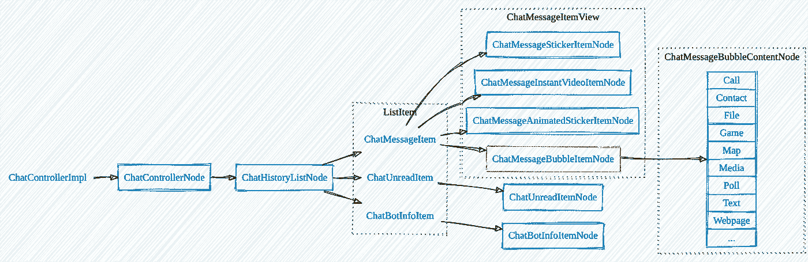
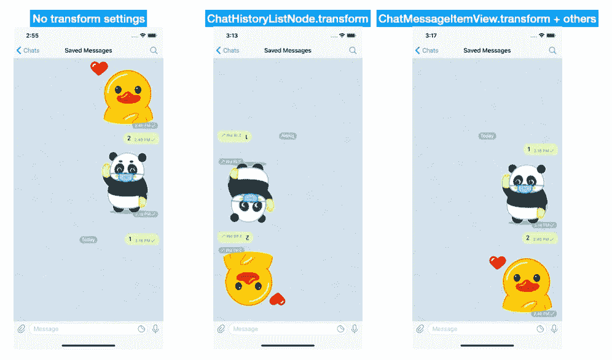
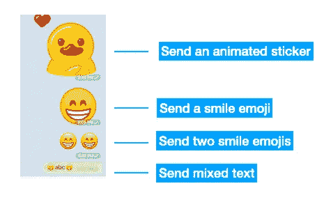
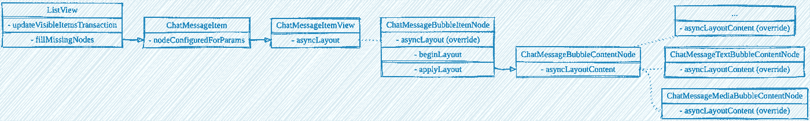

# Telegram-iOS 第 6 部分源代码演练:气泡

> 原文：<https://itnext.io/source-code-walkthrough-of-telegram-ios-part-6-bubbles-836b61759bdf?source=collection_archive---------1----------------------->

> [之镜 hubo.dev](https://hubo.dev/2020-06-22-source-code-walkthrough-of-telegram-ios-part-6/)

[梁杰森](https://unsplash.com/@ninjason?utm_source=medium&utm_medium=referral)在 [Unsplash](https://unsplash.com?utm_source=medium&utm_medium=referral) 上拍照

ubbles 是一种用户界面，几乎是我们日常生活中不可或缺的一部分。如果消息是一段纯文本或一个图像文件，这是一件简单的工作。Telegram 中的问题很困难，因为有许多消息元素，如文本、样式文本、降价文本、图像、相册、视频、文件、网页、位置等等。当一条消息可以包含几乎多个任意类型的元素时，这就变得更加困难了。本文展示了 Telegram-iOS 如何在其异步 UI 框架上构建消息气泡。

# 课程概述

`[ChatControllerImpl](https://github.com/TelegramMessenger/Telegram-iOS/blob/release-6.1.2/submodules/TelegramUI/Sources/ChatController.swift#L145)`是管理消息列表 UI 的核心控制器。其内容`[ChatControllerNode](https://github.com/TelegramMessenger/Telegram-iOS/blob/release-6.1.2/submodules/TelegramUI/Sources/ChatControllerNode.swift#L59)`由以下主要节点组成 UI 结构:

作为`[ListView](https://github.com/TelegramMessenger/Telegram-iOS/blob/release-6.1.2/submodules/Display/Source/ListView.swift#L134)`的子类，`[ChatHistoryListNode](https://github.com/TelegramMessenger/Telegram-iOS/blob/release-6.1.2/submodules/TelegramUI/Sources/ChatHistoryListNode.swift#L397)`呈现消息列表和其他信息节点。它有两种 UI 模式:`[bubbles](https://github.com/TelegramMessenger/Telegram-iOS/blob/release-6.1.2/submodules/TelegramUI/Sources/ChatHistoryListNode.swift#L76)`和`[list](https://github.com/TelegramMessenger/Telegram-iOS/blob/release-6.1.2/submodules/TelegramUI/Sources/ChatHistoryListNode.swift#L77)`。模式`bubbles`用于正常聊天，而`list`用于在对方信息面板中按媒体、文件、语音等类型列出聊天历史。这个帖子只说模式`bubbles`。

它的核心数据属性`[items](https://github.com/TelegramMessenger/Telegram-iOS/blob/release-6.1.2/submodules/Display/Source/ListView.swift#L260)`可以取三种类型的`[ListViewItem](https://github.com/TelegramMessenger/Telegram-iOS/blob/release-6.1.2/submodules/Display/Source/ListViewItem.swift#L41)`。每一项实现`nodeConfiguredForParams`返回对应的 UI 节点。

`[ChatMessageItem](https://github.com/TelegramMessenger/Telegram-iOS/blob/release-6.1.2/submodules/TelegramUI/Sources/ChatMessageItem.swift#L223)`代表一条聊天消息或一组聊天消息，应呈现为气泡。`[ChatMessageItemView](https://github.com/TelegramMessenger/Telegram-iOS/blob/release-6.1.2/submodules/TelegramUI/Sources/ChatMessageItemView.swift#L644)`的四个子类是不同类型气泡的容器节点。`[ChatMessageBubbleItemNode](https://github.com/TelegramMessenger/Telegram-iOS/blob/release-6.1.2/submodules/TelegramUI/Sources/ChatMessageBubbleItemNode.swift#L152)`实现了一种呈现消息气泡的机制，该气泡具有多个内容元素，这些内容元素是`[ChatMessageBubbleContentNode](https://github.com/TelegramMessenger/Telegram-iOS/blob/release-6.1.2/submodules/TelegramUI/Sources/ChatMessageBubbleContentNode.swift#L110)`的子类。

# 列表倒置

聊天消息列表将最新消息放在底部，垂直滚动指示器也从底部开始。它实际上是 iOS 上常见列表 UI 的倒置。Telegram-iOS 使用了类似于《T5》的《T4》中的 UI 转换技巧。使用`ASDisplayNode`的属性`transform`将`ChatHistoryListNode`旋转 180°，然后所有内容节点也旋转。

下面的屏幕截图演示了逐步应用转换后的效果:

# ListView 项目

*   `[ChatBotInfoItem](https://github.com/TelegramMessenger/Telegram-iOS/blob/release-6.1.2/submodules/TelegramUI/Sources/ChatBotInfoItem.swift#L19)`。如果对等体是电报机器人，则机器人信息卡被插入到项目的第一个位置。
*   `[ChatUnreadItem](https://github.com/TelegramMessenger/Telegram-iOS/blob/release-6.1.2/submodules/TelegramUI/Sources/ChatUnreadItem.swift#L12)`。这是一个区分未读邮件和已读邮件的指示器。
*   `[ChatMessageItem](https://github.com/TelegramMessenger/Telegram-iOS/blob/release-6.1.2/submodules/TelegramUI/Sources/ChatMessageItem.swift#L268)`。它对聊天消息建模如下:

`[ChatControllerInteraction](https://github.com/TelegramMessenger/Telegram-iOS/blob/release-6.1.2/submodules/TelegramUI/Sources/ChatControllerInteraction.swift#L52)`是为`ChatControllerImpl`维护 77 个动作回调的数据类。它通过项来触发回调，而不需要引用控制器。

`[ChatMessageItemContent](https://github.com/TelegramMessenger/Telegram-iOS/blob/release-6.1.2/submodules/TelegramUI/Sources/ChatMessageItem.swift#L15)`的结构很有意思。它是一个枚举，可以是一条消息，也可以是一组消息。依我看，它可以简化为`.group`，因为`.message`可以用一个元素的组来表达。

`[Message](https://github.com/TelegramMessenger/Telegram-iOS/blob/release-6.1.2/submodules/Postbox/Sources/Message.swift#L487)`使用两个协议`[MessageAttribute](https://github.com/TelegramMessenger/Telegram-iOS/blob/release-6.1.2/submodules/Postbox/Sources/Message.swift#L468)`和`[Media](https://github.com/TelegramMessenger/Telegram-iOS/blob/release-6.1.2/submodules/Postbox/Sources/Media.swift#L75)`来描述消息中的内容元素。

一个`Message`实例总是有一个`text`条目和一些可选的`MessageAttribute`。如果`attributes`有一个`[TextEntitiesMessageAttribute](https://github.com/TelegramMessenger/Telegram-iOS/blob/release-6.1.2/submodules/SyncCore/Sources/TextEntitiesMessageAttribute.swift#L129)`的条目，可以通过`[stringWithAppliedEntities](https://github.com/TelegramMessenger/Telegram-iOS/blob/release-6.1.2/submodules/TextFormat/Sources/StringWithAppliedEntities.swift#L49)`构造一个属性化的字符串。然后，可以在气泡内呈现丰富的格式化文本。

协议`Media`及其类实现描述了丰富的媒体类型，如`[TelegramMediaImage](https://github.com/TelegramMessenger/Telegram-iOS/blob/release-6.1.2/submodules/SyncCore/Sources/TelegramMediaImage.swift#L53)`、`[TelegramMediaFile](https://github.com/TelegramMessenger/Telegram-iOS/blob/release-6.1.2/submodules/SyncCore/Sources/TelegramMediaFile.swift#L237)`、`[TelegramMediaMap](https://github.com/TelegramMessenger/Telegram-iOS/blob/release-6.1.2/submodules/SyncCore/Sources/TelegramMediaMap.swift#L133)`等。

总而言之，`Message`基本上是一个带有几个媒体附件的属性化字符串，而`ChatMessageItem`是一组`Message`实例。这种设计可以灵活地表示复杂的消息内容，并且很容易保持向后兼容性。例如，一个[分组相册](https://telegram.org/blog/albums-saved-messages)被表示为一个包含多条消息的项目，而每条消息都有一个媒体`[TelegramMediaImage](https://github.com/TelegramMessenger/Telegram-iOS/blob/release-6.1.2/submodules/SyncCore/Sources/TelegramMediaImage.swift#L53)`。

# 气泡节点

`ChatMessageItem`执行`[nodeConfiguredForParams](https://github.com/TelegramMessenger/Telegram-iOS/blob/release-6.1.2/submodules/TelegramUI/Sources/ChatMessageItem.swift#L378)`来设置气泡节点以匹配数据。如果我们研究一下代码，它在项目结构上有一些规则。

*   如果第一条消息具有小于 128 KB 的动画贴纸媒体文件，则选择`[ChatMessageAnimatedStickerItemNode](https://github.com/TelegramMessenger/Telegram-iOS/blob/release-6.1.2/submodules/TelegramUI/Sources/ChatMessageAnimatedStickerItemNode.swift#L35)`来渲染带有贴纸的气泡。项目中的其他消息和媒体数据将被忽略。
*   默认情况下，应用程序中打开了大型表情符号支持的设置。如果一条短信只有一个表情符号字符或者所有字符都是表情符号，则用`ChatMessageAnimatedStickerItemNode`或`[ChatMessageStickerItemNode](https://github.com/TelegramMessenger/Telegram-iOS/blob/release-6.1.2/submodules/TelegramUI/Sources/ChatMessageStickerItemNode.swift#L20)`代替纯文本实现大渲染效果。

*   如果项目的第一条消息有即时循环视频文件，则选择`[ChatMessageInstantVideoItemNode](https://github.com/TelegramMessenger/Telegram-iOS/blob/release-6.1.2/submodules/TelegramUI/Sources/ChatMessageInstantVideoItemNode.swift#L22)`显示循环视频，其他内容将被忽略。
*   否则，`[ChatMessageBubbleItemNode](https://github.com/TelegramMessenger/Telegram-iOS/blob/release-6.1.2/submodules/TelegramUI/Sources/ChatMessageBubbleItemNode.swift#L152)`处理结构化消息。

`ChatMessageBubbleItemNode`检查一个项目，并通过将数据映射到`[ChatMessageBubbleContentNode](https://github.com/TelegramMessenger/Telegram-iOS/blob/release-6.1.2/submodules/TelegramUI/Sources/ChatMessageBubbleContentNode.swift#L110)`的 16 个子类来构建子节点。`[contentNodeMessagesAndClassesForItem](https://github.com/TelegramMessenger/Telegram-iOS/blob/release-6.1.2/submodules/TelegramUI/Sources/ChatMessageBubbleItemNode.swift#L32)`是维护映射逻辑的核心功能:

# 布局

气泡的布局由`ListView`的异步布局机制驱动。上图显示了最重要的布局方法的调用流程。在我对装有 iOS 13.5 的 iPhone 6s 进行测试期间，FPS 能够保持在 58 以上，这比其他拥有长而复杂的用户界面列表的应用程序要好。这无疑证明了`AsyncDisplayKit`是 Telegram 场景的一个好选择。

需要注意的一点是`ListView`不会缓存布局结果。如果你的设备真的很慢，你会在滚动时看到空的单元格。

# 结论

这篇文章简要解释了 Telegram-iOS 中消息气泡的数据模型和 UI 结构。数据结构对于复杂的消息是灵活的，这是检查您是否开始设计自己的 messenger 的一个很好的参考。我鼓励您按照我的介绍深入研究代码，因为这里没有涉及更多的细节。