# 从上到下的源地图

> 原文：<https://itnext.io/source-maps-from-top-to-bottom-597bbc07436?source=collection_archive---------2----------------------->

这篇文章涵盖了 JS 代码生成器和源代码映射机制的基本概述和深入解释。从零开始建造我们自己的，因此它是相当长的。

对大多数人来说，源地图有点神秘。它们存在于大多数基于 web 的编译场景中；从类型系统到网络捆扎机。但是它们实际上是如何构建的细节往往不是 100%透明的，因为它们的使用本身就足够复杂了。今天，我们将从它们是什么以及如何使用它们的简要概述开始。然后通过较低层次的机制继续前进；通过构建我们自己的编译器，它将生成一些代码，并生成自己的源地图供浏览器使用。

这是我的[“引擎盖下”系列](https://craigtaub.dev/introducing-my-under-the-hood-of-series)的一部分:

*   [网络捆扎机(如网络包)](https://craigtaub.dev/under-the-hood-of-web-bundlers)
*   [类型系统(如 TypeScript)](https://craigtaub.dev/under-the-hood-of-type-systems)
*   [测试跑步者(如摩卡)](https://craigtaub.dev/under-the-hood-of-test-runners)
*   [VSCode 自动格式化程序(例如更漂亮)](https://craigtaub.dev/under-the-hood-of-vscode-auto-formatters)
*   [反应钩](https://craigtaub.dev/under-the-hood-of-react-hooks)
*   [阿波罗](/under-the-hood-of-apollo-6d8642066b28)

这篇文章的完整视频浏览在[这里](https://www.youtube.com/watch?v=nUV4t5V16I4)。我的“[](https://www.youtube.com/channel/UCYi23MnKBKn0yLZKBrz5Bfw)*的幕后部分”视频系列。*

*今天的计划(如有帮助，请使用链接跳过):*

## *[A 部分:源代码和编译器简介](#b420)*

1.  *什么是源地图，为什么它们有用？*
2.  *[使用流行工具制作源地图](#12f4)*
3.  *[什么是 AST？](#b26c)*
4.  *[转换 JavaScript 的步骤](#4e78)*
5.  *[编译器如何构建源代码图](#e91b)*

## *[B 部分:构建我们自己的编译器](#8dad)*

1.  *[构建 JavaScript 代码生成器](#3b8f)*
2.  *什么是 Base64 VLQ？*
3.  *[增加源地图支持](#9de9)*
4.  *[测试我们的源图](#4340)*

*我们开始吧💪*

# *A 部分:源代码映射和编译器简介*

## ***1。什么是源地图，为什么它们有用？***

*首先让我们看看为什么人们编写需要编译成本地 JavaScript 的一些原因:*

*   *使用类型系统，*
*   *使用最新的 ES 8–9–10 功能，*
*   *代码优化(例如缩小)*
*   *捆绑包优化(例如，供应商与应用程序捆绑包)*

*现代编译器架构如下所示:*

**

*问题是，在将模块转化为资产的过程中，代码本身变得不可读，因为它的重点是放在计算机(通常是浏览器或服务器)上阅读。*

*下面是一些通过编译器编译的示例代码。如果出现问题，几乎不可能推理，甚至更难调试。*

*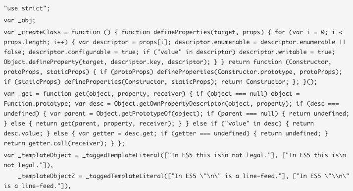*

*这就是源地图的用武之地！！*

*源映射的基本定义是:*

> **“源映射提供了一种将压缩文件中的代码映射回其在源文件中的原始位置的方法”**

*目的非常明确。现代浏览器会自动解析源地图，让它看起来好像你在运行未缩小或未合并的文件。*

*下面的例子显示了在浏览器中调试 TypeScript，这是由于源映射才有可能实现的。*

*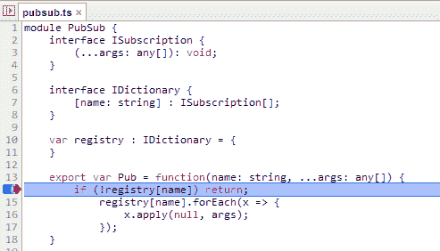*

*这样，您现在可以在代码中放置一个断点，并在浏览器中检查调用堆栈、变量和任何运行时状态，所有这些都是通过预编译的 TypeScript 代码完成的。*

## ***2。使用流行工具的源地图***

***将浏览器连接到源地图***

*有两种方法通知浏览器有可用的源地图。*

1.  *在 JavaScript 文件的页脚添加*

```
**//# sourceMappingURL=/path/to/file.js.map**
```

*2.在 JavaScript 文件的“头”中添加*

```
**X-SourceMap: /path/to/file.js.map**
```

*有几点需要注意*

*   *Chrome 只有在 DevTools 开放的情况下才会下载源地图(因为它们可能非常大)*
*   *源映射不会显示为网络请求(在网络选项卡内)*
*   *一旦有了源映射，就可以在“源”代码中添加断点(可以在 sources 选项卡下找到)。*

***源地图规格***

*当前的源映射必须遵循最新版本的源映射规范。这是第 3 版，可以在这里找到完整的版本，它主要是由 Mozilla 和 Google 的工程师编写的。版本 3 对其整体大小进行了改进，这将加快下载和解析的速度。*

*下面显示了一个源代码映射的例子，重要的一点是“*映射*”，这些是 Base64 VLQ 字符串，包含从源代码到生成代码的实际映射。稍后，我们将制作自己的产品。*

*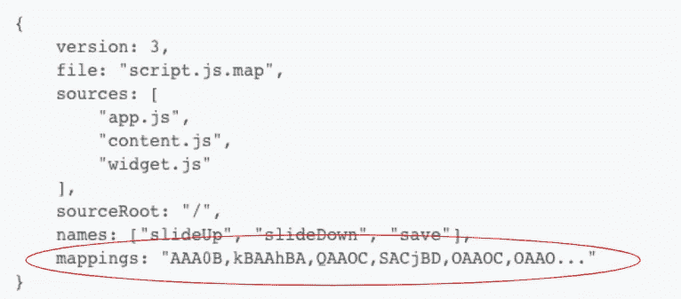*

***在流行工具中的用法:***

***Node.js***

*通过标志" *—启用-源-地图"**

*发生异常时，缓存源映射并用于堆栈跟踪。*

***巴别塔***

*默认情况下，Babel 会在每个生成的包的底部添加一个源地图位置*

```
**//# sourceMappingURL=file.map.js**
```

*但是通过标志" *— source-maps — inline"* 你可以告诉 Babel 使用一个 inline source map，如下所示(即 base64 编码内容字符串)。*

```
*//# sourceMappingURL=data:application/json;charset=utf-8;base64,....*
```

***网络包***

*通过配置属性 *devtool: 'source-map'**

*值得注意的是，因为像 Webpack 这样的工具经常一次使用许多处理器执行多个转换(例如 Babel 和 TypeScript ),所以它仍然可以生成单个源地图。每个处理器都会生成自己的源映射，但是有一些库可以连接 JavaScript 文件，同时合并相应的源映射文件。一个例子叫做 [mapcat](https://www.npmjs.com/package/mapcat) 。*

## *3.AST 是什么？*

*在我们继续深入之前，我们需要快速了解一下 JavaScript 编译器中的一个重要机制，AST。*

*AST 代表“*抽象语法树*”，它基本上是一个由“*节点*组成的树，代表一个程序的代码。一个"*节点*"是最小的可能单元，基本上是一个 POJO(即普通的旧 js 对象)，具有"*类型"*和"*位置"*属性。所有节点都有这两个属性，但是基于"*类型"*，它们还可以有各种其他属性。*

*在 AST 表单中，代码非常容易操作，所以像添加、删除甚至替换这样的操作。*

*下面的代码就是一个例子:*

*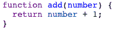*

*将成为以下 AST:*

*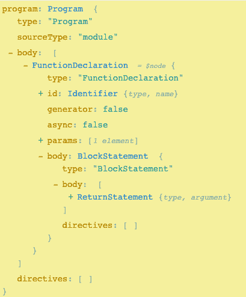*

*有一些网站，比如 https://astexplorer.net/网站，可以让你很好地编写 JavaScript 代码并立即看到它的 AST。*

***树遍历***

*处理 AST 最重要的部分是理解有不同的方法，每种方法都有优点和缺点。*

*一个流行类型的例子(也是我们今天要用的类型)叫做“ ***深度优先搜索*** ”，它的工作方式是从根开始，在回溯之前沿着每个分支尽可能向左探索。因此，它将按以下顺序处理一棵树:*

*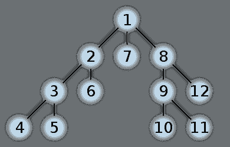*

*所以如果我们有一段代码，比如*

```
*2 + 3 * 1*
```

*它将生成以下树:*

*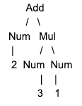*

## *4.转换 JavaScript 的步骤*

*转换 JavaScript 有 3 个步骤:*

***1)将源代码解析成 AST***

*   **词法分析* - >把代码串变成令牌流(即数组)。*
*   **语法分析* - >将令牌流转换成其 AST 表示*

***2)AST 上的变换节点** - > 操作 AST 节点(任何库插件都可以在这里运行，例如 Babel)*

***3)生成源代码**->-**-**将**-**AST 转换成字符串的 JavaScript 源代码*

****今天我们来关注一下发电机的工作岗位！！****

*库在只做步骤 1 和做所有 3 个步骤之间是不同的。*

*完成以下 3 项任务的库示例:*

*   *[巴别塔](https://www.npmjs.com/package/@babel/cli)*
*   *[重铸](https://www.npmjs.com/package/recast)*
*   *[Facebook code mod](https://github.com/facebook/codemod)*

*仅执行 1:*

*   *[Esprima](https://www.npmjs.com/package/esprima) (进行解析)*
*   *[ast-types](https://www.npmjs.com/package/ast-types) (进行 ast 节点操作)*
*   *[Escodegen](https://www.npmjs.com/package/escodegen) (礼部代)*

## *5.编译器如何构建源地图*

*生成源映射有 3 个部分，所有这些都是编译器必须完成的:*

*1)转换代码并注意新生成的源位置*

*2)检查原始代码和生成代码之间的位置差异*

*3)使用这些映射建立一个源映射*

*这是一种过度简化，我们将在下面的**B 部分**中更深入地了解它的具体细节。*

# *第二部分:构建我们自己的编译器*

## *1.构建 JavaScript 代码生成器*

*我们将从下面的架构开始。目的是在编译后产生转换后的文件( *index.es5.js* )和源映射( *index.es5.js.map* )。*

*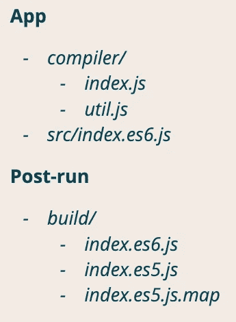*

*我们的`src/index.es6.js`会是这样的(一个简单的*加*的函数):*

*现在我们有了预编译的源代码。我们想开始看看编译器。*

# *该过程*

*我们的编译器必须执行几个步骤:*

***1。解析代码到 AST***

*由于本文的重点不是解析，我们将为此使用一个基本的第三方工具( [esprima](https://www.npmjs.com/package/esprima) 或 [escodegen](https://www.npmjs.com/package/escodegen) )*

***2。将每个节点的浅层克隆添加到 AST 上***

*这个想法是从《T4》的《T3》中借鉴来的。其思想是每个节点将持有自身以及自身的克隆(即原始)。克隆用于检查节点是否已更改。稍后会详细介绍。*

***3。变形***

*我们将手动执行此操作。我们可以使用像 [ast-types](https://www.npmjs.com/package/ast-types) 或 [@babel/types](https://www.npmjs.com/package/@babel/types) 这样的库，因为它们有有用的 API。*

***4。生成源代码***

*把我们的 AST 变成 JavaScript。*

***5。添加源地图支持***

*4 和 5 和上面一样同时做。这将涉及到遍历树并检测 AST 节点在哪里用它的“*原始的*属性改变了。对于那些实例，存储“*原始*”和“*生成的*”代码之间的映射。*

***6。写信给*build/****

*最后，将我们生成的源代码及其源代码映射写入适当的文件。*

# *代码*

*让我们再来看一下这些步骤，但这次要更详细一些。*

1.  ***解析代码到 AST***

*使用一个基本的第三方工具(我选择了一个简单的叫做 [ast](https://www.npmjs.com/package/abstract-syntax-tree) 的工具)，我们获取我们的文件内容并将它们传递给库解析器。*

***2。将每个节点的浅层克隆添加到 AST 上***

*首先，我们定义一个名为“ *visit* 的函数，其任务是遍历树并在每个节点上执行我们的回调函数。*

*这里我们做一个上面提到的 ***深度优先搜索*** 。对于给定的节点，它将:*

1.  *执行回调*
2.  *检查位置属性，如果是，则提前返回*
3.  *检查是否有任何属性是数组，如果有，用每个子元素调用它自己*
4.  *检查是否有任何属性是 AST 节点，如果有，用该节点调用自身。*

*接下来我们继续生产我们的克隆体。*

*我们的`cloneOriginalAst` 函数生成节点的克隆，并将其附加到原始节点上。*

*对于我们的克隆，我们使用`Object.assign`，所以它是一个**浅层克隆**，并复制顶级属性。嵌套的道具仍然通过**按引用传递**连接，即改变它们将改变克隆体。我们也可以在这里使用**扩展操作符**,因为它可以做同样的事情。我们将使用顶层进行比较，这足以比较 2 个 AST 节点，并确定该节点是否发生了变化。*

*总的来说，我们的代码将返回相同的树，除了在每个节点上都有“ *original* ”属性。*

***3。转换***

*接下来，我们将进行节点操作。我们将保持简单，所以我们将只从我们的程序交换 2 个节点。因此，我们将从以下内容开始:*

```
*number + 1*
```

*结尾是:*

```
*1 + number*
```

*理论上简单没错！*

*我们进行交换的代码如下:*

*我们没有使用干净的 API 来做这件事(许多库都提供了),因为我们已经手动交换了 2 个节点。*

*一个使用带有有用 API 的库的例子可能看起来像下面这样，由关于 [ast-types](https://github.com/benjamn/ast-types) 的文档提供。*

*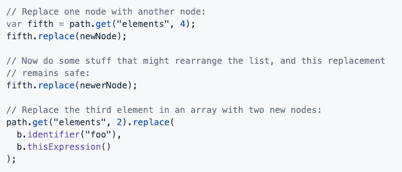*

*这种方式当然更安全，更容易遵循，开发起来也更快。所以一般来说，我会推荐使用它来处理任何复杂的 AST 操作，大多数知名编译器都这么做。*

***4。生成源代码***

*代码生成器通常存放在一个文件中，有几千行长。例如，escodegen 的编译器有 2619 行代码(参见[这里的](https://github.com/estools/escodegen/blob/master/escodegen.js))。那是相对于其他人来说较小的一面(疯狂的权利！)*

*我在我们的编译器中使用了很多相同的代码(因为大多数生成器需要非常相似的逻辑来将 AST 处理成 JavaScript ),除了我们处理来自“ *index.es6.js* 文件的代码所绝对需要的*。**

**下面我定义了编译器中的三种代码。**

****a)节点处理器和角色实用程序****

**这些是用于处理 AST 节点(取决于类型，例如函数声明将有一个标识符)和构建源代码的通用实用函数。它还包括一些常见的字符常量(如“*空格*”)。在下一节中，我们将从代码“类型语句”中调用它们。**

**我不会太担心这里的细节，除非你打算写一个编译器。这很大程度上是借用了 [escodegen 这里](https://github.com/estools/escodegen/blob/master/escodegen.js#L788)的发电机。**

****b)类型报表****

**这是一个包含与 AST 节点类型相关的函数的对象。每个都包含处理 AST 节点类型和生成源代码所需的逻辑。例如，对于一个函数声明，它包含了参数、标识符、逻辑和返回类型的所有可能的变化。这里有一个常见的递归层次，即一个类型语句触发另一个类型语句，后者可能触发另一个类型语句，等等。**

**这里我们**只有**有必要的语句函数来处理我们的“ *index.es6.js* 文件，所以它是相当有限的。您可以看到仅处理我们的 AST 树的 3-4 行代码就需要多少代码(除了上一节的代码之外)。**

**这再次借用了“ [escodegen here](https://github.com/estools/escodegen/blob/master/escodegen.js#L1020) ”所以请随意忽略细节，除非你打算编写自己的编译器。**

****c)过程代码语句****

**最后，我们将迭代程序体(即每一行代码)并开始运行我们的生成器。这将返回一个名为“ *code* 的数组，其中包含我们新生成的源代码的每一行。**

****6。写入*构建/*****

**我们现在将跳过**步骤 5** ，完成我们编译器的核心元素。因此，对于这一步，我们将**

*   **将一个源地图位置添加到我们生成的代码中(我们将在下一节构建它)**
*   **为生成的代码生成一个包(将我们的代码数组连接在一起)，并复制原始代码，以便浏览器可以看到它(这只是一种方法)。**

****5。添加源地图支持****

**构建源地图有 4 个要求:**

1.  **源文件的存储记录**
2.  **存储生成文件的记录**
3.  **存储行/列的映射**
4.  **使用规范版本 3 在源映射文件中显示**

**为了快速取胜，我们可以使用几乎每个 JavaScript 代码生成器都使用的库，名为 [source-map](https://github.com/mozilla/source-map/) 。它来自 Mozilla，处理点 1–3 的存储，以及处理映射到 Base64 VLQ 的过程(步骤 4)。**

**稍微提醒一下突出显示映射的源映射是什么样子的(从上面看):**

**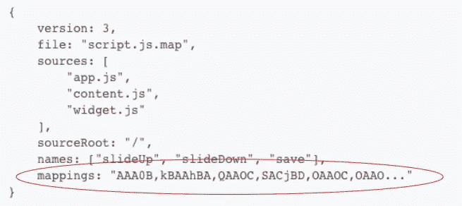**

**映射是 Base64 VLQ，但那是什么呢？**

## **2.什么是 Base64 VLQ？**

**首先简单介绍一下 Base64 和 VLQ。**

**Base64**

**解决了处理没有完整 ASCII 字符集的语言的 ASCII 问题。Base64 只有 ASCII 的子集，更容易在不同语言中处理。**

****VLQ(可变长度数量)****

**将整数的二进制表示形式分解为一组小的可变位块。**

**Base64 VLQ**

**经过优化，使源文件中的大数字和相应信息之间的映射变得容易。**

**一行代码由一系列“段”表示。数字“1”应该是:**

```
**AAAA => 0000**
```

**以下是数字如何相互关联以构建“*段*的示例:**

**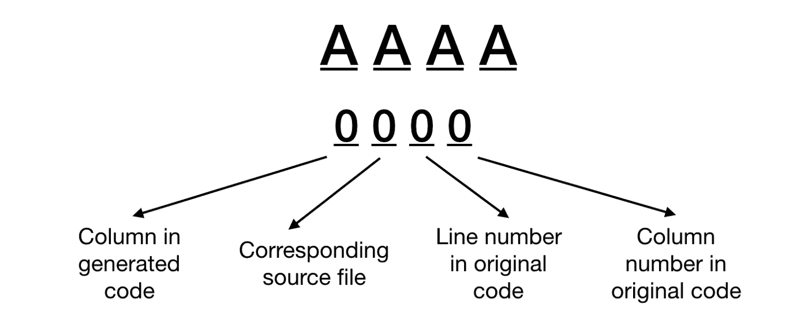**

**用 JavaScript 构建一个基本的映射应该是这样的:**

**然而，这并不处理行和段的分离(这可能非常棘手)，所以使用 Mozilla 的库仍然更有效。**

## **3.添加源地图支持**

**回到我们的编译器！！**

****使用莫扎特*SourceMapGenerator*****

**为了充分利用 Mozillas 库，我们将:**

*   **创建一个 sourceMap 实例来保存和构建我们的映射**
*   **初始化并存储本地映射**

**因此，当一个节点发生变化时，我们会这样做；构建位置，然后将其添加到我们的本地映射和 SourceMap 实例中。我们保存一个本地实例，这样我们就可以记录当前位置的开始和结束，因为这对构建下一个位置至关重要。**

**我们需要一个实际处理更新这些映射实例的函数。下面的" *buildLocation* "函数处理所有的位置生成逻辑。大多数库都有类似的功能，使用调用者给定的列和行的*偏移量*。**

**它的工作是计算出新的行号和列号的开始以及行号和列号的结束。只有当一个节点发生变化时，它才会添加一个映射，这就限制了我们要存储的映射。**

**现在我们有了“ *buildLocation* ”，我们必须在代码中引入它。下面是几个例子。对于“ *generateIdentifier* ”处理器实用程序和“*Literal*”AST 类型语句，您可以看到我们是如何合并“ *buildLocation* ”的。**

**我们需要在整个代码生成器中应用这一点(即所有节点处理器和 AST 类型语句函数)。**

**我发现这很棘手，因为节点到字符的映射并不总是 1–2–1。例如，一个函数可能在它的参数的两边都有括号，当涉及到字符行的位置时，必须考虑到这一点。所以:**

```
**(one) =>**
```

**具有不同的字符位置:**

```
**one =>**
```

**大多数库所做的是使用 AST 节点上的信息引入逻辑和防御检查，因此所有场景都可以涵盖。我会遵循同样的做法，除了我只是为我们的" *index.es6.js* "添加了绝对必要的代码**

**完整的用法请参见库中我的生成器的[代码。它缺少大的部分，但是它完成了工作，并且是真正的代码生成器的构建块。](https://github.com/craigtaub/our-own-babel-sourcemap/blob/master/compiler/ast-util.mjs)**

**最后一部分是将我们的源地图内容写入源地图文件。这对于 Mozillas 库来说非常容易，因为他们公开了一个“ *toString()* ”方法，该方法将处理 Base64 VLQ 编码并将所有映射构建到一个符合 v3 规范的文件中。**好看的**！！**

**现在我们参考*。/build/index.es5.js* "之前会有一个文件存在。**

**我们的编译器现在完成了！！！！🤩**

****

**对编译器来说就是这样了，最后一部分是确认它已经工作了。**

**如果我们编译代码，它应该产生我们的构建文件夹，里面有 3 个文件。**

***> npm 运行编译***

**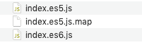**

**即原始、生成和源地图。**

## **4.测试我们的源地图**

**在 https://sokra.github.io/source-map-visualization/[有一个很棒的网站，可以让你看到源地图。](https://sokra.github.io/source-map-visualization/)**

**页面是这样开始的:**

**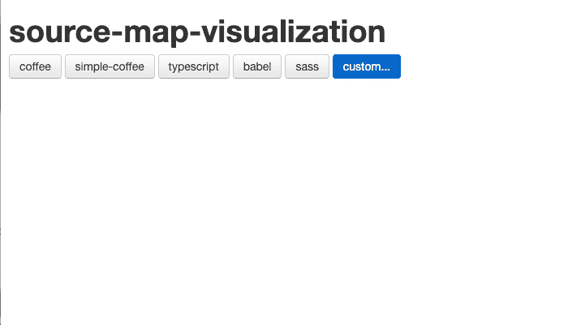**

**将我们的 3 个文件放入其中，我们现在可以看到:**

**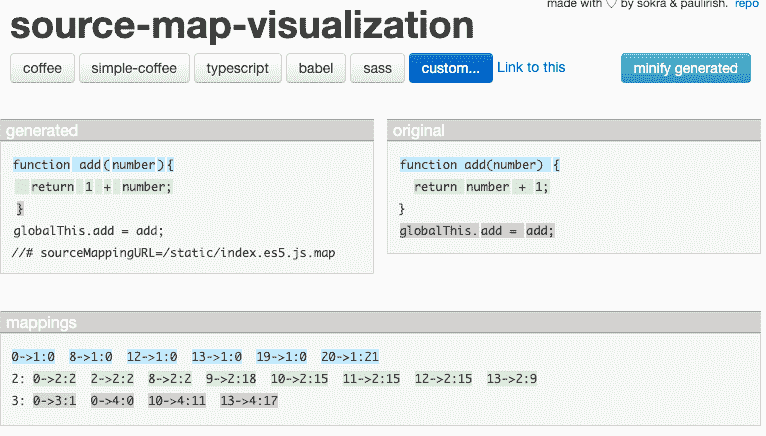**

**很鲜艳吧！**

**它包含原始代码、生成的代码和解码的映射(在底部)。**

**稍微提醒一下我们之前的转变:**

**我们交换了:**

```
**number + 1**
```

**变成:**

```
**1 + number**
```

**我们能确认地图已经工作了吗？**

**如果我们将鼠标悬停在字符或映射上，它会高亮显示该映射及其在生成位置和原始位置中的相应位置。**

**该屏幕截图显示了当我将鼠标悬停在文字数字“ *1* ”字符上时会发生什么。它清楚地表明有一个映射。**

**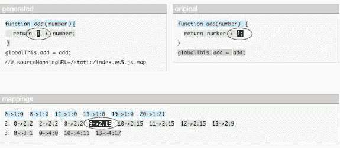**

**该屏幕截图显示了当我将鼠标悬停在变量标识符“*数字*单词上时会发生什么。它清楚地表明有一个映射。**

**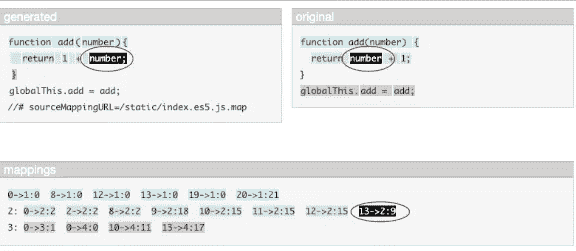**

****成功了！！💪****

# **我们错过了什么？**

**那么构建这样的编译器有什么局限性呢？**

*   **并不是所有的 JavaScript 语句都包括在内(只是我们的文件需要的)**
*   **目前它只能处理 1 个文件。Web bundlers 将遵循该应用程序构建一个依赖图，并对这些文件应用转换(参见我的“[under-the-hood of web bundlers](/under-the-hood-of-web-bundlers-e-g-webpack-926e868f7f5e)”文章了解更多信息)。**
*   **输出文件与包。Web bundlers 将生成在特定的 JavaScript 环境中可运行的代码包，我们的非常有限(再次参见我的“web bundlers 的内幕”了解更多)。**
*   **基本转换。如果没有大量的新代码，执行额外的优化并不容易。**

**非常感谢你的阅读。这个话题意义深远，在研究过程中我学到了很多。我真的希望这有助于阐明 JavaScript 编译器和源码图是如何一起工作的，包括其中涉及的机制。**

**这个的源代码可以在 craigtaub/our-own-babel-source map 找到，如果你喜欢这个，请鼓掌。**

**谢谢，克雷格😃**