# Sourcebit:如何与 Jamstack 中的各种数据源交朋友？

> 原文：<https://itnext.io/sourcebit-how-to-make-friends-with-various-data-sources-in-the-jamstack-7bd552e86ff2?source=collection_archive---------2----------------------->

当我们使用多个 CMS、API 和它们的数据契约时，总是会变得很困难。如果有一种方法可以统一一些 Jamstack 组件，比如数据源和前端框架，会怎么样？

为软件项目或网站选择正确的技术会带来很多困难。一旦你习惯了使用一个特定的堆栈，你会倾向于优先考虑它。根据我的经验，出于习惯使用特定的平台来构建项目是很常见的。此外，当开发团队最终切换到不同的平台时，他们被迫重写项目——本质上是扔掉工作并从头开始。

还有另一个极端，项目也是在原始平台上构建的。结果，仅仅因为缺乏创新，就有新的绿地项目建立在旧的平台和技术之上(年轻的我用 Objective-C 代替闪亮的新 Swift)。

这在 web 开发和 JavaScript 世界中更加明显。几乎每天都有新的框架出现，并悄悄地被摒弃。尝试检查新技术似乎不仅是浪费时间，而且也不可能跟上。静态站点生成器和整个 Jamstack 生态系统没有什么不同。掌握所有可用的 CMS 和可能的静态站点生成器的组合听起来像是一个没有希望的计划。

必须有某种方法来简化和统一所有不同的内容管理系统、数据源和静态站点生成器，对吗？

# 数据标准化将一切简化成乐高积木

当我还是个孩子的时候，没有 PlayStation 或网飞，我最喜欢的消磨时间的方式就是玩积木。随着时间的推移，我收集了许多由不同的制造商用不同的材料和形状制作的各种套件。

不相容的砖块。

谁会想到多年以后我会用 Jamstack 组件解决同样的问题呢？只是现在我们称之为互操作性、兼容性、不同合同或供应商锁定。

所有这些术语不仅在软件开发中是一个相当广泛的概念。如果有一种方法可以将各种内容管理系统(具有不同的 API、SDK 和客户机)的数据契约与不同的静态站点生成器统一起来并连接起来，那岂不是很棒？一种不期望您深入研究各种数据源和前端框架的每种组合的方式？这就是 Sourcebit 的目标。把所有这些组件变成兼容的乐高块，让你玩。

# 什么是 Sourcebit？

Sourcebit 是麻省理工学院许可的开源平台，提供数据标准化、转换和连接各种内容管理系统和目标静态站点生成器和前端框架。如果没有它，您必须使用 API 或 SDK 从 CMS 获取内容，并将这些数据处理到目标平台的特定合同中。

有很多 CMS 可以使用，比如 Contentful，Kontent，甚至 Wordpress。所有这些 CMS 都有不同的输出、API 和 SDK。还有许多流行的静态站点生成器被广泛使用，如 Hugo、Jekyll 或 Next.js。其中每一个都使用特定的平台——JavaScript、go 或 Ruby——来利用构建过程。其中的每一个都可以处理不同格式的数据——Markdown、Frontmatter、JSON、YAML 或 HTML。Sourcebit 和它的插件生态系统为你做了这一切，所以你可以专注于开发项目。

# Sourcebit 是如何工作的？

Sourcebit 与三种不同类型的插件一起工作— *源*、*转换*和*目标*。它们分别负责获取、转换和规范化数据。

source 插件负责从数据源(通常是 CMS)中检索和规范化数据。转换插件处理特定的数据转换，例如，在本地保存远程资源和媒体文件。最后，目标插件获取所有这些规范化的数据，并将它们转换成所选目标框架或静态站点生成器要求的格式。这个概念是开放和可扩展的。除了使用现成的插件，你还可以开发自己的插件。Sourcebit 的人在他们的维基上非常清楚地描述了整个插件的概念。

# 平滑配置

每次我想评估新的平台、服务或框架时，仅仅为了得到一个简单的概念证明，就要努力正确地配置服务，这简直是地狱般的努力。令人惊讶的是，配置 Sourcebit 是一种愉快的体验。就我个人而言，这是 Sourcebit 中我最喜欢的部分。Sourcebit 提供了这个简洁的交互式向导，可以为您完成所有困难的工作。

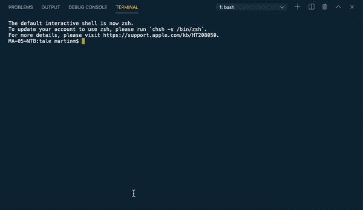

Sourcebit 交互式向导。

是的，您仍然可以自己创建一个完整的配置文件，手动指定所有的标识符、插件和数据转换。但你为什么要这么做？

# 整个想法听起来不错…但它实际上是如何工作的呢？

为了向您展示 Sourcebit 是如何工作的，让我们尝试将 markdown 文件中硬编码的静态内容迁移到一个 headless CMS 中。对于这个例子，我使用了 [Kentico Kontent](https://bit.ly/36ref8S) ，然而，你可以使用任何支持的 source bits[源代码插件](https://github.com/stackbithq/sourcebit#source-plugins)。

为了进行演示，我们可以从头开始构建整个网站，然而，本文并不是关于 Jekyll、Hugo 或 Next.js 的细节，所以我选择了一个来自[https://jamstackthemes . dev](https://jamstackthemes.dev/)的[现有的](https://github.com/chesterhow/tale)博客模板(确实是一个非常好的灵感模板来源！).这个页面是用 Jekyll 构建的。话虽如此，同样的原则也适用于 Hugo 或 Next.js 目标插件和站点。

您可以在此找到以下配方[的运行输出。这项任务的方法非常简单:](https://sourcebit-kontent-tale.netlify.app/)

1.  派生项目并将内容迁移到 CMS 中。
2.  配置 Sourcebit 以从 CMS 获取内容并使其正常化。
3.  获取内容并在本地运行项目。
4.  将站点配置和部署到网络。
5.  当 CMS 中的内容发生变化时，配置重建站点。

*注意:您需要安装 Node.js、npm 和 Jekyll 来本地运行项目。如果你在代码或者教程的某个地方卡住了，可以在 GitHub* *上查看已经完成的* [*示例库。*](https://github.com/makma/tale)

# 1.派生项目并将内容迁移到 CMS 中

*   在 GitHub 上分叉[项目](https://github.com/chesterhow/tale)。
*   用`git clone https://github.com/<your_handle>/tale.git`在本地克隆您的分叉库。
*   如果您仔细检查代码，您会发现站点的内容位于 *_pages* 和 *_post* 目录中。我们需要将这些内容复制到[Kentico kon content](https://bit.ly/36ref8S)中。
*   转到*项目*部分，在 Kontent 中创建[一个新项目](https://bit.ly/36ref8S)。

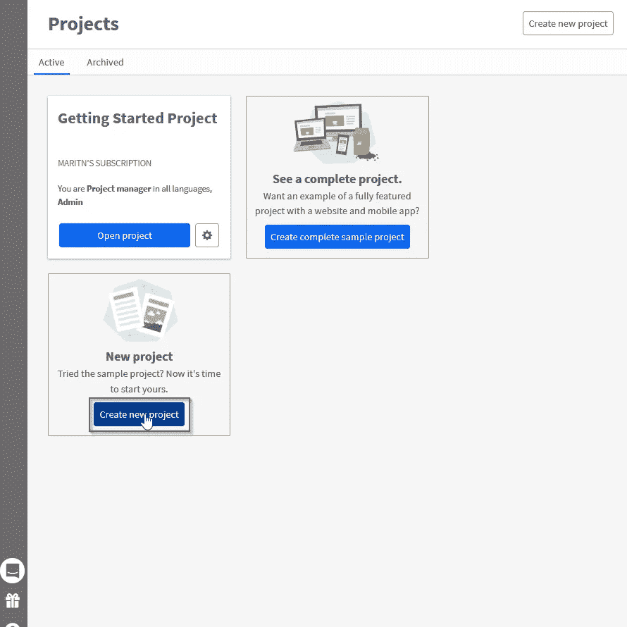

在 Kentico Kontent 中创建一个项目。

*   转到*内容模型*部分，创建*页面*内容类型。

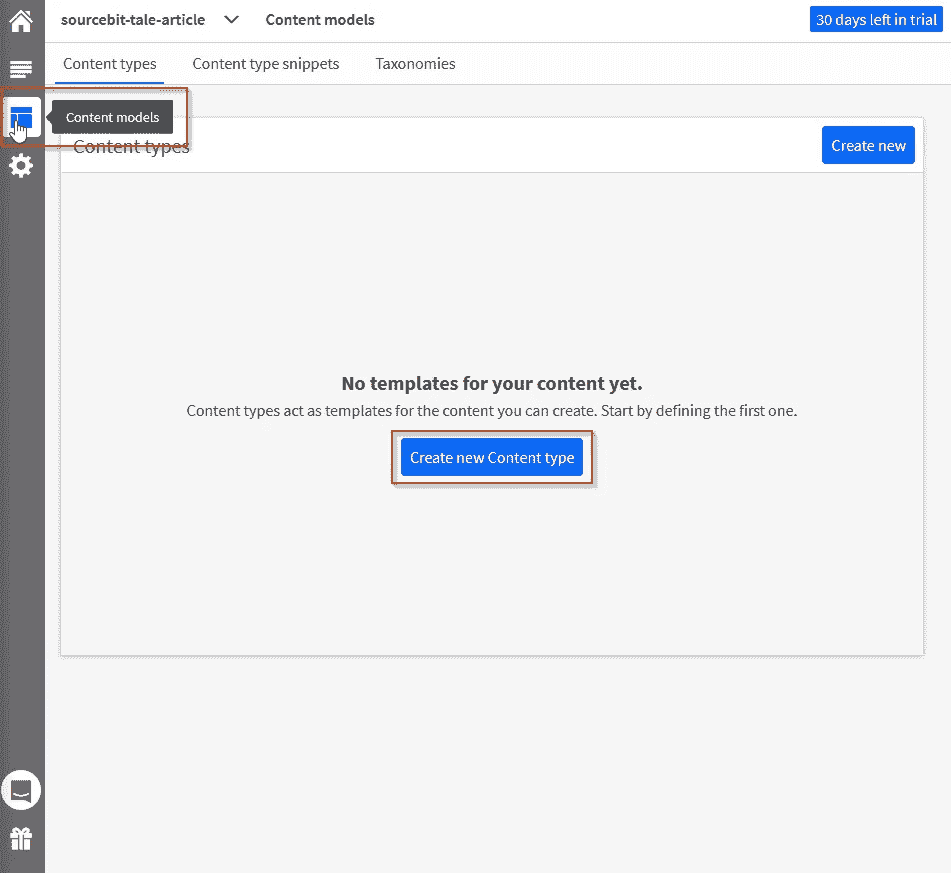

在 Kentico Kontent 中创建内容类型。

*   添加*标题*、*作者*、*永久链接、*和*布局*文本元素。因为这个 Jekyll 网站使用 markdown 格式的内容，所以还添加了一个名为 *content* 的 markdown 自定义元素。我已经为您准备好了我的 markdown 定制元素—您可以使用我的 URL — `https://sourcebit-tale-article-markdown-element.netlify.app/`或者派生出[原始存储库](https://github.com/Simply007/kontent-custom-element-toast-ui-editor)并将其部署到 Netlify。(你可以在这里了解更多关于定制元素[。)](https://docs.kontent.ai/tutorials/develop-apps/integrate/content-editing-extensions)

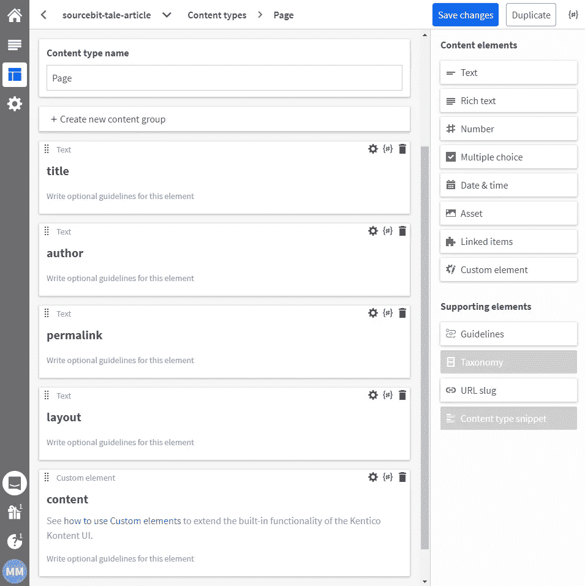

页面内容类型。

*   用*标题*、*作者*和*布局*文本元素创建*帖子*内容类型。对于内容，我们将再次需要一个 markdown 定制元素。使用您的降价编辑器 URL 创建一个自定义元素。

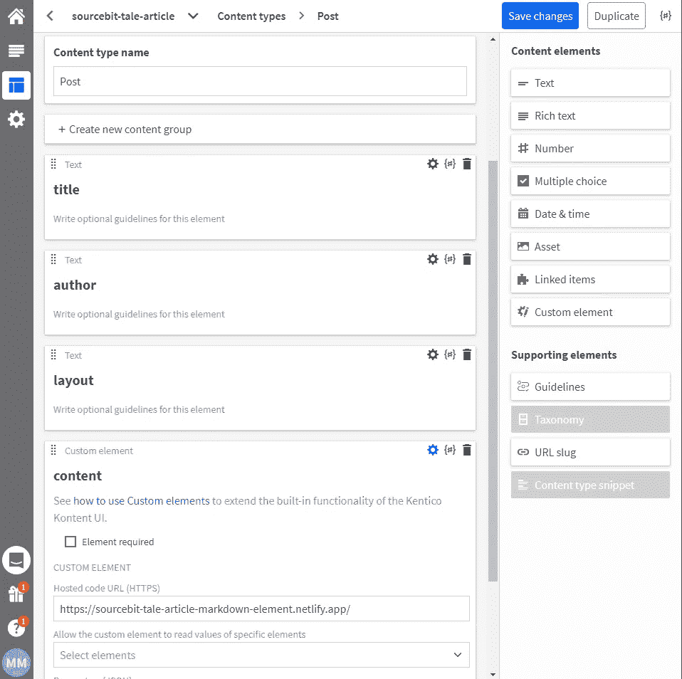

自定义降价元素。

*   在*内容&资产*部分，创建一个页面和帖子——只需将静态文件中的内容(从 *_pages* 和 *_posts* 目录)复制并粘贴到 Kontent 中。

# 2.配置 Sourcebit 以从 CMS 获取内容并使其正常化

*   由于内容将由 Sourcebit 和[koncontent Source plugin](https://github.com/kentico/sourcebit-source-kontent)获取，我们将不再需要任何硬编码的静态内容。删除项目中的 *_pages* 和 *_posts* 目录。您还应该将它们添加到*中。gitignore* 文件。
*   让我们配置 Sourcebit。在网站项目的根目录下，运行`npx create-sourcebit`命令启动交互式命令行配置。你可以用箭头键在项目间移动，用*空格键*选择选项，用*回车*键确认。
*   选择`@kentico/sourcebit-source-kontent (by Kentico): A Kontent source plugin for Sourcebit`并确认。
*   在这个例子中，我们不需要转换资产，所以用 *Enter* 键跳过这个步骤。
*   选择`sourcebit-target-jekyll (by Stackbit): A Sourcebit plugin for Jekyll target plugin`并确认。
*   输入 Kontentʼ s 项目*项目 Id* 并确认。你可以在*项目设置*->-*API 键*部分找到你的项目中的*项目 Id* 。

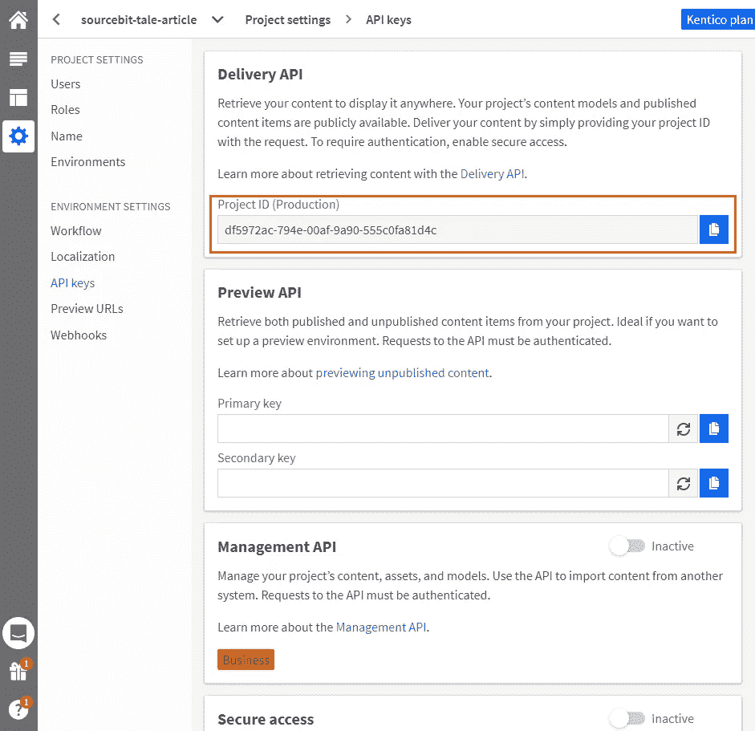

获取项目 Id。

*   输入`default`语言并确认。
*   根据屏幕配置模型/内容类型。

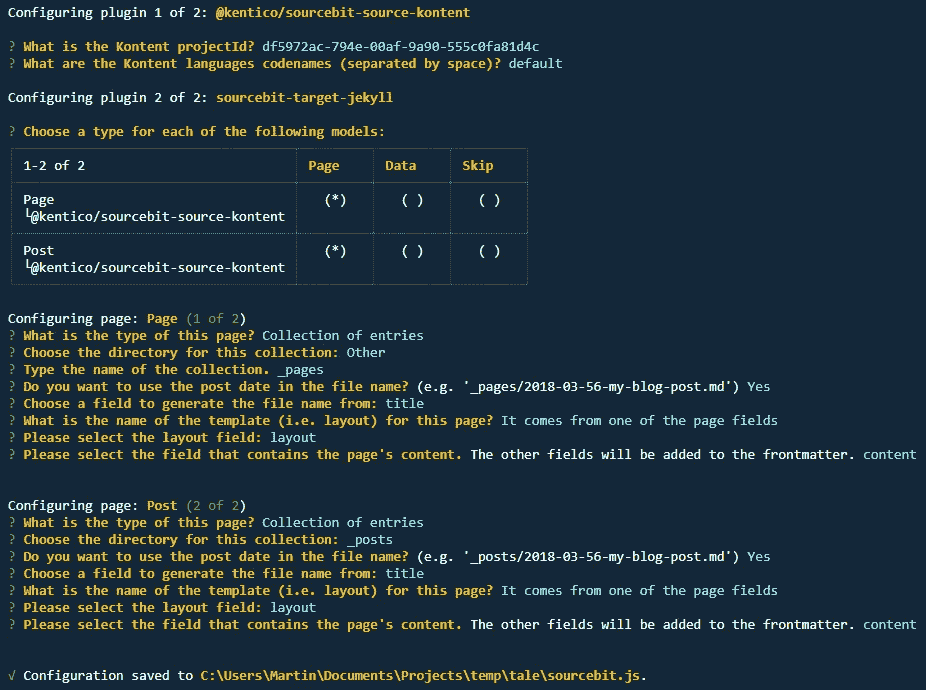

在 Kentico Kontent 中配置 Sourcebit 和项目。

*完成交互式向导后，注意新创建的名为 sourcebit.js 的文件。这是 sourcebit 的配置文件，定义了如何获取、转换、序列化和使用内容。一旦您在 CMS 中更改了项目或数据的结构，您可以再次通过交互式向导来生成新的配置，或者您可以只编辑这个文件。完整的 Sourcebit 配置也在平滑配置部分提供的. gif 文件中。*

# 3.获取内容并在本地运行项目

*   运行`sourcebit fetch`命令。现在 Sourcebit 将从 CMS 获取所有数据，并根据我们生成的 *Sourcebit.js* 配置将它们存储到已经定义的目录中。
*   您可以使用`jekyll serve`命令在本地运行站点。现在该网站正在使用来自 Kontent 的数据。

# 4.将站点配置和部署到网络服务器

在这一步中，我们将配置 Netlify 版本。

*   将部署脚本添加到[*package . JSON*](https://github.com/makma/tale/blob/master/package.json#L8)*的脚本部分。*
    T2。这将安装所有必要的依赖项，获取并规范化所有数据，并构建 Jekyll 站点。
*   用[创建一个文件*。*ruby-version](https://github.com/makma/tale/blob/master/.ruby-version)名称同 Ruby 的版本。我的情况是`2.6.2`。
*   因为我们想在 webserver 的根目录下运行站点，[从 *_config.yml* 中删除](https://github.com/makma/tale/commit/328350b2d24c377e4b2aad19119f7eca3ac51b81#diff-aeb42283af8ef8e9da40ededd3ae2ab2) `baseurl`。
*   推动所有的改变。
*   登录 [Netlify](https://www.netlify.com/) 并从 Git 用现有的 GitHub 库创建*新站点。*

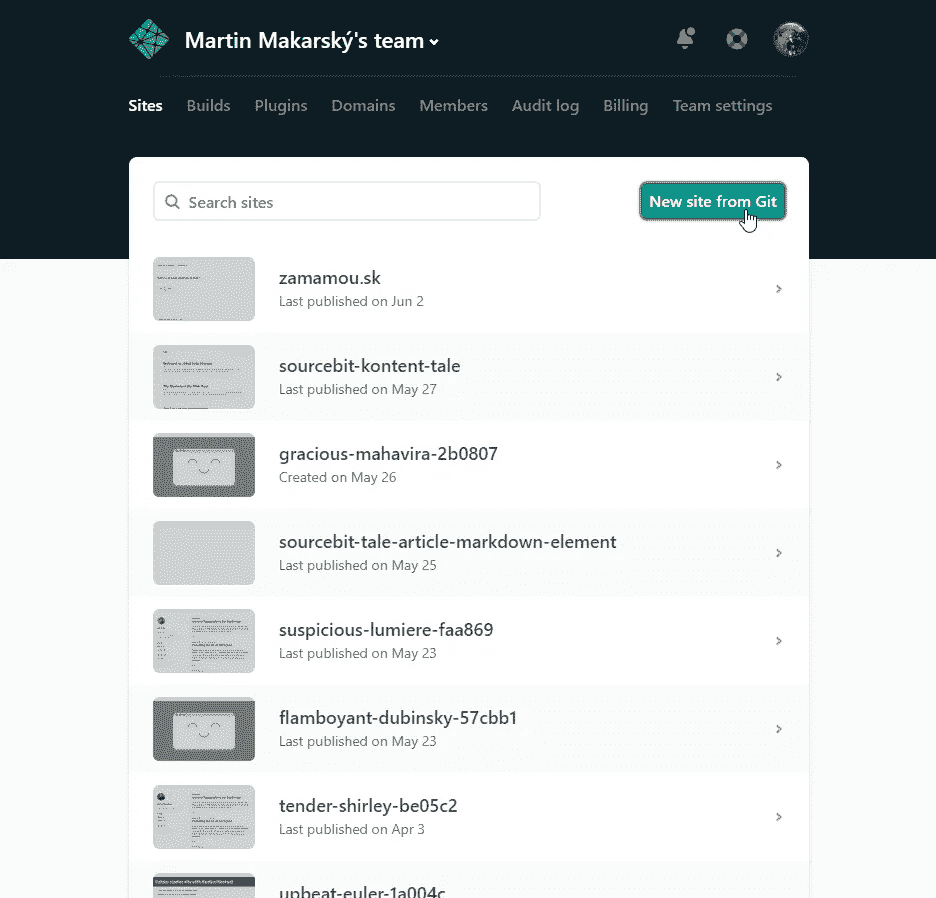

使用 Netlify 创建一个新站点。

*   在 Netlify 的用户界面中，选择要部署的`master`分支，输入`npm run deploy`作为构建命令，`_site/`作为发布目录，部署站点。成功构建后，您的站点将被部署并在 Netlify 上公开。

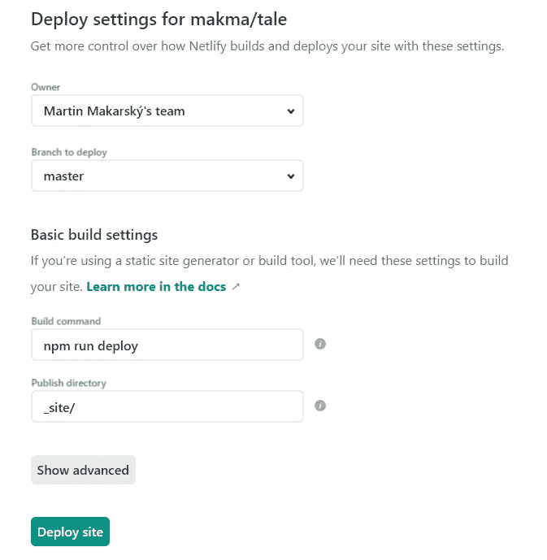

使用 Netlify 构建和部署项目的设置。

# 5.当 CMS 中的内容发生变化时，配置重建站点

现在，我们已经部署了我们的站点，内容不是硬编码的，而是从 CMS 动态获取的。但是，当内容在 CMS 中更新时，所做的更改还没有反映在已部署的站点上。为了实现这一点，一旦 CMS 中的内容发生变化，我们必须触发一个新的 Netlify 构建。

*   在 Netlify 界面，进入站点设置，进入*构建钩子*部分，点击*添加构建钩子*。命名你的钩子，例如 *Kontent.ai 内容更新*，保存并复制生成的 URL。
*   进入 [app.kontent.ai](https://app.kontent.ai/) 到你的项目*设置* - > *Webhooks* 创建一个新的 webhook。将已经复制的 webhook URL 地址粘贴到 *URL 地址*字段，并将您的 webhook 命名为，例如 *Netlify 构建触发器*。保存更改。

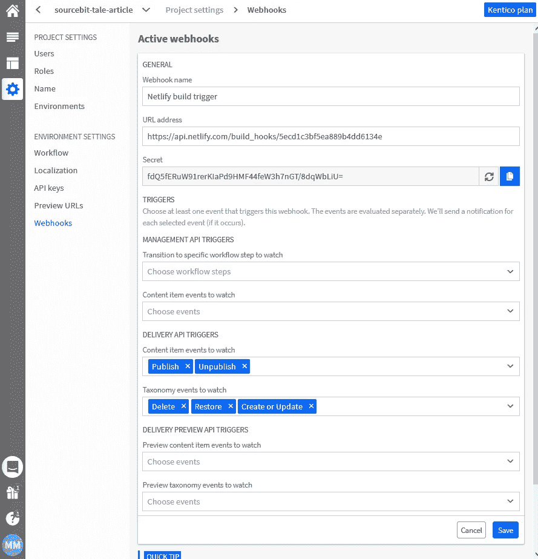

触发 Netlify 构建的 webhook 的配置。

*   当您现在更改 CMS 中的内容时，在发布项目后，将会触发 webhook，并且您的站点将会使用更新后的内容进行重建。

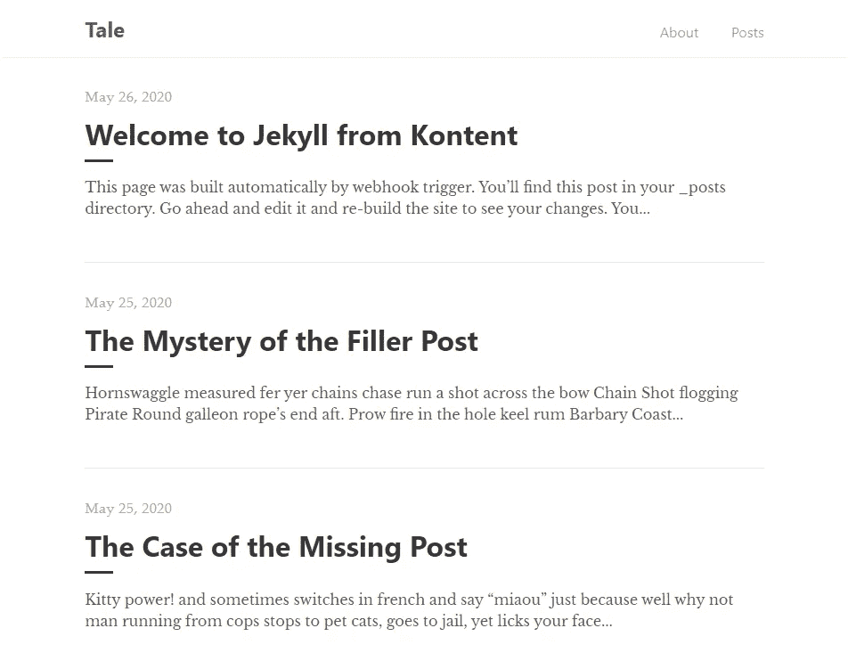

Netlify 上已完成部署的站点。

# 下一步是什么？

使用 Sourcebit 和可用的插件，即使没有定制的获取和规范化逻辑，也可以很容易地将大量数据源与目标平台连接起来。这使得为各种前端框架和静态站点生成器开发网站变得更简单、更便宜。

我相信 Sourcebit 可以改变人们开发 Jamstack 网站的方式。此外，从供应商的角度来看，Sourcebit 可能是为每个目标平台实现生态系统的一个很好的替代方案。

这只是 Sourcebit 功能的一个简单例子，只有一个源插件和一个目标插件。还有更多的东西可以探索，如 Hugo 或 Next.js 目标平台、观察和预览未发布的更改、多语言站点，甚至资产转换。另一个全新的挑战是创建你自己的定制插件——你可以看看我的插件(T17 ),然后在 Twitter 上告诉我你的想法(T18)。

# 奖金

如果你不是一个 Jekyll 的家伙，你更愿意看到一些关于 Sourcebit 与 Next.js 结合的内容，我强烈推荐我的同事 [@OndraBus](https://twitter.com/ondrabus) 的这个很棒的视频。

*原载于*[*kontent . ai*](https://kontent.ai/blog/sourcebit-how-to-make-friends-with-various-data-sources-in-the-jamstack)*。*