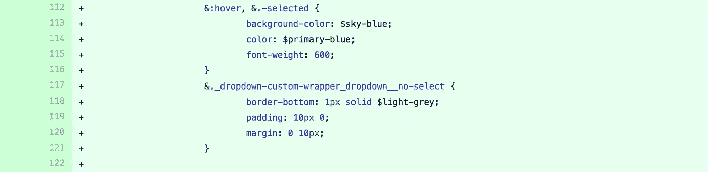
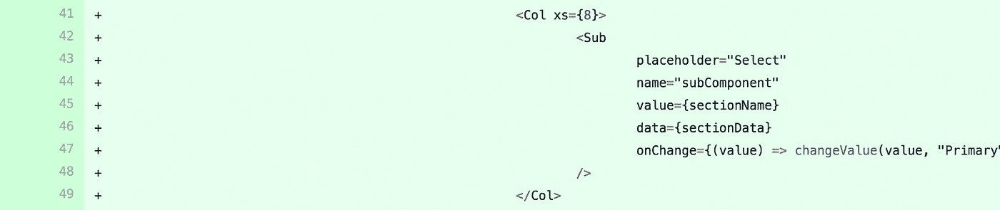
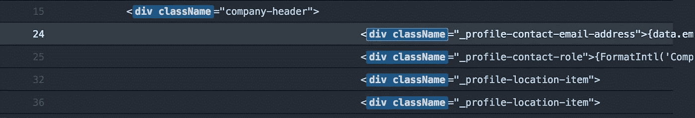
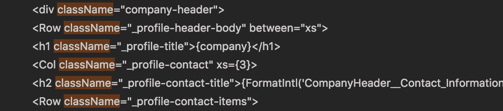
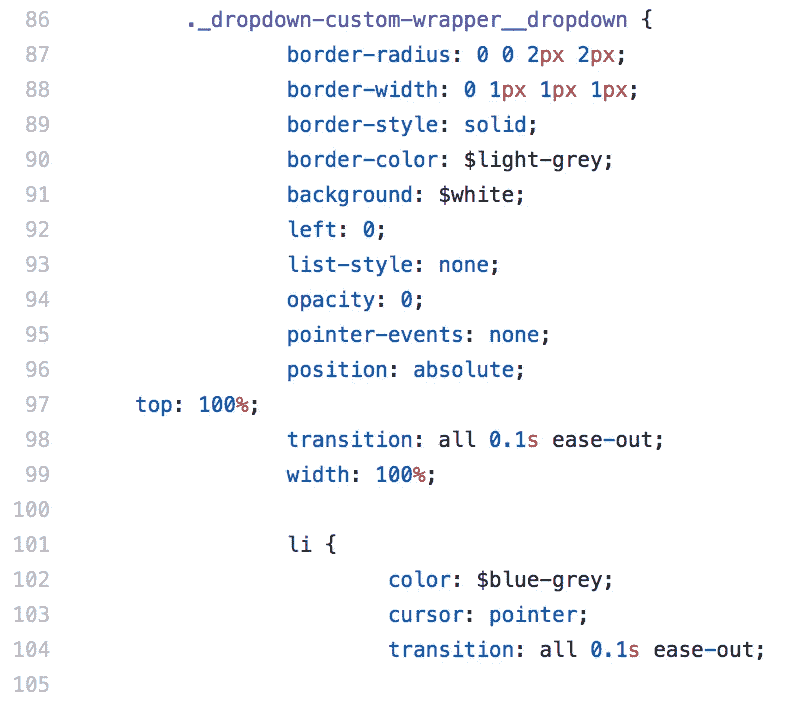

# 制表符之间一定要有空格！至少如果你是一个网页开发者

> 原文：<https://itnext.io/space-over-tabs-always-at-least-if-youre-a-web-developer-4656f2e02310?source=collection_archive---------4----------------------->

[*点击这里在 LinkedIn* 上分享这篇文章](https://www.linkedin.com/cws/share?url=https%3A%2F%2Fitnext.io%2Fspace-over-tabs-always-at-least-if-youre-a-web-developer-4656f2e02310)

这一定是编程史上最古老的争论了。空格和制表符，哪一个是更优越的缩进方法。空间。一直都是。不，我不是在这里谈论使用空间的[开发商如何赚更多的钱](https://stackoverflow.blog/2017/06/15/developers-use-spaces-make-money-use-tabs/)。我当然愿意相信这是真的——我的意思是那篇文章有图表和一切！我在这里要谈的是为什么我相信空格最终会比制表符好，一个词——一致性。即使在这个时代，标签也太不一致了，读起来很难看。

# 我来自黑暗面

我以前很喜欢标签。当我在 2000 年初开始网站开发时，我用的就是这个。部分原因是这是 Dreamweaver 的默认设置。几年后，当我对 web(也就是为工作获得报酬)更加认真时，我的同事讨厌和我一起工作，因为他们和 spaces 一起工作，而我是敌人。我坚持了几年，但即使是我也开始讨厌标签。当时我正在使用 Sublime，它不能始终如一地处理标签，VIM、Bitbucket、Github 和我们所有的工具也是如此。我屈服了。我转而使用两个空间，生活很美好。再也没打扰过我。

# 帝国反击战

去年，我在指导一名开发人员，他在 tab 中开发。这并没有真正困扰我，我对每个人做自己觉得舒服的事情都无所谓，我真的不喜欢把我的实践强加给别人——除非你要问我如何对你的 CSS 属性进行排序。当我收到第一个拉取请求时。我被带回来了。压痕很大。

Github pull 请求中巨大的制表符缩进。

即使我的反应，我没有要求任何改变，因为它仍然清晰可辨，我可以工作，但后来更多的拉请求进来，它变得失控。由于大的缩进，一些代码开始需要水平滚动。笨重，但可以忍受？

飞出这个世界的代码！

更糟糕的事情发生在我不得不帮忙修改代码的时候。幸运的是，订婚真的很短，所以我只是忍气吞声，工作了几个星期。再也不会了！

# 不一致，呃

自从 Dreamweaver 和我认为选项卡呈现差异不再存在以来，我们已经走过了漫长的道路。在我早期，从一个环境复制和粘贴标签到另一个环境是一团乱麻。几年前这还不是问题。事情正在发展。原力已经恢复平衡，但是我太天真了。Atom 在搜索文件时也会出现巨大的空格问题，尽管我的硬标签只配置了 2 个空格。正如你所看到的(截图)嵌套元素飞出了屏幕，这是在一个大显示器上。我也一直在使用 Visual Studio 代码，我猜他们的解决方案(或错误)是忽略缩进，但我真的讨厌他们的无缩进搜索结果。我一直说不一致是因为在搜索之外加载这些文件看起来是正确的，*大多数时候是*，下面的例子。

带标签的 Atom 搜索结果。

VSC 的搜索结果—忽略所有制表符或空格。

Github 对选项卡的渲染，top 有自己的想法。你做你的。

# 空间。或者四个空格。没有标签。

有一天，这些不一致性可能会得到解决，我们不再需要担心标签的丑陋面，但是为什么要等待呢？现在有一个完美的解决方案——太空(最后的边疆)。

*注意:*我在标题的末尾加上了“至少如果你是一名 web 开发人员的话”，因为我是一名 web 开发人员，我并不知道世界上所有的编程语言。我不确定，但是我记得有人曾经告诉过我，有一种语言要么只用制表符，要么用制表符更好？我不记得了。如果这是真的，空间可能不是所有语言的答案，但至少对现代网络语言来说应该是。