# 空间重装——颤动

> 原文：<https://itnext.io/space-reloading-flutter-c74e49e3a9ce?source=collection_archive---------6----------------------->

欢迎光临！今天我们将学习如何在 Flutter 中添加空间重载

[](https://www.instagram.com/theboringdeveloper/) [## boring 开发者

### 欢迎回到 Instagram。登录查看您的朋友、家人和兴趣爱好捕捉和分享了什么…

www.instagram.com](https://www.instagram.com/theboringdeveloper/) 

# 让我们看看它是什么样子的

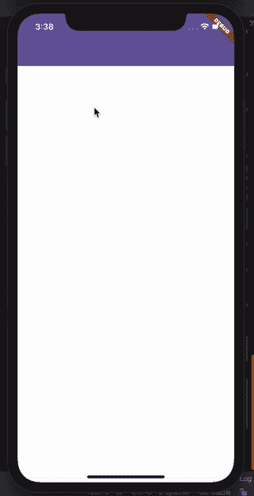

# 我们开始吧

## 我们将使用什么？

我们将使用照明弹

## **什么是照明弹？**

Flare 是一款基于矢量的应用和游戏动画工具。

它有基于矢量的工具，应用程序设计人员更习惯于这些工具。

我们可以用代码控制和操纵动画。

[](https://medium.com/rive/introducing-flare-466950caa023) [## 引入火炬

### Flare 是我们全新的矢量动画工具。即将作为免费测试版提供给所有二维用户。

medium.com](https://medium.com/rive/introducing-flare-466950caa023) [](https://medium.com/rive/flare-launch-d524067d34d8) [## 照明弹发射

### 我们很高兴地宣布推出 Flare，我们新的矢量设计和动画工具！

medium.com](https://medium.com/rive/flare-launch-d524067d34d8) 

0.将 ***flare_flutter*** 添加到 pubspec.yaml

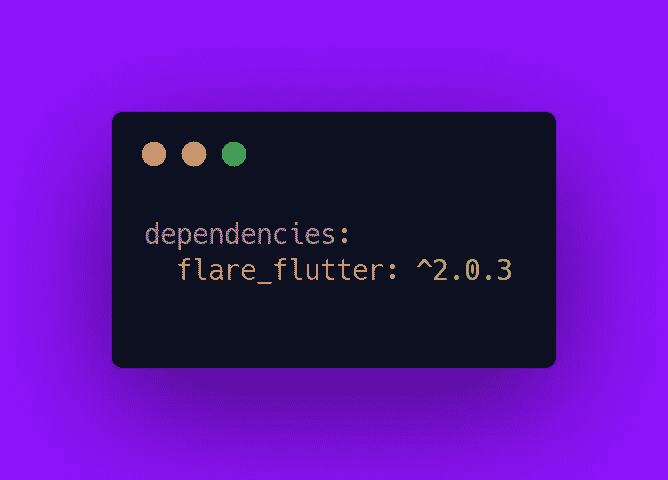

1.  创建一个以***CustomScrollView***和 ***SliverAppBar*** 和*CupertinoSliverRefreshControl*为子控件的小部件

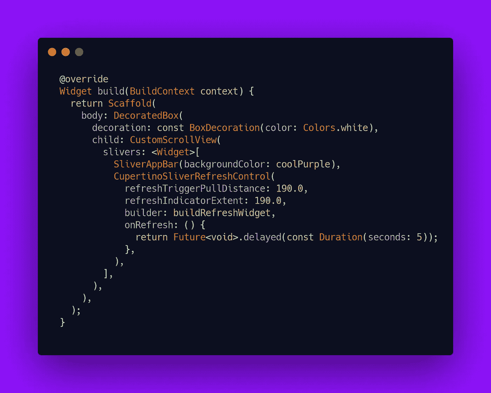

我们需要定义***buildrefreshgwidget***

但是首先我们需要下载空间重装动画文件

2.从 [***这里***](https://github.com/2d-inc/Flare-Flutter/blob/stable/example/space_reload/assets/space_demo.flr) 下载空间重装动画

3.将下载文件添加到您的项目资产中并加载它

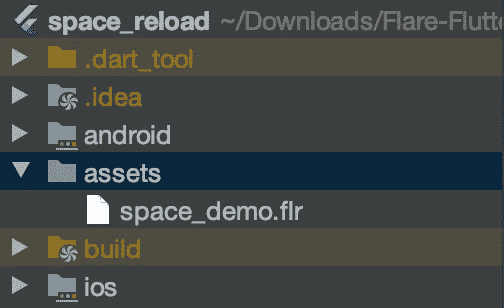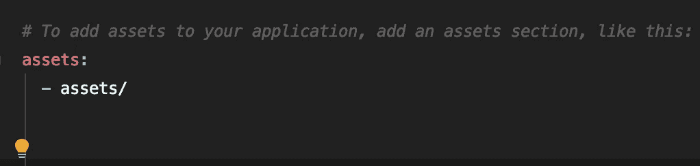

4.让我们定义***buildrefreshgwidget***方法

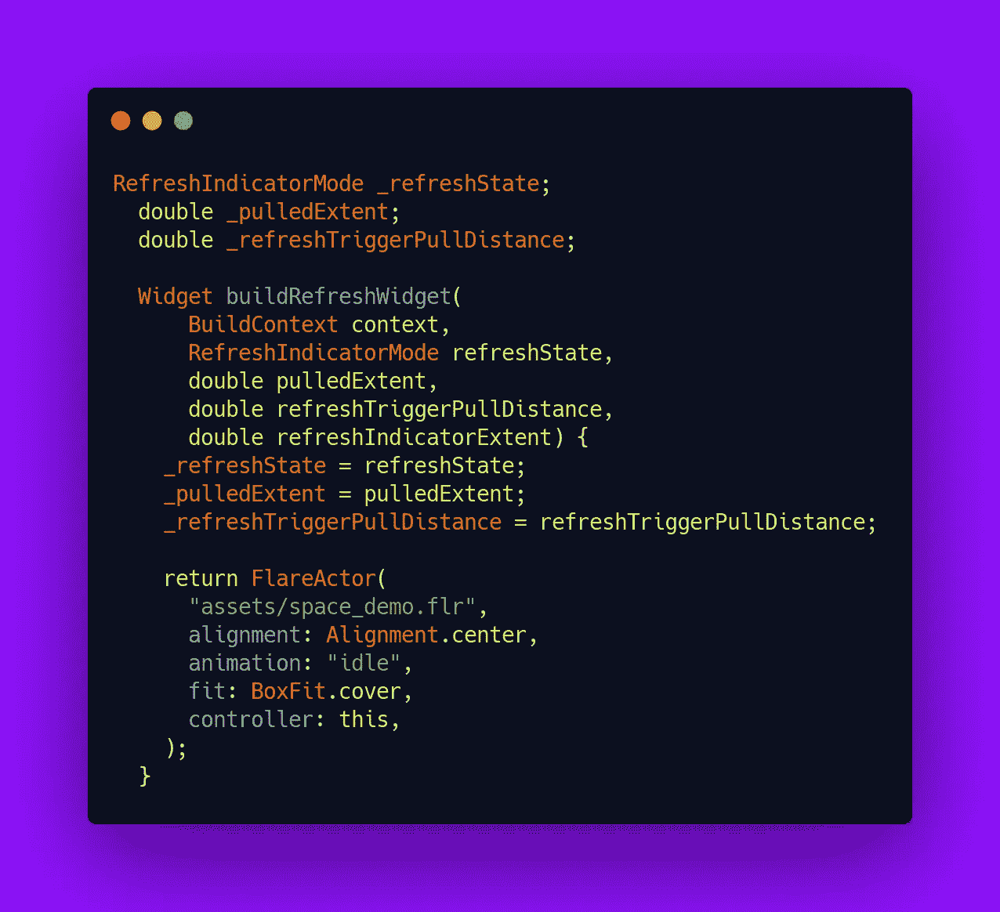

*注意:* ***这个*** 会给出错误。我们稍后会修理它。

**我们做了什么？**

*   我们添加了 FlareActor——这是一个显示耀斑的小部件
*   ***refresh indicator control***存储刷新控件的当前状态。
*   ***_ pulled extent***存储刷新指示器被拉动了多少
*   ***_ refreshTriggerPullDistance***存储了触发刷新前的拉动量
*   我们在空闲动画运行时加载照明弹

这是每个动画看起来独立的样子

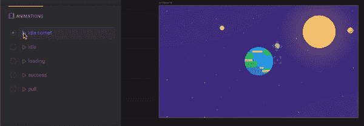

你可以在这里自己尝试-

 [## 空间演示

### 通过实时动画让您的应用和游戏栩栩如生。Rive 是一个强大的设计和动画工具，它允许…

rive.app](https://rive.app/a/pollux/files/flare/space-demo) 

**修复*此*错误:**添加 mixin FlareController

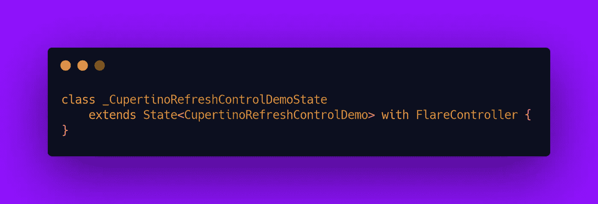

现在这个误差由**这个*这个*这个**修正了。

我们得到另一个错误。

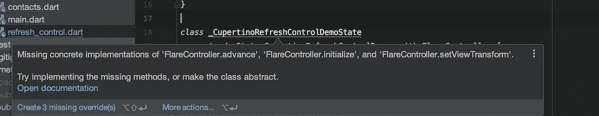

让我们逐个覆盖这些方法

5.覆盖 *setViewTransform*

```
*void* setViewTransform(Mat2D viewTransform) {}
```

6.超越*初始化*

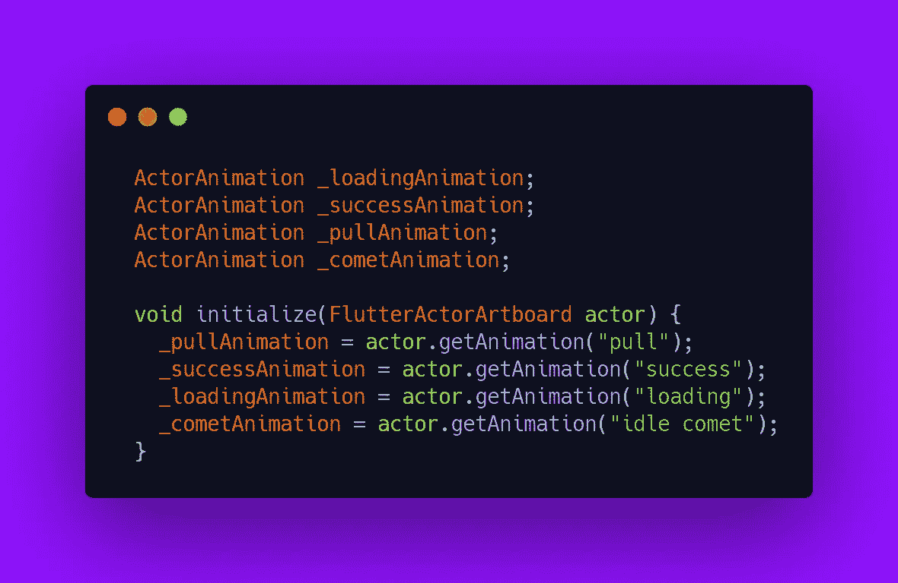

我们做了什么？

*   从动画中获取演员

> 把自己想象成一部电影的导演，一个场景有很多演员。
> 
> 在这里你得到了演员，现在你可以直接从代码中独立控制他们做什么来创建一个场景。

7.覆盖*布尔前进(FlutterActorArtboard 画板，双程)*

**是为了什么？**

```
*Advances the animation of the current [artboard] by [elapsed]*
```

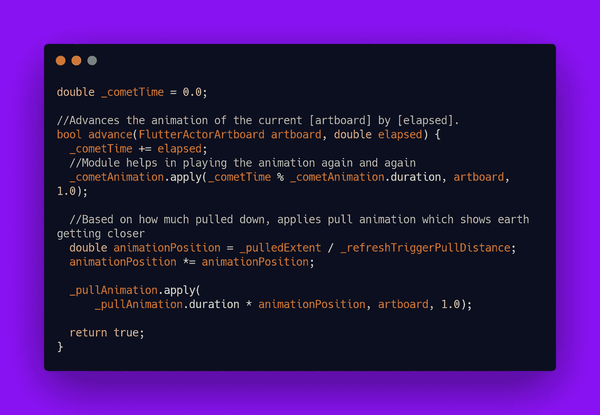

**我们做了什么？**

*   我们控制彗星演员一次又一次地播放
*   现在根据我们拉下的力度，我们播放拉的动画，显示地球越来越近

**让我们检查输出-**

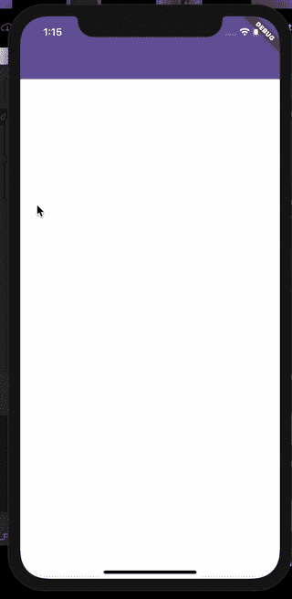

8.让我们添加绕地球旋转月球的动画

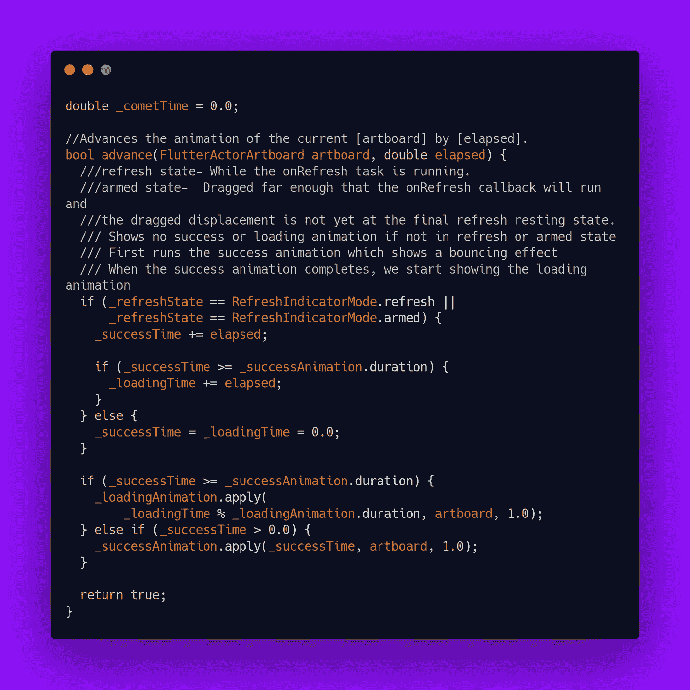

**我们做了什么？**

*   当我们拉下刷新指示器并触发刷新时
*   我们首先运行 *success* actor，它显示了一个弹跳效果
*   当弹跳效果完成时，我们开始显示*加载*动画
*   *加载*动画是月球绕地球旋转
*   我们一遍又一遍地播放*加载*动画

# 让我们检查输出


完成了:)

> 谢谢你坚持到最后

# 更多激动人心的博客-

[](https://medium.com/swlh/live-templates-flutter-6e48683e14e0) [## 实时模板— Flutter

### 欢迎光临！今天我们将学习 flutter 的实时模板。

medium.com](https://medium.com/swlh/live-templates-flutter-6e48683e14e0) [](https://levelup.gitconnected.com/instagram-stories-swiper-flutter-bb53f9377431) [## Instagram stories swiper — Flutter

### 欢迎使用本教程创建像 swiper 一样的 instagram 故事！

levelup.gitconnected.com](https://levelup.gitconnected.com/instagram-stories-swiper-flutter-bb53f9377431) [](https://medium.com/swlh/update-app-flutter-402c528235e4) [## 更新应用程序— Flutter

### 欢迎来到本教程，为你的 flutter 应用程序添加更新应用程序

medium.com](https://medium.com/swlh/update-app-flutter-402c528235e4) [](https://levelup.gitconnected.com/credit-card-slider-flutter-1edec451103a) [## 信用卡滑块—颤动

### 欢迎来到本教程，创建一个可怕的信用卡滑块。

levelup.gitconnected.com](https://levelup.gitconnected.com/credit-card-slider-flutter-1edec451103a) [](https://medium.com/dev-genius/credit-card-slider-made-easy-flutter-6c0473d0e8bb) [## 信用卡滑块变得简单——颤动

### 欢迎光临！今天我们将学习如何用简单的方法创建一个令人敬畏的信用卡滑块。

medium.com](https://medium.com/dev-genius/credit-card-slider-made-easy-flutter-6c0473d0e8bb) [](https://medium.com/swlh/common-bottom-navigation-bar-made-easy-flutter-199c9f683b29) [## 简单易用的通用底部导航栏——Flutter

### 欢迎来到本教程，在 Flutter 中创建一个普通的底部导航栏。

medium.com](https://medium.com/swlh/common-bottom-navigation-bar-made-easy-flutter-199c9f683b29)