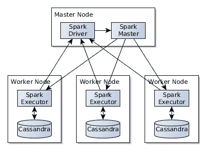
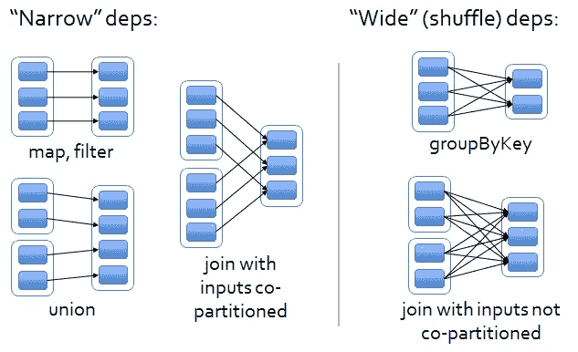
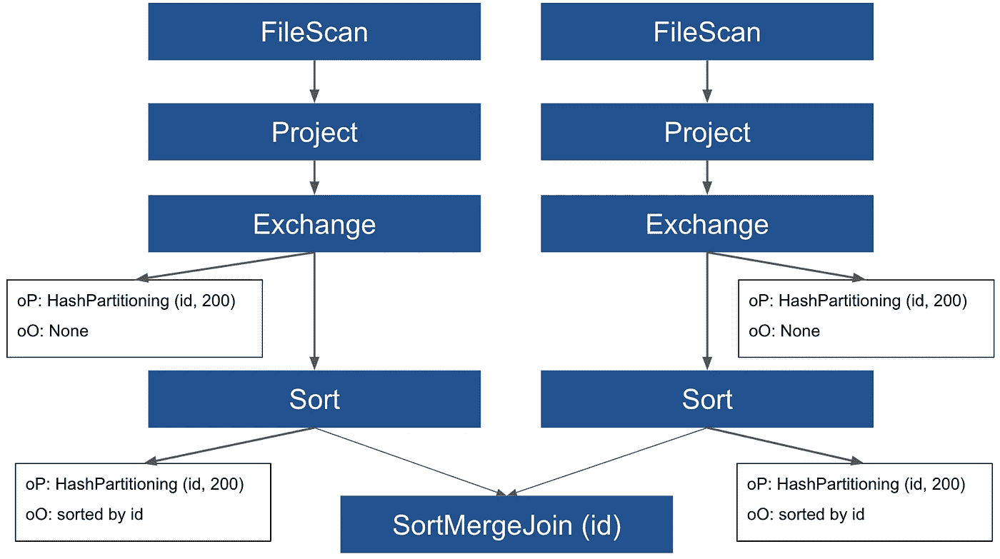
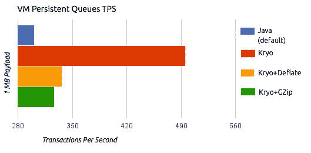
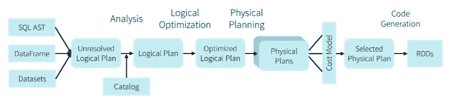
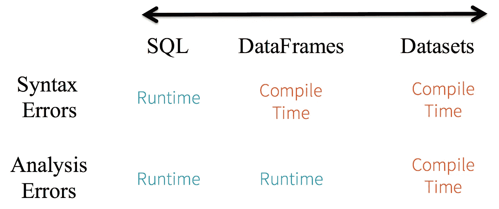

# Spark + Cassandra，所有你需要知道的:技巧和优化

> 原文：<https://itnext.io/spark-cassandra-all-you-need-to-know-tips-and-optimizations-d3810cc0bd4e?source=collection_archive---------0----------------------->


照片由[杰米街](https://unsplash.com/@jamie452?utm_source=medium&utm_medium=referral)在 [Unsplash](https://unsplash.com?utm_source=medium&utm_medium=referral)

# 介绍

在本文中，我将讨论运行 [**Spark**](http://spark.apache.org/) 与 [**Cassandra**](https://cassandra.apache.org/) 的含义，比较最常见的用例是使用深度存储系统，如[**【S3】**](https://aws.amazon.com/s3/)**[**【HDFS**](https://hadoop.apache.org/docs/r1.2.1/hdfs_design.html)。**

**目标是**理解 Spark 和 Cassandra** 的内部机制，这样你就可以尽可能高效地编写代码，真正利用这两个伟大工具的力量。**

**我会给你一些关于火花调谐和 Cassandra 优化的提示，这样你就可以最大化性能和最小化成本。我假设你已经对 Spark 和 Cassandra 有了基本的了解。**

**首先，让我们回顾一下当 Spark 和 Cassandra 一起运行时，您有哪些不同的**部署选项**。**

# **火花卡桑德拉星团**

**一般来说，我们可以认为**有两大类火花簇**:**

*   ****商用 Spark 集群**:这种类型的集群，是一种**经济有效的**处理大量数据的方式。他们使用运行在低成本硬件上的廉价但缓慢的存储系统。这个想法是利用 Spark 并行性以高效的方式处理大数据。这是迄今为止最著名的设置，无论是在本地使用[](https://hadoop.apache.org/docs/r1.2.1/hdfs_design.html)**HDFS，还是在云中使用[**【S3】**](https://aws.amazon.com/s3/)或其他深度存储系统。****
*   ******高性能集群**:这些特殊的集群使用具有高端 CPU 和大量内存的高性能机器。他们还使用非常高效、低延迟的固态硬盘。这是 Cassandra 数据库集群中使用的类似设置，因此这些类型的集群可以在相同的机器类型上运行 Spark + Cassandra，使用 **Cassandra 代替 HDFS 进行存储**。****

****高性能集群更加昂贵，它们可以安装在云中或 perm 上。如果使用正确，它们与 Cassandra 结合起来非常有效，但是如果使用不当，它们可能是资源的**浪费**。本文的目标是为您提供一些关于如何调优这些集群的技巧。****

********

****火花+卡珊德拉****

****让我们更详细地了解一下这两种体系结构可能的样子…****

## ****云中运行的火花****

****如果你在云中运行**，你有两个选择**:****

******托管服务******

****使用类似 AWS [**EMR**](https://aws.amazon.com/emr/?whats-new-cards.sort-by=item.additionalFields.postDateTime&whats-new-cards.sort-order=desc) 或 GCP [**DataProc**](https://cloud.google.com/dataproc/) 的**托管服务**。这些是托管解决方案，使用云提供商深度存储而不是 HDFS，尽管 HDFS 也可用。这是**商品星火集群**，我们在云上运行之前谈过。****

****你必须意识到 **S3** 或者其他便宜的**深度存储系统最终是一致的**，并且不像 HDFS 那样依赖于**数据局部性**。他们使用**REST**HTTP 协议将数据加载到 Spark 集群中，HDFS 仅用于缓存不适合内存的数据。HDFS 是短暂的储藏，S3 是永久的储藏。为了解决您可能会读取陈旧数据的最终一致性问题，云提供商实施了他们自己的[解决方案](https://docs.aws.amazon.com/emr/latest/ManagementGuide/emr-plan-consistent-view.html)，您应该了解一下并在必要时使用它。****

******分离存储和计算**提供了一种经济高效、灵活且**可扩展的**解决方案，这种解决方案已经变得非常流行，但请注意**当读取数据**时，您无法利用数据局部性，这是将 Cassandra 加入等式时的一个问题。****

******打造自己的******

****另一种选择是启动 [**EC2**](https://aws.amazon.com/ec2/?ec2-whats-new.sort-by=item.additionalFields.postDateTime&ec2-whats-new.sort-order=desc) 实例并自行安装 Spark，这要繁琐得多，但可以让您完全控制，因此您可以优化硬件以满足运行特定工作负载所需的需求。如果您想在云中的同一个集群中运行 Cassandra + Spark，这是您必须选择的选项。****

## ****在酒店内运行火花****

****如果您在本地运行，也有同样的选择。您将使用 HDFS 而不是 S3 作为文件系统。其优势在于，数据将位于处理节点的本地，并且不涉及网络调用，从而实现了更好的 I/O 吞吐量和稍低的延迟，但这些优势并不明显。****

****在本地运行您可能会在高端服务器上获得更好的交易，因此在这种情况下，您应该考虑在同一个集群中运行 Spark 和 Cassandra 以实现高性能计算。****

****无论您在哪里运行工作负载，您都有两种方法可以用来集成 Spark 和 Cassandra。您可以为每个工具创建一个集群，或者在同一个集群中运行它们，这是本文的重点。****

## ****不同集群的 Spark + Cassandra****

****在这个场景中，您有两个集群，一个用于 Cassandra，一个用于 Spark。在这种情况下，Cassandra 集群将使用良好的硬件和针对 Cassandra 优化的固态硬盘进行设置。另一方面，Spark 将使用商用硬件进行安装，通常，它将拥有比 Cassandra 集群更多的节点。****

****这是一个**低成本**的解决方案，并且更加**灵活**。它可以在内部或云中安装，尽管在云中安装更容易、更便宜。在这里，您通常将深层存储用于数据湖，并为 OLAP 工作负载运行 Spark 作业。您将使用 **Cassandra 进行 OLTP** ，您的在线服务将向 Cassandra 写入数据，一夜之间，您的 Spark 作业将读取或写入您的主 Cassandra 数据库。****

****在这种情况下，Cassandra 不用于处理，而只是作为一个**源或接收器**进行初始读取或最终写入，但不写入中间结果。一个典型的例子是从 Cassandra 读取前一天的数据，从 HDFS/S3 读取其余数据，以在 Spark 上运行 OLAP 工作负载。然后，您将在 Cassandra 中编写一份数据摘要，为用户提供最新的见解，并将其余数据放回数据湖，供您的内部团队进行分析。****

****请注意，使用这种方法，Cassandra 的写入和读取通过网络进行，有时会跨越不同的 VPC 或区域，因此从网络性能的角度来看，这不是太有效，但它是有成本效益的。****

****当您的 OLTP 应用程序有 Cassandra，并且您只需要从 Spark 查询数据时，通常会使用这种方法，但 Cassandra 本身并不用于您的工作，也没有针对 OLAP 进行优化。****

****这是一种流行的方法，很容易设置。在云中，您将有自己的 Cassandra 集群在虚拟机上运行，并且您的托管 Spark 集群通过网络连接到 Cassandra。****

****当不需要高性能时，或者您有大量的数据，Cassandra 可能难以处理或者运行起来太昂贵时，请使用这种方法。****

## ****Spark + Cassandra 在同一个集群****

****在这种情况下，你的目标是为你的数据处理管道获得**最佳性能**，以及**利用 Cassandra 的获得吞吐量和低延迟**，基本上你设置了一个 Spark 集群，但是**使用 Cassandra 而不是 HDFS** 。这对于迭代数据处理非常有用，例如**机器学习**需要经常读写磁盘。****

****您需要首先为集群获得一组机器。使用固态硬盘，在这种情况下，平衡您的垂直和水平扩展选项。我的意思是，与商用硬件 Spark 集群相比，您可能希望用更多内核和更多 RAM 的更好的机器来拥有更少的节点。****

****针对 OLAP 操作调整您的 Cassandra 集群，您希望通过低延迟获得高吞吐量，请记住，Spark 将读写大量数据，但大多数情况下，它将是批处理的。****

****关于如何在同一个集群上安装 Cassandra 和 Spark 的更多信息，您可以查看本文。****

********

****和卡珊德拉擦出火花。资料来源:https://opencredo.com/blogs/deploy-spark-apache-cassandra/****

****在以下情况下使用这种方法:****

*   ****您已经有一个 Cassandra 集群设置，但没有得到充分利用和/或****
*   ****您的作业需要运行得非常快(流或小型批处理)，并且不消耗大量数据。****

****对于这种方法，首先您将**将您的数据摄取到 Cassandra** 中。您有几种选择:****

*   ******使用 Spark** :如果您的源数据已经处于静止状态，并且您需要将它转移到 Cassandra 以实现快速高性能 ETL 管道，那么这是一个不错的选择。****
*   ****使用 Cassandra 的 [**批量加载器**](https://docs.datastax.com/en/cassandra-oss/3.0/cassandra/tools/toolsBulkloader.html) 向 Cassandra 导入数据。****
*   ****如果您需要从 API 中提取数据，您可以使用一些流解决方案编写自己的应用程序，如 [**Akka Streams**](https://doc.akka.io/docs/akka/2.4/java/stream/index.html) 。这个我在[这篇**文章**](/big-data-pipeline-recipe-c416c1782908) 里讲过。****

****一旦在 Cassandra 中有了数据，您将使用 Spark 读写数据到 Cassandra 来运行您的 **ETL** 管道。请注意，尽管 HDFS 可以使用，**但您不应该使用它**，原因有二:****

*   ****首先，它不是表演性的。如果你有卡桑德拉使用它，而不是缓慢的文件系统。****
*   ****它将与 Cassandra 争夺 I/O。Spark HDFS 写操作是相当繁重的 I/O 操作，它们会降低 Cassandra 集群的速度并使其挨饿。****

****本文的其余部分将主要关注在同一个集群中运行 Spark 和 Cassandra，尽管如果在不同的集群中运行，许多优化也适用。****

# ****火花四射的卡珊德拉****

****使用 [**火花卡珊德拉连接器**](https://github.com/datastax/spark-cassandra-connector) 与卡珊德拉通话。使用此连接器时，您有两种选择:****

*   ****使用**低杠杆 RDD API** 。这提供了更多的灵活性和手动优化代码的能力****
*   ****为 Spark 使用**数据帧或数据集 API**。在这种情况下，您可以像使用 HDFS 和**一样读写数据帧，连接器将在后台执行所有优化**。****

****首先，我推荐使用[数据帧/数据集 API](https://github.com/datastax/spark-cassandra-connector/blob/master/doc/data_source_v1.md) 。这样，您可以利用相同的 API，像编写其他系统一样编写 Cassandra。你只需要知道你的仓库是卡珊德拉，而不是 HDFS。你需要了解如何为 Cassandra 优化 Spark，并在你的连接器中设置正确的[设置](https://github.com/datastax/spark-cassandra-connector/blob/master/doc/reference.md)。这个我们以后再说。****

****要从 Cassandra 表中读取数据，只需指定不同的格式:"*org . Apache . spark . SQL . Cassandra*"****

```
**val df = spark
  .read
  .format("org.apache.spark.sql.cassandra")
  .options(Map( "table" -> "words", "keyspace" -> "test" ))
  .load()**
```

****这将创建一个新的数据帧，它与关键字空间“ *test* ”中的表“ *words* ”相匹配。****

****如果你导入"*org . Apache . spark . SQL . Cassandra . _*"你可以简单地写:****

```
**import org.apache.spark.sql.cassandra._
val df = spark
  .read
  .cassandraFormat("words", "test")
  .load()**
```

****其中第一个参数是表，第二个参数是键空间。****

****要将数据框中的数据写入 Cassandra 表:****

```
**df.write
  .cassandraFormat("words_copy", "test")
  .mode("append")
  .save()**
```

****请注意，数据框的方案必须与表方案相匹配。****

****就这样，基本上从 API perceptive 开始，这就是你需要的全部，当然还有一些高级特性，我们将在后面提到。****

## ****Cassandra + Spark 高性能集群****

****如果您选择在同一个集群中运行 Cassandra 和 Spark，那么将 Spark 与 Cassandra 一起使用类似于将它与 HDFS 一起使用，但是您确实需要理解细微的差别。首先，**本地数据很重要**，和 HDFS 一样。您需要理解 spark 分区利用这一知识来最大化数据局部性，这在 Cassandra 中是至关重要的，您不希望一个节点中的 Spark 执行器进行网络调用来从不同的节点获取数据。这将是本文后面的一个大主题。****

****接下来，我们将回顾您应该知道的 Spark 优化，这些优化在您使用 Cassandra 运行 Spark 时也适用，然后我们将回顾 Cassandra 特定的优化。****

# ****火花优化****

****许多[文章](https://medium.com/analytics-vidhya/apache-spark-optimization-techniques-3e984444ea07)都是关于这个主题的，我将总结你在和 Cassandra 一起工作时需要注意的最重要的一些。****

****在 Spark 中，您编写转换数据的代码，这些代码被评估为 **lazy** ，并在幕后被转换为**查询计划**，当您调用诸如 *collect* ()或 *write* ()之类的动作时，查询计划就会具体化。Spark 将数据分成**个分区**，由**个执行器**处理，每个执行器处理一组分区。在单个分区内执行的操作称为**窄操作**，包括*映射*或*过滤器*等功能。另一方面，聚合是**宽操作**，需要跨节点移动数据，这是非常昂贵的。查询计划本身可以有两种主要类型:逻辑计划和物理**计划，我们将在后面讨论。******

****记住，关于 Spark 性能的主要规则是:**最小化数据混洗**。这是由 Spark 中的 [**宽操作引起的，这样的连接或聚合**非常昂贵**因为数据混洗。**](https://medium.com/@dvcanton/wide-and-narrow-dependencies-in-apache-spark-21acf2faf031)****

****

**宽依赖性与窄依赖性。来源:[https://medium . com/@ dv canton/wide-and-narrow-dependencies-in-Apache-spark-21 ACF 2 faf 031](https://medium.com/@dvcanton/wide-and-narrow-dependencies-in-apache-spark-21acf2faf031)**

**总是试图减少数据混洗的次数，实际上，我们将要谈到的大多数优化的目标都是试图这样做:**减少通过网络发送的数据量。****

****

**来源:[https://luminousmen.com/](https://luminousmen.com/)**

**现在让我们回顾一下一些优化…**

## **早期过滤**

**这真的很简单但是**非常重要**。**尽可能早地过滤数据**，这样你就不会处理那些以后会被丢弃的数据。特别是当使用 Cassandra 时，你可以将过滤器下推到 Cassandra，特别是你可以通过分区键限制查询的地方，越好。如果可能，在 filter 语句中指定分区键的所有组成部分。此外，如果你打算不止一次使用来自 Cassandra 的一组数据，确保使用 ***缓存*** *()* 将它保存在 Spark 内存中，而不是每次都从 Cassandra 中读取。**

**一个好的经验是在过滤数据后使用**()*方法来减少分区的数量。***

## ***火花分区和火花连接***

***这是 Spark 中的**关键**，我真的推荐 [**这篇** **文章**](https://luminousmen.com/post/spark-tips-partition-tuning) 里面详细解释了不同的优化。***

*****设置正确的分区数量*****

***您需要**将** **正确的分区数量设置为** **最大化您集群中的并行度**。如果您的分区太少，那么您将无法利用集群中所有可用的核心，从而浪费资源。拥有太多分区将导致管理许多小任务的额外开销，以及降低性能的数据移动。***

******

***火花隔板。来源:[https://luminousmen.com/post/spark-tips-partition-tuning](https://luminousmen.com/post/spark-tips-partition-tuning)***

***对 Spark 的一般建议是，集群中可用于应用的内核数量为分区数量的 4 倍，当然，这取决于您的使用案例。当有疑问时，**被** **错在更大数量的任务**一边是个好主意。这需要与执行程序的数量和每个执行程序的内存保持一致，我们将在后面讨论。***

*****避免数据偏斜*****

***一般来说，您希望您的数据在所有节点上均匀分布，这在执行连接时尤为重要。您的连接键应该均匀分布，以避免数据倾斜。**偏斜的数据会导致并行处理的性能下降**甚至 OOM(内存不足)崩溃，应该避免。***

***您可以通过查看 **Spark UI** 并检查每项任务花费的时间来**诊断数据的数据偏斜度**。如果一个或多个任务比其他任务花费的时间长，那么您就有不平衡的分区。***

***一些**解决方案**可能是:***

*   *****将数据**重新分区到一个更均匀分布的键上。这是首选选项，在执行任何宽操作之前，使用一个**键自然地将数据**分布到各个分区。***
*   ***使用 [**salting**](https://medium.com/appsflyer/salting-your-spark-to-scale-e6f1c87dd18) 合成一个额外的随机密钥，以便更好地分配数据。***
*   *****将数据分为偏斜数据和非偏斜数据**并通过重新分配偏斜数据来并行处理它们。***
*   ***如果要连接的数据集很小，比如一个事实表，使用 [**广播变量**](https://acadgild.com/blog/broadcast-variables-and-accumulators-in-spark) ，我们将在后面讨论。这对于在事实表上进行查找很有用。***
*   ***使用 [**广播连接**](https://mungingdata.com/apache-spark/broadcast-joins/) 当连接两个数据集且其中一个很小时，这与广播变量有相同的好处。一个更高级的特性是迭代广播连接，我们分割数据，做许多小的广播连接，而不是大的。***

***让我们更详细地看看联播吧…***

*****火花连接*****

***默认情况下，Spark user[**Sort Merge****Join**](https://en.wikipedia.org/wiki/Sort-merge_join)非常适合大型数据集。***

******

***排序合并联接。来源:[https://towards data science . com/the-art-of-joining-in-spark-dcbd 33d 693 c](https://towardsdatascience.com/the-art-of-joining-in-spark-dcbd33d693c)***

***想法是在连接之前对分区进行排序，以减少数据混洗的数量，但是排序本身是一个昂贵的操作，这个连接的性能会根据连接两端的源数据而有很大的变化，如果数据已经混洗了，它会非常快，如果没有，Spark 将需要执行交换和排序，这将导致数据混洗。***

******

***需要交换时排序合并联接。来源:[https://towards data science . com/should-I-repartition-836 f 7842298 c](https://towardsdatascience.com/should-i-repartition-836f7842298c)***

***当两个数据集都很大时，这些连接技术非常有效，但是当您将一个表与一个小的事实表连接时，优势就丧失了。在这种情况下，特别是如果你有一个集群有足够的内存可用，你可以使用**广播加入**。***

*****广播加入*****

***在广播连接的情况下， **Spark 会将数据的副本发送给每个执行器，并保存在内存中**，这可以将性能提高 70%，在某些情况下甚至更高。广播连接的概念类似于我们将在后面讨论的广播变量，但是广播连接是由 Spark 自动处理的，您需要做的只是告诉 Spark 您想要广播哪个表:***

```
 *df = fact_table.join(**broadcast**(dimension_table),                        fact_table.col("dimension_id") === dimension_table.col("id"))*
```

***请注意，当使用广播连接时，数据在内核之间共享，但每个执行器都有自己的副本，因此平衡内核和执行器很重要，我们将在后面讨论这一点。***

******

***广播加入。来源:[https://towards data science . com/the-art-of-joining-in-spark-dcbd 33d 693 c](https://towardsdatascience.com/the-art-of-joining-in-spark-dcbd33d693c)***

***更多关于 Spark joins 的信息，请查看[这篇文章](https://towardsdatascience.com/the-art-of-joining-in-spark-dcbd33d693c)。***

*****在昂贵或多重连接之前重新分配*****

******repartition()*** 方法允许我们更改集群上的数据分布。这将导致数据混乱，代价很高，但是如果在某些类型的连接或多个连接之前进行，将会提高性能，只要您指定列名。正如我们之前看到的，Spark 需要知道数据分布，以便在排序合并连接之前使用它。这可以使用分桶来完成，分桶以预混洗和可能预排序的状态存储数据，其中关于分桶的信息存储在 metastore 中。但是，即使您的数据已经排序并在磁盘上对其中一个表进行了混洗，Spark 也不会知道，仍然会对两个表进行重新排序和完全混洗。这就是为什么需要**对数据进行重新分区，以匹配连接**一端的分区，并且可以减少数据混乱，因此只有连接的一端(表)分布在网络上。其思想是，通过指定列，Spark 将元数据添加到逻辑计划中，因此它知道不需要移动数据。例如，如果一个表按 ID 划分为 100 个分区。通过重新划分数据，您可以避免数据混乱:***

```
*df**.repartition(100, "id")**.join(..., "id")* 
```

***目标是在连接的两端有相同数量的分区，以避免数据交换。如果分区数量与此属性不同，也会发生数据混洗:***

```
*spark.sql.shuffle.partitions // default 200*
```

***它控制 shuffle 期间的**分区数量，**并由排序合并连接使用，以便在连接之前对数据进行重新分区和排序。我非常推荐阅读 [**这篇** **文章**](https://towardsdatascience.com/should-i-repartition-836f7842298c) ，它更详细地介绍了连接和数据分区是如何工作的。***

***一个很好的经验是，在多次连接或非常昂贵的连接之前尝试重新分区，以避免排序合并连接一次又一次地重新洗牌。***

***如果您需要减少分区的数量，请使用 **coalesce** 而不是 *repartition()* 方法，因为它最大限度地减少了数据混乱，并且不会触发数据交换。在过滤之后，记得使用 *coalesce()，*，因为你会有更少的数据，这比 *repartition()* 更有效，因为它最小化了数据混乱。此外，在重新分区后，始终保持或缓存您的数据，以最大限度地减少数据混乱。但是请记住，重新分区本身是一项开销很大的操作，它会在整个集群中移动数据，所以尽量只在完全必要时使用一次；并且永远记得先做窄操作。***

***重要的是要记住**一些宽操作，比如 group by，会改变分区的数量**。***

*****写入存储前重新分区*****

***以一种优化阅读的方式编写数据总是一个好主意。在 HDFS，当执行基于列的操作时，您希望使用列格式，如 [**Parquet**](https://parquet.apache.org/) 来提高读取操作的性能。我在 [**这篇** **篇**](https://towardsdatascience.com/big-data-file-formats-explained-dfaabe9e8b33) 中谈到了这一点。其思想是，如果使用正确的文件夹结构创建分区，那么读操作不需要扫描磁盘中的所有数据，而只需要扫描指定的文件夹/分区。***

***您可以使用以下方法在写入时对数据进行分区:***

```
*df.write.partitionBy('key').json('/path...')*
```

***在 Cassandra 中，端表应该已经分区，为了提高写性能，同样的原理也适用，并且您可以使用 *partitionBy* 来实现数据局部性，这样当写入磁盘时(当使用高性能集群时)，数据将在正确的 Cassandra 节点中；然而， **Cassandra 连接器在协调器节点上为您做了这件事**,它已经知道 Cassandra 分区，并将数据成批发送到正确的分区。您只需要调整一些我们稍后将讨论的属性。***

*****避免磁盘溢出*****

***当加入大型数据集时，Spark 需要在数据洗牌期间存储中间数据，如果执行器没有足够的内存，它会将其移动到磁盘，然后加入将变得非常慢，请确保为每个执行器设置正确的内存量( *spark.executor.memory* )，并减少您的数据大小。您也可以通过设置来更改缓冲区的大小:*spark . shuffle . file . buffer****

## ***设置正确数量的执行器、内核和内存***

***重要的是**根据分区数量**设置执行人数量。你的目标是最大化并行性，并且**确保你的 Spark 执行器在整个作业期间都很忙，并且所有的内核都在节点中使用**。***

***记住，每个执行器处理一个数据子集，也就是一组分区。此外，每个执行器使用一个或多个内核，如属性所设置:***

```
*spark.executor.cores*
```

***带纱运行时设置为 1。***

***在 Spark 中，我们通过将数据分割成分区来实现并行性，这是 Spark 分割数据的方式。分区分布在不同的节点上，每个节点都有一组执行器。然后每个执行器管理一个或多个分区。请注意，在计算级别，每个执行器执行一组任务，因此每个执行器将向同一个分区应用一组函数。所以，这就是为什么您可能希望每个执行器有**多个内核，这样您就可以并行运行独立的任务。重要的是要明白，每个执行器在内存中都有自己的本地和独立数据，包括广播变量(将在后面讨论)和累加器，这两者都使用相当多的内存；但是，这些在内核之间共享。因此，每个执行器只有一个内核意味着需要为每个执行器复制所有数据。此外，I/O 操作，特别是对可拆分文件格式或 Cassandra 的 I/O 操作，可以在读写分区时利用多个内核，从而最大限度地提高吞吐量。*****

***总之，当您使用广播变量、累加器或者您读取/写入大量数据时，您希望每个执行器有多个内核，但不能太多，否则一些内核将无法使用。更多信息请查看 [**这篇** **文章**](https://spoddutur.github.io/spark-notes/distribution_of_executors_cores_and_memory_for_spark_application.html) 。***

***根据经验**每个执行器 3-5 个内核是一个不错的选择**。当然，这取决于分区的数量和分区的大小。如果您有非常小的分区，并且不像广播变量那样使用很多内存，那么建议使用较少的内核。***

***您的目标是找到执行器和内核数量之间的平衡，以及每个执行器的合适内存量。运行 [spark-submit](https://spark.apache.org/docs/latest/submitting-applications.html) 时，可以设置执行器内存、执行器数量和内核数量。***

```
**# Run on a Spark standalone cluster in cluster deploy mode with supervise*
./bin/spark-submit **\**
  **--class** org.apache.spark.examples.SparkPi **\**
  **--master** spark://207.184.161.138:7077 **\**
  **--deploy-mode** cluster **\**
  **--supervise** **\**
  **--executor-memory** 20G **\**
  **--total-executor-cores** 100 **\**
  /path/to/examples.jar **\**
  1000*
```

***也可以将它们作为 Spark 属性传递。***

***为每个执行器设置正确数量的**内存**也很重要，这需要基于您使用的累加器、广播变量以及在执行连接时数据的大小，正如我们之前看到的，数据是无序的。确保你**设置了警报**，这样你就知道数据溢出是非常低效的。***

## ***广播变量***

***我们已经讨论过广播连接，它非常有用并且非常受欢迎，例如，因为连接小数据集和大数据集是很常见的；当你用一个从 *CSV* 文件上传的小事实表连接你的表时。***

***在这种情况下，想法是**将数据复制到每个执行器**中，因此不需要移动数据，并且连接是在本地完成的，因为连接的一端完全存储在每个节点的内存中。这是 Spark 中广播的思想，对于连接和变量都是如此。***

***连接由 Spark 在幕后为您管理，因此易于使用。需要在代码中创建广播变量。您可以存储任何 *JVM* 对象，只要它是可序列化的。我们将在下一节讨论序列化。***

***要创建广播变量:***

```
*val df = spark.sparkContext.broadcast(data)*
```

***注意，数据不能是数据帧或数据集，需要是一个常规对象，所以需要调用 *collect()* 方法获取所有数据，然后发送给执行者。***

## ***Spark 序列化***

***有几篇文章和几本书教你如何优化你的 Spark 代码，然而，你能做的提高所有代码的 Spark 性能的最有效的事情就是**去除 Java 序列化。*****

***Java 序列化效率很低，也不安全；会拖慢你的工作。***

***您需要了解 Spark 如何运行应用程序。简而言之，驱动程序需要序列化您的代码并将其发送到所有节点，因此广播变量和作业本身需要通过网络传输，此外，中间数据和元数据也需要序列化。这种情况在发动机罩下经常发生，它可能会成为您应用的一个瓶颈。***

***如果您在 Spark 中遇到过著名的“*任务不可序列化*”错误，那么您应该知道我在说什么。理解代码的哪些部分需要序列化，哪些不需要是至关重要的。您的目标是识别这些对象，并通过使用另一种可序列化的格式来优化它们。要解决连载问题，我真的建议看一看 [**这篇** **篇**](https://medium.com/swlh/spark-serialization-errors-e0eebcf0f6e6) 。一般来说，**确保传递给闭包的所有对象都是可序列化的。*****

***Java 序列化最著名的 Spark 替代方案是 [**Kryo 序列化**](https://github.com/EsotericSoftware/kryo) ，可以将序列化性能提高几个数量级。***

******

***Kryo 性能 vs Java，Source:[https://docs . mulesoft . com/mule-runtime/3.9/用 kryo-serializer 提高性能](https://docs.mulesoft.com/mule-runtime/3.9/improving-performance-with-the-kryo-serializer)***

***许多 Spark 开发人员选择不使用它，因为您需要使用以下方法注册您使用的每个类:***

```
*Kryo kryo = new Kryo();
kryo.register(SomeClass.class);*
```

***但是我真的建议你从项目一开始就启用 Kryo 来利用性能提升。**注意**如果你依赖数据集 API，那么你可能不需要 Kryo，因为你的类将使用比 Kryo 更有效的钨编码器，我们将在后面讨论它们。***

## ***火花催化剂***

***我把最好的优化留到了最后。Spark 有一个秘密武器，可以极大地提高你的工作效率，最棒的是，你几乎不用做任何事情就可以使用它，它在引擎盖下运行。我们之前已经接触过这个特性: [**火花催化发动机**](https://databricks.com/glossary/catalyst-optimizer) **。**它基本上以一种最佳的方式重写了你的代码。***

***Catalyst 在数据框 API 和部分数据集 API 中可用。**RDD API**中没有。它是 [**Spark SQL**](https://spark.apache.org/sql/) 层的一部分，其背后的想法是使用 RDBMS 世界多年来完成的所有优化，并将它们带到 [**Spark SQL**](https://spark.apache.org/sql/) 。由于 SQL 提供了一个已知的数学模型，Spark Catalyst 可以理解数据，做出假设并优化代码。在引擎盖下，Spark 运行一个复杂的工作流程，将你的代码完全改写成一个更难理解但更有效的代码。***

***把 Spark 数据帧 API 想象成一种**声明性**语言，而不是真正的代码。你就像是在这个引擎上写东西，这个引擎会解释你的代码并优化它。这是在 Spark 中触发动作时发生的过程:***

******

***催化剂工作流程***

***简而言之，**它创建了一个优化的逻辑计划，该计划被分成多个物理计划**。然后，它为物理计划生成代码，并将代码分发给执行者(还记得为什么序列化很重要吗？).Catalyst 通过在逻辑查询计划上应用一系列转换，如谓词下推、列修剪和常量折叠，从逻辑查询计划生成优化的物理查询计划。***

***Catalyst Optimizer 有两种类型的优化:***

*   *****基于成本的优化器**:由于数据帧是基于 SQL 的，Catalyst 可以计算每条路径的成本，并分析哪条路径更便宜，然后执行该路径以改善查询执行。***
*   *****基于规则的优化器**:包括常量合并、谓词下推、投影修剪、空传播、布尔简化和其他规则。***

***Catalyst 还将**自动执行广播连接**当连接的一端很小时，可以使用该属性设置阈值:***

```
*spark.sql.autoBroadcastJoinThreshold*
```

## *****钨项目*****

***数据帧和数据集 API 也有利于 [**项目** **钨**](https://databricks.com/blog/2015/04/28/project-tungsten-bringing-spark-closer-to-bare-metal.html) ，该项目旨在修复我们之前提到的**序列化**问题、内存管理和**性能**。它使用优化的内存格式和不需要垃圾收集的堆外内存。***

***它通过执行以下操作来优化 Spark 作业的 CPU 和内存效率:***

1.  ***堆外内存管理使用二进制内存数据表示，这是钨行格式。***
2.  ***高速缓存局部性，这是关于高速缓存感知计算和高速缓存感知布局，以实现高高速缓存命中率。***
3.  ***全阶段代码生成(CodeGen)。***

***这就是为什么在使用数据集 API 时需要使用 [**编码器**](https://spark.apache.org/docs/latest/api/java/org/apache/spark/sql/Encoders.html) 的原因，这些负责堆外优化。您可以在数据框和数据集 API 中免费获得，但数据集会得到更好的优化。更多信息请查看这篇 [**伟大的** **文章**](https://www.linkedin.com/pulse/catalyst-tungsten-apache-sparks-speeding-engine-deepak-rajak/?articleId=6674601890514378752) 。***

*   ******RDDs 呢？*** 催化剂毫无办法，这是你自己动手的方法。实际上 Catalyst 生成 RDD 代码，这是最终结果。此外，您需要管理序列化。***
*   ******Catalyst 是否优化数据集 API？*** 是和否。最初，数据集 API 较慢，因为 Catalyst " *看不到*"您在代码中做了什么，因为数据集语法比固定的 SQL 语法更广泛。但是如果你用的是最新版本的 Spark ( *3.0* )，那么大部分优化都是可用的。尽管如此，数据框架 API 在优化您的查询方面会更有效一些；对于数据集，你需要更加小心，但是如果你写了好的 Spark 代码，差别是很小的。此外，数据集具有[更好的空间和速度性能](https://databricks.com/blog/2016/07/14/a-tale-of-three-apache-spark-apis-rdds-dataframes-and-datasets.html)，数据集钨优化优于数据帧。我的建议是 **Spark SQL 和数据帧**应该由**数据科学家**使用，他们对 Spark 没有深入的了解，Catalyst 会为他们优化代码。**数据集 API 是 Scala 工程师的理想选择**,他们对 Spark 内部有很好的了解。***

******

***Spark APIs 比较。来源:[https://databricks . com/blog/2016/07/14/a-tale-of-three-Apache-spark-APIs-rdds-data frames-and-datasets . html](https://databricks.com/blog/2016/07/14/a-tale-of-three-apache-spark-apis-rdds-dataframes-and-datasets.html)***

*   ******如果使用数据集 API，需要 Kryo 吗？*** 是也不是。钨将使用编码器管理你的 case 类，但仍有其他部分的代码需要序列化，启用 Kryo 会有所帮助。如果你使用数据集 API，我建议跳过 Kryo，除非你需要最大化性能。***

## ***其他 Spark 优化***

*   ***尽可能使用***reduce by/aggregate by***方法，而不是 ***groupBy*** ，因为它们减少了数据混乱。它工作得更快，因为 Spark 在混合数据之前知道每个分区上的公共键的组合输出。***
*   ***避免 ***reduceByKey*** 当输入输出值类型不同时，用 use `**aggregateByKey**` 代替；**如果类型相同，使用 *reduceByKey* 如果不相同*aggregate by key*。*****
*   ***在重新分区和写入之前，使用***local check point****()*方法。这是为了在混洗阶段和写入操作之间创建阶段屏障。***
*   ***不要用 ***收*** *()* 的方法。它会尝试将所有数据移动到驱动程序中，在那里它可能会耗尽内存并崩溃。仅将它用于调试目的或创建定义为小尺寸的广播变量。***
*   ***使用正确的 [**文件格式**](https://towardsdatascience.com/big-data-file-formats-explained-dfaabe9e8b33) 。 [**Avro**](https://avro.apache.org/) **用于行级操作** [**用于列级操作**](https://parquet.apache.org/) **或 ORC**等 Spark SQL。压缩数据并确保格式是可拆分的，这样它就可以被 Spark 阅读器并行读取。**可拆分格式有 lso、bzip2、snappy** 等。不可分割的 gzip，zip，lz4…***
*   *****监控和可观察性**关键是火花。在写入磁盘之前，作为最后一步，使用 ***explain()*** 方法来验证我们谈到的所有优化都发生了。检查预期的 Catalyst 优化是否已完成，过滤器是否已推送到源，查询是否已重新安排，数据混乱是否已最小化，等等。启用 [**Spark 历史服务器**](https://supergloo.com/spark-monitoring/spark-performance-monitoring-history-server/) 来分析和观察您的作业的进展，并检测任何可能导致性能问题的变化。***

***如您所见，所有这些优化的目标都是减少数据移动。为此，总是**尽可能多地过滤**数据。尝试**最小化宽操作**。如果数据集将被多次使用，则缓存这些数据集。在执行连接或写入磁盘之前，确保您的**数据被均匀分区**。注意数据局部性，记得使用 **Spark UI** 和 *explain()* 方法来理解 Spark 逻辑和物理计划。***

# *****火花卡珊德拉优化*****

***首先，我们提到的 Spark 优化也适用于在同一个集群或不同的集群上使用 Cassandra。旨在过滤掉你不需要的数据，平衡分区，依靠 Spark 广播连接。***

***与 Catalyst 引擎相同的 [**Spark Cassandra 连接器**](https://github.com/datastax/spark-cassandra-connecto) 也优化了数据集和数据帧 API。因此，提到的一些方法只用于 rdd，并且是在使用高级 API 时自动添加的。***

***现在让我们回顾一下有关 Cassandra 及其连接器的具体细节…***

## ***Spark 和 Cassandra 分区***

***我们讨论了很多关于 Spark 分区的内容，如果您在同一个集群中运行 Spark 和 Cassandra，您需要注意一些额外的事情。***

***最重要的规则是这条:**将 Spark 分区匹配到 Cassandra 分区**。第二条规则是: **Cassandra 分区不同于 Spark 分区:*****

*   *****Cassandra 分区:**这些是 Cassandra 跨节点分割数据并确定您的数据存储在哪个 Cassandra 节点上的单元。Cassandra 分区键是在为 Cassandra 表定义模式时设置的。每个分区都包含在一个节点上(每个副本)。***
*   *****Spark 分区:**Spark 将数据(在内存中)划分给不同的工作线程。Spark 分区还决定了 Spark 在处理数据时可以应用的并行度(每个分区都可以并行处理)。分区的数量和分区键既可以由 Spark 自动确定，也可以显式设置。***

***了解这两者之间的区别并编写代码来利用分区是至关重要的。**您的目标是拥有正确数量的 Spark 分区，以允许 Spark 高效地并行处理计算。*****

***在许多情况下，会有比 Cassandra 分区更少的火花分区，因为 Cassandra 更细粒度；但是在可能的情况下，您希望 Cassandra 数据从 Spark 分区所在的 Cassandra 节点读取和写入。正如我们之前提到的，您还希望有足够多的 Spark 分区，每个分区都适合可用的 executor 内存，这样每个分区的每个处理步骤不会运行太长时间，但也不会太多，以至于每个步骤都很小，从而导致过多的开销。正确的数字取决于您的使用情形。在 Spark 中，特别是在 Cassandra 中，您必须运行性能和压力测试，并调整这些参数以获得正确的值。一个好的经验法则是每个执行器至少有 30 个分区。***

***好消息是，在许多情况下，Cassandra 连接器会自动为您处理这些问题。当你使用 Cassandra Spark 连接器时，它会自动创建与 Cassandra 分区键一致的 Spark 分区！。这就是为什么在 Cassandra 中设置正确的分区很重要。Cassandra spark 连接器尝试估计表格的大小，并将其除以参数`spark.cassandra.input.split.size_in_mb`(默认情况下*64MB*)。但是也要记住，有些 Spark 函数会改变分区的数量。***

***当您使用不同的分区键连接 Cassandra 表或进行多步处理时，您需要小心。请记住，像聚合这样的一些操作会改变分区的数量。因此，在这种情况下，您从一组大小合适的分区开始，但是随后极大地改变了数据的大小，导致分区数量不合适。解决这个问题的一个方法是使用连接器`**repartitionByCassandraReplica**()`方法来调整 Spark 分区的大小和/或重新分配数据。这将重新分配 Spark 在内存中的数据副本，以匹配指定的 Cassandra 表的分布，并为每个执行器分配指定数量的 Spark 分区。***

***连接器还提供了一个有趣的方法来执行连接:***

```
*JoinWithCassandraTable()*
```

***它只提取与 Cassandra 的 RDD 条目相匹配的分区键，因此它只处理速度更快的分区键。建议您在 *JoinWithCassandraTable* 之前调用`repartitionByCassandraReplica`来获得数据局部性，这样每个 spark 分区将只需要查询它们的本地节点。***

***请注意，当您使用数据集或数据帧 API 时，连接器会在幕后使用这些方法。***

## ***写入设置***

***关于向 Cassandra 读取和写入数据，我非常推荐观看这个来自 [DataStax](https://www.youtube.com/channel/UCqA6zOSMpQ55vvguq4Y0jAg) 会议的视频:***

***在连接器中有许多参数[可以设置，但一般来说，从 Spark 向 Cassandra 写入数据有两种方法:](https://github.com/datastax/spark-cassandra-connector/blob/master/doc/reference.md#write-tuning-parameters)***

*   ***t:这个想法是让许多并行的单个写操作异步执行。如果因为没有单独的分区键而不能选择批处理，那么这种方法可以很好地执行。***
*   *****批处理**:在这种情况下，我们创建批处理。为了实现这一点，我们需要确保通过一个 Cassandra 键对数据进行分区，这样每一批数据都进入同一个分区，查看视频了解更多细节。***

***在写入 Cassandra 之前，您总是可以使用 spark *重新分区*()方法来实现数据局部性，但是这很慢，而且有些矫枉过正，因为 Spark Cassandra 连接器已经在幕后更有效地实现了这一点。**连接器自动以最佳方式为您批量处理数据**。***

***根据经验，如果您不确定某件事，不要去做，让连接器和 Spark Catalyst 为您优化代码。***

***根据数据大小和目标表分区，您可能希望对每个作业进行以下设置:***

*   ***"*spark . Cassandra . output . batch . grouping . key*":Cassandra connector 将根据该值对批处理进行分组，默认为 partition，因此它将尝试重新分区，以便每个批处理都进入同一个分区，并依次进入同一个节点。您可以将其设置为 replica_set。***
*   ******spark . Cassandra . output . batch . grouping . buffer . size***:这是司机给你做批处理的时候，批处理的大小。这需要根据您的数据大小进行设置。默认值为 1000。***
*   ***"*spark . Cassandra . output . batch . size . row*s】:批量大小，以行为单位，它将覆盖以前的属性，默认为 auto。***
*   *****"*spark . Cassandra . output . concurrent . writes***":并发写的次数，这个属性和前面两个成正比，批量越大你想要的并发写越少。通过根据数据大小和分区调整这两个参数，您可以获得最佳性能。***
*   ***"*Cassandra . output . throughput _ MB _ per _ sec*"(默认值:无限制):每个内核的最大写吞吐量。您需要根据每个执行器的内核数量来设置。默认情况下，Spark 会尽可能快地(无限制)写给 Cassandra。对于长时间运行的作业来说，这不是很好，因为 Cassandra 节点将会不堪重负而崩溃。您应该为长时间运行的作业设置一些值。作为一般指导，我们建议从设置为 5 开始。***

***要使用 fire and forget 方法，请将*spark . Cassandra . output . batch . size . row*s 设置为 1，并将*spark . Cassandra . output . concurrent . writes**设置为一个大数。****

## ****读取设置****

****当从 Cassandra 读取大量数据时，请确保使用正确的分区键对数据进行分区。您可以设置几个[属性](https://github.com/datastax/spark-cassandra-connector/blob/master/doc/reference.md#read-tuning-parameters)来提高连接器的读取性能。记住，**读数据调优主要是关于分区的**，我们已经讨论过了。****

****将*spark . Cassandra . concurrent . reads*设置为高于内核数量的数字，以便每个内核可以并行读取数据。当从 Cassandra 读取数据时，由于吞吐量更高，您需要比使用 HDFS 时更大的每个执行器的内核比率，**尽可能利用 Cassandra 的优势**。****

****当读取数据时，连接器将根据对 spark 数据大小的估计来确定分区的大小，如果您想将更多的数据放入 Spark，可以增加"*Spark . Cassandra . input . split . sizeinmb*"但是要注意不要保存太多的数据，否则会遇到问题。一般来说，您的执行器应该设置为保持 ***内核数量*分区大小* 1.2*** 以避免内存不足问题或垃圾收集问题。****

******由 Cassandra 中的大分区导致的热点**也会导致 Spark 中的问题，因为我们已经提到过数据偏斜的问题。****

****还要记住，读取速度主要由 Cassandra 的分页速度决定，分页速度是使用"*spark . Cassandra . input . fetch . sizeinrows*"属性设置的，这意味着在读取当前批处理时将异步请求多少行。****

****关注即将发布的[**这款**](https://issues.apache.org/jira/browse/CASSANDRA-9259)**Cassandra 新功能**，支持从 Cassandra 批量阅读。****

## ****性能测试****

****最后但同样重要的是，您将不得不花费大量时间来调整所有这些参数。确保您使用的测试数据集在数据大小和形状方面与生产环境相似。您的环境应该是稳定的，测试应该是可重复的。****

********

****火花调谐。来源:[https://luminousmen.com/post/spark-tips-dataframe-api](https://luminousmen.com/post/spark-tips-dataframe-api)****

****可以用 Spark Cassandra[压力工具 来测试 Cassandra。还要检查连接器暴露的](https://github.com/datastax/spark-cassandra-stress) [**度量**](https://github.com/datastax/spark-cassandra-connector/blob/master/doc/11_metrics.md) 。****

# ****结论****

****在本文中，我们展开了 Spark 的内部结构，以便能够理解它是如何工作的以及如何优化它。关于 Spark，我们可以用两个要点来总结我们的经验:****

*   ******最小化数据混乱，最大化数据局部性。******
*   ******使用数据帧或数据集高级 API 来利用 Spark 优化。******

****如果你是 Scala 开发人员，请记住 Spark 高阶函数与 Scala 中的不同，你真的需要理解 Spark 和 Catalyst 引擎是如何工作的。****

****如果您有一个单独的 Cassandra 集群，并且您只是将 Cassandra 用作汇聚源，那么**会专注于优化读写设置，以最大化并行性**。请记住，设置正确数量的平衡分区非常重要。如果你有一个高性能的 Spark + Cassandra 集群，你需要**理解 Spark 和 Cassandra 分区**之间的关系，并尝试利用 Cassandra 的速度和**性能**。****

****记得关注 [**DataBricks**](https://databricks.com/) 的 Spark 更新和 [**Datastax**](https://www.datastax.com/) 的 Cassandra 更新，因为他们是这些技术背后的公司。此外，检查一下 [**ScyllaDB**](https://www.scylladb.com/) ，它是卡珊德拉的绝佳替代者。****

*******祝您大数据之旅好运！*******

****如果你喜欢这篇文章，记得鼓掌，并关注我的更多更新！****

****我希望你喜欢这篇文章。欢迎发表评论或分享这篇文章。跟随[***me***](https://twitter.com/JavierRamosRod)**进行未来的帖子。******