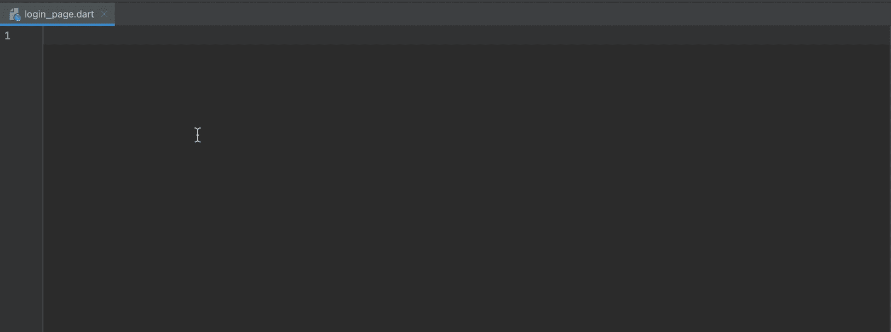
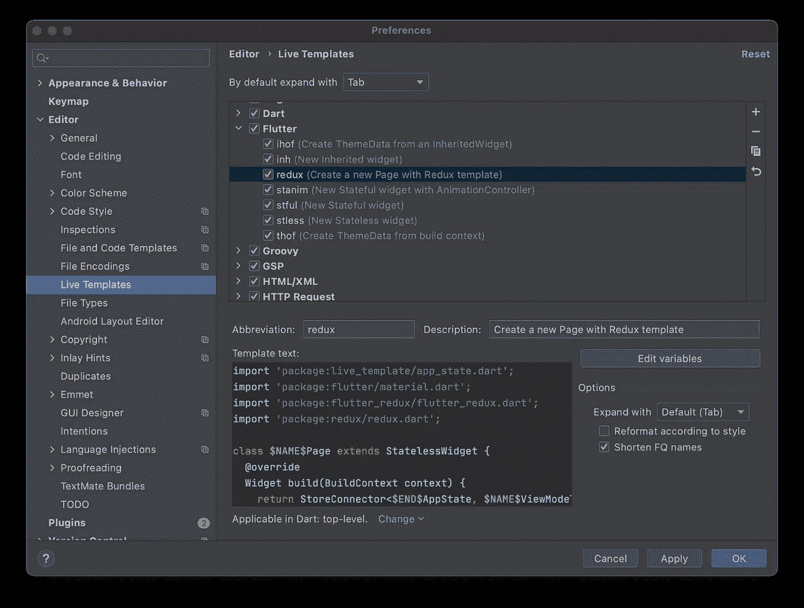
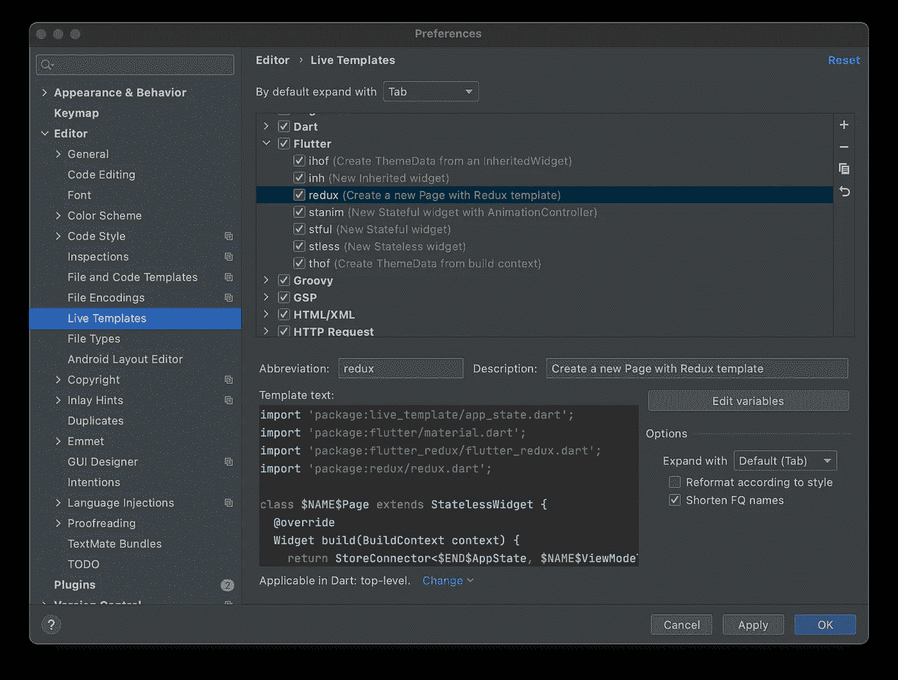
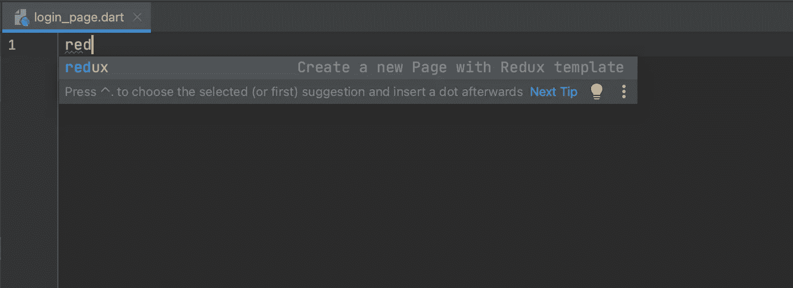
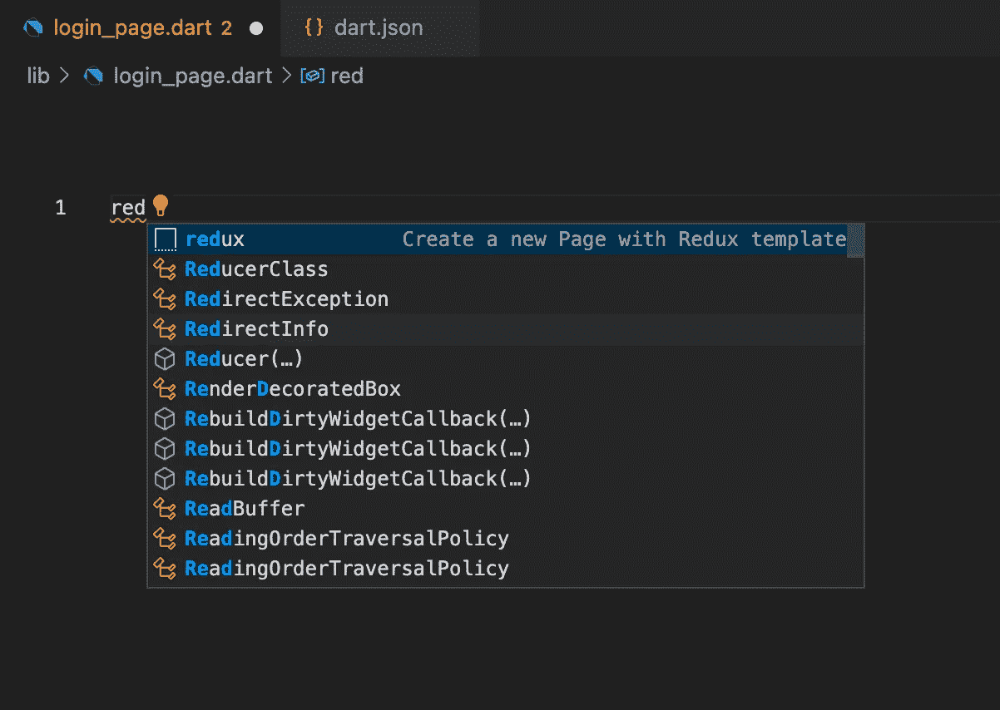

# 在 IDE 中加速编写 Flutter Redux 代码

> 原文：<https://itnext.io/speed-up-writing-flutter-redux-code-in-your-ide-e29a355684ad?source=collection_archive---------4----------------------->

嗨！👋

如果您正在使用 Redux 开发您的 Flutter 应用程序，您应该知道这种架构有很多优点。不幸的是，像所有东西一样，它也有一些缺点。其中之一是您必须为每个想要从 Redux 商店中受益的新部件编写的代码量。

今天我想向你展示一个加快这个过程的好方法。如果你正在使用 **Android Studio** 、 **IntelliJ IDEA** 或 **Visual Studio 代码，这对你会很有用。**

# Android Studio/IntelliJ IDEA

在这个 IDE 中，我们将使用一个叫做**实时模板**的特性。要创建新的实时模板，请转到**设置/首选项|编辑器|实时模板。**

在编辑器窗口中，点击+图标并添加一个新的**实时模板。**填写您想要用于模板的**缩写**(在我的例子中是 *redux* )和**描述**。将以下文本粘贴到**模板文本**字段。

在模板文本字段下，选择**定义…** 选择一个可以应用模板的上下文，并选择 **Dart:顶级**。

就是这样！要开始使用它，打开任何 dart 文件并开始输入 *redux。这应该会显示您的新 Redux 模板。*

> 要阅读更多关于实时模板的信息，请访问 [IntelliJ IDEA 文档](https://www.jetbrains.com/help/idea/using-live-templates.html)

# Visual Studio 代码

在这个 IDE 中，我们将使用一个叫做 **Snippets** 的特性。要创建新的代码片段，请转到**文件/代码|首选项|用户代码片段。**

在出现的窗口中，选择**镖。这将打开您的代码片段的编辑器。将以下代码粘贴到该编辑器中并保存:**

要使用它，打开一个 dart 文件并开始输入 *redux。这应该会突出显示您的新代码片段:*

> 要阅读更多关于代码片段的内容，请访问 [Visual Studio 代码文档](https://code.visualstudio.com/docs/editor/userdefinedsnippets)

# 摘要

总而言之，今天我向你展示了如何使用**实时模板**或**片段**来加速你的工作。您可以将它们用于许多其他事情，包括经常使用的实用程序方法或样板代码。请在评论中告诉我你的想法！