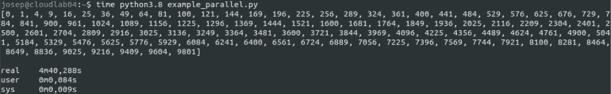
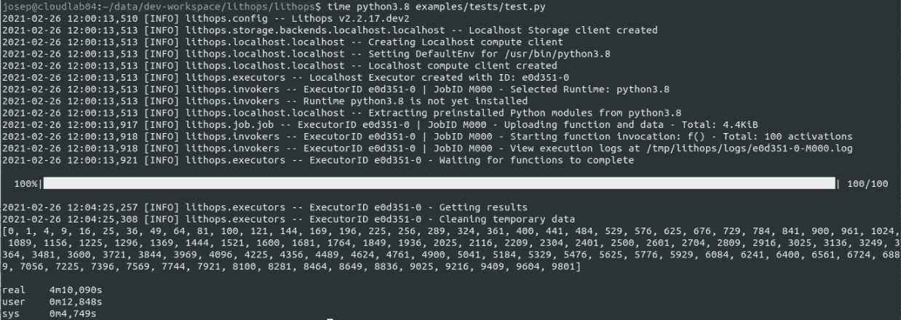
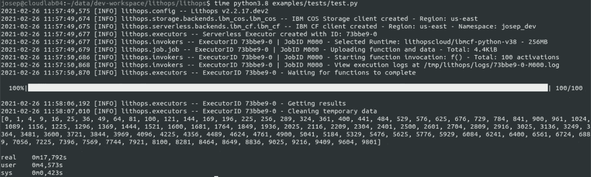

# 使用 Lithops 和无服务器云资源加速您的 Python 应用程序

> 原文：<https://itnext.io/speed-up-your-python-applications-using-lithops-and-serverless-cloud-resources-a64beb008bb5?source=collection_archive---------4----------------------->

无服务器计算的兴起。

大多数用户或企业应用程序本质上都是并行的。并行的高级特性通常用于增强应用程序的性能。也就是说，减少应用程序完成所需的总时间，充分利用大部分可用资源。

本文旨在解释串行和并行编程之间的区别，并展示我们如何利用“无服务器”云资源来加速我们的 python 应用程序。


照片由 [Aron 视觉效果](https://unsplash.com/@aronvisuals?utm_source=medium&utm_medium=referral)在 [Unsplash](https://unsplash.com?utm_source=medium&utm_medium=referral) 上拍摄

# 从串行编程到并行编程

在编写 python 应用程序时，新手用户开始编写*【串行】*代码，也就是在一种*【意大利面】*应用程序中一个接一个的指令，这是非常常见的。在这种情况下，当程序被执行时，代码使用计算机中的一个核心来执行应用程序直到结束。让我们看下一个例子:

```
import time

def f(x):
    time.sleep(10)
    return x*x

if __name__ == '__main__':
    for i in [1, 2, 3]:
        print(f(i))
```

要知道一个应用程序是串行执行还是并行执行，最简单的方法是测量它完成的时间。


串行执行 3 个任务

如您所见，这个简单的串行应用程序需要 30 秒来完成它的执行。这是因为每个 *f(i)* 执行都需要前一个执行完成才能开始。好吧，但是我们怎样才能加速这段代码呢？

现在大多数计算机都有多个内核。新的处理器架构使得在一台普通笔记本电脑中集成 16 个(或更多)内核成为可能。这个事实使得你在执行*“串行”*应用程序时，放弃了计算机的大部分计算能力。因此，人们可以很容易地推断，通过使用计算机的所有核心，我们可以大大加快任何应用程序的速度。从这个意义上来说，python [*多处理*](https://docs.python.org/3/library/multiprocessing.html) 库更容易利用计算机的所有(或仅所需)内核。让我们看下一个例子:

```
import time
from multiprocessing import Pool

def f(x):
    time.sleep(10)
    return x*x

if __name__ == '__main__':
    with Pool() as p:
        print(p.map(f, [1, 2, 3]))
```

这个应用程序是前一个示例的等效并行版本。在这种情况下， *Pool()* 将检测我们笔记本电脑中的可用内核(假设我们的笔记本电脑有 4 个内核)，并创建一个包含 4 个准备执行任务的进程的池。创建池时，进程保持空闲状态，等待任务。为了提交任务，我们需要调用一个可用的[多处理操作](https://docs.python.org/3/library/multiprocessing.html#module-multiprocessing.pool)。在这个例子中，我们调用 *p.map()* 操作，为列表 *[1，2，3]中的每个值生成一个 *f()* 函数。也就是说*，这段代码将 *f(1)* 、 *f(2)* 和 *f(3)* 提交到池中，然后，*、*由于池中有 4 个空闲进程，其中 3 个进程将各自获取这些任务中的一个并并行运行。


并行执行 3 项任务

在这种情况下，执行只花了 10 秒钟。*这太棒了！*这显示了并行性的好处。但是如果我们把输入列表增加到比如说 100 个元素呢？

```
if __name__ == '__main__':
    with Pool() as p:
        print(p.map(f, range(100))
```

在这种情况下， *p.map()* 操作将向池中提交 100 个任务。然而，笔记本电脑只有 4 个内核，因此它只能处理 4 乘 4 的任务。这意味着，在最后，这个应用程序大约需要 250 秒才能完成。让我们检查一下:



并行执行 100 个任务

行刑花了 280 秒才完成。这比预期多了 30 秒。这是由于*多处理*库是如何内部构建的，表明当任务多于核心时它会有一些开销，这导致了瓶颈。

到目前为止，我们已经演示了如何将一个简单的应用程序从串行迁移到并行，展示了并行的好处，以及由于资源有限而导致并行度较低时的缺点。现在是时候做更大的梦和思考了；如果一个应用程序是为处理大量数据而设计的呢？如果我的笔记本电脑的内核很少，获得的速度很低怎么办？如果即使使用计算机的所有内核，应用程序仍然需要几个小时才能完成，那该怎么办？**别着急，云上千核等你；)**

# Lithops 来救援了


Lithops 标志

现在是介绍 **Lithops、**python 框架的时候了，它允许将你的多进程应用程序扩展到云中。Lithops 在后台使用无服务器计算平台，对您完全透明地完成这项任务。让它工作的唯一要求是在你的应用程序中修改一行代码。

**无服务器？**无服务器是一种计算模式，允许在云中执行被称为*功能*的计算单元任务。在无服务器计算中，数百(或数千)个内核可在几秒钟内立即供您使用，只需为您使用的确切资源付费。

**透明？** Lithops 将用户的代码和数据交付到云中，而不需要了解它如何部署和运行到无服务器平台中。

Lithops 是一个开源项目，可在 [Github](https://github.com/lithops-cloud/lithops) 上获得:

[](https://github.com/lithops-cloud/lithops) [## 石质云/石质

### Lithops 是一个 Python 多云分布式计算框架。它允许在…上运行未修改的本地 python 代码

github.com](https://github.com/lithops-cloud/lithops) 

如果你是 Lithops 的新手，也请阅读这篇博文:

[](/lithops-a-multi-cloud-serverless-programming-framework-fd97f0d5e9e4) [## Lithops，一个多云无服务器编程框架

### 无服务器计算的兴起

itnext.io](/lithops-a-multi-cloud-serverless-programming-framework-fd97f0d5e9e4) 

太神奇了！让我们使用**光刻**。

首先，我们必须安装 Lithop 并运行测试，以确保它正常工作。Lithops 附带了一个 *cli* 工具，允许从控制台运行一些管理任务:

```
$ pip3 install lithops
$ lithops test

Hello Josep! Lithops is working as expected :)
```

好了，一切正常，正如我向你保证的，让我们修改一行代码，使用 Lithops 运行前面的例子:

```
import time
# from multiprocessing import Pool
from lithops.multiprocessing import Pool

def f(x):
    time.sleep(10)
    return x*x

if __name__ == '__main__':
    with Pool() as p:
        print(p.map(f, range(100)))
```

在开始时，如果没有提供额外的配置，Lithops 使用本地进程来执行功能，所以此时它就像是*多处理*库的替代品。这意味着，如果你执行这段代码，它将使用 Lithops 框架在你的计算机上并行运行。

> 让我激活 Lithops 日志，向您展示它正在工作；)



Lithops 本地执行

注意，现在我们使用 100 个元素的列表作为输入。因此，当我们在我们的 4 核笔记本电脑上本地运行代码时，应用程序花了 250 秒才完成…等一下… 250 秒？使用多处理内置 python 库需要 280 秒…是的，在某些情况下，**在 Localhost 模式下使用 Lithops 比内置 python 多处理库更快**。这太酷了！

现在是时候将 python 脚本迁移到云中，并增加并行性来提高速度了。为了配置 Lithops 在云中运行脚本，[按照这些详细的说明](https://lithops-cloud.github.io/docs/source/configuration.html)并在您首选的云提供商中设置一个**无服务器计算后端**和一个**存储后端**。一旦用适当的密钥创建了配置文件，Lithops 就自动开始使用配置的后端。因此，现在我们只需要重新执行之前的 python 示例，然后…



Lithops 云执行

… *瞧！*脚本在云端运行，现在只用了~18 秒就完成了。*非常酷！*现在，您已经准备好将您的应用迁移到云中，并使用无服务器平台为您提供的令人印象深刻的并行性。

# 摘要

本文提供了 Python **Lithops** 库的概述，并展示了如何通过只修改一行代码，我们就可以将任何 Python 应用程序迁移到云中，从而利用大量的计算和存储资源。

使用 Lithops，我们不仅可以移动，还可以构建全新的类似多进程的应用程序，这些应用程序可以利用云无服务器平台的惊人并行性。更重要的是，由于 Lithops 的多云特性，只需更改 Lithops 配置文件，应用程序就可以从一个云迁移到另一个云，而不需要对用户的 python 代码进行任何更改。