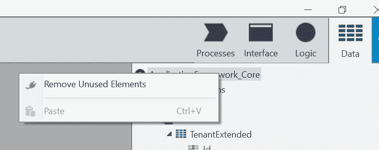

# 加速外部系统发布

> 原文：<https://itnext.io/speeding-up-outsystems-publishing-79ebec1b4ee5?source=collection_archive---------2----------------------->

安德烈·拉林在 [Unsplash](https://unsplash.com/search/photos/paper-plane?utm_source=unsplash&utm_medium=referral&utm_content=creditCopyText) 上拍摄的照片

坐在那里看一个发布完全是浪费时间。许多开发者抱怨他们的发布时间太长。花在盯着绿色旋钮上的时间是没有花在测试你最新一轮变化上的时间。好消息是，有办法让它跑得更快。

啊！让它停下！我只想做好我的工作！

# 1:隔离资源和图像

你能得到的最快、最容易的胜利之一就是好好看看你的模块，看看它们是否包含资源。资源通常是用于引导应用程序的*Excel 文件，尽管它们有时也会以其他方式使用。因为资源的内容存储在 OML 文件本身中，并且每次单击绿色大按钮时都会上传 OML，所以将这些资源文件从通常发布的模块中取出将是一个巨大的帮助。此外，每次发布时，模块都会存储在数据库中，这些资源会偷偷吃掉数据库中的大量空间。*

所有这些也适用于图像！

解决办法？为资源创建一个单独的模块，并在该模块中执行输出资源内容的操作。图像应该放在自己的模块中，并且是公共的，以便其他模块可以引用它们。这是一个非常快速、简单的变化，它将大大加快您的发布时间。您会希望将这作为引导程序代码的默认模式，并确保所有其他资源也进入该模块。如果你确定*你将不再需要它*，你也可以考虑完全移除引导程序和它的资源。

# 2:移除未使用的参考

在 Service Studio 中，您可以在右侧的树中右键单击模块名称，然后“移除未使用的元素”。定期这样做可以降低发布速度。这将使发布时的引用检查进行得更快，并且对服务器的实际编译和部署也将得到改进。这个简单的任务会让你的生活变得更好。

# 3:改善你的硬件

好吧，这里有一个不那么快也不那么容易…改善你的开发环境的硬件。我工作过的许多公司都试图通过拥有一个没有得到很好供应的开发环境来削减成本。而且很有道理！然而，开发环境确实需要资源来做好它的工作:

*   数据库应该有快速的 SSD，发布期间对数据库的更新通常是磁盘密集型的
*   部署控制器应该有快速的 SSD，因为它在部署过程中会向外部系统目录中读取/写入大量文件
*   部署控制器应该有相当数量的 RAM 来加快编译速度

# 4:将模块分割成小块

有时候模块太大了，无法快速发布。这些年来，OutSystems 编译器变得越来越聪明，但是模块越小，发布越快仍然是事实。寻找可以水平分割模块*的地方*以加速发布；换句话说，您可以发布其中的一部分，而不需要发布另一部分，因为存在依赖关系。虽然在你的结构中垂直重构*可能是有意义的，但在很多情况下，这不会节省很多发布时间，因为你将需要重新发布更多的模块来测试你的更改。*

*这些是需要进行的最常见的更改，但是系统管理员和 DBA 在发布期间捕获性能计数器的分析将能够突出所有的薄弱环节。*

*这些技巧中的前两个可以在几分钟到几个小时内完成，并且可以对您的发布时间产生很大的影响。它们还将缩短部署到其他环境所需的时间。但是，如果您没有大量资源，并且已经将未使用的引用保持在最低限度，那么硬件升级可能是您的最佳选择。*

*J.是*