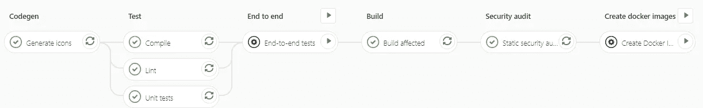

# 使用自定义 Docker 映像加快您的 CI/CD 构建时间

> 原文：<https://itnext.io/speeding-up-your-ci-cd-build-times-with-a-custom-docker-image-3bfaac4e0479?source=collection_archive---------0----------------------->


在本文中，我将解释如何大幅减少 monorepo 的 CI/CD 管道的执行时间。本文的示例适用于 Gitlab CI，但是其思想也适用于其他系统。

我们使用 Gitlab 已经有一段时间了。不幸的是，基于 NodeJS 的项目的安装/构建时间非常令人失望。关于那个问题有一个[长期未解决的问题](https://gitlab.com/gitlab-org/gitlab-runner/issues/1797)，目前还没有可用的解决方案。

对于 npm 项目，Gitlab 的[官方指南提出将 npm 缓存文件夹添加到 CI 缓存中，但是这种方式对于很多项目来说太慢了。monorepos 的情况更糟，依赖项的数量可能非常大。](https://docs.gitlab.com/ee/ci/caching/#caching-nodejs-dependencies)

问题是 Gitlab CI 提供的[缓存机制在处理 node_modules 或 npm 缓存文件夹时并不是那么快。众所周知，node_modules 文件夹是宇宙中最重的对象之一…](https://docs.gitlab.com/ee/ci/caching/)

在我的项目中，该文件夹包含大约 160K 个文件，总计大约 750MB(！).

由于这个原因，缓存系统需要花费很长时间来压缩所有文件，上传归档文件，并为每个后续管道作业检索/解包它。

# 初期状况

为了让你有个概念，下面是我的管道的样子:



以下是每项工作的分类:

*   Codegen 基于静态资产生成共享代码
*   编制
*   Lint:执行基本的代码质量检查
*   单元测试
*   端到端测试:可选/手动步骤，使用 Cypress 对 Storybook 测试页面/组件/场景
*   构建受影响的应用程序(由于依赖关系发生变化而发生变化或需要重新构建的任何内容)
*   静态安全审计:基本安全检查(依赖版本、已知漏洞等)
*   创建 Docker 映像(CD 管道的第一步)

正如你在上面的图片中看到的，一些步骤并行运行，以加快这个过程。他们争分夺秒地尝试，试图失败的建设。顺便说一句，考虑一下，我可能应该将安全审计步骤和测试一起进行:)

大多数这些步骤需要安装项目依赖项。此外，端到端测试需要 Cypress，它有自己的缓存特性。

该管道使用 Docker 映像。是这样的。gitlab-ci.yml 文件最初是这样的:

```
image: node:12.15.0-slim

stages:
  - init
  - test
  - security audit
  - build
  - ...before_script:
  - echo "Pipeline ID = $CI_PIPELINE_ID"
  - echo "Project name = $CI_PROJECT_NAME"
  - echo "Build ref = $CI_BUILD_REF_NAME"
  - pwd
  - ls -ail
  - ...
  **-** **apt-get install -y --no-install-recommends node-gyp python make g++ bash git libgtk2.0-0 libgtk-3-0 libnotify-dev libgconf-2-4 libnss3 libxss1 libasound2 libxtst6 xauth xvfb**
  - export NODE_VERSION=$(cat ./.nvmrc)
  - export NPM_VERSION=$(cat ./.npm-version)
  - export NODE_ENV=development
  - echo "Enforcing npm version = ${NPM_VERSION}"
 **- npm install --global npm@${NPM_VERSION}**
  - echo "Default environment:"
  - env
  - echo "Installing dependencies"
 **- "[ -d node_modules ] || npm ci --no-progress --quiet"**
  - date

cache:
  key: ${CI_COMMIT_SHA}
  paths: ['node_modules/']

Init:
  stage: init
  script: ['']
  cache:
    policy: push
    key: ${CI_COMMIT_SHA}
    paths: ['node_modules/']
```

正如您在上面看到的，这个管道配置在每个作业之前做了很多工作:

*   安装了很多系统级的包，比如 node-gyp(我还是讨厌你 node-gyp！)
*   已在全球范围内安装预期版本的 npm
*   安装了项目的依赖项(包括 Cypress)

此外，在整个管道的开始，一个 init 脚本将 node_modules 中的文件推送到缓存中。

注意:我想知道使用不同的缓存键，但认为它不会有多大帮助，因为大量的时间浪费在压缩/解压缩存档文件上…

# 失败的尝试

在我的调查中，我尝试了各种组合:

*   不缓存任何内容
*   仅缓存 npm 缓存
*   仅缓存 node_modules 文件夹
*   使用 Gitlab 的[作业工件](https://docs.gitlab.com/ee/ci/pipelines/job_artifacts.html)特性，而不是缓存机制
*   结合缓存机制和工件
*   …

经过这一切，我意识到在那里没有解决方案；整个管道构建时间仍然非常长(总共超过 40 分钟)。

所以我需要尝试一些别的东西。

# 使用自定义 Docker 图像

通过仔细查看 init 脚本，我意识到大部分时间都被浪费了:

*   在管道的每个作业之前，反复安装相同的系统包
*   第一次使用冷缓存安装 npm 和项目依赖项
*   第一次打包/上传 node_modules 内容
*   在后续作业中下载/解包 node_modules 内容

基于此，我决定创建一个定制的 Docker 映像，扩展官方的 NodeJS 映像来做我需要的所有事情，一劳永逸。

我对这幅图像的目标是:

*   安装一次系统包，这样每个管道作业就不必再这样做了
*   使用`NPM_CACHE_FOLDER`环境变量定义全局 npm 缓存位置
*   安装一次 npm，这样每个管道作业就不必再这样做了
*   安装一次项目依赖项，以便 npm 缓存在每个管道作业开始时处于“热”状态
*   使用环境变量`CYPRESS_CACHE_FOLDER`定义全局 [Cypress 缓存位置](https://docs.cypress.io/guides/getting-started/installing-cypress.html#Binary-cache)
*   按照 Cypress 的[缓存指南的建议，安装一次 Cypress，这样每个管道作业就不必再这样做了](https://docs.cypress.io/guides/guides/continuous-integration.html#Caching)

所以我就是这么做的。

这是我现在已经结束的 docker 文件:

```
# ---------------------------------------------------------------
# CI image
# - Used for Gitlab (see .gitlab-ci.yml)
# - MUST be updated whenever the CI installation requirements (i.e., packages/versions) change
# ---------------------------------------------------------------# ARGS are declared before any FROM so that they are globally available
# Reference: [https://github.com/docker/for-mac/issues/2155#issuecomment-372639972](https://github.com/docker/for-mac/issues/2155#issuecomment-372639972)
**ARG BASE_DOCKER_IMAGE**# ---------------------------------------------------------------
# Base image
# - Configure cache folders for npm and cypress
# - Install npm and cypress
# ---------------------------------------------------------------
**FROM ${BASE_DOCKER_IMAGE} as base**# Args
**ARG NODE_VERSION
ARG NPM_VERSION
ARG CYPRESS_VERSION**# Env
ENV NODE_VERSION="${NODE_VERSION}"
ENV NPM_VERSION="${NPM_VERSION}"
ENV NODE_ENV=developmentENV CYPRESS_VERSION="${CYPRESS_VERSION}"# good colors for most applications
ENV TERM xterm# avoid million NPM install messages
ENV npm_config_loglevel warn# allow installing when the main user is root
ENV npm_config_unsafe_perm true# avoid too many progress messages
ENV CI=1# For cypress
# disable shared memory X11 affecting Cypress v4 and Chrome
# References:
# [https://github.com/cypress-io/cypress-docker-images/blob/master/included/4.3.0/Dockerfile](https://github.com/cypress-io/cypress-docker-images/blob/master/included/4.3.0/Dockerfile)
# [https://github.com/cypress-io/cypress-docker-images/issues/270](https://github.com/cypress-io/cypress-docker-images/issues/270)
ENV QT_X11_NO_MITSHM=1
ENV _X11_NO_MITSHM=1
ENV _MITSHM=0# Define the npm cache folder
ENV NPM_CACHE_FOLDER=/root/.cache/npm# point Cypress at the /root/cache no matter what user account is used
# see [https://on.cypress.io/caching](https://on.cypress.io/caching)
ENV CYPRESS_CACHE_FOLDER=/root/.cache/CypressRUN mkdir -p ~/.gnupg && \
  echo "disable-ipv6" >> ~/.gnupg/dirmngr.conf && \
  # General packages
  apt-get update && \
  apt-get install -y --no-install-recommends bash curl gnupg dirmngr ca-certificates gnupg-agent software-properties-common apt-transport-https node-gyp python make g++ git && \
  # Cypress packages
  apt-get install -y --no-install-recommends libgtk2.0-0 libgtk-3-0 libnotify-dev libgconf-2-4 libnss3 libxss1 libasound2 libxtst6 xauth xvfb && \
  # Docker packages
  curl -fsSL [https://download.docker.com/linux/debian/gpg](https://download.docker.com/linux/debian/gpg) | apt-key add - && \
  add-apt-repository "deb [arch=amd64] [https://download.docker.com/linux/debian](https://download.docker.com/linux/debian) $(lsb_release -cs) stable" && \
  apt-get update && \
  apt-get install -y --no-install-recommends docker-ce docker-ce-cli containerd.io && \
  apt-get purge --auto-remove -y dirmngr gnupg ca-certificates && \
  rm -rf /var/lib/apt/lists/*# Install npm & Cypress
RUN npm install --global npm@${NPM_VERSION} && \
  npm install -g "cypress@${CYPRESS_VERSION}" && \
  echo "Cypress configuration:" && \
  cypress cache path && \
  cypress cache list && \
  cypress info && \
  cypress verify# Useful to inspect the image
#ENTRYPOINT ["/bin/bash"]
#CMD []# ---------------------------------------------------------------
# Prefill npm cache image
# - Installs our dependencies so that the npm cache is "hot" in the image
# - We do not keep this image! It is only used to help construct the final image
# ---------------------------------------------------------------
FROM base as npm-installRUN mkdir /temp
WORKDIR /tempRUN echo "Work dir: $(pwd)"
COPY --chown=root:root package.json package-lock*.json ./# Install npm dependencies
RUN npm ci --cache ${NPM_CACHE_FOLDER} --no-audit --no-optionalRUN echo "$(ls -ail ${NPM_CACHE_FOLDER})"# Useful to inspect the image
#ENTRYPOINT ["/bin/bash"]
#CMD []# ---------------------------------------------------------------
# Final CI image
# - Take the base image and add the npm cache to it (not the node modules of the project)
# ---------------------------------------------------------------
FROM base as ciCOPY --from=npm-install ${NPM_CACHE_FOLDER} ${NPM_CACHE_FOLDER}
RUN echo "$(ls -ail ${NPM_CACHE_FOLDER})"# Useful to inspect the image
#ENTRYPOINT ["/bin/bash"]
#CMD []
```

让我们一步一步来。

首先，图像需要定义几个参数:

*   **BASE_DOCKER_IMAGE** :要使用的基础图像；在这种情况下，它被一个特定版本的[官方基础 Node.js Docker 镜像](https://hub.docker.com/_/node/)所取代(例如 node-12.15.0-slim)
*   **NODE_VERSION** :项目使用的节点版本的引用
*   **NPM 版本**:要使用的 NPM 版本
*   **CYPRESS_VERSION** :要使用的 CYPRESS 版本

我传入这些参数的原因是为了能够根据 monorepo 依赖关系的发展，轻松地创建这个映像的新版本。你可以在这里找到更多关于 Dockerfile args [的信息。](https://docs.docker.com/engine/reference/builder/#understand-how-arg-and-from-interact)

一旦接收到这些参数，我就使用 ENV 指令将它们转换成环境变量，这样我就可以在图像中使用它们。

然后，我为 npm 和 Cypress 定义了一些其他有用的环境变量:

```
# Env
ENV NODE_VERSION="${NODE_VERSION}"
ENV NPM_VERSION="${NPM_VERSION}"
ENV NODE_ENV=developmentENV CYPRESS_VERSION="${CYPRESS_VERSION}"# good colors for most applications
ENV TERM xterm# avoid million NPM install messages
ENV npm_config_loglevel warn# allow installing when the main user is root
ENV npm_config_unsafe_perm true# avoid too many progress messages
ENV CI=1# For cypress
# disable shared memory X11 affecting Cypress v4 and Chrome
# References:
# [https://github.com/cypress-io/cypress-docker-images/blob/master/included/4.3.0/Dockerfile](https://github.com/cypress-io/cypress-docker-images/blob/master/included/4.3.0/Dockerfile)
# [https://github.com/cypress-io/cypress-docker-images/issues/270](https://github.com/cypress-io/cypress-docker-images/issues/270)
ENV QT_X11_NO_MITSHM=1
ENV _X11_NO_MITSHM=1
ENV _MITSHM=0# Define the npm cache folder
ENV NPM_CACHE_FOLDER=/root/.cache/npm# point Cypress at the /root/cache no matter what user account is used
# see [https://on.cypress.io/caching](https://on.cypress.io/caching)
ENV CYPRESS_CACHE_FOLDER=/root/.cache/Cypress
```

接下来，我安装了我需要的所有系统级包，遵循的最佳实践是避免创建太多的层，并在可能经常变化的部分之间取得平衡。

现在，我只是在一个 RUN 语句中重新组合了所有这些内容(因此所有这些内容都在一个层中结束，但是如果有帮助的话，我可以稍后再将它们分开:

```
RUN mkdir -p ~/.gnupg && \
  echo "disable-ipv6" >> ~/.gnupg/dirmngr.conf && \
  # General packages
  apt-get update && \
  apt-get install -y --no-install-recommends bash curl gnupg dirmngr ca-certificates gnupg-agent software-properties-common apt-transport-https node-gyp python make g++ git && \
  # Cypress packages
  apt-get install -y --no-install-recommends libgtk2.0-0 libgtk-3-0 libnotify-dev libgconf-2-4 libnss3 libxss1 libasound2 libxtst6 xauth xvfb && \
  # Docker packages
  curl -fsSL [https://download.docker.com/linux/debian/gpg](https://download.docker.com/linux/debian/gpg) | apt-key add - && \
  add-apt-repository "deb [arch=amd64] [https://download.docker.com/linux/debian](https://download.docker.com/linux/debian) $(lsb_release -cs) stable" && \
  apt-get update && \
  apt-get install -y --no-install-recommends docker-ce docker-ce-cli containerd.io && \
  apt-get purge --auto-remove -y dirmngr gnupg ca-certificates && \
  rm -rf /var/lib/apt/lists/*
```

一旦有了系统包，我就安装通过参数指定的 npm 和 Cypress 版本。这样，映像就包含了预期的版本:

```
# Install npm & Cypress
RUN npm install --global npm@${NPM_VERSION} && \
  npm install -g "cypress@${CYPRESS_VERSION}" && \
  echo "Cypress configuration:" && \
  cypress cache path && \
  cypress cache list && \
  cypress info && \
  cypress verify
```

以上所有内容代表了我的配置项 Dockerfile 文件的“基本”映像，如下所示:

```
**FROM ${BASE_DOCKER_IMAGE} as base**
```

“基础”是我与那个“子”图像联系在一起的名字。

我实际上定义了一个[多级 Dockerfile](https://docs.docker.com/develop/develop-images/multistage-build/) ,“基地”镜像是第一级。

在映像的下一阶段，我安装 monorepo 的依赖项。我在一个单独的阶段这样做，因为我实际上并不关心已安装的依赖项。我真正关心的是作为安装的一部分创建的 npm 缓存。

因此，在这一阶段，我添加 package.json 和 package-lock.json 文件，运行 npm ci，指定要使用的缓存文件夹位置:

```
# ---------------------------------------------------------------
# Prefill npm cache image
# - Installs our dependencies so that the npm cache is "hot" in the image
# - We do not keep this image! It is only used to help construct the final image
# ---------------------------------------------------------------
FROM base **as npm-install**RUN mkdir /temp
WORKDIR /tempRUN echo "Work dir: $(pwd)"
COPY --chown=root:root package.json package-lock*.json ./# Install npm dependencies
RUN npm ci **--cache ${NPM_CACHE_FOLDER}** --no-audit --no-optionalRUN echo "$(ls -ail ${NPM_CACHE_FOLDER})"
```

我可以做的一个改进是直接删除创建的 node_modules 文件夹，因为它没有用，只会浪费我的磁盘空间。

在映像的最后阶段(真正重要的阶段)，我简单地从“基础”阶段扩展并复制 npm 缓存文件夹的内容:

```
# ---------------------------------------------------------------
# Final CI image
# - Take the base image and add the npm cache to it (not the node modules of the project)
# ---------------------------------------------------------------
FROM base as ciCOPY --from=npm-install ${NPM_CACHE_FOLDER} ${NPM_CACHE_FOLDER}
RUN echo "$(ls -ail ${NPM_CACHE_FOLDER})"
```

# 创建和发布 Docker 图像

为了创建 Docker 映像，我使用了一个简单的 bash 脚本:

```
#!/usr/bin/env bash

# Reference: https://stackoverflow.com/questions/19331497/set-environment-variables-from-file-of-key-value-pairs
# Import env vars
set -o allexport
source ./.env
set +o allexport

echo "-----------------------------------"
echo "Create CI image                    "
echo "-----------------------------------"

# Identify the version of Cypress used by the project
export CYPRESS_VERSION="$(cat package.json | jq '.devDependencies.cypress' -r)"

echo "Building the Docker image for CI: ${CI_DOCKER_IMAGE_NAME}"

# Build arg values are passed automatically because they have the same name in the Dockerfile
# Reference: https://vsupalov.com/docker-build-pass-environment-variables/#using-host-environment-variable-values-to-set-args
docker ${DOCKER_EXTRA_OPTIONS} build \
       ${DOCKER_BUILD_EXTRA_OPTIONS} \
       --build-arg DOCKER_BASE_IMAGE \
       --build-arg NODE_VERSION \
       --build-arg NPM_VERSION \
       --build-arg CYPRESS_VERSION \
       --file Dockerfile \
       --tag ${CI_DOCKER_IMAGE_NAME}:latest \
       --tag ${CI_DOCKER_IMAGE_NAME}:${PROJECT_COMMIT_HASH} \
       --tag ${CI_DOCKER_IMAGE_NAME}:${PROJECT_VERSION} \
       .
```

如您所见，它使用 [jq](https://stedolan.github.io/jq/) 实用程序从 package.json 文件中提取要使用的 Cypress 版本，然后调用 docker build，向它传递不同的参数。

最后，图像被适当地标记。

注意，第一行加载一个包含项目所有变量的 env 文件，但这超出了本文的范围。

发布图像非常简单:

```
#!/usr/bin/env bash

source .env

echo "----------------------------------------------------"
echo "Pushing the CI Docker image to Docker Hub"
echo "----------------------------------------------------"

cat ~/.docker-hub-access-token | docker login --username ${DOCKER_USER} --password-stdin

docker push ${CI_DOCKER_IMAGE_NAME}:latest
docker push ${CI_DOCKER_IMAGE_NAME}:${PROJECT_COMMIT_HASH}
docker push ${CI_DOCKER_IMAGE_NAME}:${PROJECT_VERSION}
```

为此，您需要有一个包含 Docker hub 访问密钥的文件(或环境变量)。可以参考[这篇文章](https://ropenscilabs.github.io/r-docker-tutorial/04-Dockerhub.html)了解如何将图片发布到 Docker hub。

最初，我想在我们自己的 Docker 注册表上发布我的图像，但默认情况下，Gitlab runners 只能从 Docker hub 拉图像；这对公共使用是有意义的。

因为这个图像是公开的，所以这不是问题。

瞧，图像现在在 Docker hub 上，

# 重构的 CI/CD 管道

现在让我们回到我们的管道配置。

现在我们已经有了一个基本的 Dockerfile 文件，其中包含了我们需要的大部分内容，我们可以稍微清理一下了:

```
**image: developassion/didowi-ci:latest**

...before_script:
  - date
  - echo "Pipeline ID = $CI_PIPELINE_ID"
  - echo "Project name = $CI_PROJECT_NAME"
  - echo "Build ref = $CI_BUILD_REF_NAME"
  - whoami
  - pwd
  - ls -ail
  - echo "Default environment:"
  - env
  - date
  # FIXME track the following issue for performance improvements https://gitlab.com/gitlab-org/gitlab-runner/issues/1797
  # Current approach: install everything based on cache for each job
  - echo "Installing dependencies (if needed)"
  # The NPM_CACHE_FOLDER env variable is defined in the Didowi CI dockerfile
  - if [[ ! -d node_modules ]] || [[ -n `git diff --name-only origin/master HEAD | grep "\package-lock.json\b"` ]]; then npm ci --cache ${NPM_CACHE_FOLDER} --prefer-offline --no-audit --no-optional; fi
  - date

...
```

那么有什么变化呢？

*   我已经用自己的图像替换了 base Node.js 图像
*   我已经删除了“缓存”指令
*   我已经删除了初始化脚本
*   我已经删除了系统软件包安装
*   我已经移除了 npm 安装

我保留了 npm 包的安装，因为基本映像只包含一个预填充的 npm 缓存，但是由于缓存是热的，安装要快得多。

就是这样！

# 丰富

既然流水线使用了定制的 Docker 映像，许多繁琐/重复的任务初始化工作就简单地*消失了*。

每个作业仍然需要安装 npm 依赖项，但是由于缓存是热的(大部分时间)，安装时间非常快(大约 2 分钟)

这大大减少了管道的执行时间，在我们的例子中减少到 20 分钟。我确信事情可以进一步改善，但我已经对新的现状感到满意了。

我们在映像中缓存 Cypress 二进制文件的事实也是有益的，因为我们避免了 npm 安装期间漫长而痛苦的下载。

# 需要注意的事项

Docker 映像很好，因为一旦被缓存，Gitlab 运行者就可以立即启动它，但是它也有缺点:

只要项目依赖关系发生变化，映像中包含的 npm 缓存就会过时/不完整。在一段时间内，我们可以接受“大多数”依赖项将被缓存，只有少数需要在每个管道作业开始时下载。要解决这个问题，我们只需要考虑足够频繁地更新图像，以使缓存保持相关。

另一种需要重建/重新发布映像的情况是 monorepo 使用的节点、npm 或 Cypress 版本发生变化。这并不经常，所以这是完全可以接受的。

# 后续步骤

将来，我计划再次回到这个话题，当然希望能够从 Gitlab CI 的缓存特性的改进中受益。我认为有希望，因为多个 PRs 正在工作，但我们会看到它如何帮助。

目前，我将坚持我的解决方案..；-)

如果你对这篇文章有什么想法/意见，请随时加入进来。

今天到此为止！

PS:对于那些不知道的人，我有一份时事通讯，如果你想了解关于现代网络的新文章和很酷的东西，你可以订阅:[https://mailchi.mp/fb661753d54a/developassion-newsletter](https://mailchi.mp/fb661753d54a/developassion-newsletter)