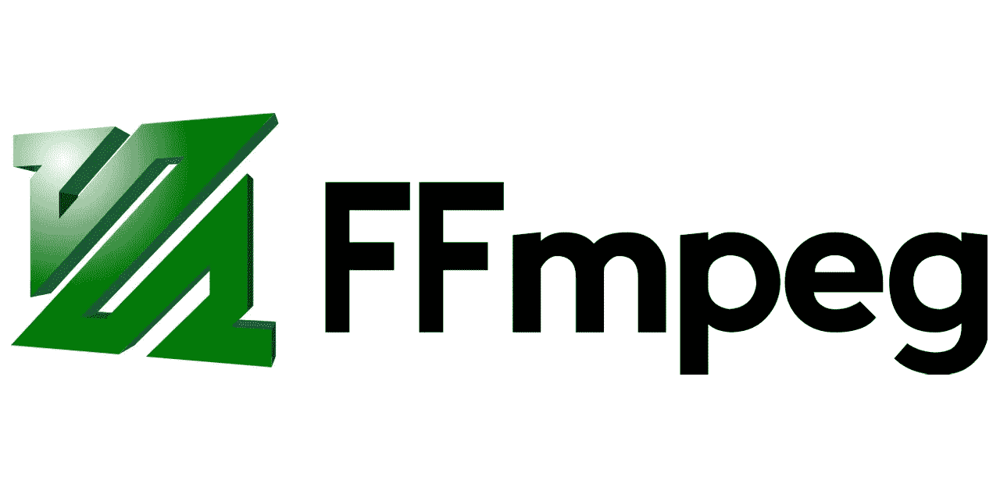
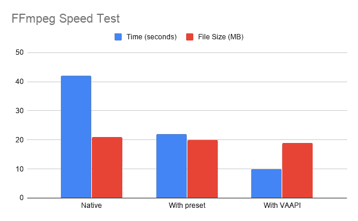

# 加速 FFmpeg，无需从源代码编译

> 原文：<https://itnext.io/speedup-ffmpeg-without-compiling-from-source-code-c1f34d4ec544?source=collection_archive---------3----------------------->



当涉及到多媒体操作时，FFmpeg 是一个很好的工具，默认情况下，它使用 CPU 和多线程来完成任务，这会给你的 PC 带来很高的负载，并且大部分时间都很慢。

如果你在谷歌上搜索如何提高 FFmpeg 的速度，你可能会发现关于使用`-preset`来降低压缩率以获得更高速度(文件大小和速度之间的权衡)的讨论，另一种有趣的方法是利用 nVidia GPU (nvenc、nvdec 和 cuvid)，但这并不容易，因为:

1.  你没有兼容的 nVidia GPU 卡
2.  需要安装 nVidia GPU 驱动和 CUDA(在 Linux 环境下很痛苦)
3.  如果找不到现成的版本，就需要从源代码编译 FFmpeg

以我自己的经验，我花了几个小时研究如何安装和编译 FFmpeg，但最终失败了，因为我的 GPU 无法支持大多数功能，这是可悲的。

那么有没有其他方法可以让 FFmpeg 更快呢？是的，你可以使用`VAAPI`在几秒钟内完成。让我们做一个实验来看看不同之处。

# 基线:不带任何选项缩放视频

假设您正在创建一个服务来提供不同质量的视频流(720p、1080p 等)。)，所以你需要把上传的视频缩小到不同的分辨率。

让我们从 [h264info](https://www.h264info.com/clips.html) 下载一个样本视频，然后不加任何选项按比例缩小:

```
$ ffmpeg -i gravity.mp4 \
    -c:v libx264 \
    -s 1024x428 \
    -b:v 1M \
    out.mp4
```

对于 21 MB 的文件大小，大约需要 42 秒(速度=3.5x)。(原始大小为 355 MB)

# 使用-preset 可加速更大的文件大小

> 查看[此处](https://trac.ffmpeg.org/wiki/Encode/H.264)了解更多关于预置的细节

使用预设，你可以很容易地加快 FFmpeg 与更大的文件大小，这是可以接受的，当你有足够的空间留在你的硬盘。

```
$ ffmpeg -i gravity.mp4 \
    -c:v libx264 \
    -preset ultrafast \
    -s 1024x428 \
    -b:v 1M \
    out.mp4
```

它需要大约 22 秒(速度=6x)，文件大小为 20 MB。(有意思，它比`-preset default`还小😎)

# 使用 VAAPI 通过集成/英特尔 GPU 卡加速

视频加速 API (VAAPI)在 FFmpeg 中不是秘密，但是很难注意到它是如何轻松地帮助你加速 FFmpeg 的。使用 VAAPI 的好处是:

1.  集成的 GPU 卡很便宜(而且你现在已经有一张了)
2.  你只需要安装`i965-va-driver`就能让它工作
3.  您不必编译 FFmpeg，因为默认情况下这个标志是启用的

要在 Ubuntu 中使用 VAAPI，首先你需要安装驱动程序并用`vainfo`命令检查状态:

```
$ sudo apt-get install i965-va-driver
$ vainfo
libva info: VA-API version 1.1.0
libva info: va_getDriverName() returns 0
libva info: Trying to open /usr/lib/x86_64-linux-gnu/dri/i965_drv_video.so
libva info: Found init function __vaDriverInit_1_1
libva info: va_openDriver() returns 0
vainfo: VA-API version: 1.1 (libva 2.1.0)
vainfo: Driver version: Intel i965 driver for Intel(R) Ivybridge Mobile - 2.1.0
vainfo: Supported profile and entrypoints
      VAProfileMPEG2Simple            : VAEntrypointVLD
      VAProfileMPEG2Simple            : VAEntrypointEncSlice
      VAProfileMPEG2Main              : VAEntrypointVLD
      VAProfileMPEG2Main              : VAEntrypointEncSlice
      VAProfileH264ConstrainedBaseline: VAEntrypointVLD
      VAProfileH264ConstrainedBaseline: VAEntrypointEncSlice
      VAProfileH264Main               : VAEntrypointVLD
      VAProfileH264Main               : VAEntrypointEncSlice
      VAProfileH264High               : VAEntrypointVLD
      VAProfileH264High               : VAEntrypointEncSlice
      VAProfileH264StereoHigh         : VAEntrypointVLD
      VAProfileVC1Simple              : VAEntrypointVLD
      VAProfileVC1Main                : VAEntrypointVLD
      VAProfileVC1Advanced            : VAEntrypointVLD
      VAProfileNone                   : VAEntrypointVideoProc
      VAProfileJPEGBaseline           : VAEntrypointVLD
```

如果您看到类似上面的输出，这意味着您的英特尔 GPU 卡支持 VAAPI，那么您可以使用以下命令进行扩展:

```
$ ffmpeg -hwaccel vaapi \
    -hwaccel_device /dev/dri/renderD129 \
    -hwaccel_output_format vaapi \
    -i gravity.mp4 \
    -vf "scale_vaapi=w=1024:h=428" \
    -c:v h264_vaapi \
    -b:v 1M \
    out.mp4
```

大约需要 10 秒钟(速度= 14.3 倍)，文件大小为 19 MB。

将它们放在一个图表中，使用 VAAPI 可以获得比本机快 4 倍的速度，并且文件大小也略小。



事实上，如果你投入时间和精力去调查 nVidia GPU 选项，你甚至可以有更多的加速，但没有太多的努力和成本的加速仍然很棒，不是吗？😄

希望你觉得这个故事有用，不要犹豫留下任何回应或掌声，谢谢！