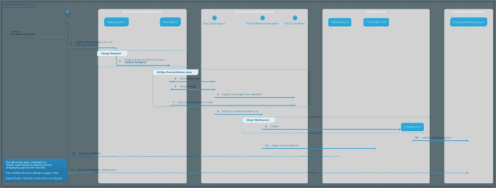

# 用玉米卷为您的基础设施增添代码的味道

> 原文：<https://itnext.io/spice-up-your-infrastructure-as-code-with-tacos-1a9c179e0783?source=collection_archive---------1----------------------->

乍得·蒙塔诺在 [Unsplash](https://unsplash.com?utm_source=medium&utm_medium=referral) 上的照片

## 墨西哥卷饼供应商评论

## 介绍

这篇文章将帮助你了解什么是玉米饼，并根据他们的能力选择供应商。sre、运营工程师或架构师会发现这些内容非常有用。

> *如果你是一个热情的厨师，或者想知道你的烹饪技能如何帮助你编写代码，你会失望的。*

## 基础设施作为代码

IaC 是一种常见的模式，虚拟化基础设施和辅助服务可以使用几乎任何语言表达的配置来管理，通常托管在源代码库中。

IaC 支持自动、可重复且可靠地创建和维护任何虚拟化基础架构。这对于按需创建环境以及管理多个提供商的基础设施尤为重要。

## 地形基础

Hashicorp 的 [Terraform](https://www.terraform.io/) 和围绕它构建的开源生态系统如今是基础设施的事实上的标准，代码为 IaC。独立的 terraform 工作流很棒，但在大规模使用时会很快变得难以管理。

> *如果你想了解一个替代的云原生的，Kubernetes powered 的工具，以数据的形式走向基础设施，请查看我最近的博客***关于* [*交叉平面*](https://crossplane.io/) *。**

*标准 terraform 工作流的典型简单实施包括:*

*   *利用 terraform runner 或独立容器将 Terraform CLI 集成到 CI/CD 管道中*
*   *配置 terraform 远程后端以存储状态，从而实现不同团队之间的协作*
*   *如果启用了并发运行，则需要锁定状态文件，以避免在单一环境中运行时被覆盖*

*上述步骤对于标准地形工具来说是可行的，但是在此过程中也需要应对一些挑战:*

*   *与常见的开发最佳实践相集成，如代码审查、通过合并请求进行更新、处理功能分支*
*   *RBAC；随着解决方案的成熟，不同的角色可以在不同的环境中执行不同的任务，例如仅应用、删除等*
*   *审核历史记录—谁运行了什么，结果是什么，恢复到以前状态的能力*
*   *基础设施治理和政策，例如使用 OPA 或 Kyverno*
*   *为开发/QA 团队提供高效的自助服务，如创建和销毁测试环境*

*以正确的方式大规模实施 IaC 非常困难！如果在本地或混合环境中完成，这将更加困难。这样做意味着投入大量时间和资源来设计、开发和维护解决方案。*

## *该吃玉米卷了*

**

*TACOS 代表*

*自动化公司和 T4 公司的软件*

*它为解决大规模操作 IaC 的问题提供了一个框架。*

# *使用玉米卷的好处*

## *云工作空间*

*通常，SaaS 产品通过集成以下内容来提供统一的抽象层:*

*   *terraform 运行时环境、状态、历史、秘密和变量管理，*
*   *RBAC —精细分级的权限*
*   *由 Terraform 管理的特定环境的策略管理。*

## *远程操作模式*

*一个好处来自于运行时关注点的远程操作模式。值得注意的是，任何提供云工作区的供应商通常也提供在您的环境(本地或云)中设置运行程序的能力，因此只有运行时和 UI 部分在云上。可以在防火墙后安全地管理实际部署和配置/数据。*

## *远程状态管理*

*另一个好处是能够管理由不同版本的 terraform 创建的不同环境*

*远程状态管理是可选的。我们可以将远程状态存储在云提供商(如 S3 存储区或本地存储区)中，并且只使用云工作区。*

## *RBAC*

*基于角色的访问控制，针对谁可以在项目或组级别计划和应用 terraform 运行。能够在工作区级别管理访问。*

## *可观察性*

*玉米饼提供了更好的可视性，让人们了解在整个生命周期中，地球环境所发生的变化。搜索多条管道以查看添加、修改、删除了哪些资源变得更加容易。在 TACOS 中可以很容易地访问这些信息，还可以看到谁或什么触发了该操作的信息。我们还可以看到地形图的历史。*

## *作为代码的策略*

*TACOS 还可以利用策略代码来改善治理和安全性。TACOS 可以利用像 Open Policy Agent 这样的工具，通过阻止不符合 terraform 代码的合并请求到主分支来工作。这些策略可以在 Kubernetes 集群策略之间重用。*

## *推荐玉米饼流程*

*下图显示了根据 GitOps 原则推荐的 TACOS 流程。*

**

*点击/收缩以缩放*

*值得指出的是，除了通过 Web UI 直接与 TACOS 提供者通信，还可以使用 CLI 或 REST API webhooks。*

*该图仅捕获了基础设施供应部分。一旦虚拟机或其他基础架构准备就绪，就可以开始工作负载部署。应用程序部署可以由 TACOS 提供触发，但它应该是一个单独的管道。*

## *安全考虑*

*大多数墨西哥卷饼供应商都提供了一个自我托管的选项，让墨西哥卷饼经营者在防火墙后面。存储用于管道触发、SSH 凭证等的变量和秘密可以在自托管的保管库或 TACOs 提供商保管库中完成。*

# *玉米卷供应商概述*

## *特拉格朗特*

*Terragrunt 不是玉米卷，但它可能是我们试图搜索 terraform 自动化时发现的第一个开源东西。这是另一个在 plain terraform 上添加测试层的二进制文件。Terragrunt 的主要目标是保持 terraform 代码干燥。不仅在我看来，它是一个相关的工具，而 terraform 本身还不够成熟。Terraform 模块的良好使用以及良好的基础设施设置结构和配置正在解决这些问题。*

## *亚特兰蒂斯*

*[Atlantis](https://www.runatlantis.io/) 也不是一个完整的 TACOS，但它是第一个尝试将 terraform 自动化添加到 PRs 的开源工具。可将 PRs 的 Webhooks 与 Terraform 代码更改配置为与 Atlantis 二进制文件(必须托管在基础架构中)通信，terraform 计划和最终应用可在 Atlantis 二进制文件中运行。它将输出反馈给 PR 以获得可见性，并且该流程还可以配置为仅合并具有成功 terraform 计划的 PR。*

*这一功能目前在所有的墨西哥卷饼中都有(通过 VCS 流程)。有趣的事实是，设计亚特兰蒂斯的开发者目前在哈希公司工作。*

## *Terraform 云 TFC/Terraform 企业 TFE*

*来自 T [erraform](https://www.hashicorp.com/products/terraform) 原始发明者——hashi corp 的提议。它们都可以提供相同的功能，主要区别在于托管模式。TFE 是一个私有安装，其中 TFC 是一个典型的多租户 SaaS 产品。它涵盖了本文开头提到的所有领域。我将使用它作为参考解决方案，并提及其他产品的不同之处。*

*这里还有一个有用的概念是[通知](https://www.terraform.io/docs/cloud/workspaces/notifications.html)，它可以在工作区发生各种事件后触发 webhooks、发送电子邮件或通知 slack channel。*

## *Scalr*

*Scalr 拥有与 TFC/TFE 非常相似的产品，包括所有主要功能。他们公开宣传自己是 TFC/TFE 的替代品，但价格公平。他们还提供多租户 SaaS 和自我管理的解决方案。*

*Scalr 有一个[定制钩子](https://docs.scalr.com/en/latest/workspaces.html#custom-hooks)的概念，可以增强 terraform 工作流。它可以在 terraform 计划或应用之前或之后分别运行其他 terraform 命令(如 fmt)、shell 脚本和 API 调用。*

*Scalr 还有经典的 [webhooks](https://docs.scalr.com/en/latest/webhooks.html) ，可以在各种事件后触发。配置在 webhooks 和端点之间进行内部分割。它还集成了 Zapier。*

*Scalr 有 RBAC 层和继承的概念(也用于凭证等)。).它可以作为产品和非产品或项目之间的区别。云凭证可以在顶层定义，然后向下传播到特定的工作区。授权配置也是如此。*

*我们可以使用工作区[状态共享](https://docs.scalr.com/en/latest/state_sharing.html)在“平台”和“项目范围”环境之间共享信息。这更多是 Terraform 本身的问题，Scalr 正在帮助实现可访问性。*

*在我看来，Scalr 有一个更好的 UI，有更多关于 Terraform 运行的信息。例如，一个视图，每个资源类型有几个添加、更改、删除的资源，并带有深入查看详细信息的选项。当试图在一个很长的列表中查看某个特定的东西时，请将它与普通的 terraform 平面图输出进行比较。*

## *Env0*

*Env0 有墨西哥卷饼的功能，但它与 TFC 或 Scalr 有很大不同。它更接近于一个通用的 CI/CD 系统，因为他们非常关注[定制流](https://docs.env0.com/docs/custom-flows)，其中任何类型的脚本、ansible 等等。可以添加到 Terraform 工作流中(应用前和应用后等。).他们支持 terraform 和 Terragrunt(我觉得已经不重要了)模板。*

*它可以进行自动[漂移检测](https://docs.env0.com/docs/drift-detection)，在外部进程或用户从 Terraform 外部更改云环境后，Env0 可以发出通知或采取措施。*

*Env0 有一个有趣的成本管理概念。它可以监控实际成本并将其与 terraform 部署相关联，还可以为团队和用户设置支出限制。*

*它还可以与 TTL 的整个环境，并自动删除它们。[策略 TTL](https://docs.env0.com/docs/policy-ttl) 有助于功能环境的设置。*

*除了上面提到的有趣的功能，我还有很多其他的问题。它不提供对状态文件的访问，它们是在幕后被管理的。我也没有找到任何与 Terraform CLI 集成的选项，所以它似乎不支持经典的远程运行，如 TFC 或 Scalr。文档没有提供足够的细节。*

## *太空升降机*

*[Spacelift](https://spacelift.io/) 和 Env0 一样有 TACOS 功能，但也和 TFC 或 Scalr 有很大不同，但和 Env0 不同。它也在某种程度上更接近于通用的 CI/CD 系统，并且它可能是最可定制的 TACOS。除了 terraform，它还支持 Pulumi，并计划支持 CloudFormation、Ansible 和 ARM 模板。它希望提供一个包装器和类似的用户体验，而不管选择的“后端”技术。*

*关于定制，它还提供了[定制工作流](https://docs.spacelift.io/concepts/stack/stack-settings#customizing-workflow)，可以在 terraform 计划、销毁等之前和之后添加 shell 脚本。但是它也支持定制的 runner 图像，实际上任何东西都可以添加到 Docker 图像中。此外，可以将任意文件装载到运行容器中。但这些文件必须先上传到 Spacelift。*

*它可以进行自动[漂移检测](https://docs.spacelift.io/concepts/stack/drift-detection)，其中 Spacelift 可以在一些外部过程或用户从 Terraform 外部改变云环境后通知或采取行动。*

*除了在云工作区(在 Spacelift 中称为堆栈)之间共享远程状态的经典方法之外，它还允许共享[内部环境](https://docs.spacelift.io/concepts/configuration/context#introduction)这看起来是一种更好的方法，但需要更多的研究。*

*看来 Spacelift 也在推进一个私有的模块注册，并为带有[测试](https://docs.spacelift.io/vendors/terraform/module-registry#tests)的模块提供类似的 CI/CD。*

*Spacelift 还拥有最具可定制性的选项来配合 [OPA 政策](https://www.youtube.com/watch?v=GWWybopkyko&t=2s)*

## *玉米卷供应商比较矩阵*

*下表提供了各种 IaC 功能以及给定提供者对这些功能的支持的高级概述。*

## *额外资源*

*   *[不同玉米卷供应商的比较](https://www.youtube.com/watch?v=4MLBpBqZmpM&ab_channel=CloudPosse)*
*   *[Reddit 上有一个关于墨西哥玉米卷的讨论](https://www.reddit.com/r/terraform/comments/lkylzk/scalr_vs_spacelift_vs_atlantis_vs_env0_bake_off/)*

# *结论*

*TACOS 将常见的平台级任务具体化。复杂的生产级 terraform 代码库通常需要 TACOS 支持。在全力投入 Terraform 之前，请考虑上述要求以及您的组织将如何支持它们。*

*特别感谢 [Oldrich Vykydal](https://www.linkedin.com/in/oldrich-vykydal/) 帮助整理这篇文章。*