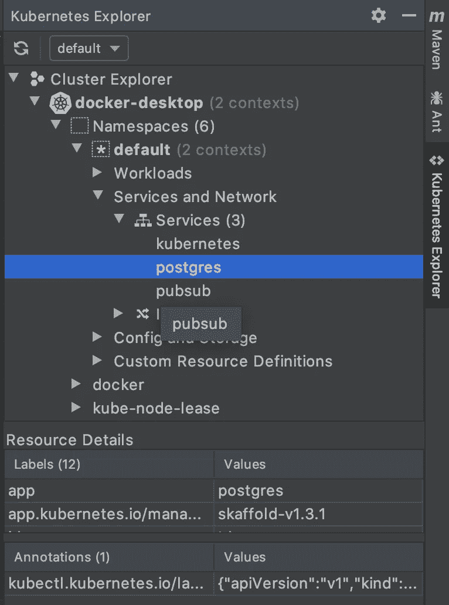
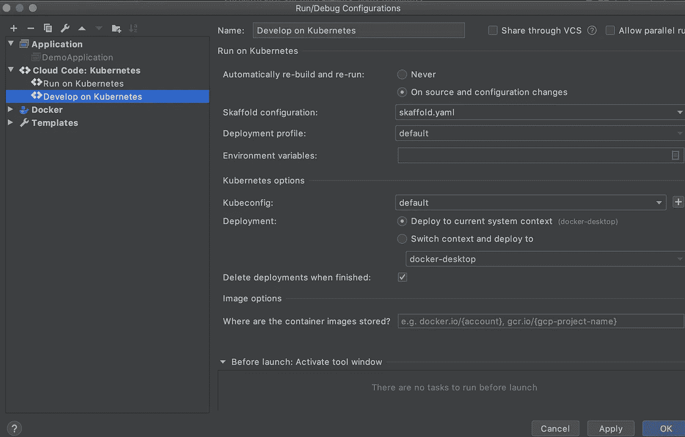

# 在 Kubernetes 为懒惰的开发人员(像我一样)Spring Boot 开发

> 原文：<https://itnext.io/spring-boot-development-in-kubernetes-for-lazy-developers-like-me-bb6e7b08f13f?source=collection_archive---------1----------------------->

我离开 Spring Boot 社区有一段时间了，所以我决定查看一些样本，看看有什么新的东西，以下是我的发现。


照片由 [Unsplash](https://unsplash.com?utm_source=medium&utm_medium=referral) 上的 [Ihor Dvoretskyi](https://unsplash.com/@ihor_dvoretskyi?utm_source=medium&utm_medium=referral) 拍摄

当我使用 [Spring Initializr](https://start.spring.io/) 创建我的项目时，我想尝试一些我以前从未使用过 Spring Boot 的集成，比如 [Google PubSub](https://spring.io/guides/gs/messaging-gcp-pubsub/) 或 [Flyway](https://flywaydb.org/documentation/plugins/springboot) 。我还添加了 Postgres 和 [Jooq](https://www.jooq.org/) 作为依赖项。

所以总的来说，我有两个依赖项:PubSub 和 Postgres，这意味着我需要在本地运行它们来测试集成。

# 公共订阅

我知道在本地运行 PubSub 的三个选项:

*   运行 [gcloud PubSub 仿真器](https://cloud.google.com/pubsub/docs/emulator)。然后手动创建您需要的所有主题和订阅

```
gcloud components install pubsub-emulator
...
gcloud beta emulators pubsub start --project=PUBSUB_PROJECT_ID
```

*   运行一个[容器化的 PubSub 模拟器](https://github.com/marcelcorso/gcloud-pubsub-emulator)。您可以将主题和订阅作为环境变量传递，它们将在容器启动时创建。

```
docker run --rm -ti -p 8681:8681 messagebird/gcloud-pubsub-emulator:latest
```

*   在 Kubernetes 中运行 [PubSub 仿真器。它使用容器化的 PubSub 模拟器，并被包装在一个 Kubernetes 服务中，这样更容易使用。](https://github.com/arielsegura/spring-boot-skaffold-example/tree/master/kubernetes/pubsub)

```
apiVersion: apps/v1
kind: Deployment
metadata:
  name: pubsub
  labels:
    app: pubsub
spec:
  replicas: 1
  selector:
    matchLabels:
      app: pubsub
  template:
    metadata:
      labels:
        app: pubsub
    spec:
      containers:
        - name: pubsub
          image: messagebird/gcloud-pubsub-emulator:latest
          env:
          - name: PUBSUB_PROJECT1
            value: "PROJECTID,TOPIC1:SUBSCRIPTION1,TOPIC2:SUBSCRIPTION2"
          ports:
            - containerPort: 8681
```

服务是这样的:

```
apiVersion: v1
kind: Service
metadata:
  name: pubsub
  labels:
    app: pubsub
spec:
  externalName: pubsub
  type: NodePort
  ports:
    - name: pubsub
      port: 8681
      nodePort: 30100
  selector:
    app: pubsub
```

# Postgres

我会提到**至少**在本地运行 PubSub 的三个选项:

*   老派:安装 Postgres——谷歌怎么做，有一个安装程序。
*   运行一个[容器化的 Postgres 实例](https://hub.docker.com/_/postgres):

```
docker run --name some-postgres -e POSTGRES_PASSWORD=mysecretpassword -d postgres
```

*   在 Kubernetes 中运行[Postgres](https://github.com/arielsegura/spring-boot-skaffold-example/tree/master/kubernetes/postgres):这个稍微复杂一点，因为我不想让我的数据库在重启 pod 时丢失所有数据，对吗？这就是为什么我需要定义一个卷和存储。

# 为什么是 Kubernetes？

在 N 个终端中运行 N 个不同的容器及其 IP 和端口，并确保它们都指向正确的地址和端口，这实在是太痛苦了。**这就是为什么我决定选择 Kubernetes** 而不是 Docker:当你在 Kubernetes 中部署时，你可以访问内置的 DNS 服务或环境变量，包括你部署的所有服务的地址和端口。

# 斯卡福德

现在我有了 Kubernetes 中的所有服务，我很懒，我不想一直应用多个 Kubernetes 文件，并确保我清理了环境(删除部署，等等)。)等我做完了。

我不知道我是怎么找到 [Skaffold](https://skaffold.dev/) 的，这是一个非常棒的工具，由谷歌开发，实际上为我解决了这个问题。它是如何工作的？

有两种使用情形:

1)使用热重载在 Kubernetes 中本地开发您的服务:您做出一个更改，Skaffold 将在您的集群中应用相应的更改

2)在 prod 中部署您的更改:在这种情况下，Skaffold 作为管道工作，您可以在远程集群中部署您的更改

我将重点放在第一个用例上，因为我没有任何东西可以在生产中部署😅

# 又一个使用 YAML 的 DSL

我认为 Skaffold 使用 YAML 进行配置是有道理的，因为 Kubernetes 中的大多数配置文件也是基于 YAML 的。

斯卡福德配置看起来是这样的:

```
apiVersion: skaffold/v2alpha3
kind: Config
deploy:
  kubectl:
    manifests:
      - kubernetes/postgres/**
      - kubernetes/pubsub/**
```

Skaffold 要做的是应用这两个目录中的所有 Kubernetes 文件。为此，您需要在终端`skaffold dev`中运行，当您取消该进程时，所有资源都将被删除。

# Skaffold 对 IntelliJ 的支持

现在是时候一键搞定了！有一个名为 [*云代码*](https://plugins.jetbrains.com/plugin/8079-cloud-code) 的 IntelliJ 插件，它允许你 1)管理你的 Kubernetes 资源和 2)从 Skaffold 文件运行你的 Kubernetes 配置。



IntelliJ 上的 Kubernetes 资源浏览器



IntelliJ 上的 Skaffold 运行配置

一旦您创建了 IntelliJ Cloud Code Kubernetes 配置，当您运行它时，您将会看到如下内容:

```
Listing files to watch...
Generating tags...
Checking cache...
Tags used in deployment:
Starting deploy...
 - serviceaccount/admin-user created
 - configmap/postgres-config created
 - deployment.extensions/postgres created
 - service/postgres created
 - persistentvolume/postgres-pv-volume created
 - persistentvolumeclaim/postgres-pv-claim created
 - deployment.apps/pubsub created
 - service/pubsub created
Port forwarding service/postgres in namespace default, remote port 5432 -> address 127.0.0.1 port 5432
Port forwarding service/pubsub in namespace default, remote port 8681 -> address 127.0.0.1 port 8681
```

如果你改变了一些东西，比如数据库名称、发布主题、端口等等。只需使用 redeploy 按钮用 IntelliJ 重新部署，您将看到所有应用的更改。完成后，停止运行，斯卡福德将为您清理所有 Kubernetes 资源:

```
Watching for changes...
Cleaning up...
 - serviceaccount "admin-user" deleted
 - configmap "postgres-config" deleted
 - deployment.extensions "postgres" deleted
 - service "postgres" deleted
 - persistentvolume "postgres-pv-volume" deleted
 - persistentvolumeclaim "postgres-pv-claim" deleted
 - deployment.apps "pubsub" deleted
 - service "pubsub" deleted
```

# 利用你在 Spring Boot 的 Kubernetes 资源

这就是一切如何开始，试图在 Spring Boot 使用 PubSub 和 Flyway！所以让我们继续。

正如我之前说过的，Kubernetes 中已经有一个内置的 DNS，所以为了在 Kubernetes 中部署，这个 Spring Boot 属性文件就足够了:

```
# https://kubernetes.io/docs/concepts/services-networking/connect-applications-service/#environment-variables
# DNS doesn't work for pubsub service for some reason
spring.cloud.gcp.pubsub.emulatorHost: ${PUBSUB_SERVICE_HOST}:${PUBSUB_SERVICE_PORT}
spring.cloud.gcp.pubsub.projectId: PROJECTID
spring.datasource.url: jdbc:postgresql://postgres/postgresdb
spring.datasource.username: postgresadmin
spring.datasource.password: admin123
spring.datasource.driverClassName: org.postgresql.Driver
```

如果您想在本地调试某些东西，那么您需要指向您在 Kubernetes 服务中使用的端口:

```
spring.cloud.gcp.pubsub.emulatorHost: localhost:30100
spring.cloud.gcp.pubsub.projectId: PROJECTID
spring.datasource.url: jdbc:postgresql://localhost:30000/postgresdb
spring.datasource.username: postgresadmin
spring.datasource.password: admin123
spring.datasource.driverClassName: org.postgresql.Driver
```

回到[示例](https://github.com/arielsegura/spring-boot-skaffold-example/blob/master/src/main/java/com/example/demo/DemoController.java)，通过运行 Spring Boot 应用程序，您可以在日志中看到如下内容:

```
2020-03-20 13:03:17.291  INFO 58272 --- [  restartedMain] o.f.c.internal.license.VersionPrinter    : Flyway Community Edition 6.0.8 by Redgate
2020-03-20 13:03:17.427  INFO 58272 --- [  restartedMain] o.f.c.internal.database.DatabaseFactory  : Database: jdbc:postgresql://localhost:30000/postgresdb (PostgreSQL 12.2)
2020-03-20 13:03:17.468  INFO 58272 --- [  restartedMain] o.f.core.internal.command.DbValidate     : Successfully validated 2 migrations (execution time 00:00.022s)
```

也就是说弗莱威被处决了。在示例中，我们可以调用 REST 端点来尝试应用程序:

```
curl localhost:8080/hello
```

没有响应正文，但是在日志中您可以看到类似这样的内容:

```
com.example.demo.DemoService: User id 1 username ariel com.example.demo.DemoService: User id 2 username alejandro com.example.demo.DemoService: Success! 
com.example.demo.DemoService: Success! 
com.example.demo.DemoService: 1-ariel
```

在迁移脚本中，我插入了一些行。然后在 DemoService 中，我查询该表，对于每一行，我在日志中打印它并发布一条 PubSub 消息(因此有两条成功消息)，最后，我读取 PubSub 订阅中的下一条消息。

# 结论

在这篇短文中，我展示了 Spring Boot、Google PubSub、Flyway 和 Kubernetes 使用 Skaffold 管理部署的实验。

希望你觉得有用🤩
别忘了鼓掌！👏

*有用链接:*

[](https://github.com/GoogleContainerTools/jib/tree/master/examples/spring-boot) [## 谷歌集装箱工具/三角帆

### 这是一个如何使用 Jib 为 Spring Boot 应用程序轻松构建 Docker 映像的例子。你可以集装箱化…

github.com](https://github.com/GoogleContainerTools/jib/tree/master/examples/spring-boot) [](https://github.com/GoogleContainerTools/skaffold/tree/master/examples/jib) [## GoogleContainerTools/skaffold

### Jib 是斯卡福德受支持的建筑商之一。它为您的 Java 应用程序构建 Docker 和 OCI 映像，并且…

github.com](https://github.com/GoogleContainerTools/skaffold/tree/master/examples/jib) [](https://medium.com/faun/skaffold-jib-for-running-java-applications-on-kubernetes-83e6896feede) [## Skaffold & Jib 用于在 Kubernetes 上运行 Java 应用程序

### 几天前，Skaffold 宣布从测试版升级到正式版，现在是时候尝试一下了…

medium.com](https://medium.com/faun/skaffold-jib-for-running-java-applications-on-kubernetes-83e6896feede)