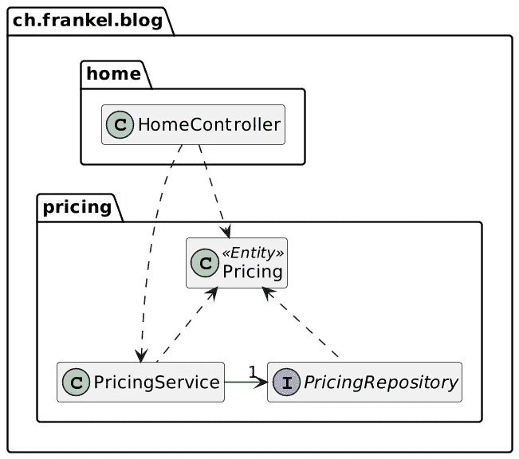
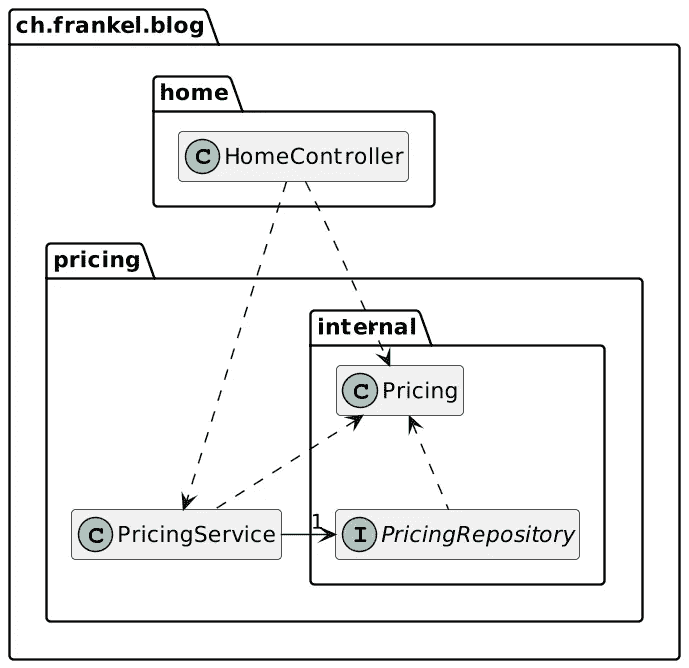
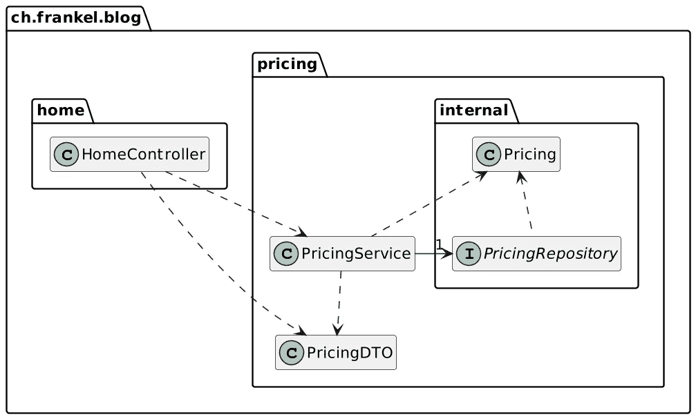

# Spring Modulith:我们已经达到模块化成熟度了吗？

> 原文：<https://itnext.io/spring-modulith-modularity-maturity-118eca138533?source=collection_archive---------2----------------------->


设计微服务的一个主要原因是它们强化了[强模块边界](https://martinfowler.com/articles/microservice-trade-offs.html#boundaries)。然而，微服务的缺点是巨大的，就像砍掉你的右手来学习用左手写字一样；还有更易管理的(也更少痛苦！)达到同样结果的方法。

甚至从微服务热潮开始，就有一些比较冷静的头脑占了上风。特别是，Spring 框架的开发人员奥利弗·德罗特博姆(Oliver Drotbohm)长期以来一直是替代方案[的支持者。这个想法是保持一个整体，但围绕模块进行设计。](https://github.com/moduliths/moduliths)

许多人涌向微服务，因为他们工作的应用程序就像意大利面条拼盘。如果他们的应用程序设计得更好，微服务的吸引力就不会这么强。

# 为什么模块化？

模块化是减少变更对代码库影响的一种方式。这非常类似于一个人如何设计(大)船。

当水不断渗入船内时，由于阿基米德推力的减小，船一般会下沉。为了避免一个漏洞使船沉没，它被设计成围绕多个水密的隔间。如果发生一次泄漏，它会被限制在一个单独的隔间里。虽然它并不理想，但它可以防止船下沉，让它改道到最近的港口进行修理。

模块化的工作方式类似:它为代码的各个部分划定界限。这样，变化的影响就被限制在零件内部，不会扩散到边界之外。

在 Java 中，这样的部分被称为包。与船舶的相似之处就到此为止，因为软件包必须一起工作才能达到预期的结果。包装不可能“滴水不漏”。Java 语言提供了跨包边界工作的可见性修饰符。有趣的是，最著名的一个`public`，完全允许跨包。

设计遵循最小特权原则的边界是一项持续的工作。有可能在项目初始开发的压力下，或者在维护过程中，随着时间的推移，努力将会失败，界限将会消失。

我们需要一种更先进的方法来加强边界。

# 模块，到处都是模块

在 Java 的漫长历史中，“模块”一直是一种加强边界的解决方案。事实是，即使在今天，模块也有许多定义。

OSGI 始于 2000 年，旨在提供可以在运行时安全部署和取消部署的版本化组件。它保留了 JAR 部署单元，但在其清单中添加了元数据。OSGi 是强大的，但是开发一个 OSGi *包*(一个模块的名字)是复杂的。开发者付出了更高的开发成本，而运营团队却享受到了部署的好处。DevOps 还没有出生；这并没有让 OSGi 像它本来应该的那样受欢迎。

与此同时，Java 的架构师们也在寻找模块化 JDK 的方法。与 OSGI 相比，这种方法要简单得多，因为它避免了部署和版本问题。Java 9 中引入的 Java 模块将自己限制为以下数据:名称、公共 API 和对其他模块的依赖。

Java 模块在 JDK 上工作得很好，但在应用程序上就不那么好了，因为这是一个先有鸡还是先有蛋的问题。为了对应用程序有所帮助，开发人员必须模块化库——不依赖于自动模块。但是只有当足够多的应用程序开发人员使用它时，库开发人员才会这样做。[上次我查了一下](https://blog.frankel.ch/update-state-java-modularization/)，20 个 commons 库中只有一半是模块化的。

在构建方面，我需要引用 Maven 模块。它们允许将一个人的代码分成多个项目。

JVM 上还有其他模块系统，但这三个是最著名的。

# 实施边界的尝试性方法

如上所述，微服务在开发和部署过程中提供了最终的边界。它们在大多数情况下都是过度的。另一方面，不可否认的是，随着时间的推移，项目会腐烂。即使是制作最精美、重视模块化的，如果不经常打理，也注定会变得一团糟。

我们需要规则来加强边界，并且需要像测试一样对待它们:当测试失败时，必须修复它们。同样，当一个人打破了规则，他必须修复它。ArchUnit 是一个创建和执行规则的工具。一个人配置规则并作为测试来验证它们。不幸的是，这种配置非常耗时，并且必须不断维护才能提供价值。下面是一个遵循六角形架构原则的[示例应用程序](https://github.com/thombergs/buckpal)的片段:

```
HexagonalArchitecture.boundedContext("io.reflectoring.buckpal.account")
                     .withDomainLayer("domain")
                     .withAdaptersLayer("adapter")
                     .incoming("in.web")
                     .outgoing("out.persistence")
                     .and()
                         .withApplicationLayer("application")
                         .services("service")
                         .incomingPorts("port.in")
                         .outgoingPorts("port.out")
                     .and()
                         .withConfiguration("configuration")
                         .check(new ClassFileImporter()
                         .importPackages("io.reflectoring.buckpal.."));
```

注意，`HexagonalArchitecture`类是在 ArchUnit API 上定制的 DSL 外观。

总的来说，ArchUnit 总比什么都没有好，但也不尽然。它的主要好处是通过测试实现自动化。如果能够自动推断出体系结构规则，将会有很大的改进。这就是 Spring Modulith 项目背后的想法。

# 弹簧模量

Spring Modulith 是 Oliver Drotbohm 的 [Moduliths 项目](https://github.com/moduliths/moduliths)(后面有一个 S)的继承者。它同时使用 ArchUnit 和[j 分子](https://github.com/xmolecules/jmolecules)。在写这篇文章的时候，它还处于实验阶段。

弹簧模数允许:

*   记录项目包之间的关系
*   限制某些关系
*   在测试期间测试限制

它要求一个人的应用程序使用 Spring 框架:它利用后者对前者的理解，后者是通过 DI 组装获得的。

默认情况下，Modulith 模块是一个与带`SpringBootApplication`注释的类位于同一层的包。

```
|_ ch.frankel.blog
    |_ DummyApplication       // 1
        |_ packagex           // 2
        |  |_ subpackagex     // 3
        |_ packagey           // 2
        |_ packagez           // 2
          |_ subpackagez      // 3
```

1.  应用程序类别
2.  模数
3.  不是一个模块

默认情况下，一个模块可以访问任何其他模块的内容，但不能访问

Spring Modulith 提供基于 PlantUML 生成基于文本的图，使用 UML 或者 [C4](https://c4model.com/) (默认)皮肤。这一代人非常容易:

```
var modules = ApplicationModules.of(DummyApplication.class);
new Documenter(modules).writeModulesAsPlantUml();
```

如果一个模块访问一个常规包，要中断构建，在测试中调用`verify()`方法。

```
var modules = ApplicationModules.of(DummyApplication.class).verify();
```

# 可以玩的样品

我已经创建了一个[示例应用程序](https://github.com/ajavageek/spring-modulith-sample)来玩:它模拟了一个在线商店的主页。主页由服务器端的百里香生成，显示目录项目和新闻提要。后者也可以通过 HTTP API 进行客户端调用(我懒得编码)。商品显示有价格，因此需要定价服务。

每个特性——页面、目录、新闻提要和定价——都位于一个包中，该包被视为一个 Spring 模块。Spring Modulith 的记录功能会生成以下内容:


让我们来看看定价功能的设计:



当前的设计有两个问题:

*   在模块外部可以访问`PricingRepository`
*   `PricingService`泄露`Pricing` JPA 实体

我们将通过封装不应该暴露的类型来修复设计。我们将`Pricing`和`PricingRepository`类型移动到`pricing`模块的`internal`子文件夹中:



如果我们调用`verify()`方法，它会抛出并中断构建，因为从`pricing`模块外部无法访问`Pricing`:

```
Module 'home' depends on non-exposed type ch.frankel.blog.pricing.internal.Pricing within module 'pricing'!
```

让我们通过以下更改来解决违规问题:



# 结论

通过摆弄一个示例应用程序，我确实喜欢 Spring Modulith。

我可以看到两个突出的用例:记录现有的应用程序和保持设计“干净”。后者避免了应用程序随着时间的推移而“腐烂”的影响。这样，我们可以保持设计的意图，避免意大利面条的效果。

锦上添花:当我们需要[砍掉一个](https://blog.frankel.ch/chopping-monolith/) [或者更多的特性](https://blog.frankel.ch/chopping-monolith-demo/)到他们的部署单位时，这是很棒的。这将是一个非常直截了当的举措，无需浪费时间来解决依赖性。Spring Modulith 提供了一个巨大的好处:**将每一个有影响力的架构决策推迟到最后一刻**。

感谢 [Oliver Drotbohm](https://twitter.com/odrotbohm) 的点评。

你可以在 [GitHub](https://github.com/ajavageek/spring-modulith-sample) 上找到源代码。

**更进一步:**

*   [介绍弹簧模数](https://spring.io/blog/2022/10/21/introducing-spring-modulith)
*   [快速启动](https://spring.io/projects/spring-modulith)
*   [参考文件](https://docs.spring.io/spring-modulith/docs/0.1.0-M1/reference/html/)

*原载于* [*一个 Java 怪胎*](https://blog.frankel.ch/spring-modulith-modularity-maturity/)*2022 年 11 月 13 日*