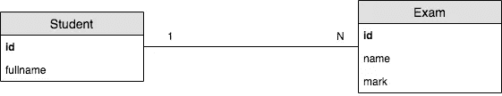
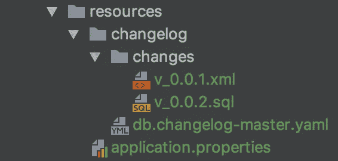
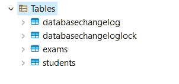
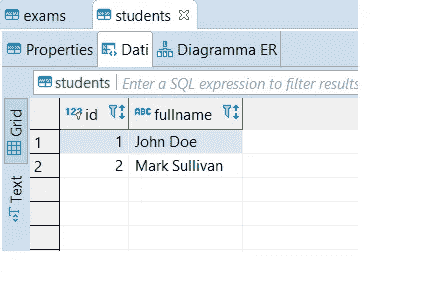
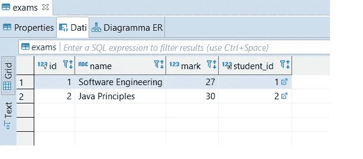

# SpringBoot，Liquibase 和 MariaDB

> 原文：<https://itnext.io/springboot-liquibase-and-mariadb-b3f943c29370?source=collection_archive---------3----------------------->

## 用 SpringBoot 中的 Liquibase 管理 MariaDB 数据库


[活动发起人](https://unsplash.com/@campaign_creators?utm_source=medium&utm_medium=referral)在 [Unsplash](https://unsplash.com?utm_source=medium&utm_medium=referral) 上的照片

在这个故事中，我们将在 Liquibase 的帮助下开发一个管理 MariaDB 实例的 SpringBoot 应用程序。

假设下面的简单用例。



我们想要建模两个实体:*学生*和*考试*。每个学生可以参加一个或多个有相应分数的考试。

*请注意，显然，这个 ER 图只是一个用于快速深入实践的简单模型。*

## 概观

> Liquibase 提供了一种独立于数据库的方式，在[liquibase.org](https://www.liquibase.org/)实现快速、安全和可重复的数据库部署

数据库更改存储在 XML、YAML、JSON 或 SQL 文件中，这些文件由 id 和作者标签以及文件本身的名称组合来标识。

除了我们的表之外，Liquibase 还会在您第一次执行 ChangeLog 文件时自动创建 *DatabaseChangeLog* 和 *DatabaseChangeLogLock* 表。

毫无疑问，Liquibase 依赖于一个简单的机制

1.  它使用 changelog 以特定的顺序明确列出数据库更改。变更日志中的每个变更都是一个*变更集*。
2.  它使用一个跟踪表(上面的 *DatabaseChangeLog* ),该表驻留在每个数据库中，并且跟踪 ChangeLog 中的哪些变更集已经被部署。

因此，使用这种分类帐，Liquibase 能够跟踪数据库变更并对其进行版本控制，此外，它还能够部署特定的变更，将分类帐中的内容与跟踪表中的内容进行比较。

## SpringBoot 快速入门

让我们更深入地看看如何用 Liquibase 实现 SpringBoot 应用程序。

打开命令行终端，导航到您喜欢的路径并创建 maven 项目。下面的命令创建了一个干净的 maven 项目。

```
mvn archetype:generate 
-DgroupId=com.pck.app -DartifactId=app 
-DarchetypeArtifactId=maven-archetype-quickstart -DarchetypeVersion=1.4 -DinteractiveMode=false
```

打开 *pom.xml* 文件并粘贴提供的源代码，以创建导入 Jpa、MariaDB 驱动程序和 Liquibase 的 SpringBoot 应用程序。

主 *App.class* 变成…

…启用 Jpa 存储库。

我们现在要做什么？

我们必须创建*资源*文件夹。内， *application.properties* 文件和一个名为 *changelog* 的文件夹。在最后一个文件夹内，我们必须创建另一个名为 *changes* 和**master**changelog*的文件。*

你可以在下图中看到完整的层次结构。



为了对 Liquibase 提供的可能性有一个更广泛的了解，我们将使用两种类型的变更文件。第一个是 XML，而最新的是 SQL。

另一方面，***db . changelog-master . YAML***告诉 Liquibase 变更文件存储在哪里。在这种情况下，YAML 文件将被

```
databaseChangeLog:
  - includeAll:
      path: db/changelog/changes/
```

Liquibase 将只执行存储在*–include all*选项下的路径中的文件。

快速浏览一下 *application.properties* 文件

```
server.port = 8080

spring.datasource.url = jdbc:mariadb://localhost:3306/liquibase?allowMultiQueries=true
spring.datasource.username = root
spring.datasource.password = admin

spring.jpa.properties.hibernate.temp.use_jdbc_metadata_defaults = false
spring.jpa.properties.hibernate.dialect = org.hibernate.dialect.MariaDB103Dialect

spring.jpa.hibernate.ddl-auto = none
```

注意在 MariaDB 中，成功执行多个查询需要使用 *allowMultiQueries=true* 选项。

注意你使用的方言。从 10.3 及更高版本开始，您应该使用也提供序列支持的***org . hibernate . dialect . mariadb 103 dialect***。

一旦我们完成了对这些配置的管理，我们就可以深入了解变更文件的语法了。

让我们从名为 *v_0.0.1.xml* 的 XML 文件开始。这个文件用于创建我们数据库的基础结构。

然后，看看第二个名为 *v_0.0.2.sql* 的文件，它用于创建序列和在表中插入值。

现在，只需用 MariaDB 连接创建 *liquibase* 数据库并运行 SpringBoot 应用程序。

终于，我们完成了！

最后，下面是生成的数据库和表格



## 结论

最后，在这个故事中，我们学习了如何使用 XML 和 SQL 更改文件配置 SpringBoot 应用程序，通过 Liquibase 管理 MariaDB 数据库。