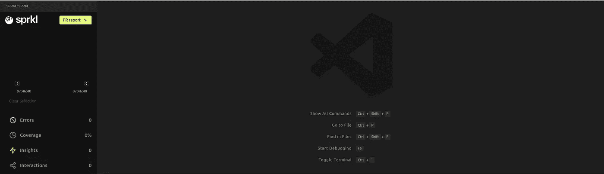

# sprkl—node . js 的 VScode 扩展

> 原文：<https://itnext.io/sprkl-vscode-extension-for-node-js-5bc40e0ee354?source=collection_archive---------1----------------------->

由 [Unsplash](https://unsplash.com?utm_source=medium&utm_medium=referral) 上的[路径数字](https://unsplash.com/@pathdigital?utm_source=medium&utm_medium=referral)拍摄

开发是一个复杂的过程，包括许多步骤和要考虑的事情。当我们用测试和覆盖率来验证我们的实现时，它变得更加复杂。

现在，正如我们所知，为了测试我们代码库的覆盖率，有很多工具可以用于不同的编程语言。这里我们将重点关注作为测试框架的`Node.js`应用程序和`Jest`。

正如我们所知，`Jest`对于我们的代码库的测试和覆盖报告来说是非常强大的。不幸的是，如今比以往任何时候，随着所有新技术、开发生命周期流程、微服务的出现，我们还必须考虑性能、交互、组件依赖、监控等。

在生产环境中，我们有很多工具和技术可以做到这一点，例如，Elasticsearch-Kibana-Fluentd 组合。

不要误解我的意思，我们可以在本地使用相同的工具，但是有缺点，因为这三个工具都依赖于`Java`，使用了大量资源，但是也没有为我们提供开发过程中需要的大量信息。这些工具非常适合监控，但不是调试的最佳工具。

***这里是*** `***sprkl***` ***接手的地方。***

对于那些没有听说过这个工具的人来说，它是你的 IDE 的扩展，正如他们的网站上所定义的:

> Sprkl 是一个个人观察平台，可以帮助开发人员更快地编写生产就绪的代码，并在他们在 IDE 中编写代码时立即识别潜在的问题。

这里最重要的部分是`Personal`关键字。为什么我这么说，因为这个工具将只为你修改的那部分代码提供报告。

不要误解我的意思，它会像`Jest`一样运行你的所有测试，但是在测试的情况下，它会区分已更改和未更改的组件，对于覆盖率和洞察力，它只会为你更改的代码部分提供报告。

事不宜迟，让我们看看如何在 VSCode IDE 中安装这个工具，以及它能为我们提供什么。

该工具可在 VSCode [市场](https://marketplace.visualstudio.com/items?itemName=sprkldev.sprkl-vscode)中获得。

在 Alexandre E Souza 的帮助下，我们可以按照这里的说明进行安装，他在这个工具上制作了一个视频:

> 如果安装后`sprkl` CLI 不可用，我们可以通过运行`npx @sprkl/scripts install`手动安装，如果安装失败，我们需要导出`SPRKL_PREFIX`和`PATH` env 变量。你可以在这里找到脚本，以防你想把它们作为依赖项添加到你的项目中，并从 VSCode 项目设置中配置一个强制的扩展。

安装完成后，我们可以从扩展窗格中看到`sprkl`已安装，添加工具令牌后，您将看到下面的仪表板。

sprkl 可观察性仪表板

如果我们用`sprkl`运行我们的测试，我们会看到结果和仪表板，有一个非常好的时间线，如下图所示。在我的例子中，我只使用下面的命令`sprkl -- yarn test PATH_OF_TEST`执行了一次测试。

我们在交互部分看到，在两个测试中，一个没有改变，另一个改变了，因为我们在组件的一个方法中做了一些更新。此外，从覆盖率部分，我们可以看到，从我们改变的方法中，该方法 50%的代码没有被测试覆盖。如果我们从测试执行时间线上点击`sprkl`图标，我们将直接跳转到没有被测试覆盖的代码。

正如你所看到的，即使有一个快速的介绍，这个工具也是非常强大的，但是它提供的远不止这里所展示的，所以我鼓励你去看看，自己试一试，希望这个工具对你的帮助和对我的帮助一样多。

> 注意:确保您使用的 nodejs 版本≥ 16，这样这个扩展才能工作

感谢您的宝贵时间:-)

照片由 [Howie R](https://unsplash.com/@howier?utm_source=medium&utm_medium=referral) 在 [Unsplash](https://unsplash.com?utm_source=medium&utm_medium=referral) 上拍摄