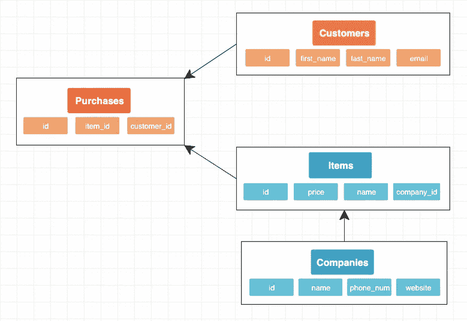
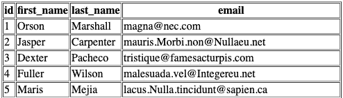
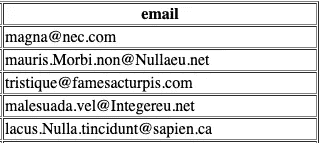

# SQL 基础知识

> 原文：<https://itnext.io/sql-basics-da3b0e19fb58?source=collection_archive---------4----------------------->

## 创建表、来源、选择和位置


结构化查询语言(SQL——读作“sequel ”)是一种 ANSI(美国国家标准协会)计算机语言，旨在检索和更改数据库中的信息。

SQL 通常被认为是标准的关系数据库管理系统(RDBMS)语言。太好了！然而，要真正理解为什么使用 SQL，我们需要先回顾一下关系数据库。

# 关系数据库简评

一种关系数据库，它将数据存储在一系列表和行中。关系数据库经常试图模仿现实生活中的关系，以便更好地帮助我们理解我们处理的数据。

> 关系数据库的结构允许您通过使用外键(或索引)来链接不同表中的信息，外键用于唯一地标识该表中的任何原子数据。其他表可能引用该外键，以便在它们的数据段和外键所指向的数据段之间创建链接。——杰奎琳·霍曼

## 便于理解的快速定义:

*   **表格** —以表格形式保存的相关数据的集合。表格由列和行组成。
*   **行** —表格中的每一行代表一个项目。例如，在代表公司的表中，每一行代表一家公司。
*   **列** —也称为属性，是特定于单个行的数据。
*   **主键** —表格中每一行的唯一标识符。主键不能重复，因为它在其他表上用作外键来表示链接关系。
*   **外键** —表示为一行中的一列数据，外键引用不同表中的一行。这就是表之间数据的链接方式。

如果您像我一样，碰巧更注重视觉，这里有一个关系数据库的模式示例:



表示购买的关系数据库的模式。

上面的模式显示了客户和他们购买的商品之间的关系。每一次购买都代表了一个顾客所拥有的物品。

鉴于本文的重点确实是 SQL，我将不再深入研究关系数据库。但是请随意自己探索这个话题。

# SQL 命令简介

SQL 查询被编写为能够对数据库表执行 CRUD(创建、读取、更新、删除)操作。随着表之间的关系变得越来越复杂，这个查询会变得更加复杂。

和任何计算机语言一样，真正学习它的最好方法是实践。因此，我将展示一些如何在 SQL 中使用 CREATE TABLE、FROM、SELECT、WHERE 和/或关键字的示例。

## 创建表格

听起来很简单。该命令向数据库中添加一个新表。更具体地说，它允许您命名表以及命名表中的每一列。

如果我对上图模式中的 customers 表使用 create table，它将如下所示:

```
CREATE TABLE customers (
  id INT PRIMARY KEY,
  first_name TEXT, 
  last_name TEXT, 
  email TEXT
);
```

惯例规定所有的 SQL 关键字都是大写的。您还会注意到，每一列都在一个新行上，这是另一个最佳实践。虽然没有必要，但这两种约定都让它对你我来说可读性更好。

## 从并选择

`FROM`关键字用于指示您正在访问哪个表，而`SELECT`关键字用于确定您想要查看哪些列。

```
SELECT * FROM customers;
```

如果我们数据库的表中有五个客户，上面的查询从`customers`表中请求所有列信息`*`。该查询的结果如下所示:



相反，如果我只是希望我将修改我的 SQL 查询的电子邮件为:

```
SELECT email FROM customers;
```

返回值将是所有五封电子邮件:



## 在哪里

`WHERE`关键字表示您想要在给定一组参数的情况下过滤结果。仅返回您设置的条件评估为 true 的结果。

```
SELECT * FROM customers 
WHERE id >= 3;
```

上述查询从 customers 表中选择 id 大于或等于 3 的所有行。该查询的返回值如下所示:


# 更复杂的查询

到目前为止，我们只看了更基本的 SQL 查询。随着关系越来越复杂，我们的 SQL 查询也变得越来越复杂。这些查询不包含在这篇关于基础知识的文章中。

但是，我希望您了解 SQL 中存在的许多关键字，我在下面列出了它们。请看一看，如果您有兴趣更深入地探索任何特定的关键字，请随时进一步研究它。

这个 SQL 命令列表可能是一个很好的起点。

## SQL 命令:

```
ALTER TABLE
AND
AS
AVG()
BETWEEN
CASE
COUNT 
CREATE TABLE
DELETE
DROP TABLE
GROUP BY
HAVING
INNER JOIN
INSERT
IS NULL
IS NOT NULL
LIKE
LIMIT
MAX()
MIN()
OR
ORDER BY
OUTER JOIN
ROUND()
SELECT
SELECT DISTINCT
SUM()
UPDATE
WHERE
WITH
```

# 资源

杰奎琳·霍曼。“关系数据库与非关系数据库:哪一个适合您？”[复数视线](https://www.pluralsight.com/blog/software-development/relational-non-relational-databases)。2014.

【SQL 命令列表】 [Codecademy](https://www.codecademy.com/articles/sql-commands) 。