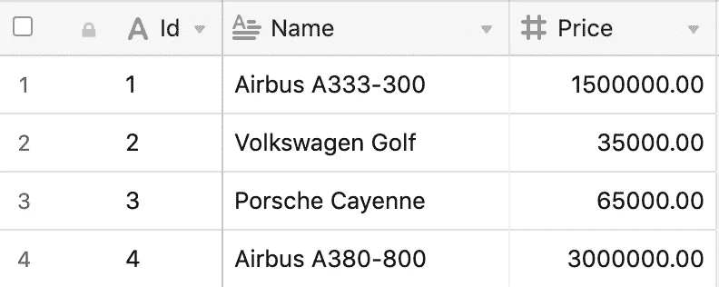
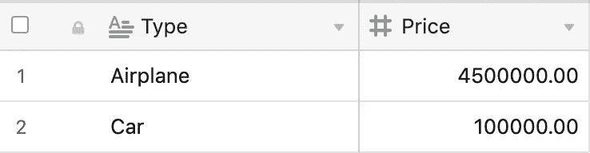
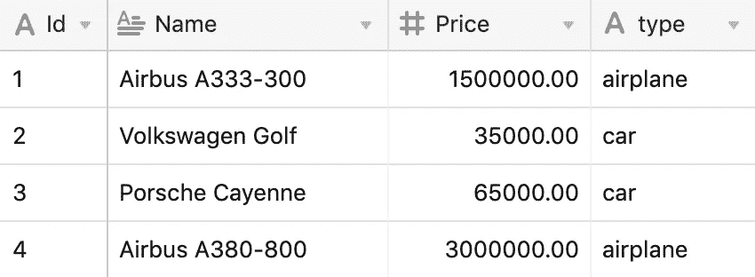

# SQL—Case 语句

> 原文：<https://itnext.io/sql-the-case-statement-87ec7eee736e?source=collection_archive---------10----------------------->

数据库只是存储数据的工具，但是它附带的查询语言 SQL 也非常强大。

在 JavaScript、Java 或 C#等编程语言中，我们一直在使用复杂的逻辑运算。所以这样做是完全正常的:

基本上，它需要一个字符串数组/列表，在这个例子中是车辆名称。我们最终想要的是具有名为`type`的属性的单个名称，以便以后进行更昂贵的操作。

完整的结果列表如下所示:

例如，这可以在上面看到的应用程序代码中完成，但在很多情况下，这里出现的问题是我们正在使用应用程序的服务器 CPU。这并不理想，因为这些事情可以用 SQL 来完成。

但是首先，我们需要显示数据库中有哪些数据。让我们看一个示例表。

车辆表

这是非常简单的数据，但这里缺少的是车辆的分组。在应用程序级别进行分组可能会占用太多的 CPU 资源，但是我们已经有了分组功能。有可能将分组功能从我们的应用程序代码转换成 SQL 语句。

欢迎使用 SQL 中的`CASE`语句🎉

`CASE`语句几乎可以在查询中的任何地方使用。这篇博文中的例子将集中在 PostgreSQL 上，但是应该适用于几乎所有的关系数据库管理系统(RDBMS)。

为了创建合适的 SQL 查询，我建议首先可视化我们想要实现的结果。我们的预期结果应该是这样的:

这是一个按车辆类型分组的表，它只存在于我们的应用程序代码中，是按类型分组的每辆车的总量。

要了解当前的第一步是什么，我们需要了解原始数据中缺少哪些数据。在我们的基本 SQL 表数据中，这是车辆类型。车辆类型已经在应用程序代码中编程，因此可以从那里获取。要将它插入到查询中，我们应该先了解 PostgreSQL 中的`ANY`操作符。您可以通过以下链接找到相关文档:[https://www . PostgreSQL . org/docs/9.4/functions-comparisons . html](https://www.postgresql.org/docs/9.4/functions-comparisons.html)或点击此处关注博客。

基本上，`ANY`与 JavaScript 中的`includes`或 Java 中的`contains`功能相同。这是一个检查项目是否在列表或可迭代数据类型中的功能。在 PostgreSQL 中，这通常用于数组。对于我们的用例，可以用两种方式定义列表:

第二种方法似乎更自然，类似于我们在现代编程语言中所习惯的方法，所以我将遵循这种方法。这就是我们将在这篇博文中用到的。所以使用它的第一件事可能是在一个简单的查询中从我们的数据集中获取所有的飞机。最简单的查询如下所示:

它将检查所有名字包含在列表中的车辆。

同样的查询也可以用于汽车。它将只返回包含汽车的行。现在让我们用一种简单的方法来检查`CASE`语句，将车辆类型附加到数据中。第一种常见的方法是使用这样的东西:

这种方法是可行的，但是确实有一个很大的缺点:对于这个查询中的每一个新的数据元素，我们都会有另一行代码，并且它会重复很多代码`WHEN name = '...' THEN vehicle_type`。这里的一个特点是我们需要调用一个`CASE`和`END`关键字来使 case 语句工作。

但是这可以通过我们之前学过的`ANY`操作符来改进:

这将产生以下数据集:

这确实接近了应该达到的最终结果。但是对于最后一部分，该查询需要在`vehicle_type`之前汇总价格。这可以通过使用`GROUP BY`语句轻松完成。

这是查询的样子。也许可以通过过滤掉将`NULL`作为`vehicle_type`的行来优化，但是在这个例子中应该显示主要的点，即`CASE`关键字。该关键字可用于许多其他用例(ba dum tss ),如多个表上的复杂`JOIN`。只是体验一下这个关键字，看看它是否可以应用在你的查询中。

总的来说，本文表明这种“丢失数据”的逻辑甚至可以在数据库级别上实现，而不是在应用程序代码中实现，在应用程序代码中，它会使整个代码变得混乱。尽管在将业务逻辑放到数据库级别时应该非常小心，但在这种情况下，它只是数据扩展。

> 感谢你阅读这篇文章。你摇滚了*🤘*
> 
> 也可以看看我的其他博客文章，比如 JavaScript 中的[函数参数](https://medium.com/@kevin_peters/function-parameters-in-javascript-clean-code-4caac109159b)、[学习如何用真实世界的例子重构 Vue.js 单个文件组件](https://medium.com/@kevin_peters/learn-how-to-refactor-vue-js-single-file-components-on-a-real-world-example-501b3952ae49)或者 Python 的[自动格式化器](https://medium.com/3yourmind/auto-formatters-for-python-8925065f9505)。
> 
> 如果你有任何反馈或者想给这篇文章添加一些东西，请在这里评论。您也可以在 [twitter](https://twitter.com/kevinpeters_) 上关注我，或者访问我的[个人网站](https://www.kevinpeters.net/)来了解我的博客文章和更多内容。