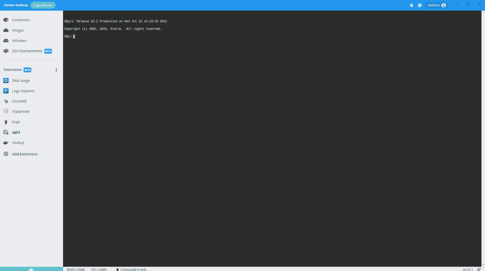
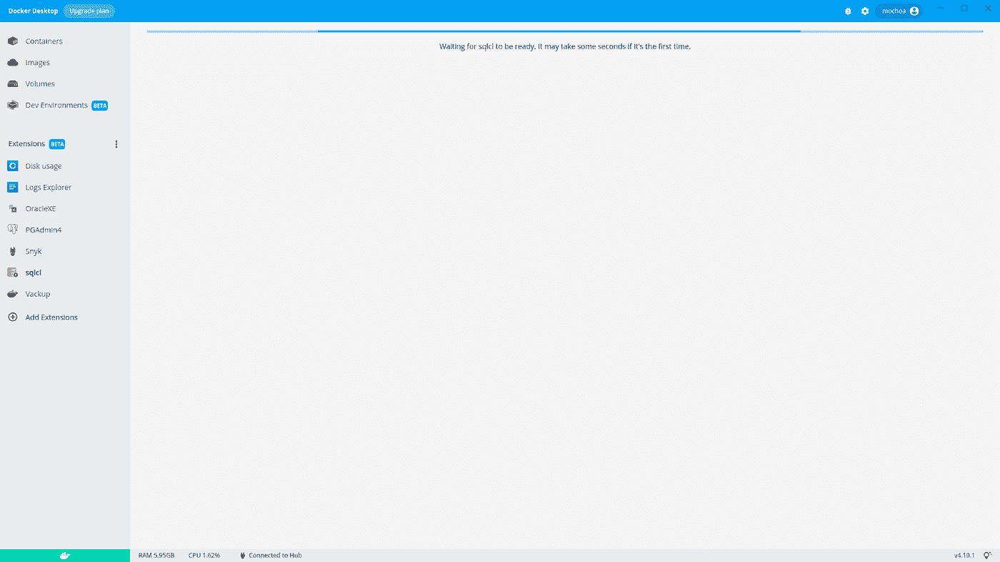
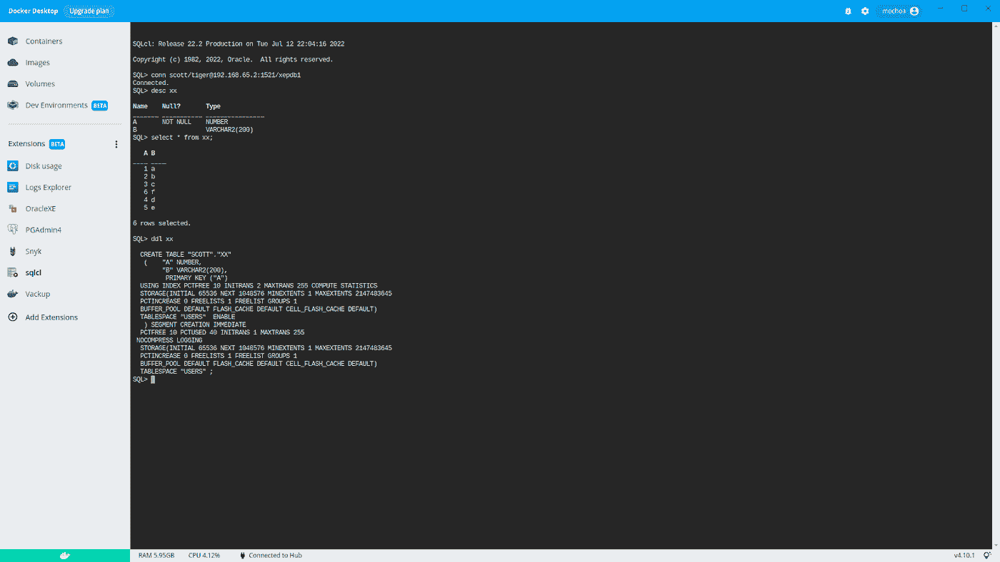
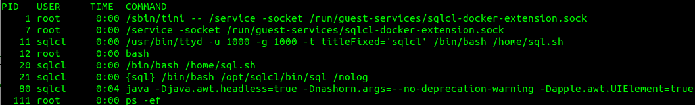
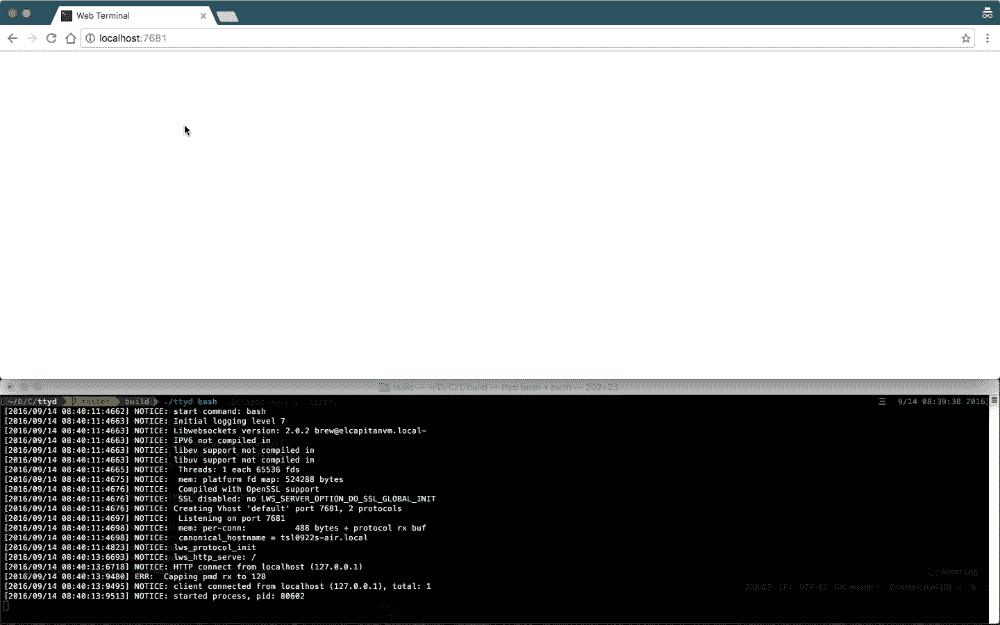
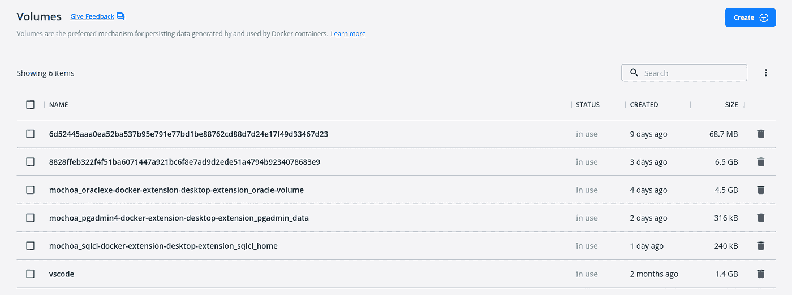
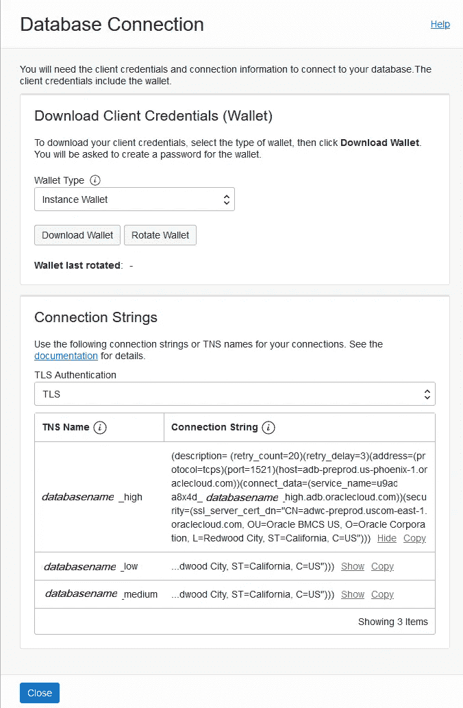

# SQLcl Docker 桌面扩展

> 原文：<https://itnext.io/sqlcl-docker-desktop-extension-982c51110835?source=collection_archive---------0----------------------->

在我解释了通过 Docker 扩展为开发者提供的生态系统的重要性之后，我决定为[Oracle SQL 工具](https://www.oracle.com/database/sqldeveloper/technologies/sqlcl/)构建一个新的生态系统，它与我之前为 [OracleXE](/oraclexe-21c-docker-extension-95c25bec0f31) 构建的生态系统成对工作

这一扩展背后的想法是有一个简单的命令行工具来连接 Oracle XE 21c 或任何其他 RDBMS 实例，包括基于云的部署。这个扩展看起来像这样:


Oracle SQLcl Docker 桌面扩展

# 为什么我需要 SQLcl Docker 桌面扩展

SQL 客户端工具如 ***SQLcl*** 可以在任何操作系统上下载和安装，但需要几个步骤:下载、解压、安装*，最后创建快捷方式图标。*

*使用 Docker Desktop 作为开发环境的基础，您只需点击几下鼠标就可以使用一个*SQL，无需在您的计算机中安装库或额外的 ***JDK*** 。只需安装，您将得到如下所示的***SQL QL***欢迎屏幕:**

****

**SQL 欢迎页面**

# **手动安装**

**在 Docker 扩展中心准备好该扩展之前，您只需执行以下命令即可安装:**

```
**$ docker extension install [mochoa/sqlcl-docker-extension:22.2.0](https://hub.docker.com/repository/docker/mochoa/sqlcl-docker-extension)
Extensions can install binaries, invoke commands and access files on your machine.
Are you sure you want to continue? [y/N] y
Installing new extension "mochoa/sqlcl-docker-extension:22.2.0"
Installing service in Desktop VM...
Setting additional compose attributes
VM service started
Installing Desktop extension UI for tab "sqlcl"...
Extension UI tab "sqlcl" added.
Extension "Oracle SQLcl client tool" installed successfully**
```

****使用 SQLcl Docker 扩展****

**安装完扩展后，Docker 桌面的 ***扩展(Beta)*** 窗格中会列出一个新的扩展。**

**通过点击***SQL***图标，扩展主窗口将显示该扩展加载过程，并显示几秒钟的进度条指示器**

****

**加载进度条**

**一旦加载了 ***SQLcl*** ，您必须使用 connect 命令进行连接，例如使用 OracleXE 和 scott 用户:**

****

**使用 OracleXE 和 scott 用户连接的示例**

**要从外部 Docker 容器连接，我的意思是不作为容器运行的应用程序可以使用 localhost:1521，但是要从其他容器连接，你必须使用内部 IP；在 Docker 桌面上运行的 OracleXE 的 IP 可在菜单中找到，设置->资源->网络-> Docker 子网，在我的例子中是 192.168.65.0/24，因此用于访问 OracleXE 的内部 IP 是 192.168.65.2，还有一个内部 DNS 名称解析上述 IP，名为***host . Docker . internal***。**

****

**找到 Docker 子网的 IP 地址**

**从上面的截图看，它显示了如下连接信息:**

```
**SQL> connect scott/tiger@host.docker.internal:1521/xepdb1**
```

**这意味着:**

*   **用户:**T43【斯科特】T44****
*   **密码: ***老虎*****
*   **数据库 IP:***host . docker . internal*****
*   **数据库端口:**T5 1521****
*   **PDB: ***xepdb1*****

**如您所见，我使用的是具有密码 tiger 的历史用户 scott，该用户是在 OracleXE Docker 桌面扩展首次启动时创建的。**

# **体系结构**

**在引擎盖下，这个 Docker 扩展启动了一个具有两个主要进程的容器，一个服务应用程序与 Docker 桌面上运行的 UI(Ract app)进行对话，一个 ttyd 作为用 Java 编写的 SQL 命令行应用程序的 web 前端。**

****

**在扩展虚拟机上运行的进程**

**[ttyd](https://tsl0922.github.io/ttyd/) 流程包括包装为终端设计的旧命令行应用程序的功能，以通过浏览器作为 web 应用程序运行。我从扩展 [Dive Into Ansible Lab — Docker 扩展](https://github.com/spurin/diveintoansible-extension)中获得了这个想法。**

**最后， ***tini*** app 用于避免扩展在没有使用 exit 命令的情况下关闭时的 Java 僵尸进程。接下来的截图展示了 ***ttyd*** app 如何在浏览器中包装命令行应用**

****

**ttyd 示例用法**

**因此，用 Go 语言编写的服务应用程序监听 Docker 桌面 UI 并检查 ***ttyd*** 守护进程的可用性，一旦 ***ttyd*** 准备好接受 http 连接，Docker 桌面扩展就使用 main 的 ttyd 页面重新加载，该页面使用 ***sqlcl*** 和 ***/nolog*** 参数运行。**

# **上传/下载文件**

**如果您想从 Oracle*中导入/导出大文件，使用 ***SQLcl*** 的一些功能，如 ***dp*** (数据泵)或 load 命令是必要的，以便将文件提供给扩展永久卷，您可以通过使用 Volumes 菜单来检查它:***

****

**Docker 卷**

**持久卷是***mochoa _ SQL cl-docker-extension-desktop-extension _ SQL cl _ home***。**

**摘自杰夫·史密斯博客但使用了 SQLcl Docker 扩展的示例用法如下:**

```
**SQL> set feedback off
SQL> spool ***objects.csv***
SQL> SELECT * FROM all_objects fetch FIRST 100 ROWS ONLY;
SQL> spool off**
```

**将导出的数据复制到您的本地文件系统，并在另一个目录中再次上传，在命令行 shell 中运行以下命令:**

```
**$ docker cp ***mochoa_sqlcl-docker-extension-desktop-extension-service:/home/sqlcl/objects.csv*** .
$ docker cp objects.csv ***mochoa_sqlcl-docker-extension-desktop-extension-service:/tmp*****
```

**最后使用 SQLcl LOAD 命令再次导入:**

```
**SQL> CREATE TABLE demo_load AS SELECT * FROM all_objects WHERE 1=2;
Table DEMO_LOAD created.SQL> load demo_load /tmp/objects.csv
Load data into table SCOTT.DEMO_LOADcsv
column_names on
delimiter ,
enclosures ""
encoding UTF8
row_limit off
row_terminator default
skip_rows 0
skip_after_names#INFO Number of rows processed: 100
#INFO Number of rows in error: 0
#INFO No rows committed
SUCCESS: Processed without errorsSQL> set sqlformat default
SQL> select count(*) from demo_load;
  COUNT(*)
----------
       100**
```

# **连接到 Oracle 云自治数据库**

**SQLcl Desktop Extension 能够连接到您的自治数据库，您必须首先从 OCI 云控制台下载您的 Wallet 文件，如[下载数据库连接信息](https://docs.oracle.com/en-us/iaas/autonomous-database-shared/doc/connect-download-wallet.html#GUID-B06202D2-0597-41AA-9481-3B174F75D4B1)中所述，您将看到一个类似如下的选项卡:**

****

**ATP 数据库连接 Wallet 下载标签**

**有了 Zip 文件后，使用 docker cp 命令将它上传到 SQL 持久卷:**

```
**$ docker cp ***Wallet_DBparquet.zip*** mochoa_sqlcl-docker-extension-desktop-extension-service:/home/sqlcl**
```

**最后，在 SQLcl Docker 扩展中使用您的钱包:**

```
**SQL> set cloudconfig /home/sqlcl/***Wallet_DBparquet.zip***
SQL> connect admin/***********@dbparquet_high
SQL> desc demo_tab
SQL> select count(*) from demo_tab;**
```

# **来源**

**一如往常，这个扩展的代码在 [GitHub](https://github.com/marcelo-ochoa/sqlcl-docker-extension) 上，欢迎随时提出修改建议和投稿，注意，我是**T5 React和**TypeScript的初级开发者，所以欢迎投稿使这个**UI更好。********