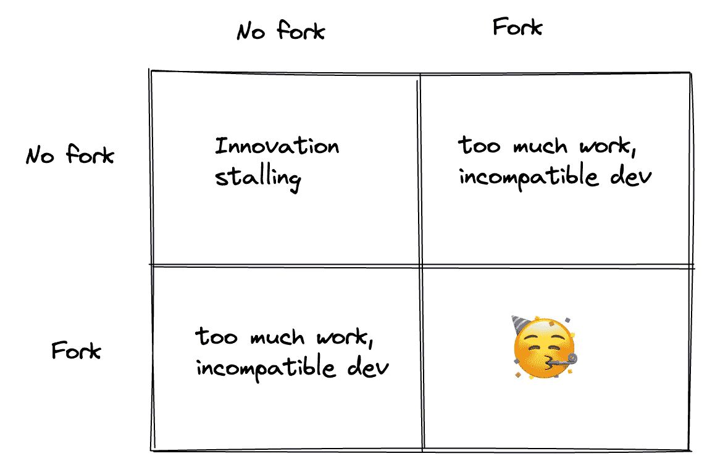

# SQLite: QEMU 又来了？

> 原文：<https://itnext.io/sqlite-qemu-all-over-again-aedad19c9a1c?source=collection_archive---------0----------------------->

## 在一次回忆之旅中，我回忆起我在 QEMU 的经历，以及这个项目是如何完全改变以适应新的行业趋势的。SQLite 历史是不是又押韵了？

我第一次听说 QEMU 是在 21 世纪初。QEMU 是法布里斯·贝拉的创意。毫不夸张地说，法布里斯是一个真正的天才。不相信我？这些只是他在维基百科页面上的一些成就:

*   [想出了以 16 为基数计算圆周率第 n 位数的公式](https://en.wikipedia.org/wiki/Bellard%27s_formula)。
*   2009 年，第一次用台式电脑计算圆周率为 2.7 万亿位。
*   创造了最广泛使用的视频编码器之一 [FFmpeg](https://ffmpeg.org/) 。
*   创建了 QEMU，这是一个快速的全系统仿真器，可以在几乎所有的处理器架构之间进行转换。

## QEMU 之前模拟器是如何工作的

我第一次听说 QEMU 是在 2006 年左右。我很早就对计算机体系结构感兴趣，当时大多数仿真器只是天真地在运行时将指令从翻译成仿真的体系结构。

另一方面，QEMU 使用一个“微型代码生成器”通过 JIT 编译来翻译指令。它没有本机运行的速度快，但对于各种应用程序来说，它已经足够快了，对于许多用例来说，它感觉像是纯粹的奇迹。QEMU 也有自己的常见物理设备仿真，自己的[磁盘镜像格式](https://en.wikipedia.org/wiki/Qcow)等等。

## 虚拟化改变了行业

但是在那个时候，一些别的事情正在酝酿。虚拟化正在成为行业的主流。

虚拟化的概念不同于仿真。如果您只是试图运行一个独立的工作负载，而不是针对一个完全不同的架构，那么您可以直接执行指令。这说起来容易做起来难，因为处理器有特权指令，允许你访问其他虚拟机。

但是 Xen 项目在 2004 年首创的称为半虚拟化的方法表明，如果你同意改变操作系统——因为用户程序无论如何不能调用特权指令——那么你可以安全地一起运行许多虚拟机来完成工作。后来，英特尔和 AMD 都发布了自己的进程扩展，可以提供处理器特权状态的阴影视图，并允许像 KVM 这样的解决方案，后来为 AWS 的 Nitro 提供了动力。

## 让 QEMU 做虚拟化

这两种解决方案都解决了如何执行 VM 指令的问题。但是，完整的解决方案还要求虚拟机拥有独立的*设备视图，*如声卡、显卡、磁盘等。QEMU 拥有所有这些，而且非常棒，每个人都想重用它。但是 QEMU 是一个仿真解决方案，而不是虚拟化。

QEMU 是一个开源项目，但是社区对整个虚拟化并不感兴趣。事实上，这个社区大部分是由志愿者维护的，除了非常有限的个人兴趣之外，它似乎对很多事情都不感兴趣。嘿，这里没有评判:我也是作为一名无偿志愿者来维护事物的，我知道这有多难！

尽管如此，我们现在有了这个惊人的解决方案，它几乎为*做了*我们需要的一切，许多其他社区围绕它构建东西，出于方便升级的原因，他们尽最大努力保持东西不变。直到不可避免的事情发生了:我们通过 [qemu-kvm](https://lore.kernel.org/all/49F08BD0.6000706@redhat.com/) 项目叉开了 QEMU。

## 没有贡献导致分裂

从某种意义上说，因为每个人都在用 QEMU 的一点一滴来构建他们的设备模型，QEMU *已经被分叉了。这项工作为 QEMU 本身(尽管是它的一个分支)的扩展奠定了基础，通过用本地处理器模拟代替处理器模拟来实现虚拟化。这个库成为了所有对推动 QEMU 所能做的事情感兴趣的各方的公共库，随着时间的推移，它基本上成为了新的 QEMU:它仍然可以像以前一样进行仿真，甚至更好，因为许多改进非常普通，但现在也可以进行虚拟化，为项目打开了一个全新的应用程序。*

# SQLite 是否处于类似的岔路口？

当我环顾四周时，我看到一个非常相似的情况正在围绕 SQLite 发展。SQLite 是 D. Richard Hipp 的想法，他也参与了 Tcl 编程语言和他自己的版本控制系统。与 Fabrice 一样，他无疑是一个聪明而有成就的人。

SQLite 的代码也是可用的，但是贡献比 QEMU 时代更难了:SQLite 明确无误地“[开源，而不是开放贡献](https://www.sqlite.org/copyright.html)”。他们拥有的少数核心开发人员不使用 git 等现代工具和 Github 等协作工具，也不接受贡献，尽管他们可能会也可能不会接受您对新功能请求的建议。

就像 QEMU 一样，行业的新趋势正在将它带入一个全新的方向:由于资源和环境有限，围绕边缘计算的用例越来越多，这意味着 SQLite 完全符合要求。然而，边缘计算也意味着您的代码将在许多地理位置上运行，尽可能靠近用户以获得更好的延迟。这意味着命中单个 SQLite 实例的数据现在需要复制到所有其他实例。

## 虚拟化的兴起和边缘的兴起之间的相似之处。

许多解决如何运行 SQLite 的问题的方法，但是随着分布式数据的出现。其中一些值得注意的是:

*   [rqlite](https://github.com/rqlite/rqlite) :一个成熟的分布式数据库，类似于 CockroachDB，但是使用 SQLite 作为存储引擎。你通过网络与它交流，它不再是一个可嵌入的数据库。
*   [BedrockdB](https://bedrockdb.com/) :类似于 rqlite，也是围绕 SQLite 构建的。
*   [dqlite](https://dqlite.io/):SQLite&RAFT 的组合，用 C 编写，保持了 SQLite 的可嵌入性。但是因为你必须清楚地说明网络事件，所以像 sqlx 这样的表单是行不通的，并且/或者必须进行调整。
*   [凿子店](https://github.com/chiselstrike/chiselstore):我自己对问题的尝试。接近 dqlite(但在 Rust 中)，最终，正如我发现的，遭受许多相同的问题。
*   作为它最大的优势，事实上它位于 SQLite 之后的 T2，所以任何和 SQLite 一起工作的东西都可以和 LiteFS 一起工作。必须做出一些让步，在当前不改变 SQLite 的限制下，他们的方法是提供一个分布式 FUSE 文件系统，它分散写操作并处理一致性问题。它有自己的一系列问题，其中许多问题在[黑客新闻的帖子](https://news.ycombinator.com/item?id=32240230)中提出。我个人认为，如果分布式文件系统很简单，我们现在应该已经有一个很好的了。但是在 SQLite 不可更改的假设下，这是目前最好的方法。向本和团队致敬！

## 如果 SQLite 接受投稿会怎么样？

为什么假设 SQLite 不能改变？当然，没有人想保留打了补丁的软件，也没有人想要求用户安装其他版本的核心软件，比如 SQLite。这是一个典型的[囚徒困境](https://en.wikipedia.org/wiki/Prisoner%27s_dilemma)情况:如果我们中的一个人拿着 SQLite 的叉子，从长远来看，这是一个失败的提议。正如 QEMU 的故事——坦率地说，还有其他许多故事——告诉我们的那样，如果我们能够团结一致，我们就会共赢。

这就是为什么今天我和我的一些同行一起开始使用 libSQL。这是一个让我们所有人聚在一起构建新一代嵌入式数据库 SQLite 的地方。我们希望构建一个强大而独立的社区，有一个清晰的行为准则，如果你觉得 SQLite 可以改变以适应未来，我们非常欢迎你来和我们一起构建。

在我们的[宣言](https://github.com/libsql/libsql/blob/main/README.md)中有更多关于我们想要实现的目标的细节。以下是我们想要解决的一些问题:

*   [我们希望使用 io _ uring 和异步接口](https://github.com/libsql/libsql/issues/7)
*   [我们希望为分布式系统提供复制挂钩](https://github.com/libsql/libsql/issues/6)
*   [我们希望允许基于 WASM 的用户自定义函数](https://github.com/libsql/libsql/issues/1)

你想贡献什么？我洗耳恭听。您可以通过以下方式联系我们:

*   [Github 讨论](https://github.com/libsql/libsql/discussions/)
*   [不和](https://discord.gg/TxwbQTWHSr)