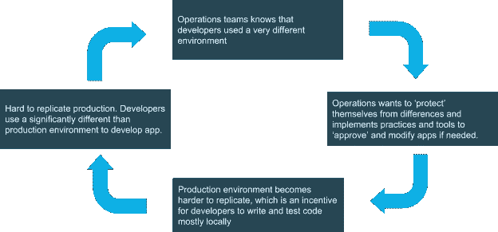
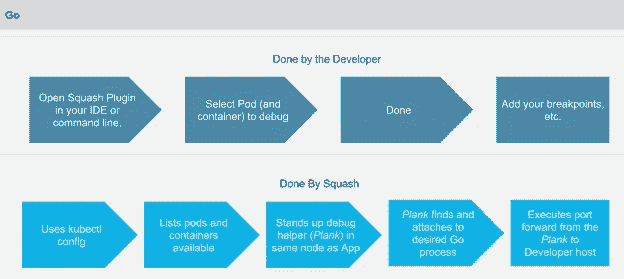
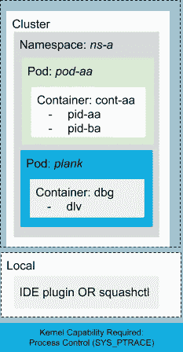
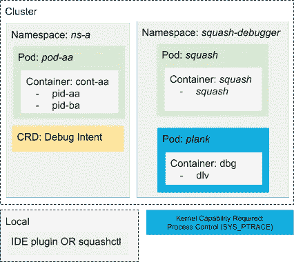
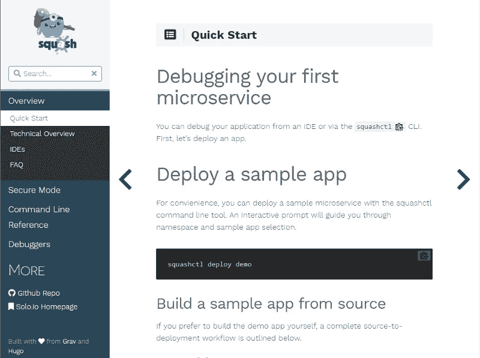

# Squash，权威的云原生调试工具

> 原文：<https://itnext.io/squash-the-definitive-cloud-native-debugging-tool-89614650cc94?source=collection_archive---------3----------------------->

## 壁球 0.5 出局。这个新版本解决了企业调试用例，使其成为云原生应用程序最普遍的调试工具。

对应用程序进行实时调试的能力是开发过程中必不可少的一部分。这让我很困扰，我经常很难理解开发人员如何能够纯粹依靠日志语句来识别一段代码是否按预期运行。将日志语句添加到您编写的代码中可能是一件很容易的事情，但它绝不应该是高效调试会话的主要工具。

应用程序应该在与它们在生产中运行的环境非常相似的环境中开发。在这样做的时候，你有机会优化我认为最重要的开发指标，也就是交付时间。

# 期望与现实(生产环境与开发环境)

在我的职业生涯中，我所在的团队多次使用 JBoss Application Server 在本地开发应用程序，然后在其他应用服务器上运行相同的应用程序。出于不同的原因，通常是 Weblogic 或 Websphere。每当我们这样做时，我们的生活变得更加艰难，对交付时间产生了负面影响。这是我的理论:

我希望你的组织或你的团队早就离开了上图适用的情况。现在你面临不同的情况，比如:

*   大多数应用程序在容器中运行
*   你是各种形式、地点和口味的 Kubernetes 的用户
*   比起爪哇，我更喜欢 Spring Boot 或戈朗

当我们考虑今天使用微服务的分布式计算的现实时，对云原生调试工具的需求肯定会增加。幸运的是，在这个旅程中，壁球可以成为你的日常朋友，这有两个基本原因:专为云原生工作负载和企业安全考虑而设计。让我们来看看这几点，这也有助于你理解壁球建筑。

# 专为云原生(和 Kubernetes)构建

Squash 的架构认为云原生部署通常是短暂的。为了实现这一考虑，它与诸如 Kubernetes API 之类的 API 接口，创建必要的组件，这些组件将允许您在首选 IDE 中远程调试应用程序。

## Java 语言(一种计算机语言，尤用于创建网站)

让我们来看看下面的流程，这是为了调试一个 Java 应用程序，例如:

Squash 给 Java 开发人员带来了极好的价值，因为它会在 JVM 启动时自动找到指定的调试端口。找到端口后，它使用端口转发，然后依靠 IDE 的功能来利用 JDWP。

## 去

对于为 Kubernetes 运行和开发的 Go 软件工程师来说，可以说它是必备的。在 Kubernetes 中有几种调试 Go 应用程序的方法，但没有一种像 Squash 那样流畅和考虑企业场景。

# 安全性

在 Solo，我们知道在分布式环境中调试应用程序时考虑安全性是多么重要。为此，Squash 有一个非安全模式和一个安全模式。

## 不安全模式

虽然这仅适用于本地环境或非常信任开发人员的环境，但它仍然是一个有效的用例。当处于不安全模式时，debug helper(一个名为“Plank”的 pod)将假设用户在集群或名称空间上具有提升的权限，这将允许在 Linux 内核级别控制进程。这变得很有趣，继续阅读关于安全模式。

# 安全模式

安全模式假设用户在集群中拥有有限的特权，我认为这是应该的。为了让 Plank pod 完成它的工作，它需要 SYS_PTRACE，一旦一个进程被授予了该权限，就意味着它们可以控制主机中的任何进程。这有多危险。嗯，您可以立即使一个节点发生内核崩溃。我们不想那样。

安全模式与不安全模式的不同之处在于，执行进程发现和附加的部分运行在不同的名称空间中。这种情况允许对调试器进程进行严格控制，同时也不要求开发人员具有提升的特权。它是企业用例的理想选择。

在上图中，希望在名称空间 **ns-a** 上调试应用程序的开发人员比负责调试器运行的名称空间的用户拥有更少的特权。您从调试能力中获益，同时又不牺牲安全性。

# 现在试试吧

我们喜欢壁球。我们创建它供我们使用，以协助我们其他项目的开发，如 Gloo，一个下一代 API 网关，和 Supergloo，一个服务网格编排平台。事实证明它非常有用，提高了我们的整体生产力。

我们已经投入了宝贵的工程时间来改进壁球文档，我们希望它能很好地为您服务。

现在就去[网站 https://squash.solo.io](https://squash.solo.io) 开始变得更有效率。壁球是开源的，我们欢迎投稿。在[https://github.com/solo-io/squash](https://github.com/solo-io/squash)随意检查代码。