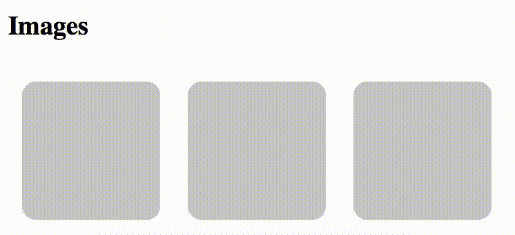
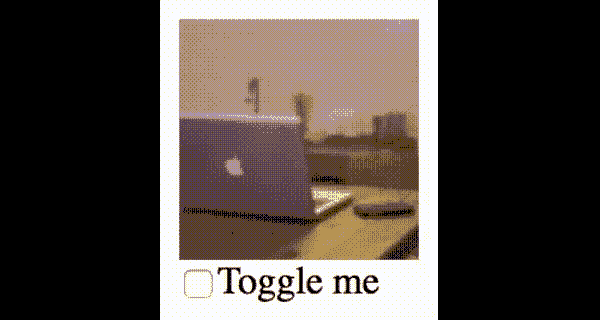

# React 中带有占位符的稳定图像组件

> 原文：<https://itnext.io/stable-image-component-with-placeholder-in-react-7c837b1ebee?source=collection_archive---------2----------------------->


在大多数情况下，在加载图像时显示占位符是一个好主意，特别是对于慢速网络/设备。要用这样的图像组件构建 React 应用程序，从 React 和 DOM 的角度来看，有几件事情需要考虑。

在本文中，我将通过展示用 ES6 编写的例子来描述如何实现这样一个组件。

*更新 2018/07/21 切换到 ES6，更新示例使用`[reenhance-components](https://www.npmjs.com/package/reenhance-components)`。

# 显示占位符，直到“onload”事件触发

实现这种行为的最直接的策略是:

1.  用`false`初始化内部状态
2.  设置一个`onLoad`事件处理程序，将状态更新为`true`
3.  让组件根据状态显示占位符或图像。

因为占位符必须在页面加载后显示，所以它应该是 SVG 或数据 URI。我们可以在常规的 JSX/TSX 中嵌入 SVG 元素，只需将属性`view-box`重命名为`viewBox.`

状态可以从`[reenhance-components](https://www.npmjs.com/package/reenhance-components)`存储在`StateProvider`中。它通过嵌入 JSX/TSX 来提供状态和更新程序。

整个过程可以编码如下:

```
interface OuterProps {
  src: string;
}const LoadedState = StateProvider(false);const ImageWithLoading = ({ src }) => (
  <LoadedState>
    {({ state: loaded, setState: setLoaded }) => (
      <div>
        {!loaded ? (
          <svg width="100" height="100" viewBox="0 0 100 100">  
            <rect width="100" height="100" rx="10" ry="10" fill="#CCC" />
          </svg>
        ) : null}
         setLoaded(true)}
        />
      </div>
    )}
  </LoadedState>
);
```

你是否注意到占位符和`img`隐藏的方式不同？一旦`loaded`变为真，占位符就可以从 dom 中删除，但是`img`必须从开始就存在，以触发`onLoad`事件。

结果会是这样的。



你也可以在这个 CodePen 里试试。

好看吗？实际上，这还不完善。

# 重新装载会导致图像闪烁

在 React 应用程序中，UI 交互可能会导致应用程序状态的一些更新，从而触发图像组件的重新安装。如果组件被重新安装，`loaded`状态将被重置，并导致这样的闪烁。



对于这个问题我们能做些什么？

# 将 DOM 属性反映到组件状态

这种闪烁的发生是因为我们的组件正在等待`load`事件，而不管图像是否被*初始*加载。该状态可通过指示元素当前状态的`complete` DOM 属性获得。

为了访问该属性，我们需要一个对图像元素的引用。从 React 16.3 开始，使用`createRef`是推荐的方式。`ref`对象可以从`[reenhance-components](https://www.npmjs.com/package/reenhance-components)`存储到`ObjectWatcher`观看的&。

一旦`complete`可用，该值可用于确定图像是否准备好。下面的代码对此进行了描述:

```
const { StateProvider, ObjectWatcher } = ReenhanceComponents;const LoadedState = StateProvider(false);
const ImageRefWatcher = ObjectWatcher(React.createRef());const ImageWithLoading = ({ src }) => (
  <LoadedState>
    {({ state: loaded, setState: setLoaded }) => (
      <ImageRefWatcher watch="current">
        {(imageRef) => {
          const complete = imageRef.current && imageRef.current.complete; return (
            <div>
              {!complete ? (
                <svg width="100" height="100" viewBox="0 0 100 100">  
                  <rect width="100" height="100" rx="10" ry="10" fill="#CCC" />
                </svg>
              ) : null}
               setLoaded(true)}
                />
            </div>
          );
        }}
      </ImageRefWatcher>
    )}
  </LoadedState>
);
```

请注意，`loaded`状态不再被引用。它只是通过调用`setLoaded`来撤销渲染。

密码笔在这里。

**运动。**

由于我们不再引用`loaded`状态，我们可以从上面例子中的`ImageWithLoading`标签中移除`key`属性。移除`key`支柱并修改`ImageWithLoading`,使其在给出新 id 时显示占位符。(提示。改变`LoadedState`的类型)

# 结论

React 可以很好地处理无状态组件，但是有些 HTML 元素背后隐藏着状态。如果你理解他们的行为并把他们包起来，你就能完全控制他们。

# 参考

[https://stack overflow . com/questions/12354865/image-onload-event-and-browser-cache](https://stackoverflow.com/questions/12354865/image-onload-event-and-browser-cache)