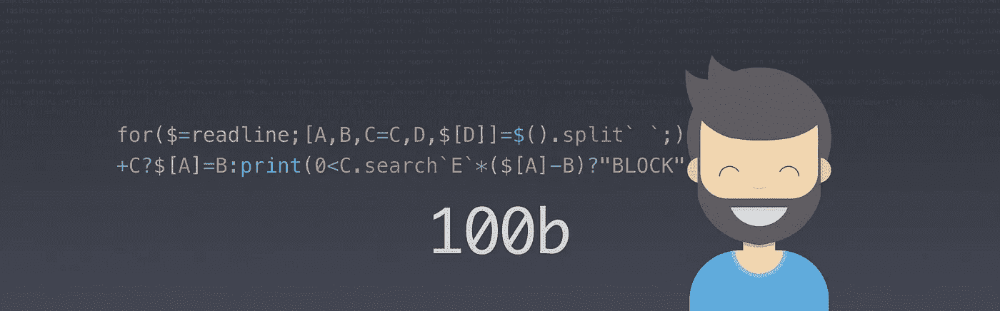

# 支持 CodeGolf，滥用你喜欢的语言，了解更多

> 原文：<https://itnext.io/standing-up-for-codegolf-abusing-the-language-you-love-to-learn-more-about-it-43c3c0ea5f12?source=collection_archive---------4----------------------->



JavaScript 被利用了，如果你知道它是从哪里来的，请不要分享，这一点都不好玩。

虽然我不打算透露上面的代码用在什么地方，但让我告诉你更多一点。我遇到了一个非常简单的代码高尔夫问题，因为大多数情况下都是如此。给你一个输入，你需要提供一个输出。基本上你写一个小算法来解决一个问题。

> Code golf 是𝐫𝐞𝐜𝐫𝐞𝐚𝐭𝐢𝐨𝐧𝐚𝐥计算机编程竞赛的一种，参赛者努力在最短的时间内完成实现某种算法的源代码。[](https://en.wikipedia.org/wiki/Code_golf)

想出一个解决方案是微不足道的。在保持功能性的同时去掉那些字节是令人着迷的部分，这样做的时候，我一头扎进了一个我不知道的世界特性和行为。在我的职业生涯中从未出现过或从未需要过的东西，从另一方面来说，可能有一天会证明非常有用的东西。

是竞争让它上瘾，没有游戏化就没有奖励，没有奖励就没有乐趣。所以我基本上是在和一个朋友兼同事竞争，尽管我对让代码变小的兴趣随着他的减少而增长。

由于代码很小，神奇的事情发生了，我记住了其中的每个字符，并开始在遛狗、购物、看电影时思考它。曾经有一段时间，当我带着我的狗在森林里奔跑时，我停下来给我的朋友打电话，让他来测试我的一个想法，这个想法可以为我节省 2 个字节。它没有起作用。

我两年前放弃了这个高尔夫球，把它留在 106b 的大小，然后就把它忘了。然后我有了一个想法，回到它，把它降低到 100b。我的神奇数字应该是 99b，但现在看来这是不可能的。

很少几个月，我读到有人说代码高尔夫就像是应该避免的瘟疫，这种做法会感染程序员的大脑，使他们无法编写正确的代码。通常我把这个人描绘成一个老派的 IT 纯粹主义者，他实际上相信坚持传统的规则和结构是学习和改进的唯一途径。这是我完全不同意的，让我解释一下为什么。

如果你读了上面的代码-高尔夫的定义，我们应该把重点放在*娱乐*上。这不是你应该在客户的代码库中尝试的东西，或者在一些应该由其他人(除非是其他高尔夫球手)维护和阅读的代码上尝试的东西，当然不是。声称程序员打代码高尔夫不好，就相当于说画家不能在上班途中涂鸦取乐，因为这会让他们以后无法画画。**是拼图，是游戏。**

我甚至会更进一步说，事实上，对于一个程序员来说，有一点打高尔夫球的能力是很好的，因为这样做需要对所讨论的语言有更深的理解，而这仅仅是编写标准代码。在代码高尔夫挑战赛中，我们可以利用的所有怪癖和错误行为都允许我们毫不费力地识别出那些行为异常或带来麻烦的代码。

有时你依赖于一个库提供的函数，却不知道它是如何工作的，它是做什么的。即使目标不是主动学习这些东西，你最终也会多次访问和阅读 polyfills，访问算法的源代码，探索其他语言的实现，学习。

> polyfill 是一段代码(通常是 Web 上的 JavaScript ),用于在不支持它的旧浏览器上提供现代功能。
> 例如，polyfill 可用于使用 Silverlight 插件模拟 Microsoft Internet Explorer 7 上 HTML Canvas 元素的功能，或模拟对 CSS rem 单元的支持，或`[text-shadow](https://developer.mozilla.org/en-US/docs/Web/CSS/text-shadow)`或任何您想要的功能。[](https://developer.mozilla.org/en-US/docs/Glossary/Polyfill)

就我个人而言，我甚至从未考虑过`Math.sign`正在做(或可能被)`((x > 0) - (x < 0)) || +x`实现，但是知道了这一点，我们就更容易记住，由于强制，我们可以使用布尔作为数字。表达式`x>0`将评估为`true`或`false`，对于`x<0`也是如此。得到它们的减法隐式地将它们转换为 1 或 0，所以如果是正数，结果将是 1，如果是负数，结果将是-1。那么`||+x`意味着如果前面的表达式返回 falsey 值，它将返回该值的数字版本，对于 0，它将为 0，对于其他任何值`NaN`。

这考虑到了我们的值可能不是一个数字，如果我们知道它总是一个数字，我们就不需要`||+x`部分，因为 return 第一个表达式已经返回了一个零，这意味着对于我们的高尔夫脚本，我们可以说`(x>0)-(x<0)`，也可以得到相同的结果。这个例子太简单了，但我认为它抓住了要点，我们对语言有了更深的理解。

# 打高尔夫时我最喜欢的发现

Simplie 用{插入选择的语言} 谷歌搜索*打高尔夫球的技巧将返回数百个讨论、争论和技巧的链接。我最喜欢的一些发现可能很有用，但我没有意识到，排名不分先后:*

## 析构或解包数组

你可能熟悉像`[a,b,c]=[1,2,3]`这样的表达式，它允许我们在一个简单的表达式中用选择的值初始化三个变量。但是你也可以依赖于左边的任何先前的赋值，比如说`[a,b,c=a]=[1,2]`会给`c`一个`a`所具有的值，以防没有东西要打包。

如何解包到一个现有的数组中，甚至依靠`length`属性推入数组。`b=[],[a,b[b.length]]=[1,2]`会将第二个值`2`加到`b`数组的末尾。它对你的日常编码有用吗？可能不会，但是随着 ES6 语法的出现，你最好习惯这一点，因为它不会很快消失。

## 映射、减少和过滤

如果你想利用这门语言，理解，我是说真正理解这些是做什么的以及它们的区别是至关重要的。不要太深入，要知道`reduce`是用来从你的数组中自定义提取单个值的，类似于`Math.max`所做的，但是有你自己的逻辑，`map`是用来返回一个新的数组，其中的值是从原始数组中改变的，而不必手动循环通过它，例如`[1,-2,3,-4].map(Math.abs)`将对每个值调用`Math.abs`并按预期返回给我们数组`[1,2,3,4]`，而不是像下面这样:

```
var rawValues = [1,-2,3,-4];
var parsedValues = [];
rawValues.forEach(function(value, index){
    parsedValues.push(Math.abs(value));
});
```

最后，但绝不是最不重要的，我们将有`filter`，它期待一个回调，该回调将通过返回值的真实性来确定数组的一个元素是被保留，还是被踢出。这个函数还返回一个包含过滤数据的新数组。以一个例子结束，假设我们有一个混合值的数组，我们希望保持所有有效数字不为 0，也就是说，删除字符串、数组、对象和其他无效数字。

有了 filter，我们可以执行`[0,1,2,3,"invalid",[],6].filter(Math.sign)`并返回`[1,2,3,6]`,而不必实现确定每个元素是否都是数字的逻辑。我这个高尔夫球手还想指出，它可以进一步压缩成一个简短的表达，用`.filter(a=>+a)`改变`.filter(Math.sign)`。

## 箭头功能

箭头函数也有自己的怪癖，比如如果对象返回时需要用括号括起来，因为如果不这样做，那么它匹配的是表达式的语法，而不是对象。我曾经读到过它，但是从来没有亲身经历过，直到我不得不在一个箭头函数中做很多事情。

例如，我原本期望`(B,C)=>{D:2}`是一个被调用时返回`{D:2}`的函数。然而，它返回 undefined，尽管语法是有效的，没有人抱怨。如果你想返回一个内嵌对象，你应该做`(B,C)=>({D:2})`

此外，如果您在 arrow 函数中执行多个表达式，您需要显式调用`return`或用`&&`链接它们，只要表达式返回 true，例如，如果我们有一个函数将某些内容记录到控制台，然后返回传递的参数，那么它可以写成`(A)=>{console.log(A); return A}`或`(A)=>!console.log(A)&&A`，因为 console.log 返回 undefined。

关于箭头函数的最后一点也适用于上面的解包部分。参数或值缺失时的默认值可以与左侧的其他变量交互。因此，例如在函数`(A=2,B=A**2)=>console.log(A,B)`中，`B`的值将是 2 的幂，除非我们收到其他值。

# 关于高尔夫专用语言

即使在高尔夫球界，这也是一个有点敏感的话题。有些人创造了专门针对高尔夫球的编程语言，他们与使用日常编程语言的人竞争。有些人讨厌这一点，有些人拥护这一点，有些人接受这一点，我是后一种人，但我绝不想贬低创造这种语言和使用这种语言所付出的努力，我发现那些[深奥的编程语言](https://en.wikipedia.org/wiki/Esoteric_programming_language)很吸引人，但从远处看。

# 结论

我认为，只要我们把注意力放在游戏中，而不是试图在不属于它的地方使用它，代码高尔夫就能带来很大的好处。我在故事中指出的事情对你来说可能是也可能不是新闻，但我相信一个优秀的开发人员不仅仅是做好他的工作，一个伟大的开发人员需要热爱编码。如果你喜欢编程，你会喜欢像这样好玩又无害的东西，如果通过玩你也能学到一两件事，那么这是一个双赢的局面。