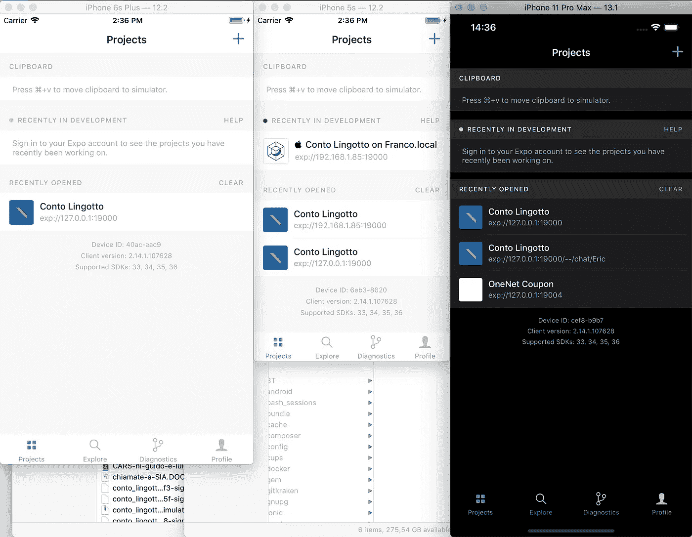
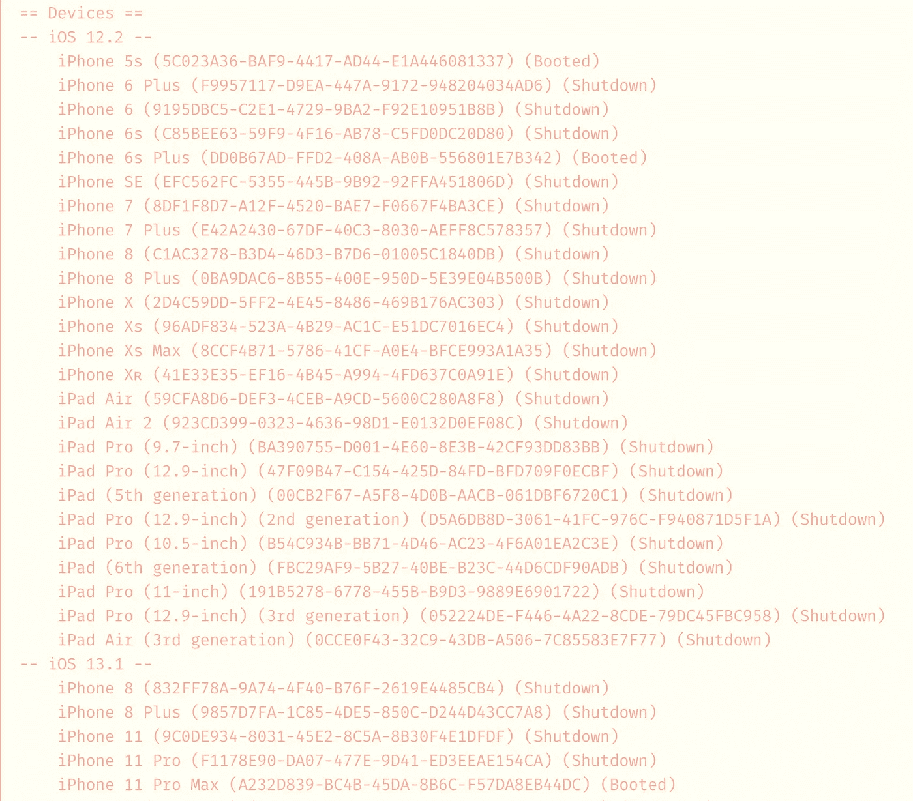
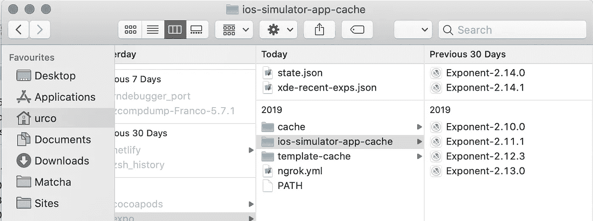

# 如何在 Expo 上同时启动 iOS 模拟器的多个实例

> 原文：<https://itnext.io/start-multiple-instances-of-ios-simulator-simultaneously-on-expo-dfa8dc6f3488?source=collection_archive---------4----------------------->

在我参与的每个 React 原生项目中，总有一个最害怕的时刻:检查你的应用程序是否在许多智能手机和 iOS/Android 版本上按预期运行(并尽可能与设计师共享的 ui 相似)。

默认情况下，Expo **只允许你通过 Expo 开发者工具打开一个 iOS 模拟器**,但是当你只打开一个设备时，很难检查布局是否按预期工作(以及检查当前的修复是否破坏了其他任何东西)。



你总是可以手动打开 iOS 模拟器的多个实例，在每个实例上安装 Expo 应用程序，然后启动应用程序，但如果你每天都需要这样做，或者如果你误按了 **cmd+q** ，那就太浪费时间了。

# 拯救脚本

为了解决这个问题，**我们可以创建一个 bash 脚本**，它可以自动启动 iOS 模拟器，安装最新版本的 Expo 应用程序，并启动你的应用程序。

## 1.找到您想要启动的设备的 id👀

最好的方法是打开你的终端并启动

```
xcrun simctl list
```

这将输出您的 Mac 上所有可用的模拟器。它们已经按照 iOS 版本和设备类型进行了排序。



我们将推出 3 款设备:一款 iPhone 5s、一款 iPhone 6s Plus 和一款 iPhone 11 Pro Max。让我们复制他们的 id(设备名称后面的字母数字字符)并保存以备后用。

> 5c 023 a 36-ba F9–4417-AD44-e1a 446081337
> 
> dd0 b 67 ad-ffd 2–408 a-AB0B-556801 e7b 342
> 
> a232d 839-BC4B-45DA-8B6C-f 57 da 8 EB 44 DC

## 2.查找最新版本的世博会应用程序

我们需要知道将安装在模拟器上的世博会应用程序客户端的最新版本(截至 2020 年 1 月，这是 2.14.1)。

这个应用程序已经存在于你的 Mac 电脑的 Expo 缓存中，所以我们只需要转到这个文件夹

```
~/.expo/ios-simulator-app-cache
```

而且你会发现 Expo 已经下载的所有 app 版本。



## 3.创建脚本👨‍💻

创建一个名为 start_simulators.sh 的文件(根据需要更改名称)并输入以下代码(我在这个 S [tackOverflow 答案](https://stackoverflow.com/questions/53924934/can-i-run-my-expo-app-on-multiple-ios-simulators-at-once)上找到了这个脚本，作者是 [Stephan Schlecht](https://stackoverflow.com/users/2331445/stephan-schlecht) ):

```
#!/bin/bash
declare -a simulators=(**"0FAE2F92-9EF7-4C4A-8F9D-097A056F8CC0" "BFCDD662-E4DE-4C08-9DF6-CAACA7C00CEC" "1A6959A0-C10F-474B-96C5-7E8955FBDD80"**)

for i in "${simulators[@]}"
do
    xcrun instruments -w $i
    xcrun simctl install $i ~/.expo/ios-simulator-app-cache/Exponent-**2.14.1**.app
    xcrun simctl openurl $i exp://127.0.0.1:19000      
done
```

如您所见，在这个脚本中，您需要输入模拟器 id 和(用引号和空格分隔)Expo 应用程序的最新版本。

现在您需要使这个脚本可执行:

```
chmod 755 start_simulators.sh
```

## 4.你想怎么用就怎么用，✨

现在，您可以在终端中输入命令

```
./start_simulators.sh
```

它将自动启动选定的模拟器，并安装 Expo 应用程序，在端口 19000 上打开 Expo 应用程序。

现在是时候修复 UI 错误了！