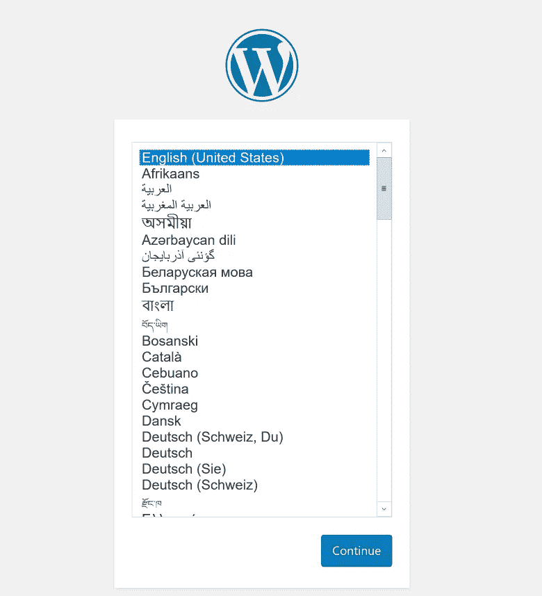

# 使用 kind 和 Docker 启动本地 Kubernetes

> 原文：<https://itnext.io/starting-local-kubernetes-using-kind-and-docker-c6089acfc1c0?source=collection_archive---------2----------------------->


# 介绍

你一整天都在尝试 Kubernetes 的教程吗？多亏了最新的工具，你不必这样做。

在本文中，我将展示使用 kind 在单个 Docker 容器中运行集群的步骤。

# 什么是善良？

> kind 是一个使用 Docker 容器“节点”运行本地 Kubernetes 集群的工具。
> [https://kind.sigs.k8s.io/](https://kind.sigs.k8s.io/)

似乎没有描述，但它显然来自“码头库贝内特斯”。它的优点是跨平台友好性，即使使用 Docker for Windows。当然，如你所见，缺点是糟糕的可搜索性。

# 安装类型

因为 kind 是在`go`中实现的，所以要确保安装了最新的`golang`。根据[投稿人文档](https://kind.sigs.k8s.io/docs/contributing/getting-started/)，`go1.11.5`以上优先。
要安装 kind，运行以下命令(需要一段时间)

```
go get -u sigs.k8s.io/kind
kind create cluster
```

然后确认“种类”群集可用。

```
kind get clusters
```

# 设置 kubectl

此外，使用[自制](https://brew.sh/)或[巧克力](https://chocolatey.org/)安装最新的`kubernetes-cli`。
最新的 Docker 有 Kubernetes 的功能，但它可能会有旧的`kubectl`。通过运行以下命令检查其版本。

```
kubectl version
```

确保它显示`GitVersion: "v1.14.1"`或以上。
如果你发现你正从 Docker 运行`kubectl`，尝试`brew link`或重新排序 path 环境变量。

一旦`kubectl`和 kind 准备就绪，打开 bash 控制台并运行这些命令。

```
export KUBECONFIG=”$(kind get kubeconfig-path)”
kubectl cluster-info
```

如果种类设置正确，将会显示一些信息。现在你已经准备好继续了。耶！

# 部署第一个应用程序

我们应该在集群上部署什么？一个不错的选择是 Wordpress，因为它由 MySQL 和 PHP 应用程序组成。幸运的是，有一个官方教程描述得很好。我们可以使用我们刚刚创建的类集群来尝试它的大多数步骤。

[https://kubernetes . io/docs/tutorials/stateful-application/MySQL-WordPress-persistent-volume/](https://kubernetes.io/docs/tutorials/stateful-application/mysql-wordpress-persistent-volume/)

首先从页面下载`mysql-deployment.yaml`和`wordpress-deployment.yaml`。

并通过运行两个`cat`命令来创建`kustomization.yaml`。
一旦那些`yaml`文件准备好了，按如下布局，

```
k8s-wp/
  kustomization.yaml
  mysql-deployment.yaml
  wordpress-deployment.yaml
```

然后将它们应用到集群中。

```
cd k8s-wp
kubectl apply -k ./
```

如果命令成功，您将看到如下输出。

```
secret/mysql-pass-7tt4f27774 created
service/wordpress-mysql created
service/wordpress created
deployment.apps/wordpress-mysql created
deployment.apps/wordpress created
persistentvolumeclaim/mysql-pv-claim created
persistentvolumeclaim/wp-pv-claim created
```

让我们通过键入以下命令来检查群集的状态:

```
kubectl get secrets
kubectl get pvc
kubectl get pods
kubectl get services wordpress
```

等到所有的豆荚都变成`Running`状态。
然后，运行这个命令来访问服务。

```
kubectl port-forward svc/wordpress 8080:80
```

并打开 [http://localhost:8080/](http://localhost:8080/)



瞧啊。
如果您想要检查数据库，请检查您的 pod，运行这样的命令并打开您的客户端应用程序。

```
kubectl port-forward wordpress-mysql-bc9864c58-ffh4c 3306:3306
```

# 结论

kind 是 minikube 的一个很好的替代品，因为它只使用 Docker 的单个容器。通过结合 Kubernetes 1.14 中集成的 Kustomze，在您的本地机器上尝试它是非常简单的。