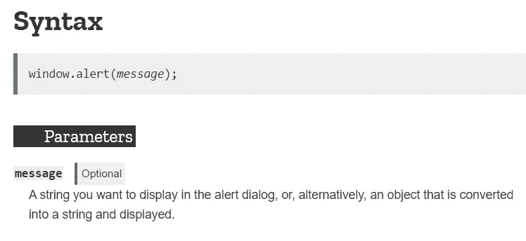
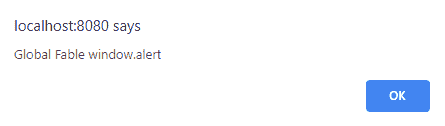
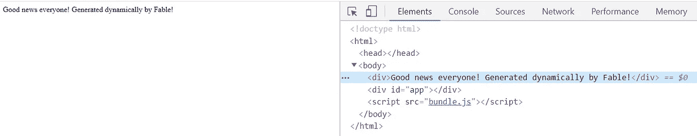

# 从寓言开始(F#)

> 原文：<https://itnext.io/starting-with-fable-f-83846ab790ad?source=collection_archive---------2----------------------->


丹尼尔·罗在 [Unsplash](https://unsplash.com?utm_source=medium&utm_medium=referral) 上的照片

> *https://github.com/semuserable/fable-basic-interop:*[](https://github.com/semuserable/fable-basic-interop)

# *前言*

*喜欢`F#`，有点不喜欢香草`JavaScript`。当我发现你可以用`F#`写前端时，我很困惑。我就是这样遇到[寓言](https://fable.io/)的——一个通过[巴别塔](https://babeljs.io/)把`F#`翻译成`JavaScript`的编译器。已经有太多不同的语言可以转换成 T5。那么，为什么具体选择`F#`？*

*这不是一个关于`F#`的教程，所以我想建议看看很棒的[fsharpforunandprofit](https://fsharpforfunandprofit.com/)，你可以自己决定。但对我个人来说，`F#`是一种非常强大、实用的函数式语言，它允许编写简洁、静态类型(防弹！)没有任何语义噪音的代码。*

*我想用静态类型语言写前端。今天，如果你想写“带类型的 JavaScript”，那么`TypeScript`是事实上的标准。但是，你必须明白`TypeScript`到底带来了什么。你必须做好心理准备。如果你太习惯于无类型(动态)代码，迁移到`TypeScript`会很痛苦。你必须接受这些类型并学会如何使用它们，否则你将会写同样的老一套。*

*对我来说，`Fable`是一个艰难的开始。这是一项新技术，由于`F#`在野外并不普遍(与`JavaScript`、`TypeScript`相比)，关于`Fable`的信息也很少。当你只想从简单开始时，官方的示例项目并不容易理解。他们通常涉及一些修修补补。*

*所以，我决定创建一个简单易懂的教程，告诉你如何从今天开始使用`Fable`。我想具体地宣传一下`F#`和`Fable`，这样更多的人可以尝试使用它。*

*我希望你会喜欢它。尽情享受吧！*

# *工具*

*在开始之前，确保你已经安装了所有的东西。*

*   *[节点](https://nodejs.org/en/)与 [npm](https://www.npmjs.com/)*
*   *[点网核心 SDK](https://dotnet.microsoft.com/download)*
*   *`IDE` -我个人使用 [JetBrains Rider](https://www.jetbrains.com/rider/) ，但是你可以选择 [Visual Studio Code](https://code.visualstudio.com/) 带 [ionide plugin](http://ionide.io/) 或者 [Visual Studio](https://visualstudio.microsoft.com/)*

# *拔靴带*

*我们先来了解一个简单的`Fable` app 的基本文件夹结构。我更喜欢从简单开始，并在此基础上进行构建。*

*为了启动一个项目，你可以使用官方指南，但就我个人而言，我不怎么使用这种方法。你会被重定向到`fable2-sample` [仓库](https://github.com/fable-compiler/fable2-samples)，但是在里面导航就没那么方便了(至于我的口味)。有许多不同设置的项目，很难找到一个真正“空”的项目。即使是“最小的”也不是“最小的”，并且包含`Fable.React`、`Fable.Elmish.React`依赖项。对于一个刚开始工作的人来说，这可能会让人不知所措。*

> **我仍然强烈推荐检查* `*fable2-sample*` *，因为它包含了大量不同的方法，你可以在* `*Fable*` *中使用。**
> 
> **最新* `*Fable*` *版本是* `*3*` *，所以你可以认为* `*fable2-sample*` *包含了过时的项目，这是不正确的。所有项目都是最新版本。**

*在`dotnet`世界中，我们使用`dotnet new`命令开始新项目。我想用`Fable`做同样的事情，但是没有官方的模板。这就是为什么我创建了[模板](https://github.com/semuserable/Semuserable.Fable.Templates)项目，你只需输入`dotnet new fable-empty`就可以创建一个没有多余依赖的空项目。*

*是时候创建一个新的空项目了。*

*   *安装模板*

```
*dotnet new -i Semuserable.Fable.Templates::**
```

*   *创建一个文件夹并移入其中*
*   *奔跑*

```
*dotnet new fable-empty*
```

> **如果要卸载模板，运行* `*dotnet new -u Semuserable.Fable.Templates*`*

*创建一个最小的`Fable`项目。*

*让我们确保一切正常*

*   *执行`npm install`*
*   *执行`npm start`*
*   *打开`[http://localhost:8080](http://localhost:8080)`*
*   *按下`F12`并打开`Console`标签*

*这里我们可以看到`Hello from Fable!`*

# *项目结构*

*每个寓言项目可以分为两个方面*

*   *`JavaScript`端- `webpack`、`npm`、静态内容(`.html`、`.css`等)*
*   *`Fable`侧- `F#`项目*

```
*- public 
    | index.html 
- src 
    | App.fs 
    | App.fsproj 
| package.json 
| package-lock.json 
| webpack.config.js*
```

*   *`public` -静态内容*
*   *`src` - `F#`项目(`Fable`)本身*
*   *`package.json`、`package-lock.json` - `npm`依赖关系*
*   *`webpack.config.js` -网络包配置*

*在本教程中，我将使用`Fable.Core`库，没有任何额外的依赖。*

# *JavaScript 端*

*为了让`Fable`与`JavaScript`生态系统互操作，我们必须确保所有需要的库都安装了`npm`。对于这样一个简单的例子，我们不会使用很多依赖项，只使用核心依赖项来启动开发服务器并运行`Fable`编译器。*

*让我们快速回顾两个重要文件— `package.json`和`webpack-config.js`*

*   *打开`package.json`*

```
*{
  "name": "App",
  "private": false,
  "scripts": {
    "start": "webpack-dev-server"
  },
  "dependencies": {
    "@babel/core": "^7.7.7",
    "fable-compiler": "^2.4.12",
    "fable-loader": "^2.1.8",
    "webpack": "^4.41.5",
    "webpack-cli": "^3.3.10",
    "webpack-dev-server": "^3.10.1"
  }
}*
```

*这里我们看到启动服务器所需的最小依赖。有`Fable`具体的有:`fable-compiler`和`fable-loader`。*

*   *打开`webpack.config.js`*

```
*// Note this only includes basic configuration for development mode.
// For a more comprehensive configuration check:
// https://github.com/fable-compiler/webpack-config-template

var path = require("path");

var contentFolder = "./public";

module.exports = {
    mode: "development",
    entry: "./src/App.fsproj",
    output: {
        path: path.join(__dirname, contentFolder),
        filename: "bundle.js",
    },
    devServer: {
        contentBase: contentFolder,
        port: 8080,
    },
    module: {
        rules: [{
            test: /\.fs(x|proj)?$/,
            use: "fable-loader"
        }]
    }
}*
```

*非常基本的`webpack`配置。我们现在需要知道的是，内容将从`./public`文件夹提供(必须在那里创建`index.html`)，服务器将监听端口`8080`并且`bundle.js`(一个应用程序)将在`./public`文件夹中生成。*

# *寓言一面*

*这里我们有一个非常基本的`.fsproj`项目设置。`App.fsproj`是一个[网络标准](https://docs.microsoft.com/en-us/dotnet/standard/net-standard)应用程序，而`App.fs`包含实际的`Fable`应用程序。*

*在您选择的 IDE 中加载`src/App.fsproj`项目并打开`App.fs`文件。*

```
*module App

// import Fable core types
open Fable.Core 

// JavaScrpt interop call
JS.console.log "Hello from Fable!"*
```

*默认情况下，我们只是将一些信息写入`JavaScript`控制台。在`log`中输入一些新东西，刷新页面-[http://localhost:8080](http://localhost:8080)。*

*那是由`Fable.Core`库提供的一些非常基本的互操作。*

# *基本互操作*

*为了充分利用`Fable`和`F#`的能力，我们需要编写一些互操作代码来将`F#`和`JavaScript`粘合在一起。我们最起码的工作是理解如何将`JavaScript`类型映射到`F#`类型。我们还可以使用一些助手形式的`TypeScript` [类型定义文件](https://github.com/DefinitelyTyped/DefinitelyTyped)，稍后会详细说明。*

*有一个官方的[寓言互操作文档](https://fable.io/docs/communicate/js-from-fable.html)，你可以自己尝试。有了互操作知识，我们就可以开始自己实现它了。*

*在本教程中，我们将实现`window.alert()`(在`Fable.Core`中没有)；`Math.random()`(在`Fable.Core`中存在，但我们仍然会实现它，我还会展示如何找到默认情况下实现了什么，没有实现什么)，一点点`DOM` API 和`p5.js` lib。*

# *window.alert()*

*先说`window.alert()`。首先，我们需要理解我们试图在这里实现什么。这是一个`JavaScript`库，一个`React`组件(在真实的`Fable`应用中大量使用，但我们不会在这里触及它)还是什么东西`global`？*

*`window`是`JavaScript`中的全局对象。接下来的事情，`alert()` call 实际上是做什么的？它接受参数吗？这些问题通常由[综合文档](https://developer.mozilla.org/en-US/docs/Web/API/Window/alert)来回答。让我们打开它，看看它能有什么帮助。从文档中，我们看到`alert`函数接受一个类型为`string`的可选参数。*

**

*windows . alert*

*现在我们有了实施`F#`所需的所有信息。我们试试吧！*

*打开`App.fs`写*

```
*// interface
type Window =
    // function description
    abstract alert: ?message: string -> unit

// wiring-up JavaScript and F# with [<Global>] and jsNative
let [<Global>] window: Window = jsNative

// client calls
window.alert ("Global Fable window.alert")
window.alert "Global Fable window.alert without parentheses"*
```

*这里我使用了一种`F# interface`方法，它通过一些`interface`魔法描述了`JavaScript`和`F#`之间的映射。*

*如果您在之前的`npm start`之后仍有流程在运行，只需保存并重新加载页面。您应该会看到两个连续的警告弹出窗口！*

**

*让我们尝试另一种方法。*

```
*// Special attribute for mapping, $0 == message parameter
[<Emit("window.alert($0)")>]
let alert (message: string): unit = jsNative

alert ("Emit from Fable window.alert")
alert "Emit from Fable window.alert without parentheses"
"Emit from Fable window.alert with F# style" |> alert*
```

*您可以选择您想要的任何方法，这主要取决于您的风格或您试图合并的库。*

> *你注意到这两个电话之间的细微差别了吗？前一个调用有一个可选参数，而后一个是必需的。*

# *Math.random()*

*下一个是`Math.random()`。利用我们已经获得的知识，我们知道`math`在`JavaScript`中也是一个全局对象。如果你不确定，你可以随时查看官方文件。*

```
*// interface
type Math =
    abstract random: unit -> float

let [<Global>] Math: Math = jsNative

// client call
JS.console.log (Math.random())*
```

*很简单，但是我想指出一件重要的事情。你有没有注意到我们在使用`jsNative`的地方写的是`Math`而不是`math`？这是因为通过这样导入，你必须确保`F#`名与`JavaScript`名完全相同。`JavaScript` API 是`Math.random()`，不是`math.random()`。*

*另一个*

```
*[<Emit("Math.random()")>]
let random(): float = jsNative

JS.console.log (random())*
```

*`Math.random()`在[寓言中实现。核心](https://github.com/fable-compiler/Fable/blob/972505785486fe003ab70764544c2cf498e32fcd/src/Fable.Core/Fable.Core.JS.fs#L84)，不需要重新创建。你可以通过查看官方的`Fable`包来发现哪些实现了，哪些没有实现。*

*重新加载页面并检查控制台(`F12`->-`Console`)*

**

# *数字正射影像图*

*现在，我们将和`DOM`一起工作！我们将创建一个包含文本的`div`元素，并将它附加到某个`div`上。*

*下面是我们将从`JavaScript`开始实现的内容*

```
*// https://developer.mozilla.org/en-US/docs/Web/API/Document/createElement#JavaScript

var newDiv = document.createElement("div"); 
var newContent = document.createTextNode("Hi from F# Fable!"); 
newDiv.appendChild(newContent);  

var currentDiv = document.getElementById("app"); 
document.body.insertBefore(newDiv, currentDiv);*
```

*好的，我们需要明白我们想要一个新的`div`连接在哪里。你还记得`index.html`文件吗？是时候打开了——`project_folder/public/index.html`。*

*打开`index.html`并在`script`上方添加`<div id="app"></div>`*

```
*<!DOCTYPE html>
<html>
    <body>
        <div id="app"></div>
        <script src="bundle.js"></script>
    </body>
</html>*
```

*我们会在`app` div 之前加入新的东西。*

*我们应该从哪里开始呢？同样，文档。我们需要理解我们将要使用的函数。*

*   *[document . createelement()](https://developer.mozilla.org/en-US/docs/Web/API/Document/createElement#Syntax)—返回作为[节点](https://developer.mozilla.org/en-US/docs/Web/API/Node)的[元素](https://developer.mozilla.org/en-US/docs/Web/API/Element)*
*   *[document . create Text Node()](https://developer.mozilla.org/en-US/docs/Web/API/Document/createTextNode#Syntax)—返回[文本](https://developer.mozilla.org/en-US/docs/Web/API/Text)，它是[节点](https://developer.mozilla.org/en-US/docs/Web/API/Node)*
*   *[Node.appendChild()](https://developer.mozilla.org/en-US/docs/Web/API/Node/appendChild) —返回[节点](https://developer.mozilla.org/en-US/docs/Web/API/Node)*
*   *[document . getelementbyid()](https://developer.mozilla.org/en-US/docs/Web/API/Document/getElementById#Syntax)—返回作为[节点](https://developer.mozilla.org/en-US/docs/Web/API/Node)的[元素](https://developer.mozilla.org/en-US/docs/Web/API/Element)*
*   *[Node.insertBefore()](https://developer.mozilla.org/en-US/docs/Web/API/Node/insertBefore#Syntax) —返回[节点](https://developer.mozilla.org/en-US/docs/Web/API/Node)*

*通过使用文档中的信息，创建下面的`F#`结构*

```
*// interfaces
type Node =
    abstract appendChild: child: Node -> Node
    abstract insertBefore: node: Node * ?child: Node -> Node

type Document =
    abstract createElement: tagName: string -> Node
    abstract createTextNode: data: string -> Node
    abstract getElementById: elementId: string -> Node
    abstract body: Node with get, set

let [<Global>] document: Document = jsNative

// client code
let newDiv = document.createElement("div")

"Good news everyone! Generated dynamically by Fable!"
|> document.createTextNode
|> newDiv.appendChild
|> ignore

let currentDiv = document.getElementById("app")
document.body.insertBefore (newDiv, currentDiv) |> ignore*
```

> **注意，我实现了* `*document.createElement*` *，但没有在文档中可选的* `*options*` *参数。那完全没问题。**

*   *按下`Ctrl-Z`关闭`npm`过程。`public`文件夹中的`index.html`不能自动重装。*
*   *运行`npm start`*

*在浏览器中打开`http://localhost:8080/`看看吧！*

**

*如果你想使用`DOM`你不需要从头开始重新创建所有的绑定，有一个官方的库！叫做[寓言。Browser.Dom](https://github.com/fable-compiler/fable-browser/tree/master/src/Dom) 。此外，在这个[官方库](https://github.com/fable-compiler/fable-browser)中实现了所有其他种类的默认内容。*

*现在你知道如何通过`Fable`与`DOM`一起工作了。*

# *p5.js*

*是时候实现第三方库的某些部分了。我选择了 [p5js](https://p5js.org/) 因为它是一个绘制图形和动画的库！*

*停止当前的`npm`进程(`Ctrl+Z`，移动到项目的根目录并运行*

```
*npm install p5 --save*
```

*`p5.js`安装在本地，随时可以使用。是时候写点绑定了！*

*这里我们可以采取几种方法。我们可以打开`node_modules/p5/lib/p5.js`尝试破译函数和类型，但我个人不建议在有机会接触源代码的情况下这么做(除非你别无选择)。因为`node_modules`中存储的内容可能是压缩/删节/缩小版的库。*

*第一种方法是检查项目的源代码。像 [p5 构造器](https://github.com/processing/p5.js/blob/master/src/core/main.js#L35-L36)和 [createCanvas](https://github.com/processing/p5.js/blob/master/src/core/rendering.js#L51) 。*

*下一个方法是通过[确定类型](https://github.com/DefinitelyTyped/DefinitelyTyped)来检查`TypeScript`类型定义文件。我强烈建议你也去看看其他的图书馆。以`p5.js`为例，我们有 [p5 构造器类型定义](https://github.com/DefinitelyTyped/DefinitelyTyped/blob/master/types/p5/index.d.ts#L88)和 [createCanvas 类型定义](https://github.com/DefinitelyTyped/DefinitelyTyped/blob/master/types/p5/src/core/rendering.d.ts#L27)。这个方法很酷的一点是，我们已经有了可以直接(不总是但仍然)转换成`F#`类型的类型，但是我们应该手动完成。*

*最后的方法是使用[ts2 寓言](https://fable.io/ts2fable/)工具将`TypeScript`定义文件转换成`F#`本身！它类似于第二种方法，但是是自动的。你只要提供`*.ts`文件，它就输出`F#`类型！多酷啊。但是请注意，这个输出并不总是您想要包含在最终绑定中的。你需要检查它是否是你真正需要的。`TypeScript`和`F#`型系统有些不同，必须手动检查。*

*有了这些知识，我们终于可以编写一些`p5.js`与`Fable`的绑定了。*

```
*open Fable.Core

// p5.js interface
[<StringEnum>]
type Renderer =
    | [<CompiledName("p2d")>] P2D
    | [<CompiledName("webgl")>] WebGL

type [<Import("*", "p5/lib/p5.js")>] p5(?sketch: p5 -> unit, ?id: string) =    
    member __.setup with set(v: unit -> unit): unit = jsNative
    member __.draw with set(v: unit -> unit): unit = jsNative
    member __.createCanvas(w: float, h: float, ?renderer: Renderer): unit = jsNative
    member __.background(value: int): unit = jsNative
    member __.millis(): float = jsNative
    member __.rotateX(angle: float): unit = jsNative
    member __.box(): unit = jsNative

// client code
let sketch (it: p5) =
    it.setup <- fun () -> it.createCanvas(300., 300., WebGL)
    it.draw <- fun () ->
        it.background(255)
        it.rotateX(it.millis() / 1000.)
        it.box()

// draw    
p5(sketch) |> ignore*
```

*瞧啊！*

**

*本教程到此为止。最终项目可以在[这里](https://github.com/semuserable/fable-basic-interop)找到。*

*感谢阅读，我希望它是有帮助的！*

# *额外资源*

*   *[寓言 io](https://fable.io/) —官方网站*
*   *[寓言 REPL](https://fable.io/repl/)——准备用 REPL 风格的项目*
*   *[寓言社区](https://fable.io/community/) —库、项目、模板*
*   *[令人敬畏的寓言](https://github.com/kunjee17/awesome-fable)——有用的`Fable`善良的精选清单，灵感来自[令人敬畏的](https://github.com/sindresorhus/awesome)*

**原载于 2020 年 2 月 1 日*[*https://dev . to*](https://dev.to/semuserable/starting-with-fable-f-kbi)*。**