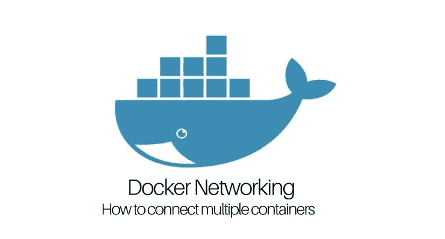
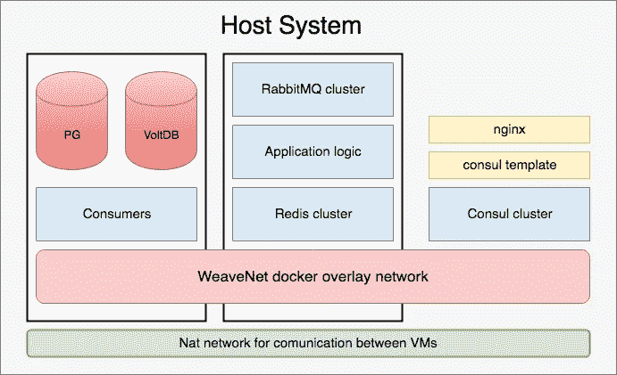

# 启动。简单的生产设置。

> 原文：<https://itnext.io/startup-simple-production-setup-27de280c4159?source=collection_archive---------2----------------------->

## 第 1 部分—编织网。Docker 覆盖网络。

你好，你好。我开始讲述我的第一个上市公司的故事，我想展示我从研究和调查到上市候选人的所有步骤。我会把一个大故事分成几个逻辑部分，这样就不会让阅读变得困难。每个部分都将包含生产使用的技术理念和细节。这是一家初创公司，所以不是所有的事情都是理想的:)



## 五金器具

生产服务器将被托管在[赫茨纳](https://www.hetzner.de/)上。它不是一个强大的服务器，但它足以测试生产架构和低负载公共使用的开放启动。

服务器配置:

*   8 个 CPU
*   64GB 内存
*   2 块 500GB 固态硬盘
*   最低安装 Ubuntu 18.04 LTS

## 软件

*   虚拟化 KVM
*   集装箱码头编号 18.06.0-ce
*   [咨询](https://www.consul.io/) —服务发现和键值存储
*   [Redis](https://redis.io/) —键值存储和会话存储
*   [RabbitMQ](https://www.rabbitmq.com/) —排队系统
*   [Postgresql](https://www.postgresql.org/) —持久数据库
*   [VoltDB](https://www.voltdb.com/) —分析系统和即席查询系统
*   [WeaveNet](https://www.weave.works/) —集装箱通信网络覆盖
*   [Go](https://golang.org/) —应用逻辑的主要语言

## 体系结构

两台虚拟机将放置在主机上。第一个具有 2 个 CPU 的虚拟机—用于数据库(Postgresql 用于配置、授权、应用程序配置等。用于实时分析和特别查询的 VoltDB)。第二个具有 4 个 CPU 的虚拟机—用于应用程序逻辑。

主机也有 docker，用于协商集群。所有应用程序配置、参数、健康检查、服务发现都将放在那里。Consul 将生成 nginx 上游配置，用于平衡容器之间的流量。



体系结构

## 目标

1.  建立稳定的生产环境
2.  通过负载和逻辑在主机之间逻辑分离容器
3.  容器应该可以从任何主机上看到

因此，我们的虚拟环境是完全配置的，docker 安装在每台主机上，主机通过网络和 iptables 是可见的，没有任何限制。我们的虚拟网络配置如下:

*   主机虚拟机— 192.168.123.1。主机虚拟机具有公共 IPv4 和公共 IPv6 网络。
*   工作虚拟机— 192.168.123.11
*   数据库虚拟机— 192.168.123.15

Docker 网络具有默认的 bridge0 接口，其范围为 172.17.0.0/16。

对于编织网，我将使用 172.20.0.0/16 范围。

## 编织网装置

[Weave Net 文档](https://www.weave.works/docs/net/latest/concepts/)是理解覆盖网络如何工作以及如何设置它以适应不同环境的良好起点。我选择这个网络是因为它不需要安装额外软件，易于配置和管理子网，易于添加/删除新主机。

*   安装编织网络二进制

```
**curl** -L git.io/weave -o /usr/local/bin/weave
**chmod** a+x /usr/local/bin/weave
```

> 根据文档，Weave Net 定期检查自己的 CDN 是否有新版本。要禁用此功能，只需在启动编织网之前**导出检查点 _ 禁用=1** 。

*   与同行推出织网。从*根*用户在主机和虚拟机上执行该命令。

```
**weave launch** --ipalloc-range=172.20.0.0/16 192.168.123.11 192.168.123.1 192.168.123.15
```

*   编织网状态

```
# **weave status**Version: 2.4.0 (up to date; next check at 2018/08/02 15:50:56)Service: router
       Protocol: weave 1..2
           Name: d2:15:65:66:6f:e1(worker)
     Encryption: disabled
  PeerDiscovery: enabled
        Targets: 1
    Connections: 1 (1 established)
          Peers: 2 (with 2 established connections)
 TrustedSubnets: noneService: ipam
         Status: ready
          Range: 172.20.0.0/16
  DefaultSubnet: 172.20.0.0/16Service: dns
         Domain: weave.local.
       Upstream: 127.0.0.53
            TTL: 1
        Entries: 0Service: proxy
        Address: unix:///var/run/weave/weave.sockService: plugin (legacy)
     DriverName: weave
```

*   默认情况下，您不能通过主机访问覆盖网络。为此，只需从池中暴露 IP。下一个命令显示 IP，将路由添加到路由表，并创建所需的 iptables 规则

```
**weave expose**
```

*   如果你想从另一个不存在编织网的主机连接到编织网中的容器，你应该添加 ***路由*** 到存在暴露 IP 的主机

```
**ip route** add <weave subnet> via <host IP>
#example
#ip route add 172.20.0.0/16 via 192.168.120.11
```

*   部署 BusyBox 容器

```
**eval** $(weave env)
**docker** run -it --rm busybox
```

在不同主机上启动几个 BusyBox 并尝试 ping 它。所有应该工作！

> 在启动任何类型的容器之前，如果你想把它放到编织子网中，执行 **eval $(weave env)** 。

*   **编织报告** —返回编织网络的完整报告
*   **编织状态** —编织网络返回状态
*   **编织隐藏** —隐藏之前暴露的 IP 地址，用于主机系统和 docker 容器之间的通信

## 结论

Weave Net 是一个独立 docker 引擎的更简单的网络覆盖，没有任何外部依赖性。易于安装和维护。可以像内部 DNS 一样用于解析容器名称。

## 待办事项

*   集成编织网与 Kubernetes 和独立的 docker 引擎。
*   通过 docker 部署容器-使用静态 IP 进行组合。