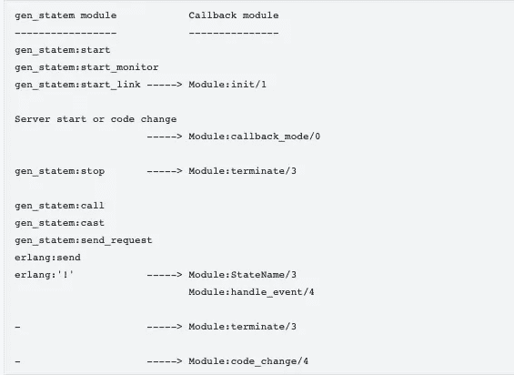
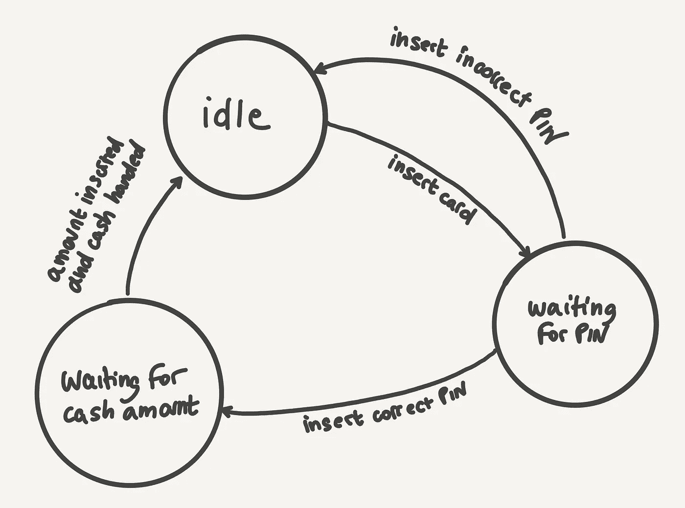
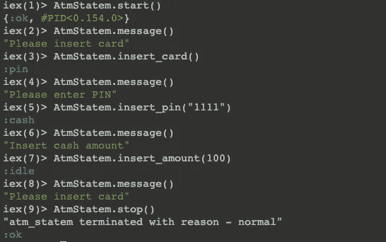
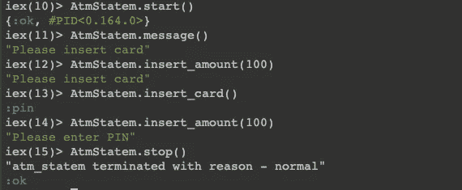

# Elixir 中的状态机使用 Erlang 的 gen_statem 行为

> 原文：<https://itnext.io/state-machine-in-elixir-using-erlangs-gen-statem-a3f90d5c536?source=collection_archive---------1----------------------->

inite 状态机是程序中常见的现象，程序需要维护多个状态，并根据一定的动作在它们之间进行转换。Erlang 的 [**gen_statem**](https://www.erlang.org/doc/man/gen_statem.html) 提供了一个通用的状态机行为。在本文中，我将使用`**gen_statem**`实现一个简单的 ATM 取款状态机。

## gen_statem 概述

`**gen_statem**`在 OTP 19.0 中引入。以前，Erlang 有用于实现状态机的`**gen_fsm**`模块。哪个`**gen_fsm**`保留在 OTP 中，新代码应该使用`**gen_statem**`。

像 Erlang 中的任何通用行为一样，`**gen_statem**` module 提供了许多 API 和回调函数，这些 API 和回调函数需要由使用该行为的模块来实现。如该行为的官方手册所述，行为函数和回调之间的关系如下



https://www.erlang.org/doc/man/gen_statem.html

`**gen_statem**`支持两种不同的回调模式—

*   **state_functions** —每个状态由一个回调函数表示(*本文将使用这种模式*)
*   **handle _ event _ functions**—一个处理所有状态的中央回调函数(*你可以在官方手册中看到这种模式的例子—*[*https://www.erlang.org/doc/man/gen_statem.html*](https://www.erlang.org/doc/man/gen_statem.html))

我觉得`state_functions`更直观。在本文中，我将使用`state_functions`和必要的函数和回调来实现下面的 ATM 取款状态机—



src:[https://andrealeopardi . com/posts/connection-managers-with-gen _ statem/](https://andrealeopardi.com/posts/connection-managers-with-gen_statem/)

## 状态和动作

重要的是要识别状态和每个状态中可能的动作，以正确地确定状态转换。状态和动作用原子来表示。根据上图，我们可以列出如下的状态和相应的动作。—

*   **:空闲**(初始状态)——动作:**:插卡**
*   :**引脚**(等待引脚)—动作:**:插入 _ 正确 _ 引脚**，**:插入 _ 错误 _ 引脚**
*   :**现金**(等待现金)—动作:**插入 _ 金额**

在每个状态中，我还将有一个 **:message** 动作，返回一个用户友好的状态特定消息，而不改变状态。

## 履行

状态机的完整实现如下所示—

这里—

*   **第 2 行**:声明这是`**gen_statem**`行为的实现
*   **第 13 行**:从`**gen_statem**`模块调用`[**start/4**](https://www.erlang.org/doc/man/gen_statem.html#start-4)`。 **start/4** 参数是服务器名称、回调模块、将传递给相应`**init/1**`回调的参数、附加选项。
*   **第 31 行**:执行 **start/4** 时调用的`[**init/1**](https://www.erlang.org/doc/man/gen_statem.html#Module:init-1)`回调。 **start/4** 会等到 **init/1** 完成。正如我们看到的，它返回一个元组的形式—

```
{:ok, :idle, @idle_message}
```

这里，它用 **:idle** 初始状态初始化状态机。元组中的第三个值称为服务器数据，它不是状态的一部分，但可以用来存储它需要的任何服务器数据。这里，它返回被定义为模块属性的`**@idle_message**`。

*   **第 15 行**:从`**gen_statem**`模块调用`[**stop/1**](https://www.erlang.org/doc/man/gen_statem.html#stop-1)`。这个调用导致相应的`[**terminate/3**](https://www.erlang.org/doc/man/gen_statem.html#Module:terminate-3)`回调。
*   **第 33 行**:定义`[**terminate/3**](https://www.erlang.org/doc/man/gen_statem.html#Module:terminate-3)`回调，用于在`**gen_statem**`停止/终止前做任何必要的清理。
*   **第 17–28 行**:实现之前定义的动作 API。每个动作都会导致相应的状态特定的回调函数。我将解释:**引脚**状态和附属于它的动作。休息也要类似，容易跟上。

当 ATM 机处于 **pin 码**状态时，客户可以使用 api -输入 pin 码

```
def insert_pin(pin) when is_binary(pin) do
    case correct_pin?(pin) do
      true -> :gen_statem.call(@name, :insert_correct_pin)
      false -> :gen_statem.call(@name, :insert_wrong_pin)
    end
end
```

我有一个**正确 _pin？/1** 本地函数，返回真/假，并基于此调用两个`**gen_statem**` `[**call/2**](https://www.erlang.org/doc/man/gen_statem.html#call-2)`函数中的一个。`[**call/2**](https://www.erlang.org/doc/man/gen_statem.html#call-2)`是同步呼叫，等待回复到达。

相应的状态回调函数如下所示—

```
def pin({:call, from}, :insert_correct_pin, _data),
     do: {:next_state, :cash, @cash_message, [{:reply, from, :cash}]}

def pin({:call, from}, :insert_wrong_pin, _data),
     do: {:next_state, :idle, @idle_message, [{:reply, from, :idle}]}def pin(event_type, event_content, data),
     do: handle_event(event_type, event_content, data)
```

根据上述代码片段，如果收到`**:insert_correct_pin**`动作，ATM 机切换到下一个状态`**:cash**`，服务器数据`**@cash_message**`。它还用下一个状态(`:**cash**`)回复调用者(由`**from**`表示)。

如果收到`:**insert_wrong_pin**`动作，ATM 机切换到下一个状态`:**idle**` ，服务器数据`**@idle_message**`。它还用下一状态(`**:idle**` **)** 回复呼叫者(用`**from**`表示)。

如果执行了其他动作，包括`**:message**`动作，则调用内部回退功能`**handle_event/3**.`

*   **第 58–62 行**:实现内部功能`**handle_event/3**`。

由于在任何状态下都可以调用`:**message**` action，所以第一个子句将保持当前状态，并用当前状态特定数据(可以是@ idle _ message/@ pin _ message/@ cash _ message 之一)进行回复。

如果采取了某个未知的动作，则调用第二个子句，该子句也保持当前状态。

```
defp handle_event({:call, from}, :message, data),
       do: {:keep_state, data, [{:reply, from, data}]}defp handle_event({:call, from}, _, data),
      do: {:keep_state, data, [{:reply, from, data}]}
```

## 样本运行(有效操作)

具有有效动作的状态机的示例运行—



## 样本运行(无效操作)

带有一些无效操作的状态机运行示例—



## 附加注释

`**gen_statem**`还提供了 start 的链接版本，名为— `[**start_link**](https://www.erlang.org/doc/man/gen_statem.html#start_link-4)`。如果使用该版本，`**gen_statem**`模块应置于监督树下，以便自动重启。还有，对应`**call**`函数，有一个异步`[**cast/2**](https://www.erlang.org/doc/man/gen_statem.html#cast-2)`函数，不等待状态回调的回复就立即返回。

## **结论**

在本文中，我使用 Erlang 的 **gen_statem** 行为实现了一个样本 ATM 机取款状态机。这个项目的完整代码可以在这里找到—[https://github . com/imeraj/Elixir _ Playground/tree/master/ATM _ statem](https://github.com/imeraj/Elixir_Playground/tree/master/atm_statem)

*更多详细和深入的未来技术帖子请关注我这里或点击* [*twitter*](https://twitter.com/meraj_enigma) *。*