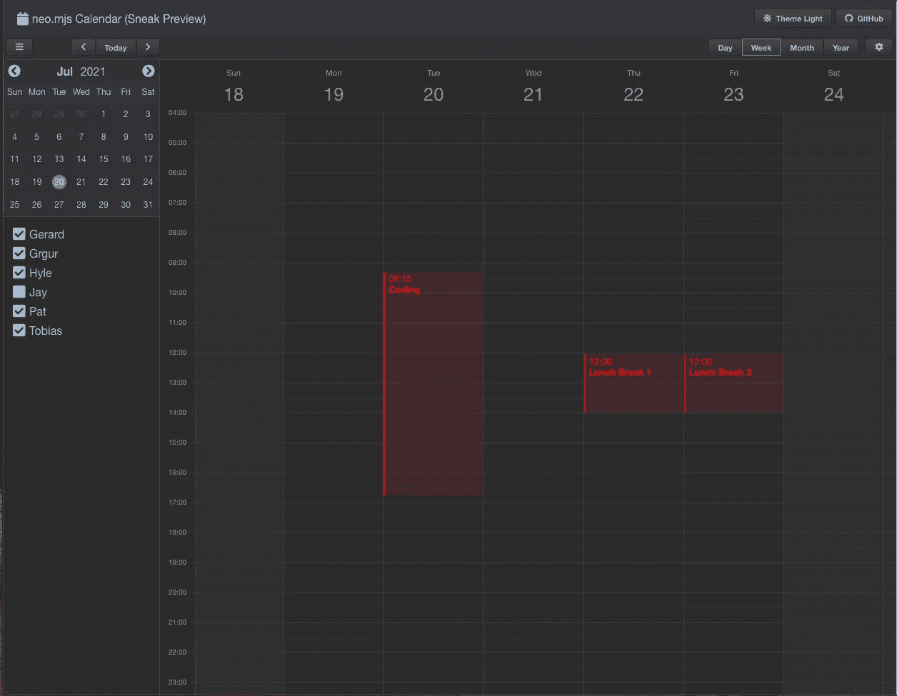
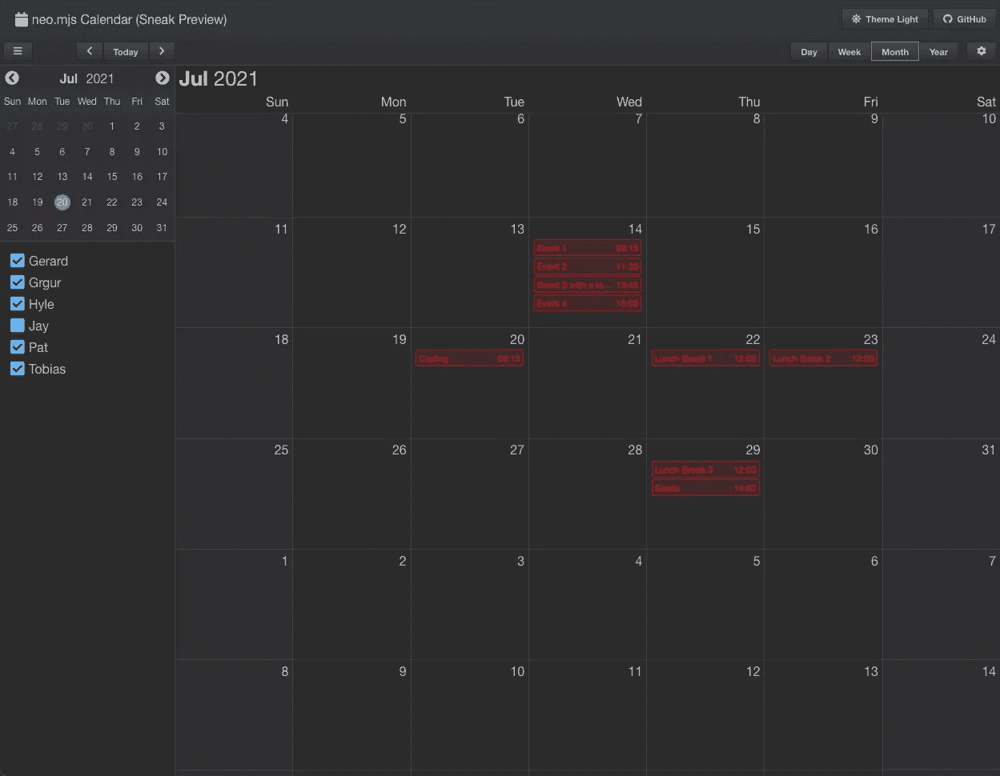
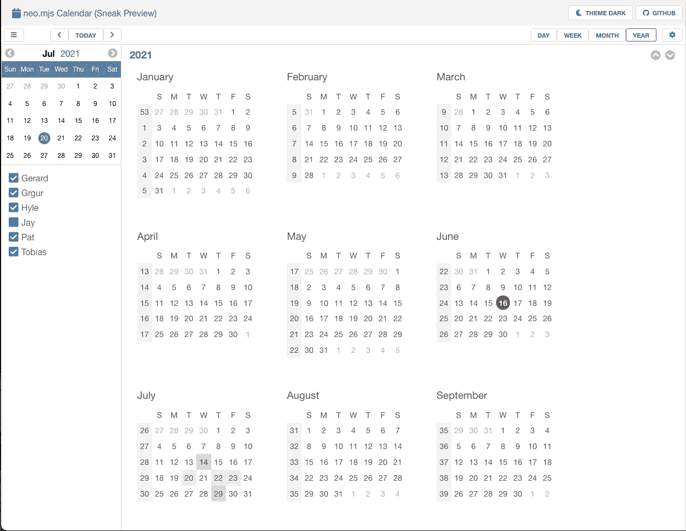
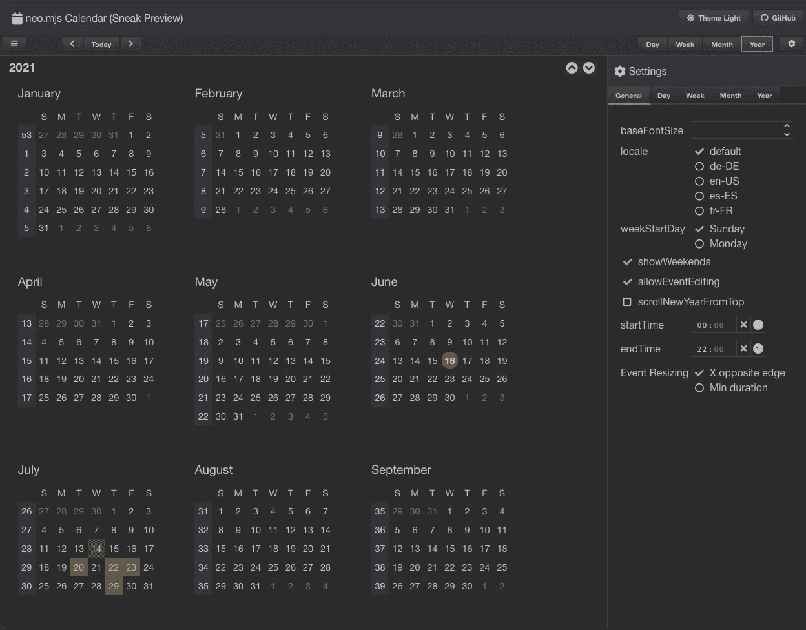
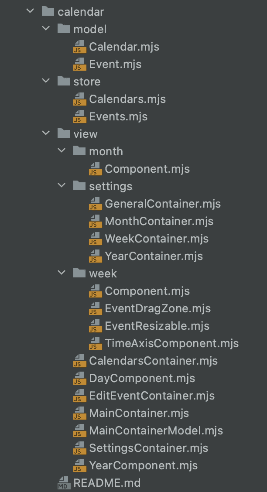

# 状态管理:双向绑定和增强的绑定格式化程序

> 原文：<https://itnext.io/state-management-two-way-bindings-and-enhanced-binding-formatters-f0e9419b7c6b?source=collection_archive---------2----------------------->

[neo.mjs](https://github.com/neomjs/neo) v2.0 版本的重点是新的视图模型实现，它使您能够绑定组件配置，以便在模型层次结构树中的任何位置查看模型数据属性。

本文涵盖了使复杂的基于应用程序的状态管理变得更加简单和强大的最新增强功能。

# 内容

1.  介绍
2.  真实世界的用例
3.  背景信息
4.  基于模板文本绑定格式化程序
5.  双向绑定
6.  布尔值的格式化程序
7.  数字格式化程序
8.  使用方法的格式化程序
9.  在后台
10.  接下来是什么？
11.  最后的想法

# 1.介绍

[neo.mjs](https://github.com/neomjs/neo) Javascript UI 框架的关键优势是什么？

1.  显然存在“应用程序工作人员是主要参与者”的范式。意思是:你的应用和组件存在于应用工作器范围内，这使得主线程大部分时间处于空闲状态。workers 设置带来了极快的性能和可伸缩性。最近使用了一个[消息通道](https://developer.mozilla.org/en-US/docs/Web/API/MessageChannel)用于应用程序← →数据工作者通信(发布消息不再需要通过主线程)变得更好了。
2.  config 系统(对 ES 类系统的定制增强)使得组件级的状态改变变得微不足道(几乎是同步的)，所以我们不需要钩子，可以简单地做更多的事情。
3.  基于定制 JSON 的虚拟 DOM 实现允许在运行时进行任何复杂的更改。这导致需要更少的组件类，并且能够相当容易地创建非常复杂的小部件。高级企业级 web 组件没有在 Angular 或 React 中创建是有原因的。
4.  视图模型和视图控制器使您能够以智能的方式处理基于应用程序(组件树)的状态逻辑，并解决前端开发环境正在处理的许多棘手问题。

虽然你基本上已经知道了第一点，但我不确定你是否已经理解了其他几点的意思。如果我在这里错了，请纠正我。

在推动核心和工具方面相当一段时间后(新的基于文件缓冲区的 SASS 主题引擎变得非常好！)，我决定在一个“垂直”上努力，而不是把更基础的部分推得更远。

对于 2.3 版本，日历实现是主要焦点，向您展示正确使用 [neo.mjs](https://github.com/neomjs/neo) 可以实现的全部功能。

# 1.真实世界的用例

如果您还没有看到日历实现的当前状态:



日历实现支持不同的时区、地区，并且是高度配置驱动的:您可以用多种方式定制小部件。

周、月和年视图已经支持无限滚动，周视图拖放实现非常接近本机 macOS 日历。

下面是一个简短的视频来看看它是如何工作的:

如果您试图用 Angular 或 React 创建如此复杂的小部件，您很可能会得到大量基于组件的文件。对于 [neo.mjs](https://github.com/neomjs/neo) 来说绝对不是这样:



到目前为止，我一直坚持“不要使用视图模型来创建组件”的范例。我为日历小部件破例有两个原因:

1.  日历更像是一个应用程序，而不是一个组件，所以在这里使用顶层视图模型确实有意义。我们需要传递更少的配置给子视图。这种方法还将使您能够单独使用子视图。示例:您创建了一个应用程序，并且只想使用日历周视图。只需将视图模型添加到其中，就可以做到这一点。
2.  教育:v2 发行版的视图模型例子非常琐碎。我认为理解好处的最好方式是一个复杂的真实世界用例。研究代码库可以帮助你快速上手。

calendar 实现的一个非常好的方面是，非活动视图从真实的 DOM 中移除，同时保持 JS 组件实例活动。我们可以任意改变非活动视图的状态(配置),例如使用设置侧边栏。更改将在本地添加到虚拟 dom 中→被 vdom 引擎忽略，直到您再次激活视图。

您可以在这里找到代码库:

[](https://github.com/neomjs/neo/tree/dev/src/calendar) [## 近地天体

### 应用工人驱动的前端框架。通过创建一个关于…的帐户，为 neomjs/neo 开发做出贡献

github.com](https://github.com/neomjs/neo/tree/dev/src/calendar) 

这是在线演示(暂时是桌面)。

**发行/制作**
基于缩小的 webpack 构建无源地图:
[neo.mjs/dist/production/examples/calendar/basic/index.html](https://neomjs.github.io/pages/node_modules/neo.mjs/dist/production/examples/calendar/basic/index.html)

**开发模式**(仅限 Chromium 或 Safari 技术预览版)
直接在浏览器中运行真正的 JS 代码，不需要源代码:
[neo.mjs/examples/calendar/basic/index.html](https://neomjs.github.io/pages/node_modules/neo.mjs/examples/calendar/basic/index.html)


如你所见，它确实存在于应用程序工作器中。

# 3.背景信息

如果您想获得更多关于 v2 发行版的信息，或者更具体地关于视图模型实现的信息，我强烈建议您阅读博客:

[https://neomjs.github.io/pages/](https://neomjs.github.io/pages/)

以下是一些相关的直接链接:

[](/introducing-view-models-for-the-neo-mjs-javascript-ui-framework-f0989154a00f) [## neo.mjs Javascript UI 框架视图模型介绍

### 本文将介绍使用新视图模型实现的一些可能性和优势。我们会…

itnext.io](/introducing-view-models-for-the-neo-mjs-javascript-ui-framework-f0989154a00f) [](/enhance-your-frontend-state-management-with-view-models-7bf49e1a0991) [## 使用视图模型增强您的前端状态管理

### 您很可能使用过 MobX、Redux 或 React 上下文 API。

itnext.io](/enhance-your-frontend-state-management-with-view-models-7bf49e1a0991) [](https://javascript.plainenglish.io/enhance-your-frontend-state-management-with-view-models-part2-5a9384bd863c) [## 使用视图模型增强您的前端状态管理—第 2 部分

### 幕后:设计目标和实现基于模板文字的视图模型。

javascript.plainenglish.io](https://javascript.plainenglish.io/enhance-your-frontend-state-management-with-view-models-part2-5a9384bd863c) [](/cross-browser-window-state-management-77bf837b6574) [## 跨浏览器窗口状态管理

### 这种新方法非常强大，而且易于使用。

itnext.io](/cross-browser-window-state-management-77bf837b6574) 

# 4.基于模板文本绑定格式化程序

由于 Angular 和 React 开发人员特别喜欢使用模板，所以基于[模板文字](https://developer.mozilla.org/en-US/docs/Web/JavaScript/Reference/Template_literals)的绑定格式化程序是可用的。

示例:

1.  您可以绑定到任何组件配置。
2.  您可以在格式化程序中使用多个数据属性。
3.  您可以在完整的组件树视图模型层次结构中使用数据属性，甚至在一个格式化程序中使用不同的模型数据属性。
4.  您可以创建嵌套的数据结构。所有离开节点都将触发更改事件。

# 5.双向绑定

虽然我们支持在格式化程序中使用的数据属性发生变化时自动更新组件配置，但是缺少另一个方向。

我们可以减少大量的模板代码，以防更改组件配置也可以自动更新绑定的模型数据属性。

您现在可以这样做:

您可以分配一个配置对象，而不是直接将箭头函数分配给组件配置。我们需要属性`towWay: true`来让引擎知道它也应该更新模型数据属性。

我们使用`value`属性来分配我们的格式化程序。

重要的是要知道，这只能用于组件配置到数据属性的 1:1 绑定。恢复任何类型的复杂格式化程序都不能以通用的方式工作。

如果您想使用复杂的格式化程序，您可以使用`afterSet()`配置方法，并手动更新您的相关视图模型数据属性。

# 6.布尔值的格式化程序

对于第一个绑定格式化程序的实现，所有的箭头函数都必须使用模板文字→``。

在处理日历时，我意识到这是一个问题，因为绑定到布尔数据属性会返回字符串。

新版本还支持不带``的箭头函数，正如您刚才在双向绑定示例中看到的那样。

对于布尔值，现在可以像这样使用绑定:

```
bind: {
    value: data => data.foo || data.bar && data.nested.baz
}
```

# 7.数字格式化程序

与布尔值类似，您也可以直接获取数字:

```
bind: {
    value: data => data.foo + data.bar * data.nested.baz
}
```

# 8.使用方法的格式化程序

最令人印象深刻的是，您现在也可以轻松地使用方法:

```
bind: {
    value: data => DateUtil.*convertToyyyymmdd*(data.currentDate)
}
```

# 9.在后台

对双向绑定的支持是立竿见影的。

[src/Neo.mjs#L511](https://github.com/neomjs/neo/blob/dev/src/Neo.mjs#L511)

通用配置设置器现在触发一个`afterSetConfig()`方法，如果它存在于所有配置中，就在单个配置的命名的`afterSet()`方法之后。

并非 neo 中的所有类都需要扩展组件。我不能经常重复这一点(例如，控制器、数据存储、选择模型可以扩展[内核。底座](https://github.com/neomjs/neo/blob/dev/src/core/Base.mjs)。

[车型的最低入门点。组件](https://github.com/neomjs/neo/blob/dev/src/model/Component.mjs)显然是组件。所以我在这里添加了新的方法:

第 14 行很有帮助，因为您可以用同样的方式手动更新模型数据属性。

对绑定箭头函数内部方法的支持要复杂得多。

虽然在开发模式中很容易实现:

```
data => DateUtil.*convertToyyyymmdd*(data.currentDate)
```

分销/生产输出将其缩小为:

```
e=>s.Z.convertToyyyymmdd(e.currentDate)
```

提取与模型相关的数据属性的组件模型正则表达式还没有准备好迎接挑战，因为我们不能再依赖于只有“数据”会被缩短为一个字符变量的事实。

相关的视图模型代码:

对于`dist/production`,我们确实需要一个动态正则表达式来解决这个问题。新的解决方案非常有效。

# 9.接下来是什么？

如前所述，对于 v2.3 版本，日历小部件是主要焦点。

我将很快撰写另一篇文章，从总体上更多地讨论近地天体路线图。物品(史诗)数量巨大。

我收到了很多关于缓冲网格实现的请求，它应该支持行列的无限滚动。

我认为我将花费大约 3 个月的时间来创建一个极快的实现，从性能角度来看，它可以与 ag grid 等解决方案竞争(显然一开始没有全部的功能)。

# 10.最后的想法

你可以在这里找到 neo 项目:

[](https://github.com/neomjs/neo) [## 近地天体

### neo.mjs 使您能够使用一个以上的 CPU 创建可扩展的高性能应用程序。不需要照顾一个…

github.com](https://github.com/neomjs/neo) 

非常欢迎您加入 project slack 频道，提出问题和反馈:

[](https://join.slack.com/t/neomjs/shared_invite/zt-6c50ueeu-3E1~M4T9xkNnb~M_prEEOA) [## 在 Slack 上加入 neo.mjs

### Slack 是一种与团队沟通的新方式。它比电子邮件更快、更有条理、更安全。

join.slack.com](https://join.slack.com/t/neomjs/shared_invite/zt-6c50ueeu-3E1~M4T9xkNnb~M_prEEOA) 

近地天体项目正在处理哪些问题？

我掌握了事情的技术方面。这个项目每天都在变得越来越好，我对代码库做了很多工作。

获得更多的贡献者将不胜感激。除非你认为自己属于前 1%的 Javascript 开发人员，否则帮助开发核心或非常高级的小部件不是一个好的开始。

然而，有很多“简单”的基本小部件可以进行更多的修饰。

你也可以写一些关于如何开始或创建简单的演示程序的文章。这将为我赢得更多的时间来关注具有挑战性的部分。

这个项目处理的真正问题是业务发展方面。

在投入了 3 年的全职和无薪工作时间(生态系统内超过 10，000 次提交)后，我不再能够全职推动它。

到目前为止，neo 有一个赞助人，但 100 美元/月并不能支付我的固定生活费用。

我需要一个搭档。如果事情进展顺利，获得股份是一种选择。

如果更多的赞助商支持这个项目，我可以继续疯狂地推动它，你可以期待更多令人难以置信的结果，这将为你的前端开发提供很多价值。

如果这种情况没有发生，我别无选择，只能转向“免费增值”的商业模式。不用担心，代码库将保持完全开源(麻省理工学院许可)。

然而，在完成日历和缓冲网格的基本版本后，将会有包含更多功能的高级版本。例如，对于日历:事件冲突、多日事件、多日事件的高级拖放。对于网格:pro 特性，如分组。

**我很乐意保持一切开源**，但是要做到这一点需要从业界获得更多的支持。这取决于你！

问候&快乐编码，
托拜厄斯