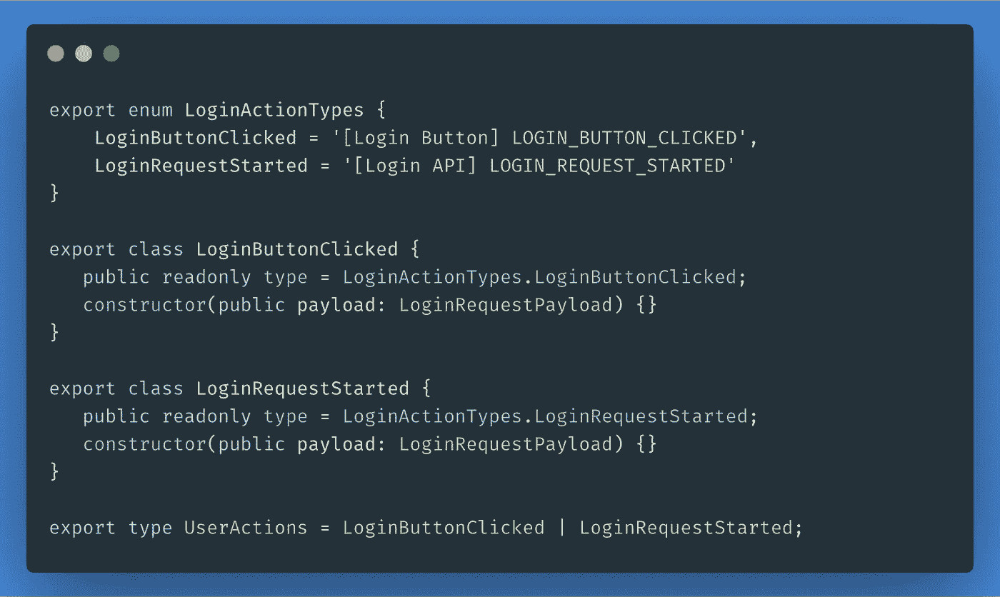
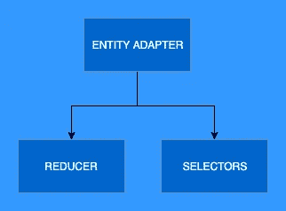
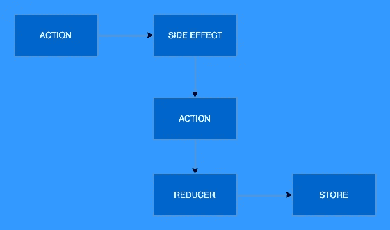

# NGRX 状态管理—简介

> 原文：<https://itnext.io/state-management-with-ngrx-introduction-1aae0803e988?source=collection_archive---------3----------------------->

## NGRX 平台简介——概念、最佳实践和技巧



在本文中，我想向您介绍构成 NGRX 平台的概念及其所有部分，以充分理解它如何帮助我们创建更好的应用程序。

*NGRX* ，对于还不知道的人来说，是 *Angular* 的 *Redux* 库。它帮助我们进行状态管理，这可以说是现代大规模客户端应用程序中最难管理的部分。

相比于 *Redux* 只提供商店的图层， *NGRX* 自带了不少强大的功能。

这是 4 篇文章系列的第一部分，将涵盖:

*   NGRX 的支柱
*   如何使用减速器和实体来构建我们的商店
*   管理和测试副作用
*   将我们的用户界面连接到门面服务，有利弊

# 为什么选择 NGRX 或任何状态管理解决方案

NGRX 和 Angular 的其他状态管理库(NGXS，Akita)已经成为复杂 web 应用程序架构中的重要部分。

我的一个不受欢迎的观点是，每个 Angular 应用程序都应该使用某种状态管理，无论是 RX 驱动的服务、MobX 还是不同的 Redux 实现。

我发现大型(甚至小型)项目在组件中使用本地状态有几个缺陷，例如:

*   在路由之间传递数据有困难
*   缓存已提取的数据有困难
*   重复的逻辑和请求
*   没有惯例

这个列表可能会更长，但这足以让我相信某种状态管理对于不在短时间内重构新应用程序是必不可少的。

# NGRX 支柱

让我们看看围绕 *NGRX* 的平台是如何构建的:

*   `store` —这是一个中央存储库，从中我们可以*选择*角度 DI 中每个组件和服务的状态
*   `effects`——顾名思义，这是当一个动作被调度时发生的副作用
*   `entity` —一个帮助减少常见样板文件的实体框架

现在，让我们更详细地看看我们将在接下来的步骤中探索的所有概念。

## 商店

商店是我们存储数据的中央存储库。

这是我们的应用数据库，也是我们客户的唯一真实来源。从技术上讲，它只是一个我们用来选择和存储数据的嵌套对象。

由于可以通过 Angular DI 访问 *Store* 服务，所以我们应用程序中的所有组件和服务都可以访问我们商店中的数据。

关于状态的任何信息，除非被隔离到应用程序的一个单独部分(例如表单、弹出窗口、瞬时状态)，可能应该存储在存储中。

## 行动

在 NGRX-speak 中——actions 是保存传递给 reducers 或触发副作用的信息的类。

动作有两个参数:

*   我们命名为`type`的唯一标识符(确保您将其标记为`readonly`)
*   可选的`payload`属性，表示传递给动作的数据

```
export enum LoginActionTypes {
    LoginButtonClicked = '[Login Button] LOGIN_BUTTON_CLICKED',
    LoginRequestStarted = '[Login API] LOGIN_REQUEST_STARTED'
}export class LoginButtonClicked {
   public readonly type = LoginActionTypes.LoginButtonClicked;constructor(public payload: LoginRequestPayload) {}
}export class LoginRequestStarted {
   public readonly type = LoginActionTypes.LoginRequestStarted;constructor(public payload: LoginRequestPayload) {}
}export type UserActions = LoginButtonClicked | LoginRequestStarted;
```

命名`type`参数的惯例:

*   你通常会看到使用`[prefix] NAME`格式书写的字体
*   正如 NGRX 小组所建议的，这个前缀对于声明请求的来源很有用

💡专业提示:写许多精细的动作，并且总是写它们的起源。如果你重写一些动作来做同样的事情，这并不重要。

## 还原剂

Reducers 只是负责以不可变的方式更新状态对象的纯函数。

reducer 是一个函数，它接收两个参数:当前状态对象和一个动作类，并将新状态作为输出返回。

新的状态**总是新构建的对象**，并且**我们从不改变状态**。

```
export function loginReducer(
    state: UserState = {},
    action: UserActions
): UserState {
    switch (action.type) {
        case UserActionTypes.LoginSuccess:
            return action.payload;
        default:
            return state;
}
```

这是一个非常简单的缩减器，如果没有匹配的动作，它就返回当前状态，或者返回动作的有效负载作为下一个状态。在实际应用中，您的减速器最终会比示例大得多。

有很多库可以简化 reducers 的使用，但对我来说，它们很少值得使用。

对于更复杂的减速器，我建议创建函数，并且**保持减速器函数简单而小巧**。

事实上，我们可以通过简单地使用一个对象来重构 switch 语句，并将动作类型与对象的键相匹配。

让我们改写一下:

```
interface LoginReducerActions { 
    [key: UserActionTypes]: (
        state: UserState, 
        action: UserActions
    ): UserState;
};const loginReducerActions: LoginReducerActions = { 
    [UserActionTypes.LoginSuccess]: (
       state: UserState, 
       action: LoginSuccess
    ) => action.payload
};export function loginReducer(
    state: UserState = {},
    action: UserActions
): UserState {
    if (loginReducerActions.hasOwnProperty(action.type)) {
       return loginReducerActions[action.type](state, action);
    }return state;
}
```

## 选择器

选择器只是我们定义的从商店对象中选择信息的函数。

在我们介绍选择器之前，让我们看看我们通常如何在服务中从存储中选择数据:

```
interface DashboardState {
   widgets: Widget[];
}export class DashboardRepository {
    widgets$ = this.store.select((state: DashboardState) => {
        return state.widgets;
    });constructor(private store: Store<DashboardState>) {}
}
```

为什么这种方法不理想？

*   它没干
*   如果商店的结构会改变(相信我，它会)，我们需要改变所有地方的选择
*   服务本身知道商店的结构
*   不缓存

让我们介绍一下由`@ngrx/store`提供的名为`createSelector`的实用程序，它的灵感来自于 React 库`reselect`。

为了简单起见，我将保持代码片段的统一，但是您应该假设选择器是在一个单独的文件中创建的，并且它们被导出。

```
// selectors
import { createSelector, createFeatureSelector } from '@ngrx/store';const selectDashboardState = createFeatureSelector('dashboard');export const selectAllWidgets = createSelector(
    selectDashboardState, 
    (state: DashboardState) => state.widgets
);// service
export class DashboardRepository {
    widgets$ = this.store.select(selectAllWidgets);constructor(private store: Store<DashboardState>) {}
}
```

💡**专业提示:**选择器非常有用，总是编写粒度选择器，并尝试将逻辑封装在选择器中，而不是在您的服务或组件中

## 实体

实体由包`@ngrx/entity`添加。

如果您曾经使用过 Redux，您可能会发现，常见 CRUD 操作的样板文件非常耗时而且多余。

NGRX 实体通过提供一组现成的通用操作和选择器来帮助我们，这些操作和选择器有助于减小我们的 reducer 的大小。

用这个实体框架我们的状态是什么样子的？

```
interface EntityState<V> {  
  ids: string[] | number[];   
  entities: { 
      [id: string | id: number]: V 
  }; 
}
```

我通常先在一个单独的文件中创建一个适配器，这样我们就可以从不同的文件中导入它，比如 reducer 和选择器的文件。



```
export const adapter: EntityAdapter<Widget> = createEntityAdapter<Widget>();
```

让我们在我们的减速器中使用适配器。适配器如何与之交互？

*   它创建一个初始状态(见上面的界面`EntityState`)
*   它给了我们一系列 *CRUD* 操作方法来动态编写减速器

```
const initialState: DashboardState = adapter.getInitialState();export const dashboardReducer(
    state = initialState,
    action: DashboardActions
): DashboardState {
   switch (action.type) {
       case DashbordActionTypes.AddWidget:
          const widget: Widget = action.payload;  
          return adapter.addOne(action.payload, state);
   }// more ... 
   }
}
```

💡 **Pro 提示** : [看看 NGRX 实体中所有可用的方法](https://ngrx.io/guide/entity/adapter#adapter-collection-methods)

实体适配器还允许我们启动一组选择器来查询商店。

下面是一个在我们的仪表板状态中选择所有小部件的示例:

```
const { selectAll } = adapter.getSelectors();export const selectDashboardState = createFeatureSelector<DashboardState>('dashboard');export const selectAllWidgets = createSelector(
  selectDashboardState,
  selectAll
);
```

💡 **Pro 提示** : [看看 NGRX 实体中所有可用的选择器](https://ngrx.io/guide/entity/adapter#entity-selectors)

## 效果

最后，我最喜欢的 NGRX 特性:*特效*。

顾名思义，我们使用效果来管理应用程序中的副作用。NGRX 将效果实现为动作发出的流，在大多数情况下返回新的动作。

让我们考虑下图:



*   一个动作从应用程序中的某个地方被分派(例如:UI、WebSocket、定时器等等)。)
*   效果拦截动作，为此定义了副作用。副作用被执行
*   副作用，除了例外，返回一个新的动作
*   该动作通过一个缩减器并更新存储

正如我提到的，不是所有的副作用都会返回一个新的动作。如果不需要的话，我们可以配置一个不调度任何动作的效果，但是重要的是你要明白，在大多数情况下，我们确实想要调度新的动作。

在 *NGRX* 中，效果最实际的用例是发出 *HTTP* 请求:

```
export class WidgetsEffects {
    constructor(
        private actions$: Actions,
        private api: WidgetApiService
    ) {}@Effect()
    createWidget$: Observable<AddWidgetAction> = 
        this.actions$.pipe(
            ofType(WidgetsActionTypes.CreateWidgetRequestStarted),
            mergeMap((action: CreateWidgetAction) => {
                return this.api.createWidget(action.payload); 
            }),
            map((widget: Widget) => new AddWidgetAction(widget))
         );@Effect({ dispatch: false })
    exportWidgets$: Observable<void> = 
        this.actions$.pipe(
            ofType(WidgetsActionTypes.ExportWidgets),
            tap((action: ExportWidgets) => {
                return this.api.exportWidgets(); 
            }),
         );
}
```

让我们把上面的片段分解一下。

*   我们创建了一个名为`WidgetsEffects`的类
*   我们导入两个提供者:`Actions`和`WidgetsApiService`
*   `Actions`是一连串的动作。我们使用操作符`ofType`来帮助我们过滤动作，只过滤我们想听的动作
*   我们在类上创建一个属性并用`Effect`来修饰它
*   当一个名为`CREATE_WIDGET_REQUEST`的动作被调度时，这个效果被调用
*   我们从动作中获取有效负载，并使用我们的 API 服务执行调用
*   一旦成功执行，我们将它映射为动作`AddWidgetAction`,该动作可以被 reducer 获取并更新我们的存储
*   在名为`exportWidgets$`的第二个效果中，我们收到一个动作`ExportWidgets`，我们使用`tap`操作符来执行一个副作用，然后……嗯，什么也没有！当我们通过配置`{ dispatch: false }`时，我们不必返回任何动作

# 外卖食品

*   状态管理解决方案，无论是库还是您自己的实现，都应该优先于本地状态
*   像商店这样的单一事实来源可以帮助我们管理应用程序的状态，但也有一些例外，比如状态是暂时的
*   我们简要地探讨了存储、动作、减少器、实体、选择器和效果的概念，但是在接下来的步骤中，我们将通过一些更高级的例子来详细介绍每一个概念

希望你喜欢这篇文章，并继续关注这个系列的下一部分！

*原发布于*[*https://frontend . consulting*](https://frontend.consulting/state-management-with-ngrx-introduction)*。*