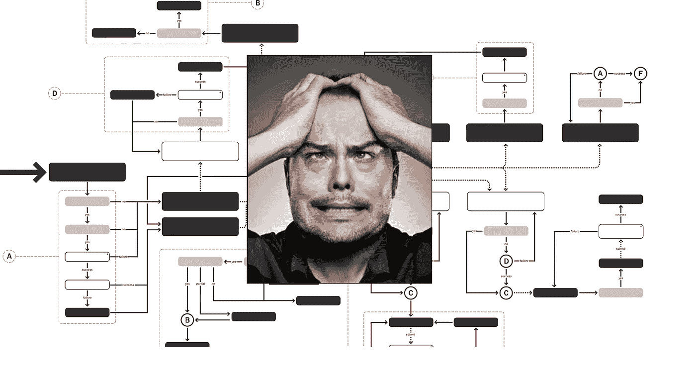

# 州经理替代方案:一个简单的、老式的图书馆

> 原文：<https://itnext.io/state-manager-alternative-a-simple-old-school-library-b06893f4974c?source=collection_archive---------1----------------------->

我喜欢州经理。我使用状态管理器。比方说，状态管理器用来解决 5 个问题。在这里，我将向您展示一个替代方案，它只能解决州经理解决的 5 个问题中的 1 个。

所以，不是 Redux，Vuex 等可以替代的东西。这只是一个简单的、老式的方法来**保持不同组件**之间的变量同步，而不通过一个大道具发送值——见鬼。就这样。

如果你需要一个拥有中间件、记忆化和更多 yerbas 的国家经理，它不适合你。

小心，你可能需要一个有着所有这些 yerbas 的国家经理，但你可能不需要它。对此要加倍注意。

# 编码不是目的，而是手段

工作时，我最重要的模式/原则是:

*   吻
*   帕累托原理
*   分量所有的东西！
*   松耦合

创建这个状态管理器库时，主要考虑了**帕累托法则**和 **KISS** 模式。这意味着。

这个状态管理器**不会给你的项目**增加复杂性，它很简单，并且允许你重用你的旧知识(如果你的团队中大多数开发人员是初级人员或者来自后端，这是件好事)。

这是好事，同时也是坏事。我刚刚写了我认为好的东西，现在我将写我认为不好的东西:这个库没有遵循当前的~ *宣传~* 良好的做法，比如:它不是声明式的，它不是函数式编程(至少在第一个版本中)，以及我相信你会发现的更多东西(人们喜欢发现不好的东西)。

还有一件更重要的事情，我认为是最重要的:

> 我相信，如果你在 10 个项目中添加一个状态管理器，你可能会添加 8 次来解决一个问题:“在组件之间保持两个变量同步”。
> 
> 你只需要一个全局状态对象和几个回调，但是你增加了，比方说，减少了…复杂性，很多复杂性，我的朋友。
> 
> `duix`的想法是覆盖你添加状态管理器的那 8 次，仅仅是因为你需要在组件之间保持同步变量。就这样。有一个全局的`state`对象，你的`set`值，或`get`值，你可以`subscribe`或`unsubscribe`，每次有人`set`一个新值，所有的订阅者将被调用接收新的和旧的值。

^:我的朋友，这就是帕累托法则。帕累托说 20%的`X`，产生了 80%的`Y`。在这种情况下，我们可以说，如果您在项目中添加了一个状态管理器，那么 80%的时间您添加它只是为了解决几个(或者仅仅一个)问题:保持组件之间的变量同步。剩下的 20%的时间不仅仅是解决“保持 var 同步”的问题。

所以，总结一下:你杀人过度了。您正在添加一个为解决大量问题而创建的库，而您只使用它来解决其中的一个问题。它让我想起了`jQuery`时代，那时我们添加`jQuery`只是为了使用`$`作为 DOM 元素选择器。或者当事情在不到 2 秒的时间内发生时，添加整个`Moment` lib 来说“片刻之前”(可以替换为:`if ((Date.now() — initialMoment) < 2000) {`)

**这很简单，而且喜欢保持事情简单。**

这个库叫做`duix`，它基本上有三个功能:

*   `duix.set`
*   `duix.get`
*   `duix.subscribe`

如果你读了这三条，明白这个图书馆将如何运作，那是因为我实现了我的目标。

# **DUIX 如何工作**

*   您可以使用`duix.set`来设置一个键值对，例如:

*   您可以使用`duix.get`来获取对的值，例如:

*   您可以使用`duix.subscribe`来订阅一个`callback`,每次值改变时都会调用它，例如:

需要知道的重要一点是，`duix.subscribe`函数返回`unsubscribe`函数，例如:

**还有……就这些。**

现在，您可以订阅任何组件的任何 var 更改，并在值更改时做您想做的任何事情。您还可以随时设置或获取值(以强制的方式)。

# 如何使用它

你知道如何使用它。去 NPM 和 Github 上的`duix`库看看就知道了。

 [## duix

### 只是一个简单的状态管理器

www.npmjs.com](https://www.npmjs.com/package/duix)  [## 布罗达尼埃尔/杜伊克斯

### 一个专注于 KISS 和 Pareto 原则的州经理——BrodaNoel/duix

github.com](https://github.com/BrodaNoel/duix) 

> 对于那些有眼睛看得见的人来说，同步性是一个永远存在的现实
> 
> 卡尔·荣格

…去看，去理解，去记忆…