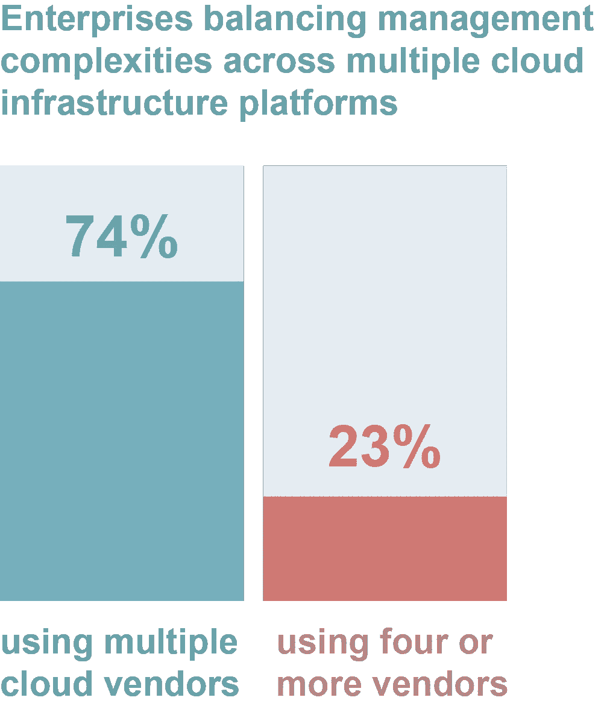
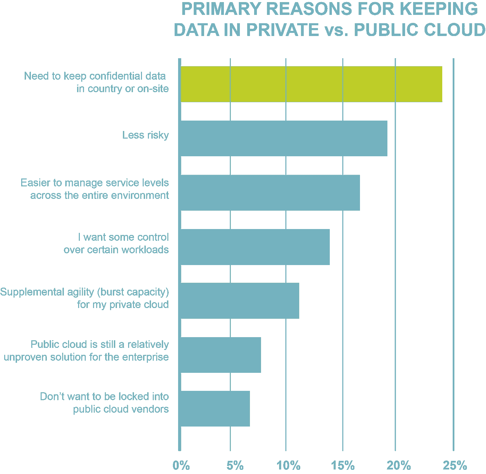
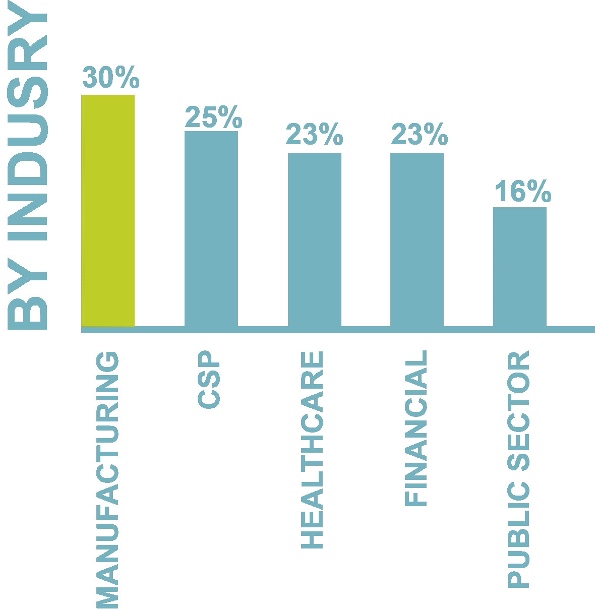

# 混合云的现状

> 原文：<https://itnext.io/state-of-the-hybrid-cloud-ae416c610b4d?source=collection_archive---------7----------------------->

来自 [Veritas Technologies](https://www.veritas.com/) 的最新报告表明，几乎四分之三(74%)的企业采用了多种私有云和公共云战略。[调查](http://www.businesswire.com/news/financialpost/20160629005405/en/%25E2%2580%259CState-Hybrid-Cloud%25E2%2580%259D-Research-Suggests-Pros-Focus)强调需要采用更好的安全性和可靠的信息管理。

Veritas 是 2016 年【Gartner 数据中心备份和恢复软件魔力象限的领导者，它调查了 1800 多名全球 IT 决策者的云采用实践。该研究调查了组织将其数据迁移到云(公共云或私有云)的速度，以及其决策背后的原因。这篇文章强调了与混合云使用增长相关的统计数据。

该研究发现，目前，74%的企业使用两家或更多的云基础架构供应商来支持其工作负载需求，23%的企业使用四家或更多的供应商。

*此图表改编自 Veritas* 的“混合云研究报告”

当前 38%的工作负载存在于私有云中，28%存在于公共云中；这些数字预计在未来 12 个月内分别增长 7%和 18%。组织决定将工作负载迁移到私有云基础架构而不是公共云基础架构时，会涉及到某些因素。在国家/地区/现场保存机密数据的需求排在第一位，其次是私有云风险更低、服务级别管理更容易的看法。下面的图表摘自 Veritas 的“混合云研究报告”指出了这些主要原因:

该报告还包括推动组织将更多工作负载迁移到公共云的因素。超过三分之一的受访者认为成本是迁移到公共云的主要驱动因素，而安全性/保护是主要阻碍因素(50%的受访者担心公共云基础架构的安全性)。有趣的是，在那些采用公共云的人中，安全性是他们做出决定的首要驱动因素。将工作负载迁移到公共云的第二个因素是 IT 灵活性措施的组合，即在调配新工作负载时爆发容量和速度的能力。

该调查还考察了不同行业对公共云基础架构的使用情况。制造业最有信心将其工作负载转移到公共云，几乎占三分之一(30%)，其次是电信(24%)、医疗保健和金融(23%)以及公共部门(16%)。从地理上看，日本和巴西以大约 50%的比例领先于公共云的使用。下图摘自 Veritas 的“混合云研究报告的现状”,显示了不同行业对公共云的使用情况:

这项研究的结论是，“虽然组织正在快速将工作负载迁移到公共云，但数据清楚地表明这不是一次完整的迁移。”值得注意的是，相当多的受访者确信，一些工作负载将始终保留在传统或私有云基础架构中；即备份和恢复(28%)、灾难恢复(27%)和数据仓库(26%)将始终保留在本地。

值得注意的是，Veritas 的调查比其他现有报告更乐观；VMTurbo 最近的一项[研究发现，57%接受调查的组织缺乏云战略。](http://vmturbo.com/press-releases/vmturbo-multi-cloud-survey-1-results/)