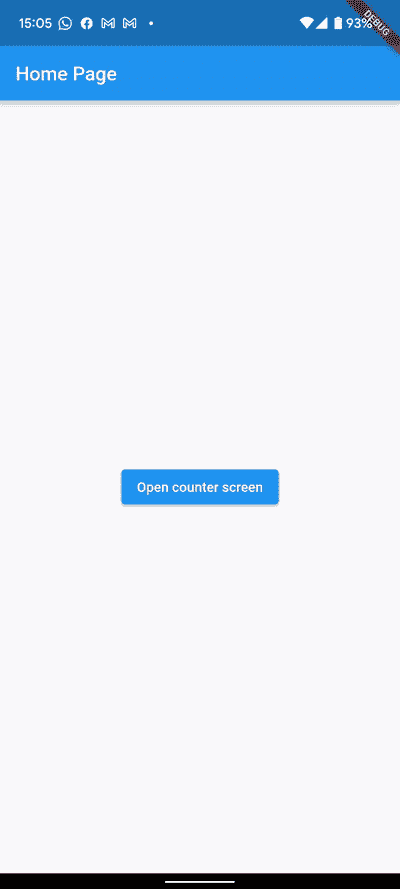
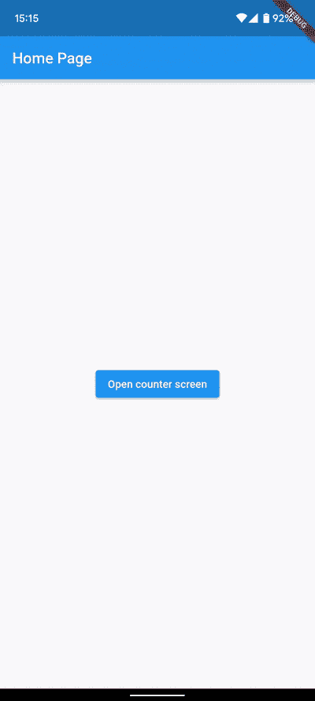
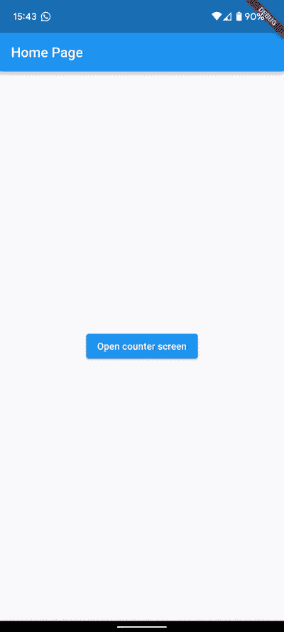
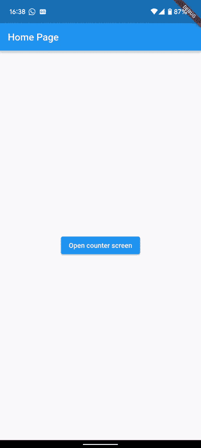

# 颤振状态恢复

> 原文：<https://itnext.io/state-restoration-in-flutter-b6030b95a4d4?source=collection_archive---------0----------------------->

当编写一个应用程序时，通常不用担心当它进入后台时会发生什么，因为你只关心当用户直接与你的应用程序交互时，他们在做什么，对吗？不完全是。

有些情况下，用户会暂时离开你的应用，但这并不意味着他们不再与它互动。例如，如果用户在你的应用程序中创建一个帐户，并需要验证他们的电子邮件地址，他们可能需要快速转到他们的电子邮件应用程序并返回。当他们回到你的应用程序时，他们希望从他们停止的地方继续。

当**系统资源受限**时，问题就出现了。假设用户同时运行许多应用程序，也许他们的手机没有太多可用内存。在这种情况下，一旦他们切换到电子邮件应用程序，**你的应用程序就会被操作系统关闭**。然后，当用户切换回您的应用程序时，它会重新启动并丢失所有状态。因此，如果他们在某个屏幕序列中导航很深，他们将不得不从头开始，直到找到他们想要的东西。这远非理想，因为很有可能**这个用户会简单地放弃**注册。

这就是国家恢复的作用。在本教程中，我们将看到我们可以使用什么策略来防止这种问题。

## 入门指南

对于本教程，我们将修改 Flutter 的默认应用程序，以更好地说明这个问题。我们的应用程序将由两个屏幕组成**，一个主屏幕，只有一个按钮将我们带到我们的第二个屏幕，在那里我们将有一个按钮，当点击时增加一个计数器(就像默认的应用程序)。**

****

**我们简单的应用程序**

**您可以查看下面的代码:**

**好吧，目前为止没什么特别的。在实现我们的更改之前，让我们模拟一下，如果我们的应用程序由于缺乏资源而被操作系统终止会发生什么。要在 Android 上模拟这一点，请进入**设置>系统>开发者选项**并选中选项**不保留活动**。**

**现在，我们将执行以下操作:**

1.  **运行我们的应用**
2.  **点击主屏幕上的按钮，进入第二个屏幕**
3.  **将计数器递增 3 次**
4.  **切换到设置应用程序**
5.  **切换回我们的应用程序**

**记下上面的步骤。我们将在整个教程中重复它们。**

****

**我们的应用被操作系统扼杀了**

**正如你在上面看到的，当我们回到我们的应用程序时，它只是重新启动，然后**我们被带回到主屏幕**。应用程序状态完全丢失，我们不再看到与之前相同的屏幕，并且**我们的计数器回到 0** 。**

**我们想要的是回到应用程序，找到我们离开时的一切。但是我们怎么做呢？**

**我们的应用程序在这里处理两种类型的状态信息。一个是**导航**状态(即什么是活动路线？)和另一个是**应用**状态(即，我们增加了多少次计数器？).我们将分别处理这些问题。**

**让我们从**导航**状态开始。这是最容易修复的一个。我们只需要做两个改变。**

**第一个与**我们如何推动第二个屏幕**有关。我们没有调用方法`Navigator.push`，而是简单地用`Navigator.restorablePush`代替它。该方法将`BuildContext`作为一个参数以及一个应该返回我们路线的构建函数。这里需要注意的一点是**builder 函数必须在你的 widget 类中定义为一个静态方法**(而不是一个匿名函数),否则你会从框架中得到一个错误。**

**我们需要做的第二个改变是当**实例化我们的** `**MaterialApp**`时。我们将把参数`restorationScopeId`传递给构造函数。这需要是一个唯一的字符串，框架将使用它来保存我们的导航状态。**

**您可以在下面看到更新的代码(更改在第 14 行和第 41 到 49 行):**

**我们的应用程序代码现在可以恢复导航状态**

**如果您现在运行该应用程序，并尝试按照之前概述的相同步骤进行操作，那么现在当我们返回到该应用程序时，您会看到，**我们看到了正确的屏幕**:**

****

**因此，您会看到**导航被保留**，但我们的计数器被重置为零。让我们看看现在如何解决这个问题。**

**当谈到恢复我们的应用程序状态时，Flutter 的工作方式是，当操作系统发出通知，表明我们的应用程序将被杀死时， **Flutter 会将我们告诉它的任何信息保存到磁盘上**。然后，当我们的应用程序重新启动时， **Flutter 会将该信息**重新注入到我们应用程序的状态中。**

**为了让 Flutter 知道我们希望它保存什么，我们需要稍微修改一下我们的代码。首先，我们将使用`RestorableInt`类代替简单的`int`来存储我们的计数器值。这个类的构造函数将接收一个初始值(在我们的例子中是零)，为了访问包装的值，我们使用属性`.value`。**

**然后，我们需要修改我们的`StatefulWidget’s`状态类，以便它实现`RestorationMixin`。对于这个 mixin，我们需要实现两个方法，一个是`restorationId` getter，它将简单地返回一个惟一的标识符字符串，Flutter 将使用它来保存我们的屏幕状态，另一个是方法`restoreState`，它将告诉 Flutter 我们需要保存我们的计数器值。最后一件事是我们需要记住，当我们的小部件使用完我们的`RestorableInt`实例时，要处理掉它。**

**好了，说得够多了，让我们看看代码(更改在第 59、60、64、82 和 95 到 107 行):**

**我们完全可恢复的应用程序**

**现在，如果我们再次经历我们的测试步骤，**当我们切换回 it** 时，我们的应用完全恢复。干得好！**

****

**对于我们的例子，我们的状态只是一个对应于计数器值的整数，但是你可能需要保存其他的东西。Flutter 提供了一堆可以让你保存原始值的类，比如`RestorableBool`、`RestorableString`、**、**、**、**等等。同样，如果你的变量碰巧是可空的，那么同样的类也有可空的版本(`RestorableBoolN` **、** `RestorableStringN` **、**和`RestorableDateTimeN`)。**

**如果您需要恢复一个非原始值(比如您自己的类的一个实例)，您可以子类化`RestorableValue`类，以向框架指示您的实例如何能够被转换成一组原始值，以及如何被转换回来。你可以在[颤振文档](https://api.flutter.dev/flutter/widgets/RestorableValue-class.html)中找到很好的例子。**

## **额外小费**

**当使用导航器来推送新的屏幕时，**我们有时可能需要将数据从第二个屏幕**传递给它的展示者。当您使用常规方法`Navigator.push`(即没有状态恢复)时，您会得到一个`future` 返回，您可以用它来访问第二个屏幕返回的数据。然而，当使用一种可恢复的导航方法(如`Navigator.restorablePush`)时，您会注意到它返回的不是未来，而是一个字符串。那么我们如何做到这一点呢？**

**从一个可恢复的方法中得到的字符串是一个**恢复标识符**。这个标识符可以用来在`RestorableRouteFuture`类的帮助下从第二个屏幕获取数据。**

**为了了解这是如何实现的，让我们修改我们的应用程序，让主屏幕显示一个文本，说明上次计数器增加了多少次。**

****

**使用状态恢复时在屏幕之间传递数据**

**以下是我们更新后的代码:**

**好的，所以代码有相当多的变化。您将注意到的第一件事是，我们必须将我们的主页类转换为一个`StatefulWidget`，因为**现在它将有一个状态变量**，指示计数器上次增加了多少次(`_lastCounter`)。这个变量的值显示在按钮的正上方。**

**然后我们在主页的 state 类中添加了一个类型为`RestorableRouteFuture` 的新属性`_counterRoute`。这个参数是在类'`initState`方法中设置的，它的构造函数接收两个简单的回调。一个是当我们决定按下第二个屏幕时调用的，另一个是当我们从那个屏幕收到结果时调用的。然后，每当用户按下按钮时，我们不调用`Navigator.restorablePush`，而是调用我们的`_counterRoute`变量上的`present()` 方法。**

**接下来，我们让主页的 state 类实现了`RestorationMixin`(就像我们之前对 CounterPage 所做的那样)，并告诉 Flutter 我们需要保存我们的`_counterRoute`值。**

**最后，我们更改了 CounterPage 的 state 类的 build 方法，这样一切都被包装在一个 [WillPopScope](https://api.flutter.dev/flutter/widgets/WillPopScope-class.html) 小部件中，这样我们就可以截取屏幕弹出的时刻，并将计数器的当前值传回我们的主页。**

**就是这样！唷，那是相当多的，所以为你做的如此伟大的工作拍拍你自己的背。**

## **关于性能的说明**

**根据我的经验，我没有发现使用这些技术对性能有任何影响。唯一需要注意的是 **Android 有 1MB 的数据保存/恢复限制**。**

**这是因为，在引擎盖下，Flutter 使用[包](https://developer.android.com/reference/android/os/Parcel)对象在你的应用程序和操作系统之间传输数据，这些对象有大小限制，否则你会遇到`[TransactionTooLargeException](https://developer.android.com/reference/android/os/TransactionTooLargeException)`。**

**但是一般来说，你应该使用这些技术来保存简单的原始值，所以你很可能永远不会达到这个极限。例如，如果您有大量不想丢失的二进制数据，您应该将它们保存到磁盘上，并且只将其路径存储在一个`RestorableString`属性中。**

## **结论**

**国家恢复是你认为永远也不会需要的东西之一，直到它来咬你。**

**例如，当你的应用程序中有一些关键流程时，比如用户注册或产品结账，用户不能丢失他们已经添加的任何信息，否则他们很可能会简单地放弃。这些时候使用上述技术将会有很大的价值。**

**我希望你喜欢这个教程！如果你有任何问题，打电话给我。**