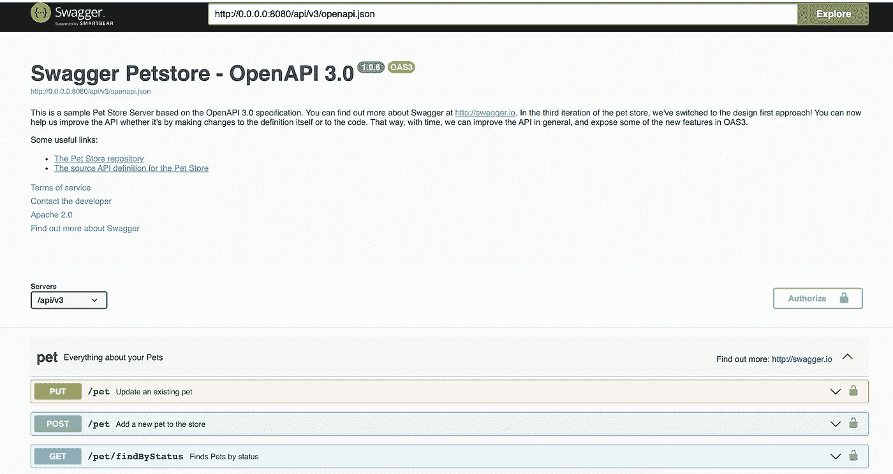
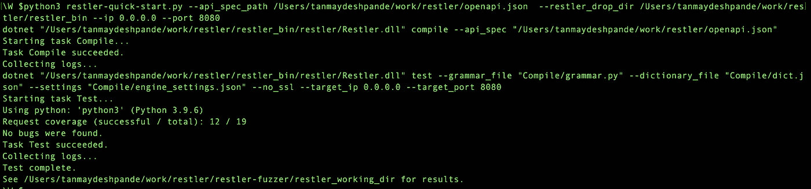
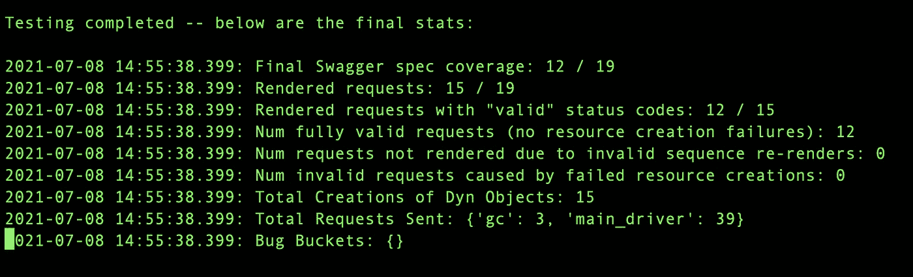
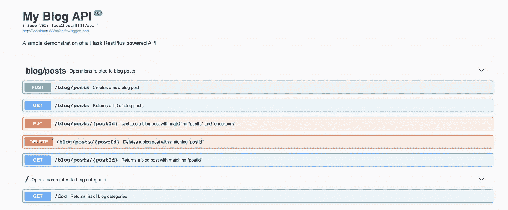
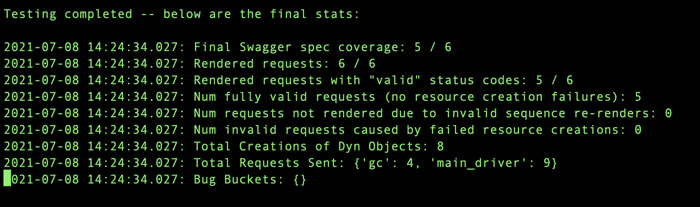
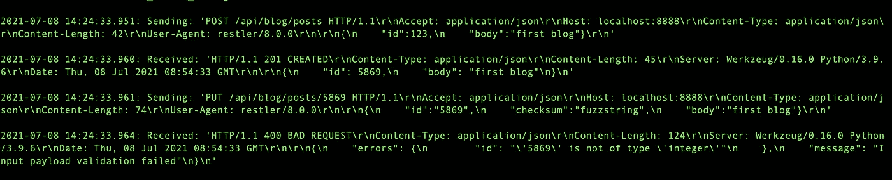
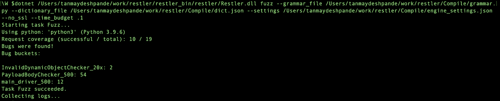

# 使用 RESTler 的有状态 API 模糊化

> 原文：<https://itnext.io/stateful-api-fuzzing-using-restler-6f42344f29df?source=collection_archive---------0----------------------->

## 微软的开源工具包


照片由[马特·张](https://unsplash.com/@mattyzzy?utm_source=unsplash&utm_medium=referral&utm_content=creditCopyText)在 [Unsplash](https://unsplash.com/s/photos/cyber-security?utm_source=unsplash&utm_medium=referral&utm_content=creditCopyText)

我最近偶然发现了一篇来自[务实程序员](https://medium.com/pragmatic-programmers)的文章[API 测试的目标](https://medium.com/pragmatic-programmers/the-goals-of-api-testing-6f3bf9bb8f0)，这篇文章深入讨论了测试 REST APIs 时需要考虑的各种目标。我想知道更多关于这个话题的信息，这让我看到了微软研究院最近发表的一篇关于 API 模糊测试的文章。

在本文中，我将解释这个概念，并尝试一个开源工具来模糊测试一些示例 API。本文期望您对 REST APIs 有一个基本的了解。

# 什么是起毛？

根据 OWASP——

> *模糊测试*或*模糊化*是一种黑盒软件测试技术，它基本上包括以自动方式使用畸形/半畸形数据注入来发现实现缺陷。

简单的模糊测试通过提供随机输入来监控应用程序的行为。起毛并不是一个非常新的技术，威斯康星大学的原始工作可以追溯到 1988 年。

在过去的二十年里，模糊化已经成为一种主流的测试技术，用来发现应用程序中的错误和安全问题。

# 起毛类型

微软研究描述了三种类型的模糊化—

*   黑盒模糊化
*   基于语法的模糊化
*   白盒起毛

**黑盒** fuzzing 随机生成变异的输入，并根据这些输入测试接口，观察行为。

在**基于语法的模糊化**中，用户为测试中的应用提供输入语法。语法帮助用户激发他们的创造力，这有助于带来关于应用程序的更多见解。

白盒模糊化从一个格式良好的输入开始，然后它动态地执行程序，并从执行过程中遇到的条件分支中找出约束。重复该过程，直到发现所有执行路径。

与其他两种相比，白盒模糊更加精确，因为它提供了更多的覆盖范围。

# 为什么起毛？

*   Fuzzing 帮助您找到手动和静态分析工具经常遗漏的漏洞。
*   如果您的程序需要来自不可信的应用程序或执行大型复杂数据解析的程序的数据，Fuzzing 可以提供非常有价值的见解。

你可以在这里阅读不同的模糊向量[。](https://owasp.org/www-project-web-security-testing-guide/v41/6-Appendix/C-Fuzz_Vectors)

OWASP ZAP 等工具支持模糊化各种界面，如 UI、命令行界面等。

# API 模糊化

现在，大多数应用程序使用 REST APIs 提供接口。在微服务的世界里，不同的服务通过 API 相互对话。因此，毫无疑问，API 是现代应用程序的重要组成部分。

当您构建 API 时，每个 API 都要执行特定的任务。因此，以一种**有状态**的方式对 API 进行模糊测试以获得更好的结果是非常必要的。

# 雷斯勒

RESTler 是第一个有状态 REST API fuzzing 工具,用于通过 REST API 自动测试云服务，并发现这些服务中的安全性和可靠性缺陷。

RESTler 接受开放 API 规范作为输入，分析规范，生成并执行测试。RESTler 动态地从以前的响应中学习，帮助它探索更多的路径，并潜在地发现更多的 bug。

# REST APIs 示例

要试用 RESTler，您需要一组 API。这里我将使用著名的[pet store](https://github.com/swagger-api/swagger-petstore)API 项目。

为此，我克隆了回购并执行

```
git clone [https://github.com/swagger-api/swagger-petstore](https://github.com/swagger-api/swagger-petstore)cd swagger-petstoremvn package jetty:run
```

如果一切正常，您应该能够看到 Petstore Swagger UI。



作者图片

# 安装 RESTler

RESTler 到目前为止还没有提供二进制安装。因此，您需要克隆 repo 并在本地构建它。

RESTler 的先决条件—

*   Python 3.8.2
*   。Net 5.0

首先，您需要创建一个目录

```
mkdir restler_bingit clone [https://github.com/microsoft/restler-fuzzer.git](https://github.com/microsoft/restler-fuzzer.git)python3 ./build-restler.py --dest_dir <Full Path for restler_bin dir>
```

如果一切顺利，您的 RESTler 二进制文件应该可以使用了。

# 开始运转

接下来，我运行一个快速入门程序来模糊 Petstore APIs。为此，你需要—

*   [打开 API 规范](http://localhost:8080/api/v3/openapi.json)下载并保存。(假设您已经在运行 Petstore 应用程序)
*   更新 openapi.json 文件以指向正确的 URL—*" servers ":[{ " URL ":" http://localhost:8080/API/v3 " }]*

现在，你需要运行快速启动程序—

```
cd <Path to restler-fuzzer dir>python3 restler-quick-start.py --api_spec_path <Full path to openapi.yml>  --restler_drop_dir <Full path to restler_bin dir>
```

在执行结束时，您应该会看到如下所示的结果—



RESTler 执行

这里 RESTler 针对 API 执行了 fuzzing，没有发现任何错误。

可以在`restler_working_dir`目录下查看完整的日志。

最终的统计数据如下所示



最终统计

# 在演示服务器上运行 RESTLer

RESTler repo 提供了一个托管 API 的演示服务，如下所示



演示服务器—我的博客 API

你可以按照[这一页](https://github.com/microsoft/restler-fuzzer/blob/main/demo_server/README.md)上给出的说明让演示服务器启动&运行。

接下来，我在演示服务器开放 API 规范上运行了快速入门程序—

```
python3 restler-quick-start.py --api_spec_path /Users/tanmaydeshpande/work/restler/restler-fuzzer/demo_server/swagger.json  --restler_drop_dir /Users/tanmaydeshpande/work/restler/restler_bin --ip 0.0.0.0 --port 8888
```

结果如下所示—


运行在演示服务器上的 RESTlet

在这里，您可以看到请求覆盖率为 5/6。

您可以在位于

```
restler_working_dir/Test/RestlerResults/experiment<>/logs
```

你也可以看看最终的统计数据



最终统计

您可以浏览`network.testing.*`文件，了解发送的确切请求和收到的响应，如下所示——



到目前为止，测试执行是使用选项`fuzzlean`运行的。接下来，您需要运行一些积极的测试

# 真正的警察

在之前的运行中，我们使用了快速启动脚本来运行精益模糊化。现在，让我们运行完整的 fuzzing。

***警告*** *—请记住，这种类型的模糊处理会导致服务器停机，因此不应该在生产服务器上运行。*

首先，您需要编译 OpenAPI 规范。这里我使用了来自 Petstore 应用程序的 OpenAPI 规范。

```
dotnet /Users/tanmaydeshpande/work/restler/restler_bin/restler/Restler.dll compile --api_spec /Users/tanmaydeshpande/work/restler/openapi.json
```

这将生成`Compile`目录，其中包含语法、配置、引擎等文件。

接下来，你运行模糊测试—

```
dotnet /Users/tanmaydeshpande/work/restler/restler_bin/restler/Restler.dll fuzz --grammar_file /Users/tanmaydeshpande/work/restler/Compile/grammar.py --dictionary_file /Users/tanmaydeshpande/work/restler/Compile/dict.json --settings /Users/tanmaydeshpande/work/restler/Compile/engine_settings.json --no_ssl --time_budget .1
```

在这里，我运行了 0.1 小时的模糊测试，即大约 6 分钟。

一旦执行完成，你可以看到结果—



模糊结果

在这里，您可以看到 fuzzing 发现了以下几类错误—

*   InvalidDynamicObjectChecker _ 20x:2
*   PayloadBodyChecker_500: 54
*   main_driver_500: 12

您可以查看日志目录来了解这些错误并修复它们。绒毛越长越好，因为它可以产生更好的效果。

您可以通过查看[用户指南](https://github.com/microsoft/restler-fuzzer/tree/main/docs/user-guide)来尝试各种功能。

# 结论

正如您在这里看到的，RESTler 可以非常强大地检测到通过常规测试技术很容易发现的错误。微软 SDLC 流程建议对所有产品的每个不可信接口进行模糊处理。所以试试吧！

快乐起毛！

# 参考

*   [https://owasp.org/www-community/Fuzzing](https://owasp.org/www-community/Fuzzing)
*   [https://patricegodefroid . github . io/public _ PS files/cacm 2012 . pdf](https://patricegodefroid.github.io/public_psfiles/cacm2012.pdf)
*   [https://www . Microsoft . com/en-us/research/publication/restler-stateful-rest-API-fuzzing/](https://www.microsoft.com/en-us/research/publication/restler-stateful-rest-api-fuzzing/)
*   [https://www.zaproxy.org/docs/desktop/addons/fuzzer/](https://www.zaproxy.org/docs/desktop/addons/fuzzer/)


# 嘿，如果你喜欢这个故事，看看[中级会员](https://deshpandetanmay.medium.com/membership)！只要 5 美元/月！

*你的会员费直接支持我和你阅读的其他作家。你也可以在媒体上看到所有的故事。*

# [现在就成为中等会员吧！](https://deshpandetanmay.medium.com/membership)