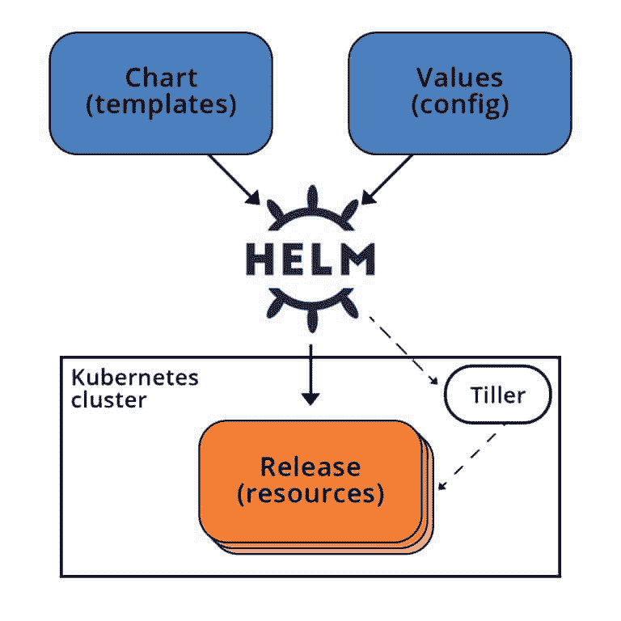
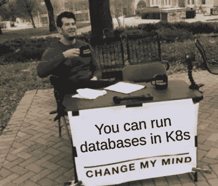
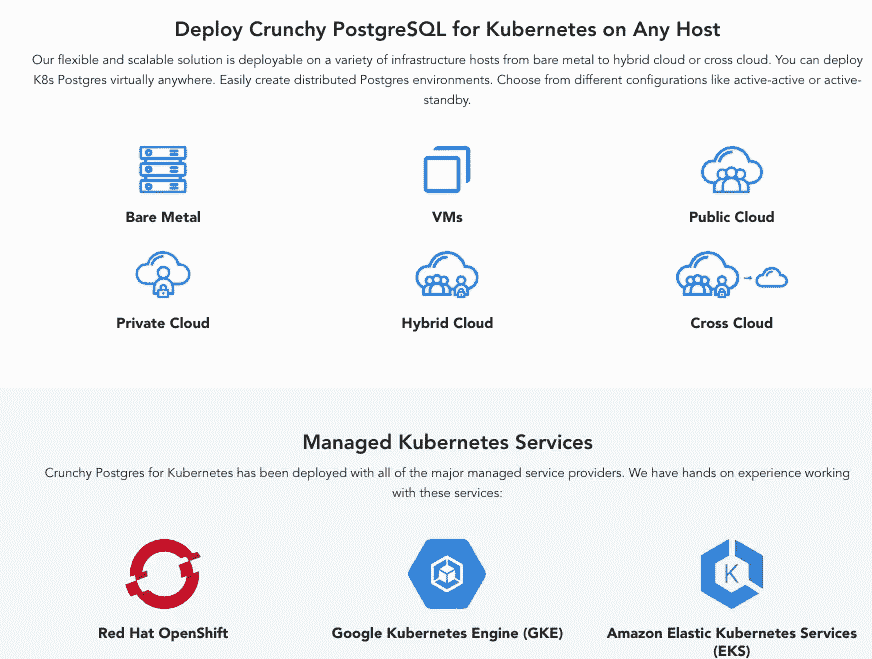
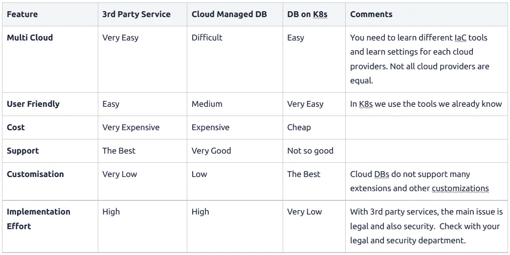

# 如何在 Kubernetes 中运行数据库

> 原文：<https://itnext.io/stateful-workloads-in-kubernetes-e49b56a5959?source=collection_archive---------0----------------------->

# 介绍

如果你对 [**Kubernetes**](https://kubernetes.io/) 不陌生，你可能已经听过无数次了:“ ***不要在 Kubernetes 上运行数据库！***”；如果你在 2016 年，这可能是真的，但现在不是了；事实上，我甚至可以说, **Kubernetes 现在是运行有状态工作负载的最佳平台。**

照片由[通风视图](https://unsplash.com/@ventiviews?utm_source=medium&utm_medium=referral)在[防溅罩](https://unsplash.com?utm_source=medium&utm_medium=referral)上拍摄

在本文中，我将尝试**改变您对在**[**Kubernetes**](https://kubernetes.io/)**中运行有状态工作负载的想法，并尝试说服您，在许多情况下，这是您可以采取的最佳方法。我还将讨论不同的选择以及何时不在 Kubernetes 中运行数据库。**

**这篇文章分为两部分，第一部分关注如何在 Kubernetes 中运行数据库，第二部分关注何时应该在 Kubernetes 中运行数据库。**

**让我们从一堂快速的历史课开始，然后我们将深入到用例中。**

# **简史**

**虽然很多招聘者有时会要求有 10 年以上经验的工程师；Kubernetes 1.0 发布于 **2015** 。它是由谷歌创建的，并作为开源在云本地计算基金会下发布。**

**由于云计算和云原生应用的兴起，它变得流行起来。它的采用在过去几年中呈指数增长，现在 Kubernetes 是运行容器最流行的方式。**

**在我看来，它成功的关键是**拥有正确的抽象层次**；不要太低，这样就不可能管理，也不要太高或固执己见。许多工程师抱怨复杂性，许多框架和工具是在 Kubernetes 之上开发的，以解决特定的问题或用例，使其更加固执己见。事实是，Kubernetes 正在成为在任何环境中运行工作负载的事实上的标准，无论是在云上还是在本地。**关键是它的 API** ，可以扩展以创建更高级别的抽象，这将允许我们使用相同的标准和熟悉的 **YAML** 文件部署任何工作负载。**

**多亏了可扩展的 Kubernetes API，随着时间的推移，新的特性不断增加，公司开发了针对特定工作负载的定制 API。**

****

**库伯内特建筑**

**Kubernetes 早期版本的一个问题是，部署复杂的应用程序非常麻烦，因为你需要编写和维护许多行 YAML 文件。为了简化部署， [**Helm**](https://helm.sh/) 于 2016 年推出，如今是 Kubernetes 中打包和部署工作负载的事实上的方法，尽管 Helm 有几个[替代方案](https://github.com/kubernetes-sigs/kustomize)。**

**多亏了 **Helm** ，可以非常容易的打包复杂的应用，可以包含微服务、PVC、服务、秘密等。变成一张图表。这就是为什么 Kubernetes 是以高效和安全的方式运行 [**微服务**](https://en.wikipedia.org/wiki/Microservices) 的最佳平台。**

****

**[**微服务**](https://microservices.io/) 是**无状态**服务，因此它们是在 Kubernetes 上运行的完美工作负载，这允许它们快速扩展或缩减。如果出现任何故障，Kubernetes 控制回路将重启吊舱。然而，当我们谈到数据库等有状态工作负载时，事情变得更加复杂。当您想要扩展时，不能只添加更多的副本。一些数据库只支持只读副本，其他的需要重新平衡。其他数据库不能重启，需要正常关闭。此外，操作数据库更加复杂，我们需要执行许多操作任务，如备份、恢复、监控、警报等。**

**由于运行数据库的复杂性，许多公司决定**在虚拟机**中运行他们的数据库，或者使用第三方管理的数据库。这些服务将负责运行数据库的所有操作开销。这是 Kubernetes 中最常见的方法，其中**应用程序运行在 Kubernetes 集群上，并连接到运行在其他地方的数据库**。这种方法有很多缺点，我们将在后面讨论可扩展性。一旦事情清楚了，我们不能假设应用程序是无状态的，它们需要状态，问题是状态在哪里，在 Kubernetes 内还是在 Kubernetes 外。**

**但是在我们讨论这个之前，让我们更深入地了解如何在 Kubernetes 上运行数据库…**

# **状态集**

**在 Kubernetes 中运行有状态工作负载的第一步是引入[**stateful sets**](https://en.wikipedia.org/wiki/Kubernetes#StatefulSets)**，它提供了允许在 Kubernetes 中运行有状态应用程序的基本功能。****

****[**stateful sets**](https://en.wikipedia.org/wiki/Kubernetes#StatefulSets)**为数据库等有状态工作负载提供可预测的**顺序**和**状态**。它们以可预测顺序按比例放大或缩小。这对数据库非常重要:******

*   ****对于主从架构，这允许有一个可预测的主节点(第一个)和许多次节点。****
*   ****对于环形架构，这允许自我发现和数据再平衡。****

******StatefulSets** 也有一个基于此顺序的唯一 DNS 名称，这对工作负载很重要，如 [Apache Kafka](https://en.wikipedia.org/wiki/Apache_Kafka) 在它们的代理之间分发数据；因此，一个经纪人不同于另一个经纪人。在这种情况下，实例唯一性的概念很重要。****

****简而言之，StatefulSets 是在 pod 的实例中强制执行**唯一性**和**排序**属性的控制器，可用于运行有状态应用程序。它们还允许客户端负载平衡，因为客户端可以通过带有顺序后缀的固定名称来发现和复制副本。****

****作为一个例子，假设我们想要部署一个带有一个主节点和两个只读节点的 [**PostgreSQL**](https://www.postgresql.org/) 数据库。如果我们使用常规 Kubernetes 部署，pod 将获得一个随机名称，Kubernetes 服务会将流量重定向到任何副本，客户端将连接到服务，并且不知道谁是主只写 pod，谁是副本。这样不行。我们需要一种方法来识别主节点和次节点。对于 StatefulSets，pod 有一个由名称+后缀组成的可预测名称。例如，`postgres-0`将是第一个 pod，在我们的例子中是主节点。辅助节点将是`postgres-1, postgres-2.`,这样客户端就有办法识别主节点。****

****此外，持久卷声明( [**PVCs**](https://kubernetes.io/docs/concepts/storage/persistent-volumes/) )对于**statefullsets**是稳定的，因此，如果一个 pod 终止并在另一个节点中获得重新调度，则相同的卷会装载到新节点中，并具有相同的数据。****

> ****StatefulSets 对于需要下列一项或多项的应用程序很有价值。****
> 
> ****-稳定、唯一的网络标识符。****
> 
> ****-稳定、持久的存储。****
> 
> ****-有序、优雅的部署和扩展。****
> 
> ****-有序的自动滚动更新。****

****虽然 **StatefulSets** 的特性对于运行数据库极其重要，但是它们**不足以运行生产级数据库**，然而它们是所有有状态应用程序共有的最佳抽象。****

****有状态工作负载需要日常操作，如备份、压缩等。此外，纵向扩展可能需要拷贝数据或自我发现。这通常是通过安装某种“代理”来实现的，该代理监视集群并在发现新节点时执行操作。****

****所有这些操作都依赖于每个数据库及其架构(环、主-辅等)，它们是非常特定于应用程序的；我们不能为每个数据库构建一个 Statefulset，以便在添加或删除节点时让代理或操作员执行操作。****

****然而，正如我们之前提到的，Kubernetes API 是高度可扩展的，允许开发人员扩展它来创建新的对象。Kubernetes 连续控制循环可以监视这些对象，并且可以实现特定于给定数据库的操作符。****

# ****如何在 Kubernetes 中运行有状态工作负载****

****我们已经看到，随着 **StatefulSets** 的引入，我们获得了运行数据库的构建模块，但是您需要额外的功能来运行生产就绪数据库。这就是人们说我们不应该在 Kubernetes 上运行数据库的原因吗？嗯，不完全是…****

## ****我可以在 Kubernetes 中运行有状态的工作负载吗？****

****答案是:**是的！******

****根据来自 Kubernetes 的[数据的最新报告:](https://dok.community/)****

> *******90%的客户认为 it 已经为有状态工作负载做好了准备，绝大多数(70%)客户在生产环境中运行这些工作负载，其中数据库居于首位。*** *公司报告称，标准化、一致性和管理是重要的驱动因素。*****

****在 Kubernetes 中运行数据库在管理和成本方面有很多优势，虽然复杂，但利大于弊。Kubernetes 提供了一个大家都熟悉的统一框架。它还提供了正确的抽象级别来运行任何工作负载。 [**DevOps**](https://azure.microsoft.com/en-us/resources/cloud-computing-dictionary/what-is-devops/) 熟悉 Kubernetes 的工程师更喜欢使用同样熟悉的数据库 API，而不是学习和维护数据库的并行部署。这实现了真正的 **DevOps** 原则，即每个人都使用相同的语言，使用相同的工具来部署任何工作负载，无论是微服务、批处理作业还是数据库。****

********

****关键是**自动化**，对于云原生应用程序，我们希望减少所需的手动工作量。我们不想进行手动备份，甚至不想进行手动恢复。****

****我们希望在 Kubernetes API 中创建新的对象，并构建依赖于奇妙的 **Kubernetes 控制循环**的操作符来监听关于这些对象的事件并采取相应的行动。例如，我们可以创建一个名为`PostgresDB`的新 Kubernetes API，它可以在 YAML 定义并像部署一样应用。缺少的部分是监视部署的操作员，当它被更新以添加新的副本时，它将调用其他 pod 来应用适当的更改。****

## ****在 Kubernetes 上运行有状态工作负载的最佳方式是什么？****

****答案是:**使用一个** [**运算符**](https://kubernetes.io/docs/concepts/extend-kubernetes/operator/)**+**[**CRDs**](https://kubernetes.io/docs/tasks/extend-kubernetes/custom-resources/custom-resource-definitions/)**。******

****[**有状态集**](https://kubernetes.io/docs/concepts/workloads/controllers/statefulset/) 是有状态工作负载的构建块，但是它们太基础了。对于数据库，您需要创建备份、复制数据、扩展集群、创建备用集群、灾难恢复、监控等等。****

******CRD**用于使用新对象扩展 Kubernetes API，在我们的示例中，将定义一个 CRD 来描述使用新的`PostgresDB` API 的 PostgreSQL 集群。****

****创建 [**操作符**](https://kubernetes.io/docs/concepts/extend-kubernetes/operator/) 模式是为了允许集群管理员创建应用程序，这些应用程序可以使用现有的 Kubernetes 控制循环和 API 来监视集群中的资源并采取行动。****

****使用 [**操作符**](https://kubernetes.io/docs/concepts/extend-kubernetes/operator/)**+**[**CRDs**](https://kubernetes.io/docs/tasks/extend-kubernetes/custom-resources/custom-resource-definitions/)我们可以创建 Kubernetes 对象来表示可以作为任何其他资源来管理的数据库集群，而**操作符**将监视 Kubernetes API 的任何变化并采取行动。例如，如果我们增加副本，它将处理数据复制和备份，如果我们添加注释，它将触发恢复，等等。这个解决方案非常强大，它使用了 Kubernetes 最擅长的技术，即监视资源并采取实时行动。并针对特定的数据库或技术对其进行定制。****

****数据库的所有者/贡献者只需要写一个 **CRD** 来描述数据库和一个操作者来管理新的 CRD。CRD 将基于 StatefulSet 对象，但将具有额外的属性，如备份时间表、连接池、内存设置等。这些属性将对**操作者**可用，操作者只需监听发生在 CRD 对象上的事件。因此，如果我们更改 YAML 文件以添加新节点，操作员可以触发数据重新平衡。****

******StatefulSets** 提供所有类型的有状态工作负载所需的构建块，然后每个数据库必须创建自己的操作符；但是我在哪里可以找到这些操作员呢？答案是 [**运营商枢纽**](https://operatorhub.io/) ，在这里你可以找到数以千计的运营商几乎任何数据库。****

****操作符**的一大好处**是因为它们扩展了 Kubernetes API，它们**与许多 Kubernetes 工具**兼容。例如， [**GitOps**](https://www.gitops.tech/) 工具如 [**ArgoCD**](https://argo-cd.readthedocs.io/en/stable/) 可用于部署数据库，就像它们用于部署微服务一样。 [**ArgoCD**](https://argo-cd.readthedocs.io/en/stable/) 将对待新的 CRDs 和其他资源一样。****

## ****示例:PostgreSQL 运算符****

******PostgreSQL** 是一个流行的数据库，并且[操作中心](https://operatorhub.io/?keyword=postgresql)有许多[操作符](https://operatorhub.io/?keyword=postgresql)准备用于生产工作负载。最受欢迎的操作符是[**crunchy data**](https://access.crunchydata.com/documentation/postgres-operator/v5/)**PostgreSQL**操作符，它是所有操作符中功能最丰富的，在生产中被许多公司使用。****

****我们需要一个操作员来为我们处理常见的数据库操作，同时仍然利用 **Kubernetes** 对象，以便以相同的方式管理有状态和无状态工作负载。我们还想要一款与 [**GitOps**](https://www.gitops.tech/) 工具兼容的产品，比如 [**ArgoCD**](https://argo-cd.readthedocs.io/en/stable/) 以声明的方式管理和监控我们的工作负载。****

****[**crunchy data**](https://access.crunchydata.com/documentation/postgres-operator/v5/)**PostgreSQL**操作员创建一个自定义的 **CRD** 来表示由操作员管理的数据库，允许它自己停止和启动实例。ArgoCD 可以管理操作符，而操作符管理 DB 实例，从而创建另一个抽象级别。集群管理人员只需要维护操作员，开发人员可以管理数据库，实现真正的 **DevOps** 体验。****

****[**crunchy data**](https://access.crunchydata.com/documentation/postgres-operator/v5/)**PostgreSQL 运算符特性******

****Crunchy Data 的 [Postgres 操作符](https://access.crunchydata.com/documentation/postgres-operator/v5/quickstart/)为企业级 PostgreSQL 编制了一个商业分布式工具集，开箱即用，具有以下特性:****

*   ****Crunchy 认证 PostgreSQL****
*   ****备份****
*   ****监控和仪表板工具****
*   ****坦克激光瞄准镜（Tank Laser-Sight 的缩写）****
*   ****连接池****
*   ****自动自我修复高可用性****
*   ****轻松的集群部署和管理****
*   ****零停机更新****

********

****[PostgreSQL 操作符](https://access.crunchydata.com/documentation/postgres-operator/v5/(https://github.com/CrunchyData/postgres-operator))，给你一个**声明性 PostgreSQL** 解决方案，自动管理你的 [PostgreSQL](https://www.postgresql.org/) 集群。****

****专为您的 **GitOps** 工作流而设计，使用 PGO 在 Kubernetes 上使用 PostgreSQL 非常容易。****

****有了像克隆 PostgreSQL 集群到使用滚动更新以最短的停机时间推出破坏性更改这样的便利，**PGO**([Postgres Operator](https://access.crunchydata.com/documentation/postgres-operator/v5/quickstart/))随时准备在发布管道的每个阶段支持您的 PostgreSQL 数据。PGO 是为弹性和正常运行时间而构建的，它会将您想要的 PostgreSQL 保持在一个理想的状态，因此您不必担心它。****

****简而言之， [Postgres 操作符](https://access.crunchydata.com/documentation/postgres-operator/v5/(https://github.com/CrunchyData/postgres-operator))支持 ArgoCD、Helm、任何版本的 Kubernetes、**任何云**，并提供运行和维护 PostgreSQL 集群所需的所有需求，尤其是零宕机更新和轻松备份。****

****这是一个完美的例子，展示了 **Kubernetes** 的强大功能及其强大的**可扩展性**，允许我们在任何环境中部署任何工作负载。****

# ****可供选择的事物****

****您需要做出的关键决定是在 Kubernetes 内部还是外部运行您的数据库。我们认为在 Kubernetes 中运行所有的工作负载是可能的，而且有很多优点。它**统一了您的运营平台，降低了成本，并提供了完全不受云影响的唯一现实方法。******

****同时，许多数据库在开发时并没有考虑到 Kubernetes，在 Kubernetes 上运行可能会有问题。大多数现代数据库现在都支持 Kubernetes，但是您应该首先进行研究，确保您的目标数据库有一个针对 Kubernetes 的成熟操作符。尽管如此，数据库需要数据库特定的技能，这是普通开发工程师所不具备的，这就是为什么我们有专门从事数据库管理的数据库管理员(**DBA**)。通常，一个 DBA 会专注于一个数据库，比如 PostgreSQL admin 或 Cassandra admin。这些专家通常不具备 Kubernetes 的技能。但是，这个问题在 Kubernetes 中得到了缓解，因为操作员自动执行过去 DBA 会执行的任务，如监控和备份。****

****但是在我们继续之前，让我们回顾一下，如果您不使用 Kubernetes 来运行您的数据库，您有什么选择。****

## ****虚拟机****

****这可能是最常见的选择。您可以在云中或内部使用它。所有数据库都支持该选项。****

****这种选择具有成本效益和便携性。您只需要确保数据库二进制文件可用于您的目标平台。****

****如果您在虚拟机中运行工作负载，并且没有使用 Kubernetes，那么请继续使用虚拟机。最好先迁移无状态工作负载，然后再决定如何处理数据库。****

****这个选项的问题是**不是云友好的**，**抽象级别太低**。你需要操作系统技能，网络技能，监控技能等。您需要了解如何为给定的操作系统安装和修补不同的库。****

## ****云管理的数据库****

****主要的云提供商如 **AWS** 或[GCP，有数据库服务如](https://cloud.google.com/gcp/?hl=en) [MySQL](https://www.mysql.com/) ，PostgreSQL 或 [Cassandra](https://cassandra.apache.org/_/index.html) 。这些服务易于使用，因为它们是 SaaS 服务。****

****云提供商提供自动化和配置来轻松备份和恢复数据。这是在云中部署数据库的最简单的方法。****

****然而，您将需要使用 [**Terraform**](https://en.wikipedia.org/wiki/Terraform_(software)) 或另一个 [IaC](https://en.wikipedia.org/wiki/Infrastructure_as_code) 工具来构建自动化，以供应数据库并设置配置。请注意，如果您在一个多云环境中，您将需要为每个提供者编写不同的 IaC，这非常耗时。****

****这种方法的主要优点是非常容易安装和使用。**缺点**是**缺乏跨云提供商的可移植性**，成本以及缺乏控制和定制选项。****

## ****第三方管理的数据库****

****该选项类似于前一个选项，不同之处在于管理数据库运营方面的不是云提供商，而是第三方公司。****

****这种方法的主要优点是，理论上，这家公司将解决多云问题，允许你在任何云中运行数据库。如果您需要在多个云中部署您的应用程序，并且您没有使用 PostgreSQL 或 MySQL，那么如果您不想管理数据库，您将需要走这条路。****

****大多数数据库供应商都会提供可以在任何云中使用的云产品，尽管每个云提供商的支持和选项可能会有所不同。一些供应商还将提供托管服务，他们可以在您的帐户内部署和操作数据库，而不是在他们的帐户上。****

****这种方法的缺点是其成本、让第三方管理数据的法律影响以及每个云提供商的不同支持/定制级别。****

## ****利弊****

****下表总结了每个选项的优缺点:****

********

******第三方托管数据库**最容易上手，它是一款完全 SaaS 产品。一些例子是[弹性云](https://www.elastic.co/cloud/)、 [MongoDB 云](https://www.mongodb.com/cloud)或 [ScyllaDB 云](https://www.scylladb.com/product/scylla-cloud/)。这些服务为您管理**多云**部署，并提供最佳支持。如果您不想自己运行数据库，这可能是最简单的选择；毫无疑问，如果数据库不是 MySQL 或 PostgreSQL，这将是唯一的选择，因为这些是主要云提供商中唯一可用的数据库。这种方法的问题是非常**昂贵**，往往**难以定制**，而且由于数据安全和国家法律的原因，对于许多组织来说这可能是不可行的。一些公司提供了一种方法来将数据保留在您的云帐户中，并仍然为您管理它，因此您仍然是数据的所有者，但这也有法律影响，因为将有另一家公司管理和访问数据。如果这不是一个关心你，你有预算，这将阿格很好的选择。****

******云供应商数据库**是运行有状态服务的一种简单方式，云供应商提供了不错的支持和一些定制选项。对于多云部署来说，这不是一个好的选择。即使您使用 MySQL 或 PostgreSQL，它们是主要云提供商中唯一可用的数据库，它们支持的版本、定制选项、安全性或网络也因云提供商而异；使得在多云环境中维护非常困难。例如，对于 PostgreSQL，您只有一个可用的扩展子集，并且在撰写本文时 Azure 仅支持版本 11。这种云服务也很昂贵，可能会有许多隐性成本，如出口费、备份费等。您仍然需要编写 [**IaC**](https://en.wikipedia.org/wiki/Infrastructure_as_code) 来提供数据库并管理备份和恢复。支持不如第三方供应商，但他们更便宜。****

****使用运营商在 Kubernetes 中运行数据库非常便宜，因为你可以使用 Kubernetes 共享基础设施。由于 Kubernetes 和操作者的强大功能，部署和维护都很容易；可能没有之前的选项那么简单，但是 **DevOps** 工程师将会使用熟悉的 Kubernetes 语法。这个选项非常容易部署和开始；只需安装操作器并开始提供数据库。主要的缺点是，这是“自己动手”的方法，你将得不到支持。****

****最后一个选项是在**虚拟机**中运行。这与在 **VM vs Kubernetes** 中运行任何工作负载的想法是一样的，我们可能需要另一篇文章来讨论利弊。****

****简而言之，如果您已经在使用 Kubernetes，那么也在 Kubernetes 中部署有状态服务，而不是在有操作者的数据库中部署虚拟机。如果数据库不是 Kubernetes 友好的，或者您不使用 Kubernetes，请继续使用 VMs。****

# ****用例****

****让我们看一下根据您在哪里运行工作负载，您有哪些不同的选项。让我们假设您已经有了一个 Kubernetes 集群，并且您正在那里运行一些工作负载。****

## ****酒店内****

****如果您在本地或私有云中运行**，Kubernetes 通常是最佳选择之一，因为它统一了工作负载管理和监控。******

****在这种情况下，对于数据库来说，如果数据库有一个操作符并且对 Kubernetes 友好的话， **Kubernetes** 将是最好的选择。如果没有，请在虚拟机中部署数据库并单独管理它。****

****在 Kubernetes 中运行数据库将更加容易，因为操作员将负责更新、备份、监控等工作。与**虚拟机**相比，自动化运营开销。****

## ****单朵云****

****如果您致力于单一云提供商(供应商锁定)，那么您可以利用云托管服务来实现**轻松采用和低运营开销**。您需要考虑成本，特别是隐性成本，如备份存储、网络出口等。****

******始终使用符合您需求的数据库，而不是试图将您的需求放入特定的数据库**。例如，如果您有一个层次/图形模型，不要试图使用关系数据库。在这种情况下，如果云提供商有针对所需数据库的托管解决方案，并且您负担得起，请选择它；这会节省你很多时间。****

****如果数据库在云提供商处不可用，您有 3 种选择:****

*   ****使用**第三方托管服务**:这很贵，但与云托管服务具有相同的优势。也检查一下法律含义。我个人更喜欢使用第三方管理的数据库，以防我需要支持许多云，因为这些公司会为您解决多云问题。****
*   ****使用 **Kubernetes** ，如果数据库有一个操作符并且对 Kubernetes 友好，这是最好的选择。****
*   ****使用**虚拟机**:如果 DB 不是 Kubernetes 友好的，并且托管选项不可用或太贵，请使用此选项。****

****如果你在一个单独的云中，并且你致力于它，那么尽可能使用托管数据库，但是要注意成本，因为它们可能很昂贵，如果你想更有成本意识，可以考虑使用 Kubernetes。****

## ****多重云****

****这是最复杂的场景。您需要部署和支持所有主要的云提供商，甚至可能是本地的。****

********

****插入很酷的图片，这样你就不会累了，你可以继续阅读，你就快完成了！****

****在这种情况下，**云管理的数据库会有问题**。第一，3 大云提供商中只支持 **MySQL** 和 **PostgreSQL** ，所以你会非常受限。甚至，如果您使用这两个数据库中的一个，每个云提供商的设置、自动化、成本结构和网络都不同；这意味着您通过使用托管解决方案节省的时间将用于支持跨云提供商的数据库自动化和配置。令人惊讶的是，我已经见过这个选项几次了，但我不推荐它，它在纸上看起来不错，但由于云提供商之间的差异，你很快就会遇到问题。****

******第三方托管服务**旨在解决这一问题，通常提供多种云支持。请注意，它们可能不支持所有地区，因此请提前检查。此外，定制选项可能非常有限，您可能无法调整数据库或底层硬件。如果您有第三方处理您的数据，您还需要检查安全性和法律含义，特别是关于数据保护的当地法律。对许多公司来说，这可能是行不通的。最后，这将是一个**昂贵的**解决方案。****

****在我看来，如果您需要支持多云环境， **Kubernetes** 将是最佳解决方案，因为它提供了跨所有云提供商和本地的统一解决方案。此外，越来越多的云提供商进入市场，在未来几年，我们将看到更多的云提供商，支持他们的唯一方式将是使用 Kubernetes。****

****同样，如果数据库不支持 Kubernetes，您将需要使用 VMs。****

# ****结论****

****在本文中，我们似乎有不同的选择来部署数据库，现在已经清楚的是 **Kubernetes 提供了最可移植和最有效的平台来运行有状态工作负载**。这是您必须支持多个云提供商和本地的唯一方法。多亏了操作人员，您可以轻松地部署和管理数据库。不要使用*舵图*运行**生产**中的数据库，确保目标数据库存在**操作员**。****

****如果你在 **Kubernetes** 中运行**微服务**，那么[域驱动设计](https://en.wikipedia.org/wiki/Domain-driven_design)规定每个微服务都应该有自己的数据存储。这一直是个问题，因为过去在 Kubernetes 中部署数据库很困难，所以许多公司最终都使用托管数据库，由于成本和复杂性，这些托管服务由另一个团队运行，该团队只支持非常少量的数据库。这意味着开发者经常在不同的微服务之间共享数据库，这是一种反模式。Kubernetes 解决了这个问题**,允许每个跨职能团队以统一的方式在数据库旁部署微服务**,团队拥有并管理数据库，而不会违反 **DevOps** 最佳实践。****

****Kubernetes 仍在呈指数级增长，如今大多数数据库都提供定制的 CRDs 和**操作员**在 Kubernetes 中运行它们。如果您已经在使用 Kubernetes，运行数据库将是您的最佳选择，因为您将使用熟悉的 API 和语法。****

****Kubernetes 面向未来，拥有庞大的用户群，并为任何类型的工作负载提供统一的管理层，为每个人提供真正的体验。您将在 *YAML* 中定义您的资源，并部署它们，而不管资源的类型，它可以是数据库、微服务或批处理作业。这使得管理和监控更加容易。****

******Kubernetes** 也极其**成本** **有效**并且提供了许多不同的选项来节省成本，比如共享资源、 **spot 实例**支持和自动缩放。****

****我要提出两项重要建议:****

*   ****对于问题域，始终使用正确的数据库。不要试图让你的模型适合数据库，而是相反。我见过一些公司试图在关系数据库中对图形数据建模，因为这是他们可以得到的。这是一个坏主意，Kubernetes 解决了这个问题，因为你可以运行任何数据库，这打开了无限可能的大门。****
*   ****采用一致统一的方式部署工作负载。如果可能，不要混合溶液。不要让一些数据库在云提供商中运行，其他数据库由第三方托管服务运行，其他数据库在虚拟机中运行，等等。维护不同解决方案的运营开销是巨大的，应该避免。如今，您的公司使用不同的数据库是很正常的，您的云提供商很难支持所有这些数据库，并且让几家第三方公司管理您的数据会非常昂贵或复杂。**这就是为什么我认为 Kubernetes 是需要支持许多环境和不同工作负载类型的现代云原生 SaaS 公司的唯一解决方案。******

****总的来说，由于 Kubernetes 的快速发展，它似乎已经成为以高效且经济的方式部署任何工作负载的事实标准。多亏了新的**操作员模式**，这现在包括数据库和其他复杂系统。 **Kubernetes 提供了在任何环境下运行数据库的最便携、最安全、最值得信赖、最经得起未来考验、最具成本效益和最可靠的方式。******

******更新**:我目前在坦桑尼亚帮助当地的一所学校，我创建了一个 [**GoFundMe 活动**](https://www.gofundme.com/f/help-the-mango-school-children-in-tanzania) 来帮助孩子们，通过这个[链接](https://www.gofundme.com/f/help-the-mango-school-children-in-tanzania)来捐款，每一点帮助！****

*****记得来* ***拍拍*** *如果你喜欢这篇文章还有* [***关注*******me****](https://javier-ramos.medium.com/subscribe)**或者* [***订阅***](https://javier-ramos.medium.com/membership) *获取更多更新！******

*****[**订阅**](https://javier-ramos.medium.com/subscribe) 获得**通知**当我发表一篇文章和 [**加入 Medium.com**](https://javier-ramos.medium.com/membership)访问数百万或文章！*****