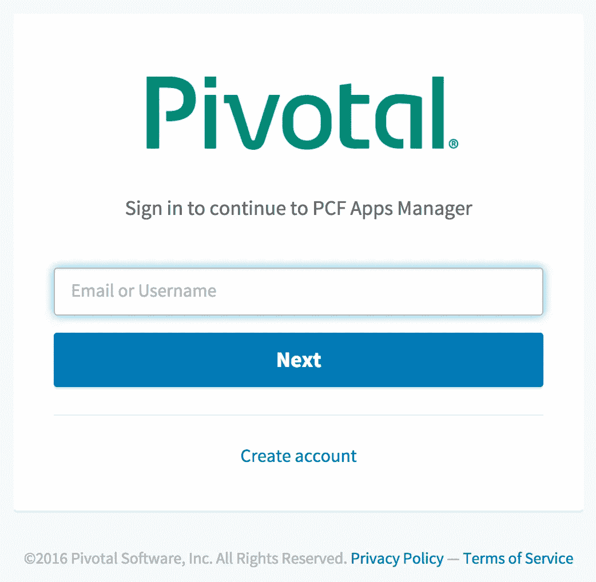
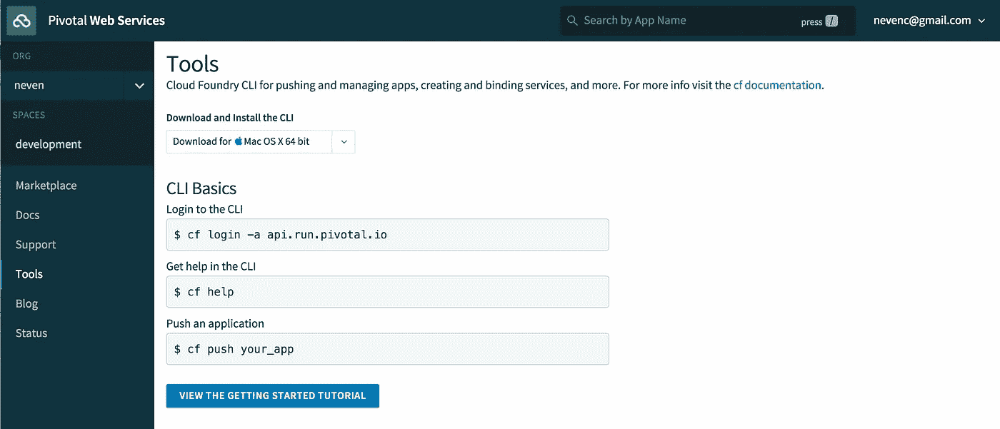
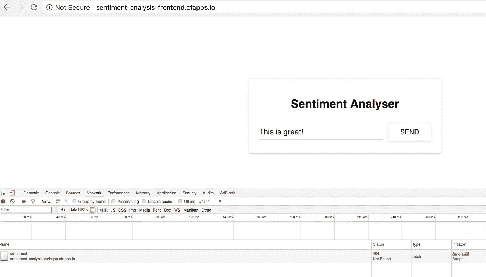
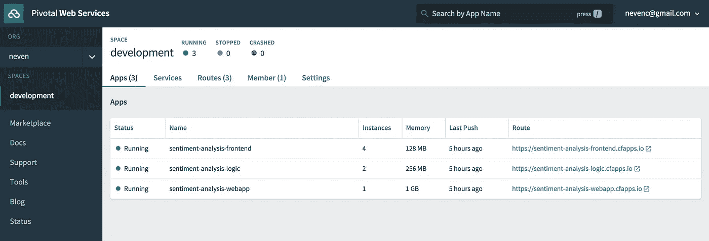
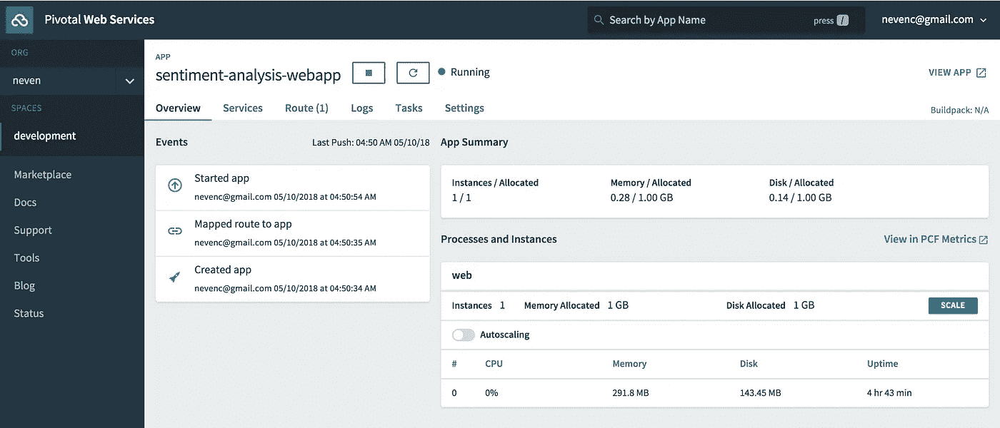
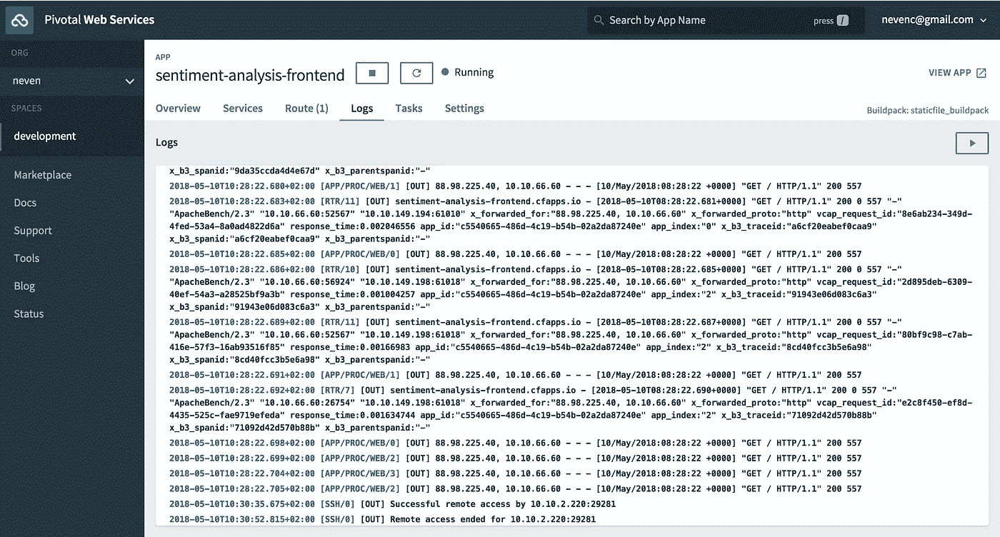
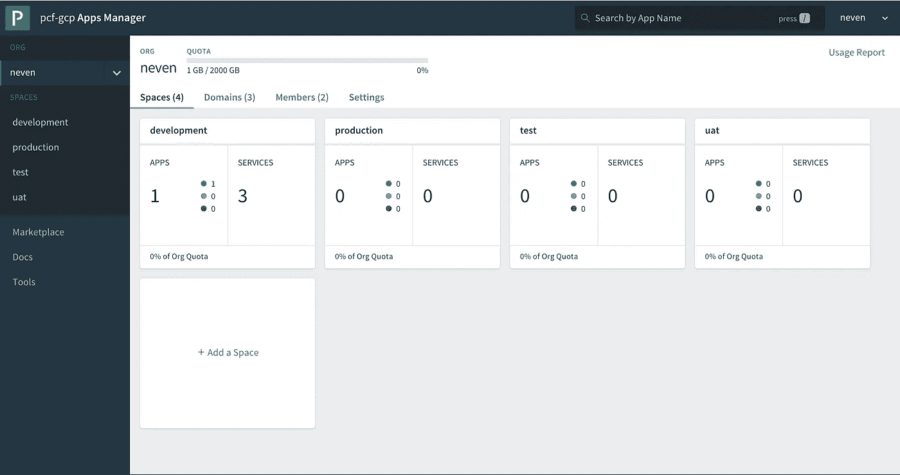
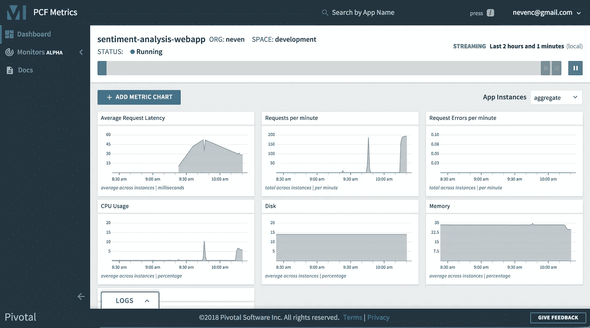

# 将无状态微服务应用轻松移植到 Cloud Foundry 应用运行时和 Pivotal 应用服务

> 原文：<https://itnext.io/stateless-microservices-on-application-platform-ce6dea9c9821?source=collection_archive---------8----------------------->


最近，我读了一篇[Rinor Maloku](https://medium.freecodecamp.org/learn-kubernetes-in-under-3-hours-a-detailed-guide-to-orchestrating-containers-114ff420e882)【2】撰写的关于 Kubernetes 的文章【1】，这篇文章温和而全面地介绍了这个无状态的微服务应用程序如何在一个更高抽象的平台上工作，例如应用程序运行时。

## TL；速度三角形定位法(dead reckoning)

我们采用了一个简单的微服务应用程序(使用 ReactJS、Spring Boot 和 Python Flask 编写的 3 个无状态微服务),并使用`cf push`以最小的代码更改部署到生产环境(Pivotal 应用程序服务)。

## 微服务应用简介

在他的文章中，Rinor 描述了一个简单的微服务架构应用，包括三个组件:

*   由 Nginx webserver 提供的 ReactJS 编写的情感分析**前端** ( `sa-frontend`)
*   在 Spring Boot 编写的情感分析 **WebApp** ( `sa-webapp`)，以及
*   用 Python Flask 写的情感分析**逻辑** ( `sa-logic`)。

参见 Rinor 的动画图像，了解应用程序工作流程:


微服务应用程序的动画流程。

这将在以后转化为在应用运行时(PCF PAS)中运行的三个微服务:

*   `sentiment-analysis-frontend`
*   `sentiment-analysis-webapp`
*   `sentiment-analysis-logic`

一旦部署完毕，应用程序将显示一个输入句子的表单。在将一个句子提交到表单中时，应用程序会进行情感分析，并为给定的句子提供一个带有情感色彩的极性(参见 Rinor 的动画 gif 以了解一个工作应用程序的图示)。


情感分析微服务应用实例。

有关完整的源代码，请参考 [Rinor 的 Github repo](https://github.com/rinormaloku/k8s-mastery)【3】或[my forged Github repo](https://github.com/nevenc-pivotal/k8s-mastery)【4】并更改代码以使该应用程序在 PCF PAS 中运行。

## 创建应用程序运行时帐户

首先，我们需要一个应用程序运行时的帐户。一个人可以做出许多选择。我选择了[Pivotal Web Services](https://run.pivotal.io)(PWS)【6】，因为我最熟悉这种应用平台风格(而且我确实为 Pivotal 工作——见下面的免责声明)。PWS 提供免费试用，任何人都可以轻松试用，不需要信用卡。所有 Cloud Foundry 应用程序运行时风格的开发人员体验都非常相似。

在向 Pivotal Web Services (PWS)确认您的帐户后，您需要登录 [PWS 网站](https://console.run.pivotal.io)【7】并下载 [CF CLI 工具](https://console.run.pivotal.io/tools)【8】。



Pivotal Web 服务::应用程序管理器::登录页面



Pivotal Web 服务::应用程序管理器::工具页面

## 登录应用程序运行时

使用 CF CLI 工具登录应用运行时环境，例如 Pivotal Web Services (PWS):

```
cf login -a [https://api.run.pivotal.io](https://api.run.pivotal.io)
cf target
cf apps
cf services
cf buildpacks
```

注意:如果您的 PCF 安装使用自签名证书，您需要跳过使用 CF CLI 工具的 SSL 验证，例如

```
cf login -a https://api.system.my.pcf.intranet **--skip-ssl-validation**
```


使用 CF CLI 登录 Pivotal Web 服务(PWS)

从 Github repo 获取原始源代码，例如

```
git clone https://github.com/rinormaloku/k8s-mastery
cd k8s-mastery
```


## 构建和部署 ReactJS 应用程序

首先我们看一下 ReactJS 应用程序`sa-frontend`。我们需要用`yarn`安装 ReactJS 模块。接下来，我们需要使用`yarn build`构建应用程序。为了在生产平台上工作，我们需要做一些改动。首先，更新`src/App.js`以参数化`sa-webapp` (Spring Boot WebApp)位置，例如

```
...const WEB_APP_URL = '[http://localhost:8080'](http://localhost:8080');...analyzeSentence() {
        fetch(WEB_APP_URL + '/sentiment', {
            method: 'POST',
            headers: {
                'Content-Type': 'application/json'
            },
...
```


构建 sa 前端应用程序

接下来，使用 Spring Boot WebApp 的实际部署位置再次更新应用程序，例如`http://sentiment-analysis-webapp.cfapps.io`

```
// const WEB_APP_URL = '[http://localhost:8080'](http://localhost:8080');const WEB_APP_URL = '[http://sentiment-analysis-webapp.cfapps.io'](http://localhost:8080');
```

> **注意**:通过读取环境变量而不是在代码中硬编码值(`src/App.js`)，我们或许可以更好地利用 ReactJS 应用程序中的`WEB_APP_URL`。ReactJS 开发者请插话(可能是类似于`process.env.WEB_APP_URL`的东西)。


重新构建 sa 前端应用程序

再次构建应用程序，例如`yarn build`。

从命令行推送应用程序，例如

```
cf push sentiment-analysis-frontend -b staticbuildpack -p build -m 256M -i 1 
```


使用 cf 推送部署应用程序

阅读 [CF CLI 文档](https://docs.cloudfoundry.org/cf-cli/getting-started.html#push)【9】了解更多命令行参数。

您还可以创建一个[部署清单文件](https://docs.cloudfoundry.org/devguide/deploy-apps/manifest.html) [10],以便于部署，例如

```
---
applications:
- name: sentiment-analysis-frontend
  buildpack: staticfile_buildpack
  path: build
  memory: 256M
  env:
    WEB_APP_URL: [http://sentiment-analysis-webapp.cfapps.io](http://sentiment-analysis-webapp.cfapps.io)
```

并且只需用`cf push`就能推送应用。


使用 manifest.yml 部署应用程序

您的应用程序已准备好接受测试，例如[http://opinion-analysis-frontend . cf apps . io](http://sentiment-analysis-frontend.cfapps.io)



部署的 sa 前端应用程序

注意到`sa-webapp`尚未部署，从`sa-frontend`到`sa-webapp`的 JavaScript 请求导致 404 错误。接下来我们将部署`sa-webapp`。

## 构建和部署 Spring Boot 应用程序

情绪分析 Webapp ( `sa-webapp`)是一个 Spring Boot 应用程序，自然地 ***在 Cloud Foundry 应用程序运行时运行得非常好*** ，开箱即用。

首先，我们需要建立一个应用程序。Rinor 的 app 使用 Maven `pom.xml`来定义依赖关系，所以我们可以使用`mvn clean install`或者`./mvnw clean install`来构建 app。


使用 Maven mvn 构建 sa-webapp

要推送 app，我们一般用`cf push`就可以了。因为这个应用程序需要设置环境变量，所以我们需要使用不启动选项来推送应用程序，设置环境变量，然后启动应用程序，例如

```
cf push sentiment-analysis-webapp -p target/sentiment-analysis-web-0.0.1-SNAPSHOT.jar --no-start
cf set-env sentiment-analysis-webapp sa.logic.api.url [http://sentiment-analysis-logic.cfapps.io](http://sentiment-analysis-logic.cfapps.io)
cf start sentiment-analysis-webapp
```


使用 cf push 从命令行部署 sa-webapp

同样，我们可以使用部署清单来更好地描述`manifest.yml`中的部署属性，例如

```
---
applications:
- name: sentiment-analysis-webapp
  path: target/sentiment-analysis-web-0.0.1-SNAPSHOT.jar
  env:
    sa.logic.api.url: [http://sentiment-analysis-logic.cfapps.io](http://sentiment-analysis-logic.cfapps.io)
```


使用清单部署 sa-webapp

请注意，我们在部署清单中将`sa-logic`应用程序 URL 作为环境变量传入，以便 Spring Boot 应用程序可以获取它并配置 webapp 服务 RestTemplate 来调用后端逻辑。

另外，请注意，我们不需要指定要使用的 buildpack，因为 Java buildpack 会被自动识别(如果我们正在推送一个 JAR / WAR 文件)。

最后，我们需要构建第三个组件，为 Python Flask 中构建的情感分析逻辑服务。

## 构建和部署 Python Flask 应用程序

与前两个微服务类似，我们可以使用`python_buildpack`轻松部署一个 Python 应用`sa-logic`。我们需要做一些改动，以使应用程序更加“云原生”并易于部署到 Cloud Foundry 应用程序运行时。

首先，我们需要添加引用`punkt`包(一行程序)的`sa/nltk.txt`，例如

```
punkt
```


通过添加 nltk.txt 构建 sa 逻辑

我们还需要修改 Python 代码，将网络绑定添加到`PORT`环境变量中，例如

```
from textblob import TextBlob
from flask import Flask, request, jsonify**import os**app = Flask(__name__)**port = int(os.getenv("PORT"))**[@app](http://twitter.com/app).route("/analyse/sentiment", methods=['POST'])
def analyse_sentiment():
    sentence = request.get_json()['sentence']
    polarity = TextBlob(sentence).sentences[0].polarity
    return jsonify(
        sentence=sentence,
        polarity=polarity
    )if __name__ == '__main__':
    app.run(host='0.0.0.0', port=**port**)
```


通过修改 sa/sensation _ analysis . py 构建 sa 逻辑

最后，我们准备使用`cf push`将 Python 应用程序推送到 Cloud Foundry 应用程序运行时

```
cf push sentiment-analysis-logic -b python_buildpack -p sa -m 256M -c python sentiment_analysis.py
```


使用 cf push 从命令行部署 sa 逻辑

类似地，我们可以在一个`manifest.yml`文件中定义部署属性，例如

```
---
applications:
- name: sentiment-analysis-logic
  buildpack: python_buildpack
  path: sa
  command: python sentiment_analysis.py
  memory: 256M
```

现在，部署变得非常简单，例如`cf push`


使用 manifest.yml 部署 sa 逻辑

## 把所有的放在一起

我们已经在生产平台上部署了三个微服务组件(应用程序)。很容易独立操作和管理所有应用程序，例如

```
cf appscf app sentiment-analysis-frontend
cf app sentiment-analysis-webapp
cf app sentiment-analysis-logiccf stop sentiment-analysis-frontend
cf start sentiment-analysis-frontend
cf restart sentiment-analysis-frontend
cf restage sentiment-analysis-frontend
```


使用 cf CLI 操作和管理微服务

平台为所有应用程序提供集成日志记录，包括最近的条目(类似于`tail LOGFILE`)和对日志的持续观察(类似于`tail -f LOGFILE`)，例如

```
cf logs sentiment-analysis-webapp
cf logs sentiment-analysis-webapp --recent
```


从应用程序获取流式日志


从应用程序获取最近的日志

Platform 还提供了一种简单的方法来独立地扩展应用程序，包括许多实例、调整容器内存大小、磁盘大小等。

```
cf scale sentiment-analysis-logic -i 2
cf scale sentiment-analysis-frontend -m 128M
cf scale sentiment-analysis-frontend -i 4
```


扩展 sa 逻辑应用程序(实例数量为 2)


扩展 sa 前端应用程序(内存大小为 128M，实例数量为 4 个)

该平台还提供了许多其他现成的东西，例如自动伸缩、自助服务市场、弹性、健康检查、负载平衡以及我们期望从生产级平台获得的许多其他有用功能。

我们需要探索的最后一件事是把所有的放在一起，并且可能用一个清单文件和一个`cf push`命令推动所有三个应用程序。

让我们在项目的根目录下构建一个单独的`manifest.yml`文件，例如

```
**manifest.yml**
sa-frontend/manifest.yml
sa-logic/manifest.yml
sa-webapp/manifest.yml
```

我们需要为每个应用程序更新`path`属性。同样，让我们调整内存的大小和实例的数量，例如

```
---
applications:
- name: sentiment-analysis-frontend
  buildpack: staticfile_buildpack
  path: **sa-frontend**/build
  **memory: 128M**
  **instances: 4**
  env:
    WEB_APP_URL: [http://sentiment-analysis-webapp.cfapps.io](http://sentiment-analysis-webapp.cfapps.io)
- name: sentiment-analysis-webapp
  path: **sa-webapp**/target/sentiment-analysis-web-0.0.1-SNAPSHOT.jar
  **instances: 1**
  **memory: 1GB**
  env:
    sa.logic.api.url: [http://sentiment-analysis-logic.cfapps.io](http://sentiment-analysis-logic.cfapps.io)
- name: sentiment-analysis-logic
  buildpack: python_buildpack
  path: **sa-logic**/sa
  command: python sentiment_analysis.py
  **memory: 256M**
  **instances: 2**
```

最后，我们可以用一个清单文件和一个命令部署所有三个应用程序，例如

```
cf push
```


一键部署所有三款应用

我们可以检查部署的应用程序，并测试它们是否部署成功，例如

```
cf appscf app sentiment-analysis-frontend
cf app sentiment-analysis-webapp
cf app sentiment-analysis-logic
```


验证三个微服务部署是否正确

## 开发者门户(AppsManager)

我们已经看到了 CF 命令行界面(CLI)和开发人员 API。Pivotal Web Services (PWS)和 Pivotal Application Service (PAS)还提供 PCF Apps Manager，这是一个 GUI 开发人员门户，提供与 CF CLI 类似的功能。您可以管理和操作应用程序，缩放它们，观察日志，并利用每个开发人员都渴望的许多其他有用的功能！



Pivotal Web 服务::应用程序管理器::空间视图



Pivotal Web 服务::应用程序管理器::应用程序视图



Pivotal Web 服务::应用程序管理器::日志视图



Pivotal 应用程序服务::应用程序管理器::组织视图

## PCF 指标

Pivotal Web 服务(PWS)和 Pivotal 应用服务(PAS)包括用于观察和关联指标和日志的 [PCF 指标](http://docs.pivotal.io/pcf-metrics/1-4/using.html) [12]组件，包括监控和警报功能。



Pivotal Web 服务::PCF 指标

在 PWS/PAS 平台中有很多其他的开发者糖果，但是那是另一次讨论的主题…

## 摘要

我们已经使用了三个简单的(无状态)微服务(都是用不同的编程语言编写的)，并展示了如何将它们推送到应用运行时(例如 Pivotal 应用服务)。

将无状态应用程序部署到生产平台上非常容易，只需对应用程序代码做最少的更改。使用定义良好的属性，部署清单使得推送应用程序代码变得更加容易:`cf push`

应用程序运行时对应用程序的无状态本质做出假设，并优化运行时以提高开发人员的生产力和运营效率。使用应用程序运行时的开发人员不需要构建和维护 Docker 映像、K8s 服务描述符、K8s 部署描述符、配置日志记录、配置 DNS、配置 SSL 证书、配置负载平衡以及平台提供的其他许多现成的东西。

容器运行时(Kubernetes)提供了许多类似的功能，具有更大的开发人员灵活性和进一步定制部署的能力，但代价是平台标准化、开发人员生产力和操作效率。权力越大，责任越大。开发人员不想担心管理和操作容器映像、运行时二进制文件和其他基础设施管道，除非有令人信服的理由，他们必须这样做。

应用运行时为无状态应用打造了一个[伟大的多租户平台，并允许](https://medium.com/@doctor_julz/cf-vs-kube-is-the-difference-who-creates-the-container-f2189960f98c)[开发者梦想俳句](https://twitter.com/onsijoe/status/598235841635360768?lang=en)【13】:

> **这里是我的源代码**
> 
> **帮我在云上运行一下**
> 
> **我不在乎如何**

## **免责声明**

我在[Pivotal Software Inc .](https://pivotal.io)【14】工作，该公司负责[Pivotal Cloud Foundry](https://pivotal.io/platform)【15】平台，包括[应用运行时(Pivotal 应用服务)](https://pivotal.io/platform/pivotal-application-service)【16】和[容器运行时(Pivotal 容器服务)](https://pivotal.io/platform/pivotal-container-service)【17】。

意见是我的，不是我雇主的。

## 参考

[1][https://medium . freecodecamp . org/learn-kubernetes-in-under-3-hours-a-detailed-guide-to-orchestration-containers-114 ff 420 e882](https://medium.freecodecamp.org/learn-kubernetes-in-under-3-hours-a-detailed-guide-to-orchestrating-containers-114ff420e882)

[https://rinormaloku.com/](https://rinormaloku.com/)

[3][https://github.com/rinormaloku/k8s-mastery](https://github.com/rinormaloku/k8s-mastery)

[https://github.com/nevenc-pivotal/k8s-mastery](https://github.com/nevenc-pivotal/k8s-mastery)

[5][https://www . cloud foundry . org/blog/how-to-try-cloud-foundry-2018/](https://www.cloudfoundry.org/blog/how-to-try-cloud-foundry-2018/)

[6][https://run . pivotal . io](https://run.pivotal.io)

[7][https://console . run . pivotal . io](https://console.run.pivotal.io)

[https://console.run.pivotal.io/tools](https://console.run.pivotal.io/tools)

[9][https://docs . cloud foundry . org/cf-CLI/getting-started . html # push](https://docs.cloudfoundry.org/cf-cli/getting-started.html#push)

[10][https://docs . cloud foundry . org/dev guide/deploy-apps/manifest . html](https://docs.cloudfoundry.org/devguide/deploy-apps/manifest.html)

[11][https://medium . com/@ doctor _ julz/cf-vs-kube-is-the-difference-who-created-the-container-f 2189960 f98c](https://medium.com/@doctor_julz/cf-vs-kube-is-the-difference-who-creates-the-container-f2189960f98c)

[12][http://docs.pivotal.io/pcf-metrics/1-4/using.html](http://docs.pivotal.io/pcf-metrics/1-4/using.html)

[13]https://twitter.com/onsijoe/status/598235841635360768?[lang=en](https://twitter.com/onsijoe/status/598235841635360768?lang=en)

[14] [https://pivotal.io](https://pivotal.io)

[15][https://pivotal.io/platform](https://pivotal.io/platform)

[https://pivotal.io/platform/pivotal-application-service](https://pivotal.io/platform/pivotal-application-service)

[https://pivotal.io/platform/pivotal-container-service](https://pivotal.io/platform/pivotal-container-service)