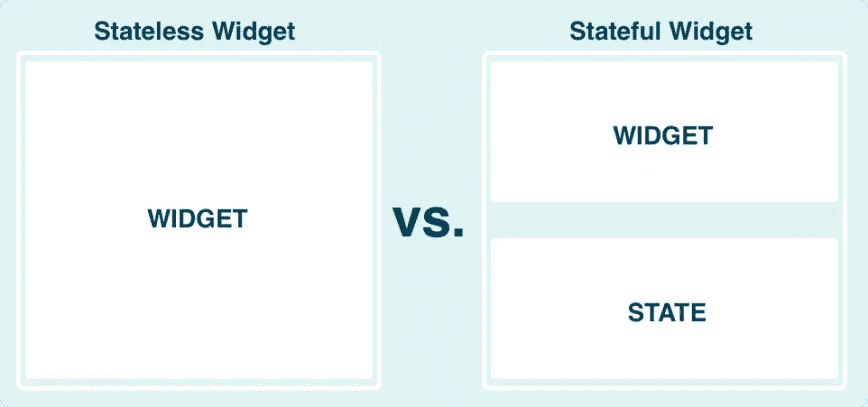

# 无状态与有状态

> 原文：<https://itnext.io/stateless-vs-stateful-cde9d178084f?source=collection_archive---------1----------------------->

Flutter 有两种核心类型的小部件:无状态和有状态。这两个小部件是 flutter 提供的每个小部件的构建块。

但是在我们进入什么是无状态和有状态之前，我们需要理解什么是状态。最简单的说法是，状态是可以在小部件中改变的东西。例如，假设我们有一个 like 按钮。该按钮可以被填充，也可以不被填充，这取决于它是否被点击。那是一个州。该按钮的状态可以是已填充或未填充。如果一个小部件是不变的，无论做什么都不会改变，那么它就没有状态。

既然您已经理解了状态，那么您就可以理解无状态和有状态这两个名称的由来了。无状态意味着它没有国家。Stateful 充满了状态。

## **有状态**

有状态窗口小部件非常强大，只要你能很好地管理你的状态。根据当前所处的状态，它们可以显示或执行不同的操作。如果你的应用程序交互性很强，那么你将需要使用很多有状态的小部件。在管理所有不同的状态时，你需要全神贯注。有很多工具和方法可以帮助进行状态管理(BLoC、Provider 等)。

## **无国籍**

无状态小部件没有状态。它们只是可以一直显示或做同样事情的小部件。它们不会改变运行时的行为方式。

编写小部件时要遵循的一个好习惯是尽量少用有状态的小部件。只使用无状态小部件编写代码，并在需要的地方添加有状态小部件。例如，如果你的屏幕上只有一个不会改变的文本和一个会改变的按钮，就没有必要让整个屏幕都是有状态的。只有按钮应该需要状态(如果它会改变状态，一旦按下像一个按钮)。这主要有两个原因。首先，它将提高性能。在例 2 的句子之前，我们只重新构建了 changing 按钮。如果整个屏幕是一个有状态的小部件，那么我们需要重新构建整个屏幕，即使屏幕中只有一个元素发生了变化。第二个原因是因为它使你的代码更易于维护和调试。假设我们提到的按钮工作不正常，你不需要查看屏幕的状态并弄清楚它是如何连接在一起并使按钮工作的，你只需要检查按钮本身并确保它相应地改变状态，然后从那里开始。

如你所见，无状态和有状态窗口小部件是 flutter 的核心部分，学习管理它们将帮助你编写更好的代码和拥有更好的架构。

感谢阅读

在推特上关注我:@tadaspetra