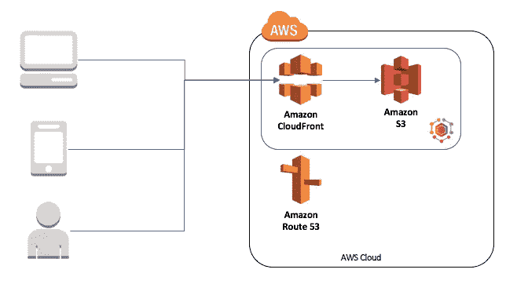

# 通过 https 与 S3、CloudFront、Gatsby 建立静态网站—持续交付

> 原文：<https://itnext.io/static-website-over-https-with-s3-cloudfront-gatsby-continuously-delivered-b2b33bb7fa29?source=collection_archive---------1----------------------->

在 Appfocused，我们的目标是以最小的财务风险构建企业级解决方案，并选择阻力最小的技术途径。我们自己的网站和博客的架构是低成本应用简单性和可靠性的完美展示。

在这篇文章中，我想分享 Github / Travis 和 AWS 服务套件如何帮助我们托管静态网站、设置域和 SSL/TLS 证书以及自动化部署。

*这篇文章最初发表在我公司的博客上。我们在 Appfocused 的使命是通过利用我们丰富的经验、对现代 UI 趋势的了解、最佳实践和代码工艺，帮助公司在 web 上实现* [*卓越的用户体验。*](https://www.appfocused.com)

# 体系结构

*   网站内容生成并上传到 S3 桶
*   CloudFront 使以前的缓存失效，并缓存 S3 存储桶的新内容
*   用户请求`[www.appfocused.com](http://www.appfocused.com)`
*   AWS Route 53 A 记录匹配这个请求，并指向链接的 CloudFront 分发
*   Cloudfront distribution 支持安全连接，并提供 S3 bucket 内容的缓存版本

静态网站架构

# 技术选择

*   静态网站生成器:**盖茨比**
*   主持: **AWS S3**
*   域名管理: **AWS 路由 53**
*   TLS 证书: **AWS 证书管理器**
*   CDN: **AWS Cloudfront**
*   代码库: **Github**
*   连续部署:**特拉维斯**

# 过程

网站运营基线如下:

*   生成网站
*   在[https://www.appfocused.com](https://www.appfocused.com/)安全地服务网站
*   将所有`appfocused.com`请求重定向至`[www.appfocused.com](http://www.appfocused.com)`
*   将所有`http`请求重定向至`https`
*   引入变更时自动构建和部署网站
*   部署时使 CDN 缓存无效

让我们一步一步来，讨论技术决策和设置。

# 1.生成网站

首先，我必须生成网站。我们的站点使用[Gatsby v2](https://www.gatsbyjs.org/)—React 的现代站点生成器。自从 2013 年引入 React paradigm 以来，很难想到一种更好的方式来让 web 应用和网页用 [CSS 模块](https://github.com/css-modules/css-modules)组成组件和封装样式。一旦设置完成，您需要运行`gatsby build`，它将为您的站点执行优化的生产构建，生成静态 HTML 和每条路线的 JavaScript 代码包。

在 github 上查看我们网站的源代码[以获取灵感。](https://github.com/appfocused/appfocused.com)

# 2.托管网站

一旦我生成了网站内容，我迫切需要向所有人展示它，而最简单的方法就是让它在互联网上可访问。

为此，我使用了 AWS S3。这项服务非常便宜，你不需要在 AWS EC2 实例上运行服务器，维护它，检查日志，最重要的是为正常运行时间付费。你所要做的就是创建存储桶(思考，文件夹)并将你生成的网站内容上传到那里。最后，S3 桶被配置为一个静态网站提供文件。

为了支持裸机`appfocused.com`和`www.appfocused.com`，我需要创建两个具有各自域名的 S3 桶。在我们的例子中，`www.appfocused.com`桶保存了网站的所有静态文件，而`appfocused.com`桶是空的，它被配置为使用`https`协议将来自`appfocused.com`的请求重定向到 URL `www.appfocused.com`。

我不打算详细讨论设置，因为 AWS 终于赶上了文档，现在已经有了几乎任何你能想到的广泛的文档。这里有一个关于如何建立一个带有自定义域的[基本静态站点的好文档。魔鬼总是在细节中，我稍后会谈到这些。](https://github.com/awsdocs/amazon-s3-developer-guide/blob/master/doc_source/website-hosting-custom-domain-walkthrough.md)

现在要记住的一个关键点是，用作[网站端点](https://github.com/awsdocs/amazon-s3-developer-guide/blob/master/doc_source/WebsiteEndpoints.md)(例如`http://appfocused.s3-website.eu-west-1.amazonaws.com`)的 AWS S3 桶不支持安全连接。这也是我在架构中添加 AWS Cloudfront 层的原因之一，这样我就可以代理对静态网站的安全请求。我将在接下来的步骤中告诉您如何设置它。

# 3.注册域名

我们的文件现在是托管的，用户可以通过 S3 水桶的网址查看。下一步是添加更像样和专业的域名— `appfocused.com`。

我倾向于谨慎选择域名注册商。这不仅仅是关于抢注一个闪亮的域名，还包括你将从注册商那里得到的持续的域名管理。

域管理直接影响服务器停机时间、DNS 配置更改、软件补丁和许多其他给 IT 组织带来严峻挑战的任务。

AWS Route 53 对我来说几乎在所有方面都赢了:低成本、快速 DNS 更新、子域名通配符(一些提供商阻止该功能)、与 AWS 其他部分的良好集成(显然)。

# 4.生成 SSL/TLS 证书

默认安全是一个很好的心态，虽然我们的许多用户可能永远不会注意到，但那些注意到的人会欣赏它。SSL/TLS 证书的另一个粉丝群体是搜索引擎爬虫。您可以放心，如果没有有效的 TLS 证书，您的网站将在 [SERP](https://en.wikipedia.org/wiki/Search_engine_results_page) 上受到处罚。当然，我想避免处罚。

通过 AWS 证书管理器，我免费申请了一个 SSL/TLS 证书。将裸域及其 www 版本添加到新证书中(一个包含主域、子域和通配符的证书)。

需要注意的一件重要事情是:在请求或导入证书之前，我必须在 AWS 证书管理器控制台中将 AWS 区域更改为 US East (N. Virginia)。

# 5.创建 CloudFront 发行版

在我们的解决方案中使用 CloudFront 有两个重要原因:

*   **边缘安全**
    SSL/TLS 证书提供网络级保护。
*   **快速和全球化**
    该网站的延迟得到改善，并且在原始服务器上的负载较低(在我们的例子中是 S3 存储桶)。

## 设置步骤和一些注意事项

*   我创建了两个 CloudFront 发行版。每个分布都指向相应的桶:一个指向`appfocused.com`，另一个指向`[www.appfocused.com](http://www.appfocused.com)`
*   对于*源域名*我**没有在下拉列表中使用 AWS 自动建议**(我知道这是违反直觉的)。相反，您需要手动输入*静态网站托管*部分(网站端点)中提供的存储桶 URL。URL 应该具有以下形式(或类似形式):`appfocused.com.s3-website-us-west-1.amazonaws.com`
*   在这两个发行版中，我将 HTTP 设置为 HTTPS 重定向
*   我将*默认根对象*置空
*   我将我们的 TLS 证书添加到了*自定义 SSL 证书*字段

一旦创建了发行版，我记下了两个发行版的 URL(类似于`d1111111111111.cloudfront.net`)，它们将在下一步中发挥关键作用。

# 6.配置您的域以与 CloudFront 协同工作

随着两个 CloudFront 发行版的成功设置和部署，我去 Route 53 配置我的域 DNS。我为`www.appfocused.com`和`appfocused.com`设置了一个记录，指向相应的 CloudFront 发行版。(格式与此类似:d 111111111111 . cloudfront . net)。
现在我们的网站只通过`https`协议提供服务:`http`流量和`appfocused.com`流量都被重定向到`https://www.appfocused.com`。完美的搜索引擎优化，因为没有镜像(重复的网站)创建。

# 7.使用 Github 和 Travis CI 设置连续交付

网站代码以开源形式托管在 github 上，[我们没什么好隐瞒的](https://github.com/appfocused/appfocused.com)。

每个对`master`分支的提交都会触发对 AWS S3 的构建和部署。荣誉由 Travis CI 完成。为了让它工作，我必须授权它访问 appfocused repository。

然后，我向 Travis CI 添加了环境变量:

*   `$AWS_ACCESS_KEY_ID`
*   `$AWS_SECRET_ACCESS_KEY`
*   `$S3_APPFOCUSED_BUCKET`
*   `$CLOUDFRONT_DISTRIBUTION_ID`

这些变量只有构建脚本可以访问，没有人能够访问它们。源代码和环境配置的这种分离和封装有助于我们自由地共享我们的代码，而不用担心被黑客攻击。

在 Travis 中配置好环境变量后，我在 Github 上的项目根目录下添加了一个配置文件— [.travis.yml](https://github.com/appfocused/appfocused.com/blob/master/.travis.yml) 。这是一个针对 Travis CI 的分步说明，它通过执行以下操作使持续集成和部署成为可能:

*   安装 AWS 命令行
*   安装 npm 依赖项
*   运行单元测试
*   构建项目
*   通过 AWS 认证
*   删除 S3 桶的内容(以前的版本)
*   将新版本部署到 S3
*   使新内容出现在用户屏幕上的 CloudFront 发行版上的缓存失效

所有这些都允许我从浏览器进入 Github 的 web UI，在`src/data/blog`中添加一个文件夹和一个 markdown 文件。编辑完 markdown 文件后，我可以保存它，并使用浏览器中相同的 web 界面提交给`master`分支。新的博客帖子将在几秒钟内发布。

# 费用

最后但同样重要的是，拥有成本。【appfocused.com 的年度维护成本:

*   域名价格— **$12**
*   S3 /云锋— **$40**
*   盖茨比/ Github /特拉维斯— **免费**(需开源)

**总计:每年 52 美元**