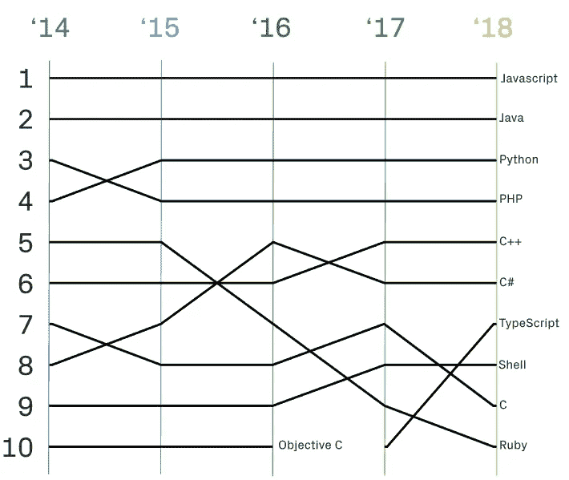
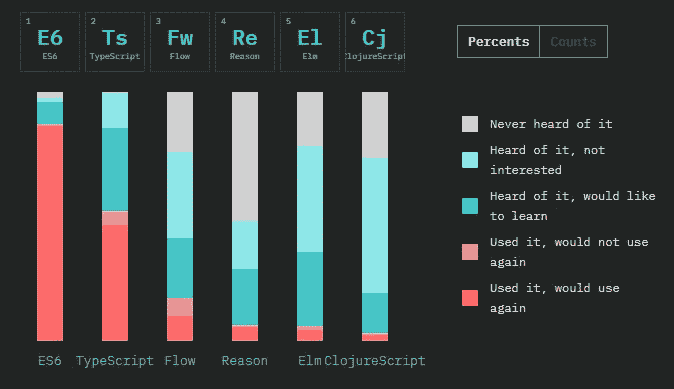
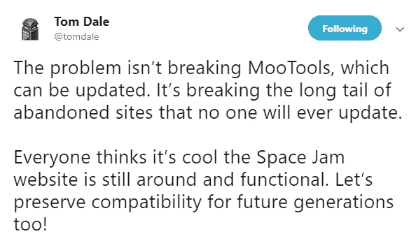
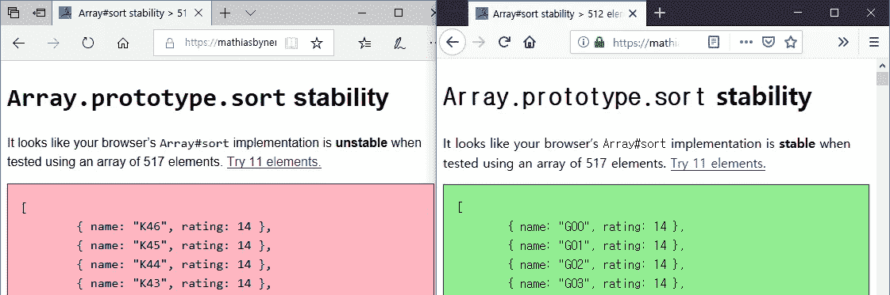
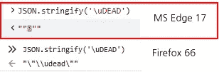
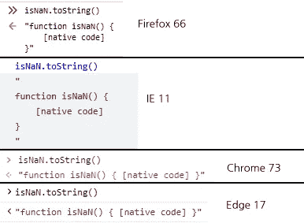

# JavaScript(ECMAScript)的现状:2019 年及以后。

> 原文：<https://itnext.io/status-of-javascript-ecmascript-2019-beyond-5efca6a2d233?source=collection_archive---------0----------------------->

JavaScript 继续流行，这是没有必要再提了

多年来，JavaScript 一直是 GitHub 中最常用的语言，如 GitHub 报告中的[图](https://octoverse.github.com/projects#languages)、 [Octoverse](https://octoverse.github.com/) 所示。还有 Stack Overflow 最近的调查，“[开发者调查结果 2019](https://insights.stackoverflow.com/survey/2019#technology) ，JavaScript 被评为最受欢迎的技术。



[GitHub 上使用的热门语言](https://octoverse.github.com/projects#languages)

特别是 ECMAScript 2015 以及后续的 ECMAScript 规范，似乎被很多开发者接受，没有太大阻力。



“2018 年 JS 状况”调查中的 JavaScript 风格。

在本文中，我们将了解 ECMAScript 2018 的主要特性，以及预计将包含在以下规范中的建议，ECMAScript 2019 和 ECMAScript 2020。

> **切记:**
> 本文内容以 2019 年 6 月为准。根据你阅读的时间，文章的内容和事实可能会有所不同。

# 一些变化和新闻

虽然它不会直接影响 JavaScript 的语言方面，但是有一些变化可能会影响间接方面，比如使用环境和生态系统。

## TC39 的变化

讨论 JavaScript 标准规范的技术委员会 TC39 已经决定从 2019 年开始改变其运行结构。TC39 每年举行六次会议，该委员会已经发展到大约 40 到 60 人参加会议的地步。

过去由董事长和副董事长组成的结构，变成了由三位联席董事长([阿基·布劳恩](https://github.com/gesa) (PayPal)、[布莱恩·泰尔森](https://github.com/bterlson)(微软)和[尤利娅·斯塔策夫](https://github.com/codehag) (Mozilla)共同负责的横向结构。还在 2019 年 3 月开通了官网( [https://tc39.github.io](https://tc39.github.io) )。

在 TC39 联席主席 Aki Braun 撰写的文章《TC39 一年(加一点点)》中，可以看到 TC39 会议的进展和会议的样子。

2018 年 7 月早些时候，npm 加入了 [ECMA 国际](https://www.ecma-international.org/)和 TC39(参见“ [npm 加入 ECMA 国际和 TC39](https://blog.npmjs.org/post/175722319045/npm-joins-ecma-international-and-tc39) ”)。

## SharedArrayBuffer

由于安全漏洞 [Meltdown 和 Spectre](https://meltdownattack.com/) ，浏览器厂商改变了默认设置，从 2018 年 1 月 5 日起禁止使用 [SharedArrayBuffer](https://developer.mozilla.org/en-US/docs/Web/JavaScript/Reference/Global_Objects/SharedArrayBuffer) 对象。

这些设置至今仍在保持，除了 Chrome。Chrome 从 v67 开始重新激活，通过[站点隔离](https://www.chromium.org/Home/chromium-security/site-isolation)(参见“ [Isue 821270:重新启用 SharedArrayBuffer + Atomics](https://bugs.chromium.org/p/chromium/issues/detail?id=821270) ”)。

## MS Edge 对铬的采用

微软在 2018 年 12 月 6 日宣布，它将把浏览器 Microsoft Edge 过渡到基于 Chromium 的浏览器，这让许多人感到惊讶(参见“ [Microsoft Edge:通过更多开源合作制作 Webbetter)。](https://blogs.windows.com/windowsexperience/2018/12/06/microsoft-edge-making-the-web-better-through-more-open-source-collaboration/)))

在 2019 年 1 月 29 日 TC39 会议期间与微软举行的 [Q & A 会议](http://tc39.github.io/tc39-notes/2019-01_jan-29.html#edgechakra-qa-from-microsoft-brian-terlson--kevin-smith)中，披露了以下关于微软 Edge Chromium 过渡的事实。

*   没有开源旧渲染引擎的计划。
*   现有 JavaScript 引擎 [ChakraCore](https://github.com/microsoft/ChakraCore) 的更新将继续，但没有长期计划。

> 查克拉核心团队成员朱利民评论道:
> 查克拉核心目前正在浏览器之外的各种项目中使用。因此，尽管微软 Edge 的方向发生了变化，我们的团队将继续支持 ChakraCore(参见“ [Chromium 在微软 Edge 中的采用和 ChakraCore 的未来](https://github.com/Microsoft/ChakraCore/issues/5865)”)。

你可以从[微软 Edge 内部渠道](https://www.microsoftedgeinsider.com/en-us/download/)网站下载基于 chromium 的微软 Edge(Canary/Dev/Beta 版本)。

> 在“[微软 Edge 和 Chromium 开源:我们的意图](https://github.com/MicrosoftEdge/MSEdge/blob/master/README.md)”文章中可以找到将微软 Edge 转变为基于 Chromium 的目的和未来计划。

从开发者的角度来看，微软 Edge 的这种转变可以减轻跨浏览器开发的负担和困难。

然而，从网络生态系统的角度来看，一些令人担忧的事情可能会发生。因为这将减少浏览器的多样性。

如果你还记得 Internet Explorer 处于垄断地位的时候，许多网站只针对 Internet Explorer，那么基于 chromium 的浏览器的扩展将不是一件令人愉快的事情。

> 对于多样性的担忧，请参见文章“ [Chrome 正在变成新的 Internet Explorer 6](https://www.theverge.com/2018/1/4/16805216/google-chrome-only-sites-internet-explorer-6-web-standards) ”和 Mozilla 的“[再见，EdgeHTML](https://blog.mozilla.org/blog/2018/12/06/goodbye-edge/) ”。

# 模块支持

由于 ECMAScript 2015 中添加了模块支持，模块现在作为一项基本功能被广泛使用。

让我们看看动态导入()语法和本机模块支持的覆盖范围和当前状态，以进一步扩展模块的用途。

## 动态导入()

基于 [import()](https://github.com/tc39/proposal-dynamic-import) 语法的承诺，会让模块动态加载。该提案在第 3 阶段停留了一段时间，但最终在 2010 年 6 月 6 日达到了第 4 阶段，并成为 ECMAScript 2020 的一部分。

*   有关 import()语法的详细解释，请参见文章“[ES modules:A cartoon deep-dive](https://hacks.mozilla.org/2018/03/es-modules-a-cartoon-deep-dive/)”。
*   查看[caniuse.com](https://caniuse.com/#feat=es6-module-dynamic-import)的浏览器支持范围。

```
import("./myModule.mjs")  
    .then(module => {
        ...
    });
// using async/await
(async () => {
    const module = await import("./myModule.mjs");
    ...
})();
```

从 Firefox 60 开始，可以通过设置**JavaScript . options . dynamic import**标志来使用 import()语法，这在 Firefox 67 中是默认启用的。

微软 Edge(不基于 chromium)还不支持 import()语法，但是当基于 chromium 的 Edge 发布时，它应该会得到支持。

## 本机模块加载

从 2018 年 5 月发布的 Firefox 60 开始，可以在没有标志的情况下使用本机模块(ESM)(参见“ [Firefox 60 —模块和更多](https://hacks.mozilla.org/2018/05/firefox-60-modules-and-more/)”)。2017 年 9 月发布的 Node.js 8.5.0 在实验上支持 ESM。

Node.js 中的 ESM 需要`--experimental-modules`标志，如下例所示。在这种情况下，CommonJS 的' require()'将被禁用以进行模块加载(参见"[宣布新的实验模块](https://github.com/nodejs/modules/blob/master/doc/announcement.md)")。

```
node --experimental-modules my-app.mjs
```

Node.js 基金会成立了“[模块团队](https://github.com/nodejs/modules)，为 ESM 提供官方支持。模块团队的工作分为 [4 个阶段](https://github.com/nodejs/modules/blob/master/doc/plan-for-new-modules-implementation.md)。

*   **阶段 0**
    从当前节点分支，但删除了节点 8.5.0+ `--experimental-modules`的大部分实现。
*   **第 1 阶段**
    增加了“最小内核”特性，模块工作组认为这些特性可能会出现在任何潜在的新 es 模块实现中。
*   **第 2 阶段**
    用足够的功能充实实现，作为一个最小可行的产品，它应该对普通用户有用。
*   **第三阶段**
    改善用户体验，延伸 MVP。

这项工作目前正处于第三阶段。

# ECMAScript 2018

[ECMAScript 2018](http://www.ecma-international.org/ecma-262/9.0/) 于 2018 年 6 月公布。

## 异步迭代器

异步操作符枚举异步流数据，其操作类似于典型的操作符，并使用一种语法形式`for — await — of`。异步操作符和普通操作符的区别在于它返回 Promise 对象。

```
async function test() {  
    // Regular Iterator
    for (const i of list) ...// Async Iterator
    for await (const i of asyncList) ...
}
```

如果您正在处理异步调用流，您可以创建一个异步操作符工厂。

```
// example from: [https://jakearchibald.com/2017/async-iterators-and-generators/](https://jakearchibald.com/2017/async-iterators-and-generators/)
async function* asyncRandomNumbers() {
    const url = "[https://www.random.org/integers/?num=1&min=1&max=100&col=1&base=10&format=plain&rnd=new](https://www.random.org/integers/?num=1&min=1&max=100&col=1&base=10&format=plain&rnd=new)";while (true) {
        const response = await fetch(url);
        const text = await response.text();
        yield Number(text);
    }
}(async function() {
    let i = 0;for await (const number of asyncRandomNumbers()) {
        console.log(++i, "=>", number);
        if (i === 10) break;
    }
})();// 1 "=>" 65
// 2 "=>" 62
// ...
```

## 对象静止/扩散属性

与 ECMAScript 2015 中的 Rest 参数和 spread 运算符规范一样，该提案引入了[对象析构赋值和对象文字的 Spread 属性](https://github.com/tc39/proposal-object-rest-spread)。

```
// Rest property
let { x, y, ...z } = { x: 1, y: 2, a: 3, b: 4 };  
x; // 1  
y; // 2  
z; // { a: 3, b: 4 }// Spread property
let n = { x, y, ...z };  
n; // { x: 1, y: 2, a: 3, b: 4 }
```

## 模板字面语法限制的下降

模板文字删除了对转义序列使用的限制(参见“[模板文字修订](https://tc39.github.io/proposal-template-literal-revision/)”)。

标记模板文字是一个接收模板并返回修改后的字符串的函数。传递给函数的字符串可以是以下类型之一:

*   熟:转义序列被解释
*   Raw:转义序列是普通文本。
    模板字符串中未解释的值由 [String.raw()](https://developer.mozilla.org/en-US/docs/Web/JavaScript/Reference/Global_Objects/String/raw) 方法处理。

```
function tagFunc(str, substs) {  
    return str;
}const result = tagFunc`\u{4B}`;  
result;  // ["K"]  
result.raw; // ["\u{4B}"]
```

以前，如果模板在反斜杠后有一些字符序列，它被视为非法，不会返回原始字符串。

*   `\u`:统一码(如`\u004B`)
*   `\x`:十六进制(如`\x4B`)
*   `\positive`:八进制(如`\141`)

ECMAScript 2018 消除了所有与转义序列相关的语法限制，并以原始形式返回字符串。在这种情况下，解释的值返回`undefined`。

```
const result = tagFunc`\131`;  
result;  // [undefined]  
result.raw; // ["\131"]
```

> 请查看“ [ES2018:模板文字修订版](http://2ality.com/2016/09/template-literal-revision.html)”以了解有关模板文字中的问题和解决方案的更多信息。

## 承诺.原型.最终

像`try...catch`语句的`finally`语法一样，这个提议为 Promise 对象引入了相似性用法。

`finally`语法是在最后无条件执行的代码块，不管 Promise 对象的处理状态(“resolve”或“reject”)。一旦调用了 Promise 对象，不管结果如何，都将执行这个代码块。

```
let isLoading = true;fetch("[https://www.random.org/integers/?num=1&min=1&max=100&col=1&base=10&format=plain&rnd=new](https://www.random.org/integers/?num=1&min=1&max=100&col=1&base=10&format=plain&rnd=new)")  
.then(function(res) {
    if(res) {
        return res.text();
    }throw new TypeError("Error");
})
.then(function(text) { /* Success */ })
.catch(function(error) { /* Error */ })
.finally(function() {
    // will be performed regardless success or error
    isLoading = false;
});
```

> 从 MDN 的[promise . prototype . finally](https://developer.mozilla.org/en-US/docs/Web/JavaScript/Reference/Global_Objects/Promise/finally)文档中查看更多细节。

## 正则表达式

增加了几个正则表达式建议。

*   [**s (dotAll)标志为正则表达式**](http://2ality.com/2017/07/regexp-dotall-flag.html)的圆点(。)匹配所有字符，但不针对`\r`也不针对`\n`。为了解决这个问题，引入了新的[旗](https://developer.mozilla.org/en-US/docs/Web/JavaScript/Guide/Regular_Expressions#Advanced_searching_with_flags_2)T2。

```
// previous
/./test("a");  // true
/./.test("\n");  // false// dotAll flag
/./**s**.test("\n");  // true
```

*   [**RegExp 命名捕获组**](https://github.com/tc39/proposal-regexp-named-groups)
    提供了命名捕获组的能力。`(?**<name>**pattern)`，将把`**<name>**`添加到捕获组模式中，然后用这个名字作为引用捕获。

```
const rx = /(?**<year>**[0-9]{4})-(?**<month>**[0-9]{2})/;  
const match = rx.exec('2018-03');  
match.groups.**year**; // 2018  
match.groups.**month**; // 03
```

*   [**RegExp Lookbehind 断言**](http://2ality.com/2017/05/regexp-lookbehind-assertions.html)
    在正则表达式中，特定模式的值后面跟(lookahed)或后面不跟(负 look ahed)一个字符串。
    相比之下，这一提议提供了寻找特定模式以超前(lookbehind)或不超前(negative lookbehind)的能力。

```
// positive lookahead
/aa(?=bb)/.test("aabb"); // true// negative lookahead
/aa(?!bb)/.test("aac");  // true// positive lookbehind
/(?<=aa)bb/.test("aabb");  // true// negative lookbehind
/(?<!=aa)bb/.test("bbbb");  // true
```

*   [**RegExp Unicode 属性转义**](https://github.com/tc39/proposal-regexp-unicode-property-escapes)
    Unicode 属性转义是在设置了`[u](https://developer.mozilla.org/en-US/docs/Web/JavaScript/Reference/Global_Objects/RegExp/unicode)` [标志](https://developer.mozilla.org/en-US/docs/Web/JavaScript/Reference/Global_Objects/RegExp/unicode)的正则表达式中可用的一种新型转义序列。

```
/^**\p{**White_Space**}**+$/**u**.test('\t \n\r');  // true /^**\p{**Script=Greek**}**+$/**u**.test('μετά');  // true
```

# ECMAScript 2019

[ECMAScript 2019](https://tc39.github.io/ecma262/2019/) 处于候选草稿状态。鉴于之前的发布日期，最终版本预计将于 2019 年 6 月左右公布。

## array . prototype . flat()/array . prototype . flat map()

[Array.prototype.flat()](https://developer.mozilla.org/en-US/docs/Web/JavaScript/Reference/Global_Objects/Array/flat) 方法和[array . prototype . flat map()](https://developer.mozilla.org/en-US/docs/Web/JavaScript/Reference/Global_Objects/Array/flatMap)方法递归地查找指定深度的子数组元素，并创建一个新数组连接到其中。

```
// Array.prototype.flat
[1, 2, [3, 4]].flat();  // [1, 2, 3, 4]
[1, 2, [3, 4, [5, 6]]].flat(1);  // [1, 2, 3, 4, [5, 6]]// Array.prototype.flatMap
[1, 2, 3, 4].map(x => [x * 2]);  // [[2], [4], [6], [8]]
[1, 2, 3, 4].flatMap(x => [x * 2]);  // [2, 4, 6, 8]
```

> 关于命名的小故事。**平()**:
> 
> 最初提议的名称是"。**展平()**”。但是，MoTools(广泛使用的遗留库)已经在同名的'**array . prototype . flatten()'**下提供了类似的功能。若名”。flaten()”按原样被接受，它可能对所有使用 MoTools 的网站都有问题。
> 
> 为了避免冲突的可能性，**。flatten()** 更名为**。**平()。
> -1)[的名称。‘smoosh()](https://github.com/tc39/proposal-flatMap/pull/56)’是候选人之一。
> - 2)也有人建议改变 MoTools 的 flatten()的行为，使其与 ECMAScript 2019 一样工作(参见“[更新 Array.prototype.flaten 以匹配 TC39 提案](https://github.com/mootools/mootools-core/issues/2797)”)。但是，这可以让许多不再更新的网站停止工作，比如汤姆·戴尔的推特(他参与了[恩伯](https://emberjs.com/)和 [SproutCore](https://github.com/sproutcore/sproutcore) 的开发)。



[https://twitter.com/tomdale/status/971288054966247430](https://twitter.com/tomdale/status/971288054966247430)

## Object.fromEntries()

[Object.fromEntries()](https://developer.mozilla.org/en-US/docs/Web/JavaScript/Reference/Global_Objects/Object/fromEntries) ，将一列键值对转换成一个对象。

```
const entries = new Map([  
    ['foo', 'bar'],
    ['baz', 42]
]);Object.fromEntries(entries);  // { foo: "bar", baz: 42 }
```

## String.prototype.trimStart() /。特里蒙德()

删除开头([string . prototype . trim start()](https://developer.mozilla.org/en-US/docs/Web/JavaScript/Reference/Global_Objects/String/trimStart)—别名)的空白。trimLeft()')或从末尾([string . prototype . trimend()](https://developer.mozilla.org/en-US/docs/Web/JavaScript/Reference/Global_Objects/String/trimEnd)—aliased '开始。trimRight()')。

```
const greeting = "   Hello world!   ";greeting.trimStart();  // "Hello world!   "  
greeting.trimEnd();  // "   Hello world!"
```

## Symbol.prototype .描述属性

Symbol.prototype.description 属性返回 Symbol 对象的可选只读描述。

```
// will return 'Test Description'
Symbol("Test Description").description;
```

## 可选 catch 绑定

[可选的 catch 绑定](https://github.com/tc39/proposal-optional-catch-binding)提议，是允许在`try...catch`语句中的 catch 语法中不使用参数时省略参数。

```
// Traditional way
try { ··· } catch**(e)** { ··· }// Optional catch binding
// if don't need the use of parameter, it can be omitted
try { ··· } catch { ··· }
```

## Array .原型. sort()稳定性

[Array.prototype.sort()](https://developer.mozilla.org/en-US/docs/Web/JavaScript/Reference/Global_Objects/Array/sort) 方法使用了不稳定的[快速排序](https://en.wikipedia.org/wiki/Quicksort)算法，对超过 10 个元素的数组进行排序。为了确保数组正确对齐，ECMAScript 2019 对 Array.prototype.short()使用了 [Timsort](https://en.wikipedia.org/wiki/Timsort) 算法。

该规范目前适用于所有 JavaScript 引擎。但是，Microsoft Edge with ChakraCore 会对包含 512 个以上元素的数组产生排序错误。

下面的截图展示了 Edge 和 Firefox 上的[稳定性测试结果](https://mathiasbynens.be/demo/sort-stability-512)。如你所见，Edge 正在失败。



稳定性测试结果:(左)微软 Edge 17.17134 /(右)火狐 66.0.2

> 更多详细讨论请参见:“[数组#排序稳定性](https://docs.google.com/presentation/d/1mHvxDciqsAchhjepMZlU5fn1DBvglCXSjDWUEtsPGvI/edit#slide=id.g41da6c5107_0_0)”。

## 格式良好的 JSON.stringify

[RFC 8259](https://tools.ietf.org/html/rfc8259#section-8.1) 指定要编码为 UTF-8 格式的 JSON 文本，用于 JSON 对象数据交换。但是当使用 JSON.stringify()时，一些 UTF-16 代码(从 0xD800 到 0xDFFFF 的字符，被归类为“代理”)没有在 UTF-8 中编码。

ECMAScript 2019 返回转义序列，而不是返回无效的 Unicode 字符串，如下图所示(Edge)。



JSON.stringify()在 Edge 和 Firefox 上的结果

> 欲了解更多详情，请查看[提案文件](https://github.com/tc39/proposal-well-formed-stringify)。

## 包含 JSON

ECMAScript 声称 JSON 是`[JSON.parse](https://tc39.github.io/ecma262/#sec-json.parse)`中的子集，但这不是**真的**，因为 JSON 字符串可以包含未转义的 U+2028 行分隔符和 U+2029 段落分隔符。

这个提议表明 ECMA-262 可以扩展，以允许这些字符不破坏 JSON 成为 ECMAScript 的子集。

```
// if ECMA is superset of JSON, these must be true
eval('"\u2028"') === "\u2028"  // true  
eval('"\u2029"') === "\u2029"  // true
```

> 要了解更多细节，请查看提案文档:[包含 JSON(又名 JSON ⊂ ECMAScript)](https://github.com/tc39/proposal-json-superset)

## Function.prototype.toString 版本

根据 ECMAScript 2016 中的定义， *Function.prototype.toString()的结果会因引擎而异*。ECMAScript 2019 确保返回定义的原始代码(参见“[function . prototype . tostring revision](https://tc39.es/Function-prototype-toString-revision/)”)。

当返回函数中定义的代码时，ECMAScript 2019 使用以下算法返回函数中定义的代码字符串:

*   **换行符** :
    `\r\n` (Windows)或者`\n` (macOS)全部返回为 Unix 风格的`\n`。
*   **内置函数** :
    所有没有通过 ECMAScript 定义的代码(主要是内置函数)都将作为`[native code]`返回。

```
isNaN.toString();  // "function isNaN() { [native code] }"
```



“isNaN.toString()”在不同浏览器中的结果

*   **通过** `**Function**` **和** `**GeneratorFunction**` **:**
    引擎动态创建的函数必须创建适当的源代码并附加到函数上。
*   **其他情况:**
    扔个`TypeError`。

> 更多详细信息，请查看:[ES proposal:function . prototype . tostring revision](http://2ality.com/2016/08/function-prototype-tostring.html)

# ECMAScript 2020

截至 2019 年 3 月 1 日，TC39 回购主分支更新为指向下一个 ECMAScript 2020。(参见[提交日志](https://github.com/tc39/ecma262/commit/7a9a9b6b25c115fcda95e943e8875432636f2cfd))。

至此，ECMAScript 2020 完成的提案(阶段 4)只有[***string . prototype . matchall()***](https://github.com/tc39/String.prototype.matchAll)和[***import()***](https://github.com/tc39/proposal-dynamic-import)而已，但随着时间的推移这些列表将包括更多的项目。

*string . prototype . match all()*方法的工作方式类似于 *String.prototype.match()* 。当与`g(global)/y(sticky)`标志一起使用时，前者返回包含匹配字符串和匹配细节的迭代器。

```
const str = "test1test2";  
const rx = /t(e)(st(\d?))/g;str.match(rx);  // ["test1", "test2"]for (const match of str.matchAll(rx)) {  
    // 1: ["test1", "e", "st1", "1", index: 0, input: "test1test2"]
    // 2: ["test2", "e", "st2", "2", index: 5, input: "test1test2"]
    match;
}
```

## 一些新的或不完整的建议

让我们来看看一些有趣的提案还没有到最后阶段。

## globalThis

通常访问顶层对象是通过浏览器环境中的' ***窗口*** '对象。

随着执行环境的扩展，访问顶层对象的方式也发生了变化。

*   在 Node.js 环境中，通过' ***全局*** '对象访问顶层对象。
*   在 HTML5 规范中，有' *Window* 和' ***WindowProxy*** '用于此，而 ECMAScript 2015 规范中，两个对象以相同的方式访问顶级对象。

> 检查窗口和 WindowProxy 对象之间的差异的“[内部和外部窗口](https://developer.mozilla.org/en-US/docs/Mozilla/Developer_guide/Inner_and_outer_windows)”。

不管环境如何，下面的代码是获取顶级对象(“全局”)引用的最简单的方法。但这种方法导致 Chrome 应用违反了*内容安全政策(CSP)* 。(参见“[es6-垫片断裂镀铬 App CSP](https://github.com/paulmillr/es6-shim/issues/301) ”)。

```
**var** global = Function('return this')();
```

众所周知的 ES6 兼容垫片库， [***ES6 垫片***](https://github.com/paulmillr/es6-shim) ，使用下面的函数来获取全局对象，这是目前最常用也是最好的方法。

```
// [https://github.com/paulmillr/es6-shim/blob/003ee5d15ec1b05ae2ad5ddad3c02fcf8c266e2c/es6-shim.js#L176](https://github.com/paulmillr/es6-shim/blob/003ee5d15ec1b05ae2ad5ddad3c02fcf8c266e2c/es6-shim.js#L176)
var getGlobal = function () {  
    /* global self, window, global */
    // the only reliable means to get the global object is
    // `Function('return this')()`
    // However, this causes CSP violations in Chrome apps.
    if (typeof self !== 'undefined') { return self; }
    if (typeof window !== 'undefined') { return window; }
    if (typeof global !== 'undefined') { return global; }
    throw new Error('unable to locate global object');
};
```

新提议“globalThis”旨在提供一种进入顶层的方式，摆脱依赖环境的不适。目前停留在“第三阶段”。尚未最终确定，但在 Chrome 71 和 Firefox 65 以及 Node.js 12 中，globalThis 对象可以如下使用:

```
globalThis.setTimeout;  // window.setTimeout
```

> 关于' **globalThis** 名称:
> 
> 类似于“Array.prototype.flat()”的情况，第一个建议的名称是“global”。但是这个名字的使用，[报破了 flickr.com](https://github.com/tc39/proposal-global/issues/20)的报道，从而让把名字改成了‘global this’。

## 类字段声明

从 Babel 7 . 1 . 0(2018 年 9 月 17 日发布)开始可以使用类字段声明。然而，这个提议还没有达到最后阶段，目前停留在“第三阶段”。

这个提议以一种更加直观和简单的方式为类变量引入了声明性语法。

**初始化** 初始化实例变量是通过构造函数实现的。

```
class MyClass {  
    constructor() {
        this.x = 1;
        this.y = 2;
    }
}
```

使用 class 字段，实例变量可以被定义为下面代码的`//Initializer`部分，初始化区域在构造函数运行之前运行。

```
class MyClass {  
    // Initializer
    x = 1;
    y = 2;
    log = console.log("Initializer"); constructor() {
        console.log("Constructor:", this.x, this.y);
    }
}new MyClass();  
// Initializer
// Constructor: 1 2
```

**私有声明
但是这实际上并没有让变量或方法作为私有变量工作(好吧，有一种方法可以让变量或方法作为私有变量工作)。**

```
function MyClass() {  
    this._x = 1;
    this._y = 2;
}MyClass.prototype.getX = function() {  
    return this._x;
}
```

私有声明器使用数字符号( **#** )作为前缀来显式声明它是私有的。以' # '开头的变量或方法只能在类块中访问。

```
class MyClass {  
    #foo; // private field constructor(foo) {
        this.#foo = foo;
    } incFoo() {
        this.#foo++;
    }
}
```

**声明和访问** 下面是一个简单的以各种形式声明和访问类字段的例子。

```
class MyClass {  
    A = 1;  // (a) instance field
    static B = 2;  // (b) static class field
    #C = 3;  // (c) private field getPrivate() {
        return this.#C;
    }
}new MyClass().A;  // 1
MyClass.B;  // 2
new MyClass().getPrivate();  // 3
```

> 查看 [ES 建议:类别字段](http://2ality.com/2017/07/class-fields.html)了解更多详情。

## 内置模块

当前的“阶段 1”内置模块规格与 ESM 相同。普通 ESM 的不同之处在于，这些是“**内置**”并随浏览器本身一起分发。

内置模块，不直接暴露给全局。仅通过导入语法可用。如果浏览器支持内置模块，则这些模块以“ **std:** 前缀+模块名导入，如下例所示。在本例中，负载 [KV 存储模块](https://wicg.github.io/kv-storage/)。

```
import {storage, StorageArea} from "**std:**kv-storage";
```

KV 存储模块和[进口地图提案](https://github.com/WICG/import-maps)与内置模块规格密切相关。这两个不是 ECMAScript 规范的一部分，它们属于 WICG(Web 孵化器社区组织)。

**KV 存储模块** Chrome 74，增加了[第一个内置模块，KV 存储](https://developers.google.com/web/updates/2019/03/kv-storage)。KV Storage 解决了 [localStorage](https://developer.mozilla.org/ko/docs/Web/API/Window/localStorage) 所具有的[性能问题](https://hacks.mozilla.org/2012/03/there-is-no-simple-solution-for-local-storage/)，并且继承了简单 API 的优点。

*   在 Chrome 74 中，可以用`chrome://flags/#enable-experimental-web-platform-features`标志启用 KV 存储。
*   参见“[内置模块演示](https://rollup-built-in-modules.glitch.me/)”页的 KV 存储演示。

KV Storage 有类似于[映射对象](https://developer.mozilla.org/ko/docs/Web/JavaScript/Reference/Global_Objects/Map)的 API。字符串和可序列化的数据类型可以用作键值。它返回一个承诺或异步迭代器，它们被异步处理。

这两个命名的导出分别是“ ***存储*** ”和“ ***存储区域*** ”。

*   **存储:**
    是`**StorageArea**` 类的实例，名称为`**default**`(默认存储数据库为' ***kv-storage:默认*** ')。
*   **StorageArea:**
    用于需要额外隔离的情况(如存储数据的第三方库，希望避免与通过默认`**storage**` 实例存储的数据冲突)。`**StorageArea**` 数据存储在名为`**kv-storage:${name}**`的 IndexedDB 数据库中，其中 name 是`**StorageArea**` 实例的名称。

```
import {storage} from "std:kv-storage";const main = **async** () => {  
  const oldPreferences = await storage.get("preferences"); document.querySelector("form")
    .addEventListener("submit", **async** () => {
       const newPreferences = Object.assign({}, oldPreferences, {
         // Updated preferences go here...
       }); await storage.set("preferences", newPreferences);
  });
};main();
```

**导入映射** [导入映射](https://github.com/WICG/import-maps)提议允许控制 JavaScript `import`语句和`import()`表达式获取哪些 URL，并允许在非导入上下文中重用该映射。

导入映射为内置模块提供多填充和回退，使其能够将当前不可用的模块标识符映射到 URL(参见“[导入映射 v0.5 实现设计文档](https://docs.google.com/document/d/1vFQzbmxg9ilpg8CT_P8roEYcpTfZ06Q5N4J9-ZQqqZo/edit)”)。

比如内置模块 KV Storage，目前只有 Chrome 才有。在受支持的浏览器中，您可以无问题地加载，但对于不支持的浏览器，您需要使用 KV Storage 的 load polyfill。

以下示例显示了如何使用导入映射。为模块定义映射，并为导入语句使用键 URL 值。

在不支持的浏览器中，导入 URL 被识别并作为普通的导入 URL 进行处理。如果有支持，它们将根据映射信息流动。

```
<!-- The import map is inlined into your page -->  
<script type="importmap">  
{
  "imports": {
    "**/path/to/kv-storage-polyfill.mjs**": [
       "std:kv-storage",  // if has native support
       "/path/to/kv-storage-polyfill.mjs" // otherwise load polyfill
    ]
  }
}
</script><!-- Then any module scripts with import statements use the above map -->  
<script type="module">  
  import {storage} from '**/path/to/kv-storage-polyfill.mjs**';// Use `storage` ...
</script>
```

# 关闭

JavaScript 仍在不断变化。它证明了多年来它一直是最流行的语言并不是巧合。针对浏览器和 Node.js 的新 ECMAScript 版本的覆盖范围也在不断增加，甚至在其完成之前的一些提案中也是如此。

*   检查覆盖范围的 ECMAScript 兼容性表。
*   Node.js 支持 ECMAScript 规范的版本如下(参见“ [Node.js ES2015/ES6、ES2016、ES2017 支持](https://node.green/)”)。
    —es 2017:v 9 . 11 . 2
    —es 2018:v 10 . 3 . 0
    —es 2019:v 12 . 0 . 0

通过透明和健壮的标准化过程的持续开发使 JavaScript 变得可靠和强大。

让我们为所有人继续旅程吧！。