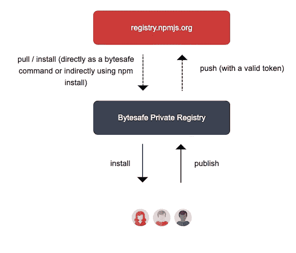

# 保持对您的私人 npm 注册表的控制

> 原文：<https://itnext.io/stay-in-control-with-your-private-npm-registry-f7d1d4791698?source=collection_archive---------6----------------------->

> 网站从头开始建立的时代已经一去不复返了(有人记得 CGI-BIN 吗？众所周知，今天的快节奏、交互式网络是建立在模块化技术之上的，网站经常使用数百甚至数千个 Javascript 包。当某人或某物坏了会发生什么？

*完全披露:我是 bytes safe(https://bytesafe.dev/)产品的创始人之一，该产品提供免费、安全和高度可用的私人国家预防机制注册。*


[邵杰](https://unsplash.com/@neural_notworks?utm_source=medium&utm_medium=referral)在 [Unsplash](https://unsplash.com?utm_source=medium&utm_medium=referral) 上拍照

今天，大多数开发人员只接触运行他们构建的网站所需的一小部分代码。这当然是一件美妙的事情:能够使用和重用其他人编写的代码，并且(希望)仍然维护着这些代码。这也是能够快速交付高质量结果的关键。

大型网站超过 1000(！)依赖。例如，对于那些想开始学习脸书设计框架 React 的人来说，有一个官方的“React getting starter app”([https://create-react-app.dev/](https://create-react-app.dev/))，它使用 React 和其他依赖项建立了一个现代的 web 应用。根据版本的不同，React 应用程序对数百个贡献者提供的不同 javascript 包有 1500 多个依赖项。

想象一下，这些开发人员中的一个过了糟糕的一天，或者更糟:失去了他的[证书，他的 Github 账户被黑。](https://www.zdnet.com/article/a-hacker-is-wiping-git-repositories-and-asking-for-a-ransom/)这样的事件会如何影响全球开发者和公司的日常生活？我想起了一个著名的事件:[当开发者 Azer Koç ulu 从 npm 中删除了他的一个包。](https://medium.com/@mproberts/a-discussion-about-the-breaking-of-the-internet-3d4d2a83aa4d)这导致了 2016 年 3 月初世界各地的大量构建中断。

保护自己的一种方法是使用 npm 代理，它位于您(或您的开发团队)和您的应用程序所使用的不断变化的大型依赖关系网络之间。

这是我们着手用[字节安全(https://bytesafe.dev/)](https://bytesafe.dev/)解决的挑战之一，它最基本的形式可以用作 npm 代理。



使用这样的 NPM 代理，您可以在您的依赖项在互联网上发生问题时获得通知，而不是从您的 CI/CD 管道中获得不及时的故障警报。当你的竞争对手做不到的时候，你也许可以发布下一个版本。

那么，如何使用私有 npm 注册表呢？很简单，使用你已经知道的工具。我们努力兼容常用的工具，如 npm、yarn 等，因此入门门槛不应太高。

首先在[https://bytes safe . dev](https://bytesafe.dev)创建一个免费帐户(点击注册)为你的帐户选择一个唯一的名称，登录，瞧！你已经准备好了！

一旦建立了帐户，就创建了初始(“默认”)注册表。创建额外的注册中心有两种方法，从 web 或者从 bytesafe CLI(如果您喜欢您的终端的话)。

使用你的 Bytesafe 缺省注册表，你可以连接到外部世界，我们设置了一个缺省的*上游，*，它使你能够从你保存私有包的同一个注册表中从 npmjs 拉包。关于上游的更多信息，[见本文](https://bytesafe.dev/posts/using-bytesafe-upstreams/)。这简化了您的工作流程，因此您不必使用多个注册表。

在客户端，您需要做的第一件事是让您的环境知道您的新注册表:

```
npm config set registry '[https://example.bytesafe.dev/r/default'](https://example.bytesafe.dev/r/default')
npm login
```

提供您的凭据，这些凭据在 bytesafe.dev 上的注册表页面上可见。

从注册表中取出一个包就像:

```
npm install 'some-package'
```

如果指定的 Bytesafe 注册表不包含特定的包，则该包将从上游(如果已配置)提取，并将**存储在注册表中。**

发布到您的私有注册表也同样简单:

```
npm publish ‘some-package’
```

# 0.11.1 ? 0.11.2?


照片由[杰克逊煨](https://unsplash.com/@simmerdownjpg?utm_source=medium&utm_medium=referral)在 [Unsplash](https://unsplash.com?utm_source=medium&utm_medium=referral) 上拍摄

作为开发人员，我们经常遇到的另一个挑战是确保团队中的每个人(以及我们与之互动的团队)都使用这些包和版本。

开发人员/CD/QA 环境并不总是同步的，这是错误、混乱和浪费时间的常见原因。

您是否曾经花时间试图帮助同事理解为什么没有编译，而相同的代码在您的本地 env 中运行良好？只是后来才明白，他或她使用的是某种依赖的不同版本，而你早就忘记了当初为什么需要它？我有。

当然有很多方法可以解决这个问题。在 Bytesafe 中，我们使用了两个特性(我们称之为策略):不可变版本和冻结，我们相信这将有助于避免这种情况([在此阅读更多内容](https://bytesafe.dev/posts/introducing-policies-plugins/))

好的可靠的工作流不是微不足道的，我将在以后的文章中讨论如何在您的工作流中使用 Bytesafe。

保护您的代码供应链，检查这些依赖性，祝您编码愉快！

❗️ **更新于 2020 年 4 月 27 日** : [继续阅读本文](/automate-javascript-deployment-of-npm-packages-with-github-actions-ad82e2acb075)，获得一个简单的分步示例，了解如何创建 Javascript 部署到您自己的私有注册中心的管道。